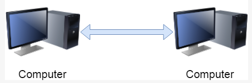
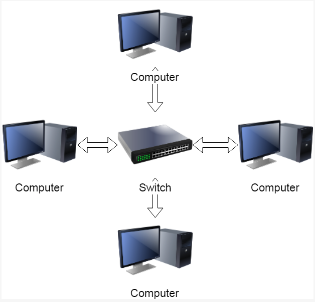
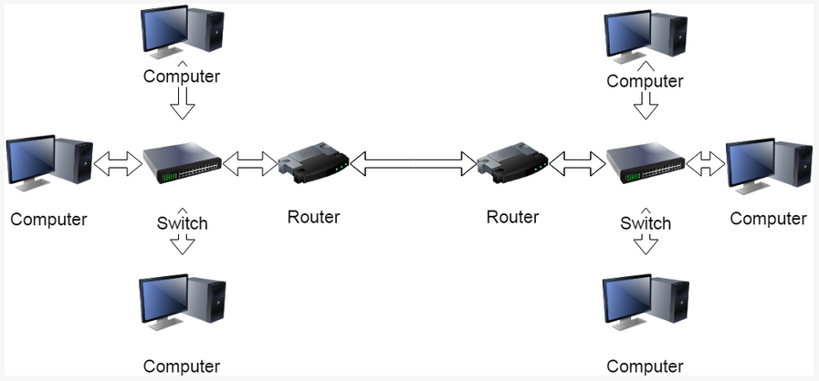
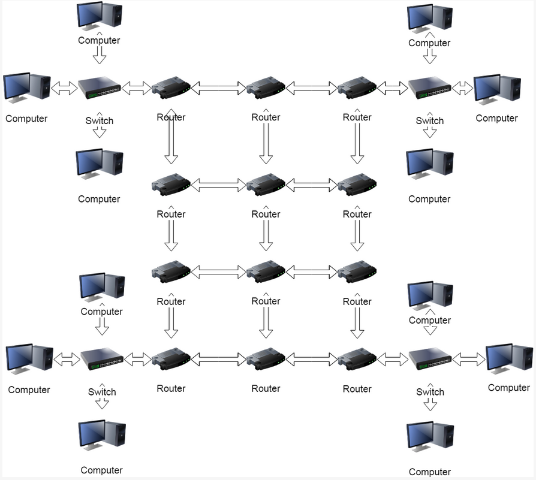

# What Is The Internet?

## What Is A Network?
At the most basic level, a network consist of two connected devices that can
exchange data. The devices could be linked with LAN cable with settings 
configured so that they form a distinct group.

## Local Area Network(LAN)
A more likely scenario will involve multiple devices within **certain physical
proximity** (e.g. a home or office) connected to a hub/switch via network
cables or wirelessly(WLAN).

## Inter-network Communication
The next level of communication network involves connecting multiple networks
together using routers. Routers are network devices that can route network
traffic to other networks. Within a Local Area Network, they effectively
act as gateways into and out of the network.

## Internet - A Network of Networks
The internet is essentially a vast number of these networks connected together.
In between all of the sub-networks are systems of routers that direct the
network traffic.

