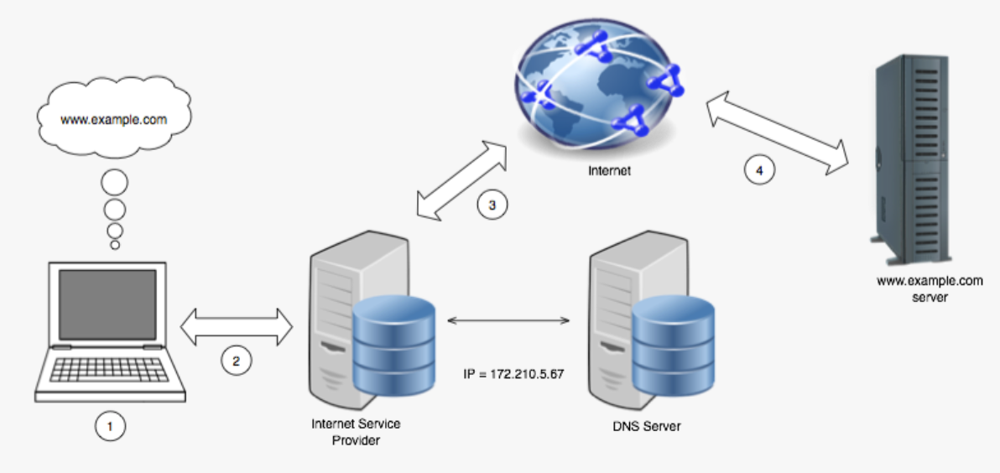
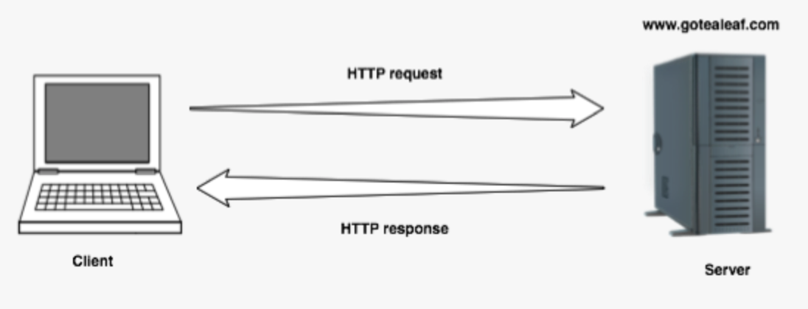
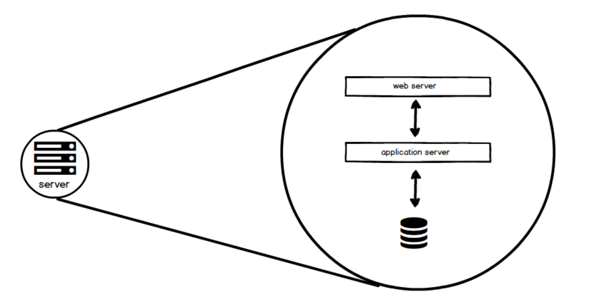

# The Internet
## Section Links

[What is the Internet?](#what-is-the-internet)\
[What happens when you enter a URL in a browser and press enter?](#what-happens-when-you-enter-a-url-in-a-browser-and-press-enter)\
[What is the web?](#what-is-the-web)\
[What is a resource?](#what-is-a-resource)\
[What is a Client-server model?](#what-is-a-client-server-model)\
[Server Components](#server-components)

---

## What is the Internet?
The internet is a "network of networks". A network is any plurality of
devices that are connected so that they can exchange data. Devices in
close proximity connected to hub/switch forms a local area network (LAN).
Lots of these LANs are then interconnected via routers to form the 
Internet. When we say "The Internet", we are describing both the physical
infrastructure that facilitates this interconnectivity, and the protocols
that govern its functionality.

Smallest Network\

Local Area Network\

Inter-Network\

Internet\

[Back to Top](#section-links)

## What happens when you enter a URL in a browser and press enter?

**URL -> IP Address with DNS**
- User enters `www.google.com` in the address bar of a browser.
- The browser asks the operating system to resolve the domain name to IP 
address with the Domain Name System (DNS) in the following order:
  - DNS cache on the local computer
  - DNS servers of the Internet Service Provider (ISP). 
  - ISP DNS servers will escalate the query to external DNS servers if it does not
  have the domain name's IP address.

  High Level DNS Workflow for Internet Traffic
  

**Data Transfer & TCP Handshake**
- To open a connection for the browser to communicate with the application 
server hosting the requested  resource, the Transmission Control Protocol
(TCP) operating at the **Transport layer** creates a TCP Segment to initiate
the TCP handshake. The metadata of a TCP Segment include 
  - source and destination port numbers extracted from local process and the
  URL respectively. `HTTP` defaults to port number `80` unless specified 
  otherwise,
  - `Sequence number` and `Window Size` fields to ensure in-order segments 
  processing and flow control so that server do not send too many segments
  at one go that may overwhelm the client.
  - `SYN` flag set to initiate TCP handshake
  - `Checksum` for error detection  

- The `SYN` Segment get passed to the **Network/Internet layer**. The Internet 
Protocol (IP), which operates in this layer, then encapsulates the `SYN`
Segment with IP metadata to form a `IP Packet`. Key metadata in an IP packet
includes:
  - Source and Destination IP addresses for routing this packet across the
  network. The destination IP address is obtained from the DNS service 
  highlighted above. 

- Next, the IP packet is passed to the **Data Link/Link layer**. which commonly
employs the **Ethernet** protocol to encapsulate the IP packet into an **Ethernet
Frame**. The Ethernet protocol provides two main functions: 1)framing to provide
the logical structure to bits streamed over the physical infrastructure and 
2)addressing to route a frame to the right recipient within a network. An
important metadata of a Frame is the **MAC Address** for Source and Destination. 
This is a fixed address that uniquely identifies each Network Interface Card
(NIC) that connects a host to the rest of the network infrastructure through
cables or WIFI. To get the Destination MAC address, the client refer to its
own Address Resolution Protocol (ARP) table to find the MAC address 
corresponding to the Destination IP address. If this record is is not found in
its ARP table i.e. no record from previous interaction, the client will
broadcast an ARP, also known as "who-has" request with the IP address in
question to all devices on its Local Area Network (LAN). If the device with
that IP address is on the same network, it will reply to the ARP. Otherwise,
the local router on the client network will reply and lie that it has the
destination IP address (since it is responsible for inter-network routing).
The client will then associate the MAC address of the device that replies
(usually the router) with the destination IP address. This mapping is then
used to update its own ARP table and the outgoing Frame. 

- Finally, that Ethernet Frame is handed over to the **Physical layer**,
the lowest layer in the networked communications model. This consists of 
tangible physical parts that make up the network i.e. network devices, cables
and air gap. These transport all the bits in the Frame as either radio waves,
light waves or electrical signals depending on the connecting medium between
devices (Air Gap, Fiber Optics or Ethernet cables). The physical limitations
of networked communication, latency and bandwidth, all stems from the physical
laws that govern this layer.

- Assuming the next hop is the local router, the router will receive the 
the Ethernet Frame, then decapsulate it to retrieve the destination IP in
the packet. It will then refer to its local routing table to identify 
a suitable router containing the destination IP address in its own network
range for the next hop. It then re-encapsulate the packet into a **new frame**
and send it to that router. This process repeats in a series of hops across 
network routers until the frame eventually reaches the server with the
destination IP address. The server's NIC receives the frame, check that the
frame is meant for itself, decapsulate the frame and pass the packet up to its
own Internet/Network layer. IP then process the packet and confirm it is the 
intended recipient before decapsulating the packet to pass the Segment to its
own Transport layer. TCP then process the segment, recognizing the `SYN` request,
before it prepares a `SYN-ACK` Segment as a reply to the client computer. The
`SYN-ACK` Segment then follows the same process described above to travel
from server to the client. The client TCP then generate a `ACK` Segment to send
back to the server's TCP to complete the TCP handshake.

**HTTP Request and Response**
- With connection now established, the browser then generates a HTTP `GET` 
request in its **Application layer** and pass it down to its transport layer to
send to the server application. The server application receives this request, 
finds the required resource using the path in the request line, and generate a
response with status code `200` to indicate the request is successful. The 
cookie header of the response is set with the unique session ID and HTML 
representing the resource is included in the response body. This response is
then transferred back to the browser. The browser then process the HTTP
response, interpret the HTML file and send requests for any referenced resources
used in the HTML file. Once all resources are gathered, the browser refreshs and
renders the HTML page to the user. The user now sees the HTML page in his/her
browser.

**References**\
[What happens when you enter a URL in your browser](https://medium.com/@maneesha.wijesinghe1/what-happens-when-you-type-an-url-in-the-browser-and-press-enter-bb0aa2449c1a)\
[Quora - How a computer know the MAC address of the receiver](https://www.quora.com/How-does-a-computer-know-the-MAC-address-of-its-receiver)\
[What is an ARP table](https://www.auvik.com/franklyit/blog/what-is-an-arp-table/)\
[Launch School - Encapsulation and Decapsulation in Packet Routing](https://launchschool.com/posts/b8c4153b)

[Back to Top](#section-links)

## What is the web?

The web (aka World Wide Web) is a service that can be accessed via the internet.
It is vast information system comprised of resources that are accessible with
the use of an URL. Applications such as browsers are able to interact with
these reources through the use of HTTP. The Internet provides both the physical
infrastructure and protocols required to facilitate the transfer of these resource
from one device to another across the world.

[Back to Top](#section-links)

## What is a resource?
[URL - What are resources](12_urls.md#what-are-resources)

[Back to Top](#section-links)

## What is a Client-Server model?
- A client-server is a type of networking model where two processes
communicating over a network each take on a specific role.
- The client is the party initiating the communication. It is responsible
for issuing requests to a server. The request could be to retrieve a resource
or for an action to be carried out on the server. It is also responsible for
processing server responses and rendering contents.

- The server is usually a computer hosting the resources. It will process 
incoming requests and then send a response to the client informing the client
the status of that request and any accompanying resource, when applicable.
- For web service, the client could be a browser or a GUI or terminal based
HTTP tool.
- The server is a simplified model. In reality, server-side infrastructure
can be highly complex, with multiple components (e.g. web server, application
server and database) distributed over multiple machines supported by 
intermediary machines e.g. load balancers.

[Back to Top](#section-links)

## Server Components
- The three primary pieces of server components are the web server, the
application server, and the data store.
- Web server = responds to requests for static resources, i.e. resources that
do not require data processing (like CSS files)
- Application server = handling more complicated requests, such as those that
contain application or business logic. Any server-side application code lives here.
- Data store = some kind of storage construct that can save data for later
retrieval and processing.

[Back to Top](#section-links)
