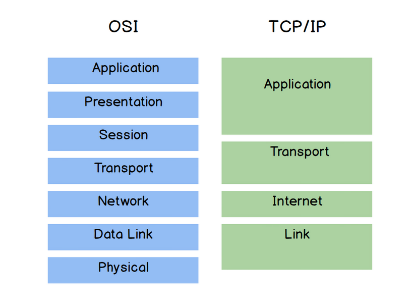
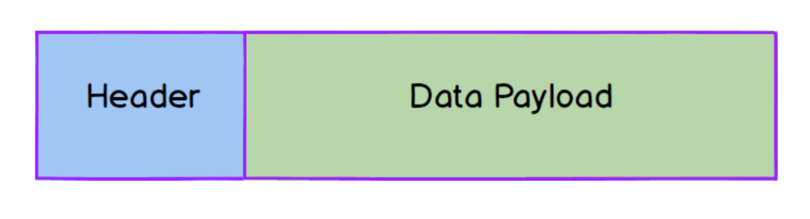
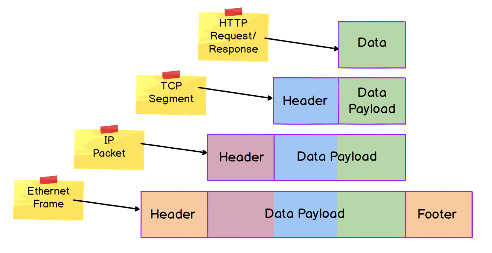

# Layered Models for Network Communication
## Section Links

[Layered Architecture](#layered-architecture)\
[OSI vs TCP/IP Models](#open-systems-interconnection-osi-and-internet-protocol-suite-tcpip-models)\
[Data Encapsulation](#data-encapsulation)\
[Header and Trailer](#header-and-trailer)\
[Data Payload](#data-payload)

---

## Layered Architecture
Given the large number of protocols addressing different aspects of network
communications, one way to organise them would be to group them by the
aspect of communication each handles.

A communication system can be viewed as having multiple layers, with each
layer handling a particular aspect. Protocols that work on the same aspect,
albeit in a different way, will reside on the same layer. Protocols
working on different aspects, will then reside on different layers. Collectively,
they work together to enable network communication.

[Back to Top](#section-links)

## Open Systems Interconnection (OSI) and Internet Protocol Suite (TCP/IP) Models
OSI and TCP/IP are two of the most popular communication network models.
There is some rough equivalency, with some overlap, between layers of the two
models:

The reason both models have different layers because:
- TCP/IP model divide the layers by the scope of communication within each layer
  (i.e. within a LAN, between networks etc) 
- OSI model represent layers by the functions each provide (physical addressing,
  logical addressing and routing, encryption, compression etc)

There are utility in both models to understand how the system work conceptually
as no single model perfectly captures the real world implementation.

[Back to Top](#section-links)

## Data Encapsulation
Data encapsulation in networks involves **embedding data** from the upper 
layer within the data unit in the layer below. 

In network models, a **Protocol Data Unit (PDU)** refers to a block of data
to be transferred over a network and consists of **a header, a data payload
and sometimes a trailer/footer.**

PDUs at each layer have their own unique name:
- Link/Data Link layer: **Frame**
- Internet/Network layer: **Packet**
- Transport layer: **Segment (TCP) or Datagram (UDP)**

[Back to Top](#section-links)

### Header and Trailer
These contains **metadata about the PDU**. The exact structure, however, differs
from protocol to protocol. For example, an Internet Protocol (IP) packet header 
will include Source and Destination IP addresses to route it to the correct 
host.

[Back to Top](#section-links)

### Data Payload
This is the data component of the PDU. Data encapsulation works in such a way
that the entire PDU from the upper layer forms the data payload for a protocol
at the immediate layer below.

This arrangement allow protocols at each layer to operate independently with a
level of abstraction. A lower layer protocol can just encapsulate the entire
PDU from the upper layer by adding the requisite header without the need to
consider the protocol used in the upper layer. For example TCP segment
isn't really concerned whether its data payload is an HTTP request, an SMTP
command, or some other sort of Application layer data. This creates a system
where the lower layer effectively provides a **service** to the upper layer.

[Back to Top](#section-links)
