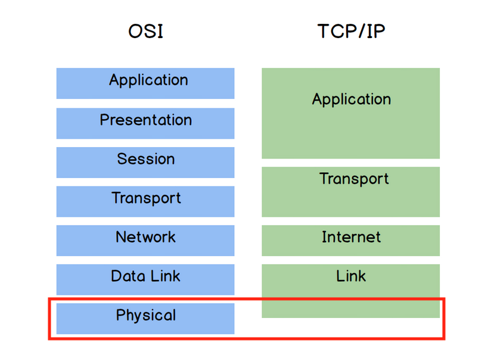

# The Physical Network



The "physical" network (lowest layer) is made of networked devices, cables
and wires. Even radio and light waves used in wireless network and fiber optics
exist in the physical realm and are bounded by physical laws and rules such
as travel speed, losses and maximum range. 

These limitations determine the physical characteristics of a network and
how the protocols higher up have to function.

## Bits and Signals
To transfer information at the physical layer, **binary bits are converted
to electrical signals, light signals or radio waves**, depending on the
transportation medium used.

## Characteristics of a Physical Network
We can define the performance of a physical network by its Latency and Bandwidth.

**Latency**: The **time** required to move data from one point to another point
             in a network. This is a **measure of delay**.
             
**Bandwith**: The **maximum amount of data** that can be sent **per unit of time** 
              and measured in bits per second (e.g. Mbps). This is a **measure 
              of capacity** but is frequently misunderstood as speed. An analagous
              example is the number of lanes on the road, each with same speed
              limit. The more lanes available, more cars can be transfered at
              once with all moving at designated speed.
              
## Components of Latency
Latency is a measure of delay. Data starts at point A and takes x millisecs (ms)
to reach another point in the network. Different types of delay add up to
determine the overall latency of a network connection.

- **Propagation delay:** Time it takes for a message to move from point A to B 
  on a network. This is governed by the type of signal (light, radio etc) and 
  medium.
- **Transmission delay:** Network is made of numerous wires and cables
  interconnected by switches, routers and other network devices. Each of these
  can be thought of as a link. The time required to push data onto a link is 
  the transmission delay.
- **Processing delay:** Time needed to process data to determine which link to 
- forward on the network.
- **Queuing delay:** Network devices such as routers can only process a certain
  amount of data at a time. Data beyond that time have to be buffers for 
  processing.
  
## Measures of Latency
- **Last-mile latency:** Delays involved in getting network signal from Internet
  Service Provider (ISP) network to home/office network. A lot of delays can
  take place at this part of the network as there are more frequent and shorter
  hops here to direct data along the network hierarchy to the correct
  sub-network.
- **Round-trip Time (RTT):** Length of time for a signal to be sent + length of
  time for an acknowledgement to be received.

`traceroute` is a utility we can use to display the route and latency of a piece
of data from source to destination. The path represents a series of hops and 
the time indicated are the RTT for each hop. For Windows, we use `tracert`
instead of `traceroute`.
```terminal
traceroute google.com
```

## Bandwidth
Bandwidth **varies across the network**. Capacity is much **higher at the core
network then at the last mile** (endpoint that connects to home or office
buildings). The bandwidth of a connection is the lowest amount at a particular
point which is called as a bandwidth bottleneck. 

## Limitations of Physical Network
**Low bandwidth** can be an issue when dealing with large volume of data but
**latency** tends to impose a more serious limitation on the performance of a
network application. These physical limitations **have to be handled by higher
level protocols** and will influence how applications are designed.