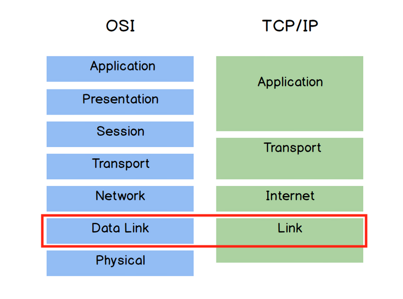
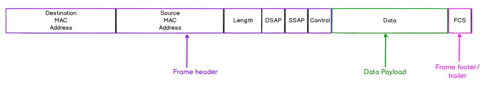
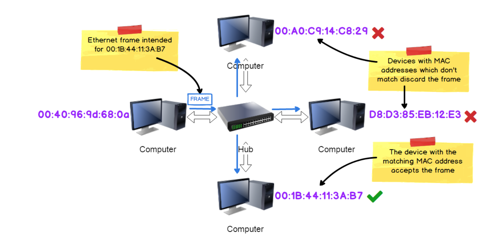
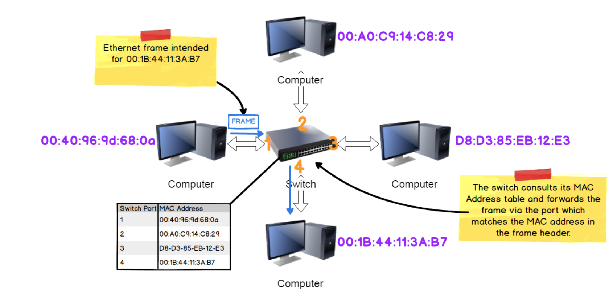

# The Link/Data Link Layer

The physical layer is focussed on converting bits into signals(electrical, 
light and radio waves) over the physical network. 

To transfer signals from one place to another, a key requirement is to identify
the device we want to send that data. Thus, protocols operating at this layer are
primarily concerned with the **identification of devices on the physical network
and the moving of data over the physical network between devices** (e.g. hosts
computers switches and routers).

The most commonly used protocol at this layer is the Ethernet protocol. Both the
technical specifications for Ethernet cables used to connect network devices
and the Ethernet protocol are governed by the 
[IEEE standards](https://standards.ieee.org/ieee/802.3/7071/).

Two important aspects of Ethernet are **framing** and **addressing**.

## Ethernet Frames

Ethernet Frames are the Protocol Data Unit (PDU) for this layer and encapsulates
the PDU from the layer above (TCP/IP - Internet/ OSI - Network).

They **provide structure to the binary data**, defining which bits are metadata and
which are data payload from above. 

- **Preamble and SFD:** Not part of an frame but sent before a frame to
notify and synchronize with receiving device about incoming frame. 

- **Source and Destination MAC address:** Addresses of the frame creator (can 
change at various point along data journey) and intended recipient.
- **Length:** indicate the size of the Data Payload
- **DSAP, SSAP, Control:** DSAP and SSAP fields identify the network protocol
used for the Data Payload. Control field indicate communication mode for flow
control.

**Key Takeaway:** Source and Destination MAC addresses are part of the
metadata in an Ethernet Frame. 

Side note: There are different ethernet standards. Frame structure
described here is based on the most widely used IEEE 802.3.

### Interframe Gap
Frames are transmitted with a time gap. The gap length varies with the
capability of the Ethernet connection. A 100 Mbps Ethernet has a gap of
0.96 microseconds (just under one millionth of a second). This gap contributes
to the [transmission delay](05_physical_layer.md/#components-of-latency) 
highlighted under the notes for physical layer.

## MAC Addressing
Every network-enabled device (e.g. a Network Interface Card) has a **unique MAC 
Address** assigned when it is manufactured. This address is specific to a
specific physical device and doesn't change. 

MAC Address takes the form of six two-digit hexadecimal numbers 
e.g. `00:40:96:9d:68:0a`

For hub (a simple network hardware) connected devices, a sent message will be
replicated and forwarded to all devices connected to it. If the message is
addressed to a specific MAC address, each receiving device will check the
destination address of the message frame. If it is not the intended
recipient, it will ignore that frame.

Switch connected devices are more efficient. Instead of sending every frame
to all connected devices, a switch uses the destination address to direct
a frame **only to the intended device**. 

It does this by maintaining a register of MAC addresses of devices connected
to it using a MAC Address Table 

|Switch Port| MAC Address | 
|---|---|
|1|00:40:96:9d:68:0a|
|2|00:A0:C9:14:C8:29|
|3|D8:D3:85:EB:12:E3|
|4|00:1B:44:11:3A:B7|

## Problem of Scale
While MAC Address works for local network supporting a small number of devices,
it **cannot be scaled to a large network** such network of networks because
1. **MAC addressses are physical rather than logical**. Every time a device switches 
network it is connected to (e.g. a mobile phone or laptop), address tables of
affected network has to be updated. Keeping MAC Address Table up-to-date becomes
impossible as the network scales.
2. **Addresses are flat rather than hierarchical**. Search will take impossibly long
with large networks since we can't use a hierarchical grouping of addresses to
efficiently retrieve a tiny subset of addresses that contain the required
address. Each routing device will hence need to store all the MAC addresses in
the world, an impossible task.

A different protocol will be require to scale to a network of networks that 
spans the world. The Internet Protocol provides that.