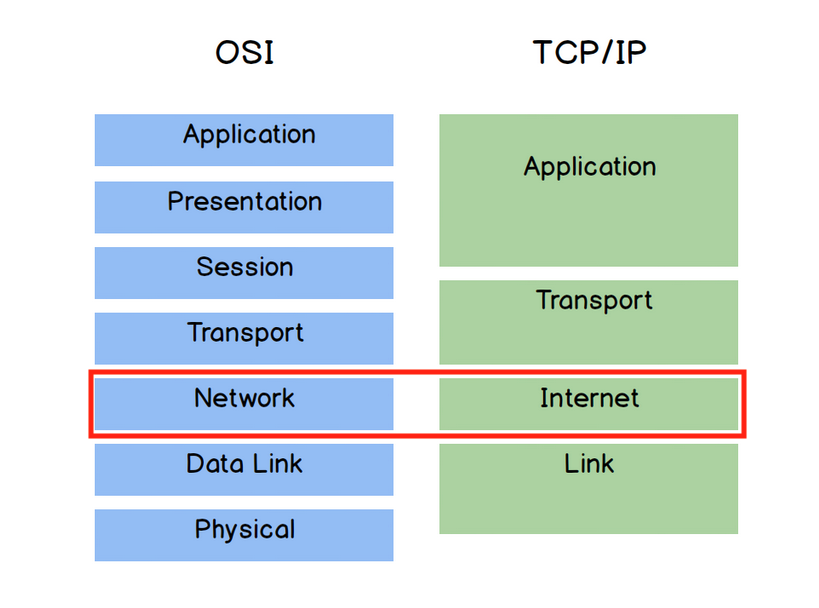
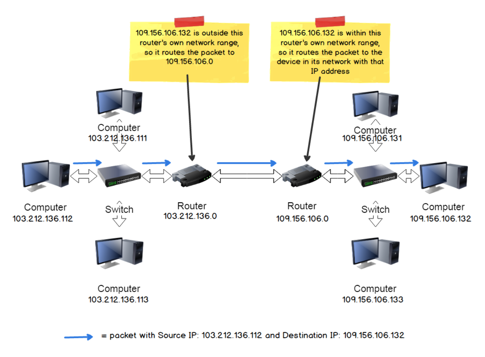
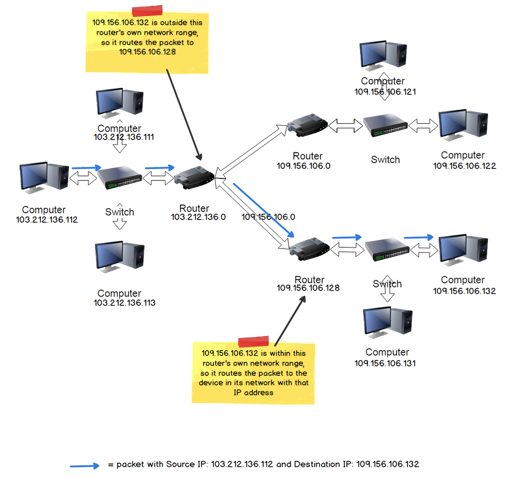

# The Internet/Network Layer

The primary function of protocols at this layer is to facilitate communication
between hosts (e.g. computers) on different networks.

The Internet Protocol (IP) is the predominant protocol at this layer. There
are two versions of IP currently in use: IPv4 and IPv6. Although there
are slight differences between the two versions, the primary features are the
same:
- Routing capability via IP addressing
- Encapsulate data into packets.

## Data Packets
The Protocol Data Unit (PDU) for the IP protocol is the **packet**. A packet
consists of a Data Payload (PDU of transport layer which could be TCP segment
or a UDP datagram) and a Header.  

Some important fields in the header are:
- **Version:** indicate version of IP used
- **ID, Flags, Fragment Offset:** These fields are for handling fragmentation
and reassembly of transport layer PDU that are too large to send over a single
packet.
- **TTL:** indicates the **Time to Live** value that tracks the number of
remaining network "hops" a packet has left before it will be dropped. Each "hop"
decrement this value by 1.
- **Protocol:** indicates the protocol used for the Data Payload (e.g. TCP or
UDP)
- **Checksum:** error checking value. Destination device will generate a value
using the same algorithm and it doesnt match with this value, the packet is
deemed corrupted and is dropped.
- Source Address: 32-bit IP address of the source (sender)
- Destination Address: 32-bit IP address of the destination (intended recipient)

## IP Addresses (IPv4)
- IPv4 addresses are 32-bit in length and divided into four sections of eight
bits. When converted from binary to decimal, each section have a range between
`0` to `255`. An example IP address is `109.156.106.57`.
- Unlike MAC addresses, IP addresses are **logical** in nature. They are not tied
to any devices but are **dynamically assigned** when they join a network. 
- The actual IP address must fall within a range of addresses available to the
local network the device is joining. This range is determine by a network
hierarchy, where an overall network is split into logical subnetworks. 

### Network Hierarchy Example
A local network could be assigned the addresses between `109.105.106.0` to
`109.105.106.255`. The **start of the range** `109.105.106.0` **identifies the
the network address of the subnet** (a segmented piece of a larger network) while
the **end of range**  `109.105.106.255` corresponds to the **broadcast address of
this subnet**. Addresses in between are available for allocation to individual
devices on the network. Since the network address of the range is used to
identify a network segment, a router that wants to forward a packet just need
to keep a record of which router on the network controls access to the segment
that subsumes that particular network address. It doesn't need to keep records
of every single devices within that addressable range.

We can further split a network into smaller subnets by dividing IP address
ranges further, to create more tiers within the hierarchy.

### Routing and Routing Tables
All routers on the network store a local routing table. When an IP packet
is received by a router, the router examines the destination IP address and
matches it against a list of network subnets in its routing table to determine 
the best route to forward the packet to its destination.

### IPv6
- Due to the growing number of internet connected devices, IPv6 was introduced
to expand the maxium number of IP addresses from ~4.3 billion in IPv4 to ~340 
undecillion (340 billion billion billion billion). This is achieved by
increasing the number of bits of an IP address from 32-bit to 128-bit 
(eight 16-bit blocks).
- IPv6 also has a different header structure and a lack of error checking (left
to linked layer checksum)

## Networked Applications
Internet Protocol supports communications between hosts. To support
communications for applications residing on hosts, we need to solve this
at the transport layer.
