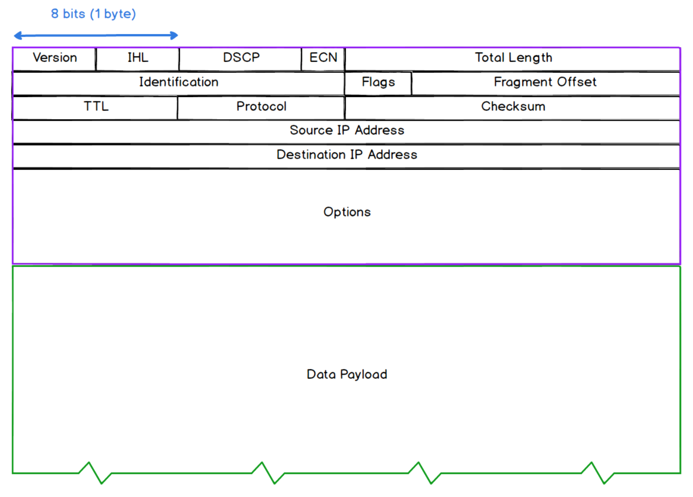

# The Internet/Network Layer
## Section Links

[Function of Network Layer](#function-of-network-layer)\
[Data Packets](#data-packets)\
[IP Addresses (IPv4)](#ip-addresses-ipv4)\
[Routing and Routing Tables](#routing-and-routing-tables)\
[Difference with IPv6](#difference-with-ipv6)\
[Networked Applications](#networked-applications)

---

## Function of Network Layer
The primary function of protocols at this layer is to **facilitate communication
between hosts** (e.g. computers) on different networks.

The Internet Protocol (IP) is the predominant protocol at this layer. There
are two versions of IP currently in use: IPv4 and IPv6. As the primary features
of both versions are the same:
- provide routing capability via IP addressing, 
- encapsulate data into packets.

Notes will be **based on IPv4**, with main differences between IPv4 and IPv6 
highlighted in a section below.  

[Back to Top](#section-links)

## Data Packets
The Protocol Data Unit (PDU) for the IP protocol is the **packet**. A packet
consists of a Data Payload (PDU of transport layer which could be TCP segment
or a UDP datagram) and a Header.  

Some important fields in the header are:
- **Version:** indicate version of IP used
- **ID, Flags, Fragment Offset:** These fields are for handling fragmentation
and reassembly of transport layer PDU that are too large to send over a single
packet.
- **TTL:** indicates the **Time to Live** value that tracks the number of
remaining network "hops" a packet has left before it will be dropped. Each "hop"
decrement this value by 1.
- **Protocol:** indicates the protocol used for the Data Payload (e.g. TCP or
UDP)
- **Checksum:** error checking value. Destination device will generate a value
using the same algorithm and it doesnt match with this value, the packet is
deemed corrupted and is dropped.
- **Source Address:** 32-bit IP address of the source (sender)
- **Destination Address:** 32-bit IP address of the destination (intended recipient)

[Back to Top](#section-links)

## IP Address
- An IP address is an address that **uniquely identifies** a device connected to
the Internet or local network. Similar to how postal addresses are used for the
delivery of parcels and mails, an IP address is used for the delivery of data
packets on the Internet. 
- Unlike MAC addresses, IP addresses are **logical** in nature i.e. they are
not tied to any devices like a serial number. Instead, they are **dynamically
assigned** when a device join a network. The assigned value must fall within
the IP range managed by that network's router.
- **IPv4** addresses are 32-bit in length and divided into four sections of eight
bits (octet). When converted from binary to decimal, each section have a range
between `0` to `255`. An example IP address is `141.213.127.13`.
- IP addresses are hierachical in nature. The first sequence of bits identifies
the  network and the final bits identify the individual node in the network. For
example `141.213.127.13` can be broken into 3 parts:

  | 141.213 | 127 | 13 |
  |---|---|---|
  | UMich network | Medicine department | Lab computer |

- Their logical and hierarchical nature greatly speeds up packet routing since 
a router need not track the IP addresses of all devices in its routing table. 
Instead, it's routing table just need to contain the network range of its 
neighbouring routers. From there, it can very quickly determine which of these 
network range subsumes a packet's destination IP address and forward the packet
to it. This allows IP addressing to scale to very large networks, something that
MAC addressing is not suited to.

### Network Hierarchy Example
A local network could be assigned the addresses between `109.105.106.0` to
`109.105.106.255`. The **start of the range** `109.105.106.0` **identifies the
the network address of the subnet** (a segmented piece of a larger network) while
the **end of range**  `109.105.106.255` corresponds to the **broadcast address of
this subnet**. Addresses in between are available for allocation to individual
devices on the network. Since the network address of the range is used to
identify a network segment, a router that wants to forward a packet just need
to keep a record of which router on the network controls access to the segment
that subsumes that particular network address. It doesn't need to keep records
of every single devices within that addressable range.

We can further split a network into smaller subnets by dividing IP address
ranges further, to create more tiers within the hierarchy to improve 
efficiency.

[Back to Top](#section-links)

## Routing and Routing Tables
All routers on the network store a local routing table. When an IP packet
is received by a router, the router examines the destination IP address and
matches it against a list of network subnets in its routing table to determine 
the best route to forward the packet to its destination.

[Back to Top](#section-links)

## IPv6
- Due to the growing number of internet connected devices, IPv6 was introduced
to expand the maxium number of IP addresses from ~4.3 billion in IPv4 to ~340 
undecillion (340 billion billion billion billion). This is achieved by
increasing the number of bits of an IP address from 32-bit to 128-bit, organized 
into eight 16-bit blocks.
- IPv6 also has a different header structure and removed error checking (left
to linked layer checksum)

[Back to Top](#section-links)

## Networked Applications
Internet Protocol supports communications between hosts. As there can be multiple
applications residing on a single host that needs to communicate with
applications residing on different hosts simultaneously, we need to solve
this with another protocol at the transport layer.

[Back to Top](#section-links)

