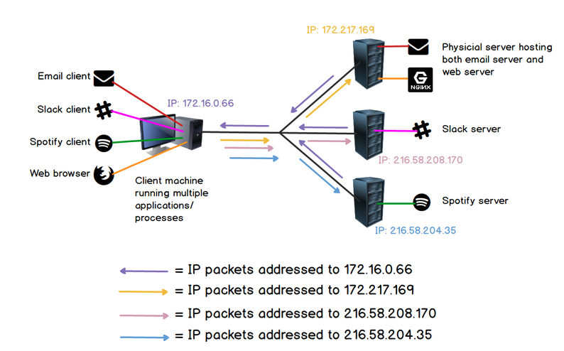
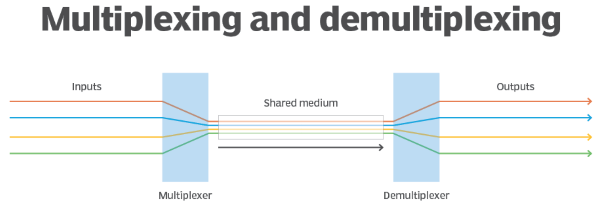
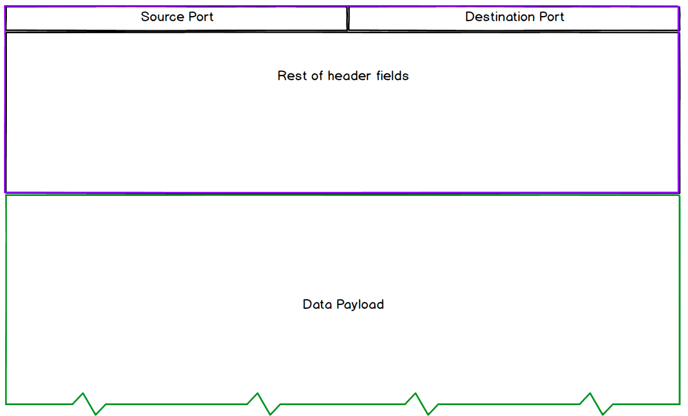
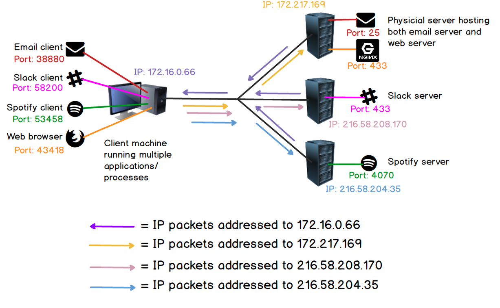
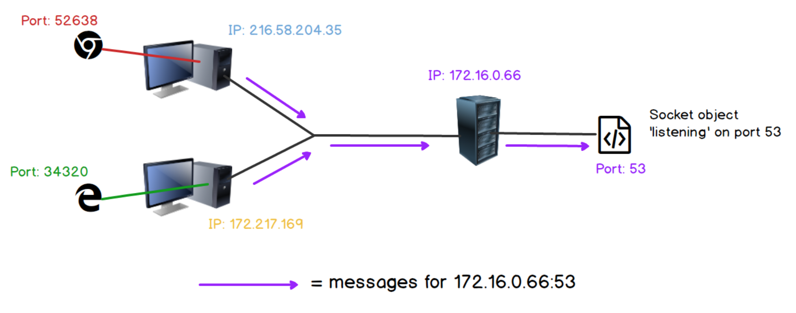
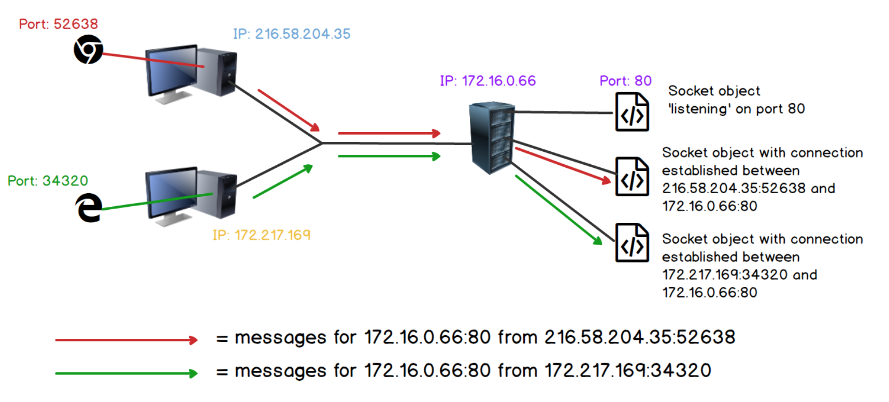

# Communications Between Processes

## Multiplexing and Demultiplexing
While the Internet Protocol enables data exchanges between _hosts_(i.e. devices),
we still need a way to support multiple applications/processes running
simultaneously on a single host. The host IP address, is like a single
channel shared by all concurrent processes for data exchange.



In computer networking, **multiplexing** is a way of transmitting multiple
signals over a common channel. **Demultiplexing**, the reverse process, 
recovers those separate signals and outputs them to individual processes.

\
[Source: TechTarget](https://www.techtarget.com/searchnetworking/definition/multiplexing)

This concept has different meaning on different network layers. At the physical
layers, multiplexing would involve sending light at different refraction angles
through optical fibers or radio waves transmitted at different frequencies.

At the transport layer, we need a way for multiple applications to 
share a common IP address which is shown below. 

## Ports
A port is an **integer based identifier** assigned to a specific
process running on a host. Port values can range from 0-65535 and are
typically assigned based on following rules:
- 0 - 1023: **Well-known ports** for common networking services. E.g. port 80 
for HTTP, port 20 and 21 for FTP, port 25 for SMTP.
- 1024 - 49151: ports registered **by private entities** such as Microsoft, IBM,
Cisco for their services. On some operating systems, these ports are available
for temporal allocations. 
- 49152-65535: **dynamic ports** for temporal allocations.

For example, services running on servers will likely have a port in the
well-known range assigned to them. e.g. a web-server running on a host machine
responding to HTTP requests is likely to have port 80 assigned. This is also
known as listening on port 80.  

On the other hand, a browser running on client laptop won't use one of these
well-known ports, but will likely be given an ephemeral (short lasting) port
assigned to it by the operating system, for example 59258.


Multiplexing is made possible at the transport layer through the use of
ports. Data from the application layer is encapsulated as the data payload in
the transport layer PDU. Source and destination port numbers are header fields 
of this PDU and are used to direct that data to specific processes on a host.



The entire PDU is then encapsulated as the data payload in an IP packet. 
The IP addresses in the packet header can be used to direct data from one host
to another. Hence, the **IP address and port number combination** (e.g. 
`216.3.128.12:8080`), is used to define a communication end-point, also known
as a **socket**. This is what enables end-to-end communication between
specific applications on different machines.



## Netstat
We can use the `netstat` command to view all active connections on a system

```terminal
netstat -ntup
```
If above command doesn't work, we can try `netstat -avp TCP` or 
`netstat -ap TCP` or consult netstat documentation for Windows, Linux or MacOS.

```terminal
Proto Recv-Q Send-Q Local Address           Foreign Address         State       PID/Program name   
tcp        0      0 172.16.0.66:38880       172.217.169.36:443      ESTABLISHED 4180/chrome --type=    
tcp        1      0 172.16.0.66:53458       3.81.154.63:443         CLOSE_WAIT  3118/dropbox        
tcp        0      0 172.16.0.66:52638       216.58.208.170:443      ESTABLISHED 4180/chrome --type=
tcp       32      0 172.16.0.66:34320       162.125.64.7:443        CLOSE_WAIT  3118/dropbox        
tcp        0      0 172.16.0.66:32786       216.58.204.35:443       ESTABLISHED 4180/chrome --type=
tcp        0      0 172.16.0.66:39700       162.125.18.133:443      ESTABLISHED 3118/dropbox        
tcp        0      0 172.16.0.66:36216       18.235.20.216:443       ESTABLISHED 4180/chrome --type=
tcp        0      0 172.16.0.66:43418       104.17.221.204:443      ESTABLISHED 4180/chrome --type=
tcp        0      0 172.16.0.66:39606       162.125.18.133:443      ESTABLISHED 3118/dropbox
tcp        0      0 172.16.0.66:58200       3.8.113.63:443          ESTABLISHED 3942/slack      
```

## Sockets
Sockets can have different meaning depending whether we are referring to
the concept or its implementation.

**Conceptually**, a socket is an communication endpoint defined by an 
IP Address-Port pair used for inter-process communication.

**Implementation-wise**, it could refer to:
- UNIX socket: a mechanism for communication between local processes running 
on same machine
- Internet socket (e.g. TCP/IP): a mechanism for communication between
networked processes (usually on different machines). Note: it is possible 
to have two networked processed running on the same machine using internet
socket to communicate even if traffic never travel across the network
infrastructure. For example, we can have a webserver running on `localhost` and
a browser connecting to that webserver.

In socket programming, the implementation of the concept involves instantiating
_socket objects_. Methods such as `bind()`, `listen()`,`accept()` and 
`connect()` are defined under the popular Berkeley socket API models.

While we focus on the conceptual definition of sockets, some understanding of
their implementation is required to appreciate differences between 
connection-oriented communication and connectionless communication. This
is a distinguishing trait between two common protocols of the transport layer,
TCP and UDP.

## Sockets and Connections
A **connectionless** communication system has **only one** socket object
defined by the IP address of the host machine and the port assigned to that
process. This object will use the `listen()` method to wait for any incoming
messages directed at its IP/port pair. Messages can come from
**any source, at any time in any order**. It will simply process incoming 
messages as they arrive and send responses as required.



A connection-oriented system will also use the `listen()` method to wait for
incoming message. How its implementation differs from a connectionless system
is that it will instantiate a new socket object that specifically listens and 
responds to messages from that source IP/port. This socket is defined by the 
four-tuple of (source IP, source port, destination IP, destination port).

Any messages not matching this four-tuple will be picked up by the original
socket to instantiate a new socket object for the new connection.



The advantage of a **connection-oriented system** is that it makes it **easier
to include rules that will make the communication more reliable**: 
- ensure the order of the messages, 
- acknowledge received messages and
- retransmit of lost messages.


