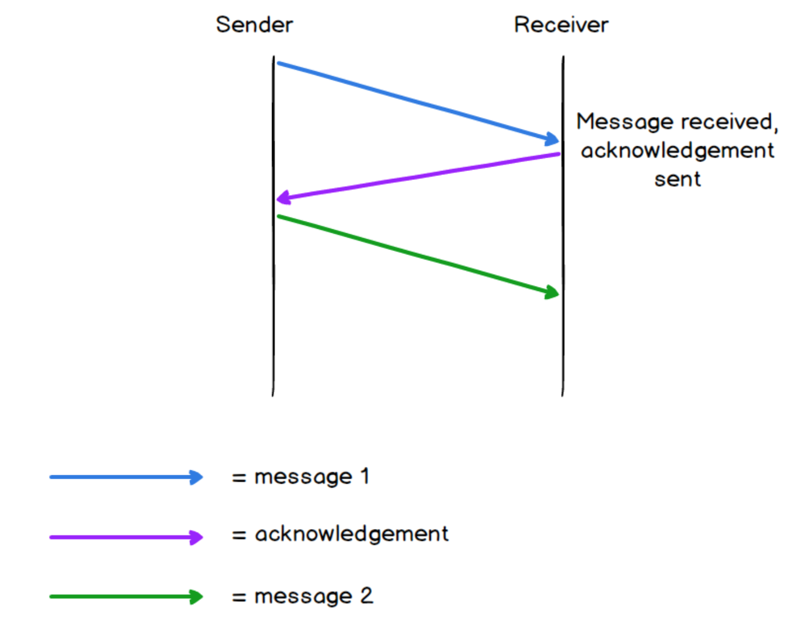
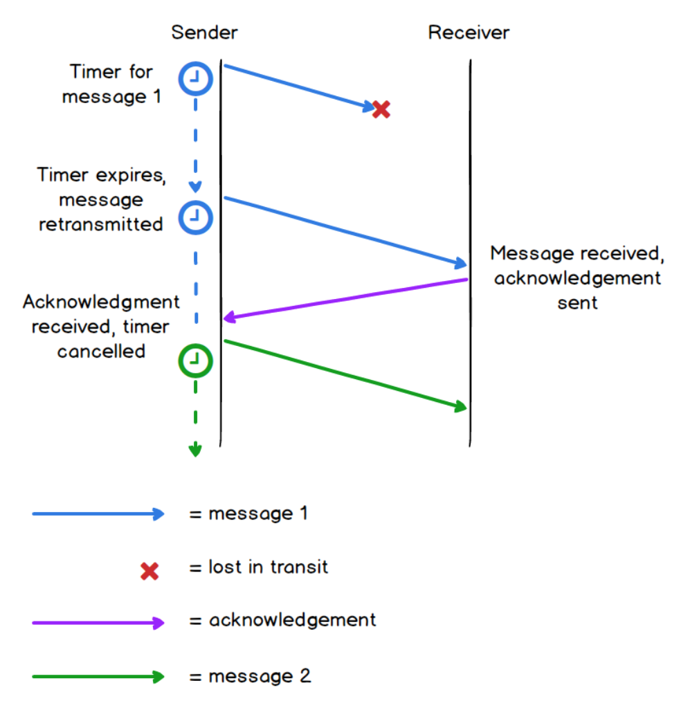
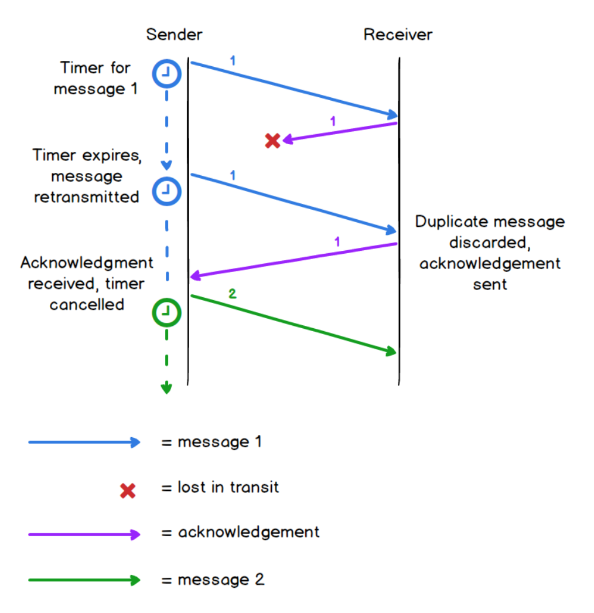
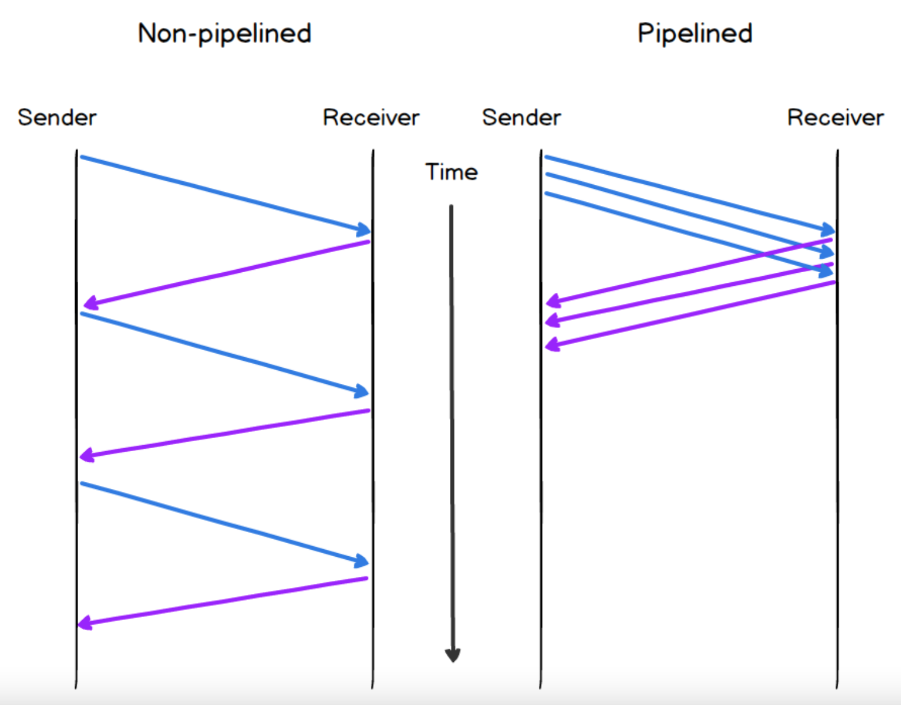
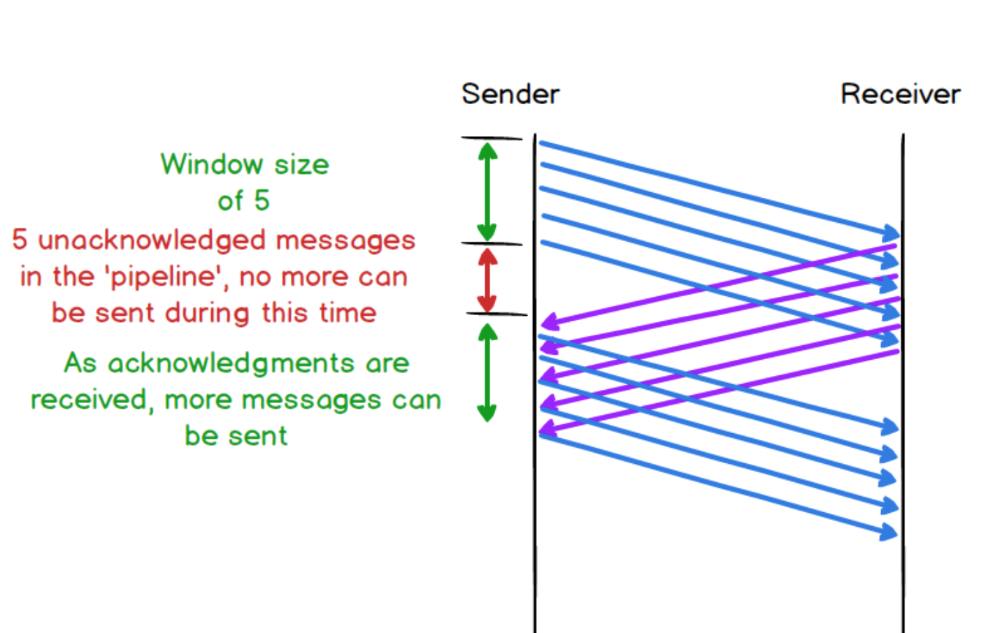

# Network Reliability

Communication protocols used in the **lower layers of the network system up till
the network layer is inherently unreliable**. Data can be **corrupted** during
transportation and be **discarded** when they failed to match with the checksums
embedded in frames (Ethernet) and packets (IP). These layers have **no provisions
to replace lost data**, making them an unreliable communication channel.

Missing data can cause applications to malfunction e.g. web page not rendering
correctly, missing content in emails. Hence we need a protocol that can help
ensure reliability.

## Components of a Reliability Protocol
1. Having an **acknowledgement message** when original message was successfully 
received before transmitting the next message.\

2. To guard against loss of acknowledgement message, resend message if 
acknowledgement not received **within a certain time**.\

3. Having 1) and 2) above could meant result in situation where message was received but
acknowledgement was lost or not received on time, causing sender to resend 
original message. In this scenario, we need a **sequence number for recipient to
identify duplicate message** and respond accordingly (e.g. resend acknowledgement,
but discard the duplicate message)\

4. To improve performance, we can send **multiple messages in each batch**. This is 
known as **pipelining**. This make more efficient use of available bandwidth.\

**Example of Pipeline Approach**
