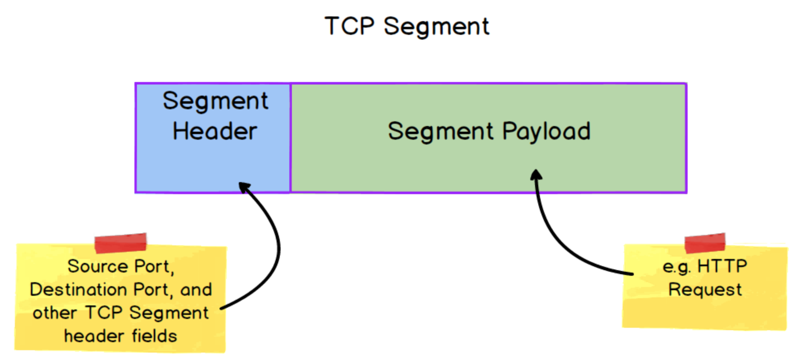
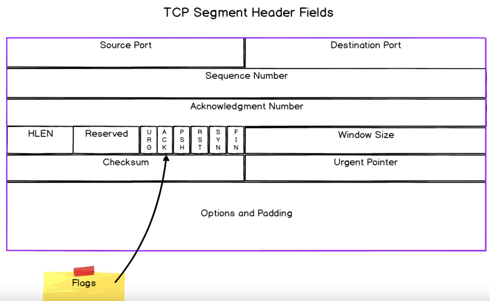
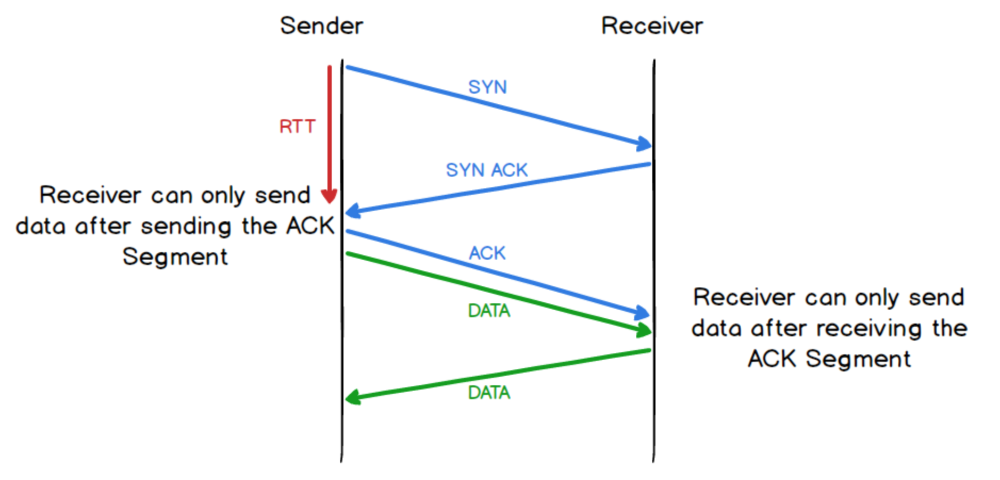

# Transmission Control Protocol (TCP)
The Transmission Control Protocol is a key backbone of the Internet by ensuring
**reliable** data transfer over an unreliable channel. A connection-oriented
protocol, it ensures the following:
- It guarantees message delivery through message acknowledgement and retransmission
- It guarantees message delivery order
- It has built-in congestion avoidance (i.e. network) and flow-control 
(recipient) mechanisms

## TCP Segments
**Segments** are the Protocol Data Unit (PDU) of TCP. Source Port and 
Destination Port are key fields in the header and are what provides 
the multiplexing capability of the protocol.

There are TCP variants but all will contain the following important fields:
- Checksum: Used to detect data corruption. Recipient compute a checksum with 
same algorithm and compare with this field. Drop the segment if doesn't match.
- Sequence Number & Acknowledgement Number: Used to ensure in-order delivery,
handle data loss and duplication.
- Window Size: Used for flow control
- Other fields: `URG` and `PSH` used to indicate importance or urgency of
segment. `SYN`, `ACK`, `FIN` and `RST` flags are used to establish and terminate
a TCP connection and manage state of connection.

## TCP Connections
TCP is a connection-oriented protocol. It uses a three-way handshake to 
establish a connection. 

**State Transition Table for 3-way handshake**
|Client Start State |Client Action |Client End State |Server Start State |Server Action |Server End State |
|---|---|---|---|---|---|
|CLOSED |Sends a SYN Segment |SYN-SENT |LISTEN |Waits for a connection request |- |
|SYN-SENT |Waits to receive an ACK to the SYN it sent, as well as the server's SYN |SYN-SENT |LISTEN |Sends a SYN ACK Segment which serves as both it's SYN and an ACK for the client's SYN |SYN-RECEIVED |
|SYN-SENT |Receives the SYN ACK Segment sent by the server, and sends an ACK in response. The client is now finished with the connection establishment process |ESTABLISHED |SYN-RECEIVED |Waits for an ACK for the SYN it just sent |- |
|ESTABLISHED |Ready for data transfer. Can start sending application data. |ESTABLISHED |SYN-RECEIVED |Receives the ACK sent in response to its SYN. The server is now finished with the connection establishment process. |ESTABLISHED |

**TCP Reference:** [RFC793](https://www.ietf.org/rfc/rfc793.txt)

The sender cannot send any application data until it has sent the `ACK` segment
while the recipient cannot start sending data until it has received the `ACK`
segment. This imply that there is **at least a round-trip latency before any
application data can be exchanged**. Since the hand-shake process occurs every
time a TCP connection is made, this connection overhead is what applications
using TCP at the transport layer has to bear.

**Question: What happens when the handshake messages are lost?**\
TCP has a sequence number in all its segments. Hence it's easy to know if a 
segment was lost or not and retransmission is required.

In the event `ACK` is lost, in most cases, there will be no resending
for a very simple reason. Directly after the `ACK`, the host that opened the TCP
protocol is likely to start sending data. That data will, as all TCP segments,
have an `SEQ` number, so the recipient would know implicitly the sender had 
received its `SYN-ACK` segment to be able to start sending data. The re-send of
the `SYN-ACK` is only necessary of there no data is received at all.

**Source:** [Stackoverflow](https://stackoverflow.com/questions/16259774/what-if-a-tcp-handshake-segment-is-lost)

## Flow Control
Flow control is a mechanism to **prevent the sender from overwhelming the
receiver with too much data at once**. The recipient will process data at 
certain rate. Data that cannot be processed immediately is stored in a buffer.
The buffer size is function of memory allocated by the OS according to
configuration and phsyical resources available.

Each side of a connection uses the **WINDOW** field of the TCP header to **inform 
the other the amount of data it can handle**. This number is dynamic, and can
change during the course of a connection. If the receiver's buffer is getting
full it can set a lower amount in the WINDOW field of a Segment it sends to
the sender, the sender can then reduce the amount of data it sends accordingly.

Although flow control prevents the sender from overwhelming the receiver,
it **doesn't prevent either the sender or receiver from overwhelming the
underlying network**.

## Congestion Avoidance
Network Congestion is a situation that occurs when there is more data being
transmitted on the network than there is network capacity to process and
transmit the data. 

IP packets get directed around the network by routers in "hops". At each router,
packets are processed, with excess packets stored in buffer. Once buffer
capacity is exceed, excess packets are simply dropped. 

As TCP tracks lost segments for retransmission. If the **rate of retransmission
is high**, it knows the network is congested and **reduce the size of transmission
window**.

## Advantages of TCP
- It guarantees message delivery through message acknowledgement and retransmission
- It guarantees message delivery order
- It has built-in congestion avoidance (i.e. network) and flow-control 
(recipient) mechanisms

## Disadvantages of TCP
- TCP connection incur a **latency overhead** due to 3-way handshake
- **Head-of-Line (HOL) blocking**, which relates to how issues in delivery or
processing a message can delay or block the delivery or processing of subsequent
messages. TCP exchanges can suffer from HOL blocking as it need to ensure 
in-order delivery. Thus if an earlier sequence segment is lost and has to be
retransmitted, segments later in the sequence that arrives
first cannot be processed but has to be buffered. This increases
queuing delay, a [component of latency](04_physical_layer.md#components-of-latency).