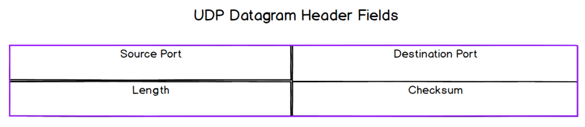

# User Datagram Protocol (UDP)
UDP is another popular protocol on the transport layer. The Protocol Data Unit
(PDU) of UDP is known as a **Datagram**. Similar to TCP, it uses the Source and
Destination Port numbers to provide multiplexing. 

## Pros and Cons of UDP
Pros
- UDP provides **speed and flexibility** to its applications.
  - Being a connectionless protocol, applications using it can start sending 
  data without incurring the latency involved in establishing a connection
  - Without acknowledgements and retransmissions, data delivery is faster. 
  Without providing message order guarantee, it also remove the issue of 
  [Head-of-line blocking](09_tcp.md#disadvantages-of-tcp).
  - Application developers choosing UDP has flexibility to choose only the 
  type or level of reliability required rather than take it wholesale if they 
  use TCP e.g. implement sequencing but not retransmission.
  - Some applications such as video calling or online gaming requires speed for
  good user experience. Occasional loss of data causing a slight glitch is
  better than significant lag.

Cons
- UDP does not provide any of the reliability of TCP. It is just as **inherently
unreliable** as the layers below it.
  - It does not guarantee message delivery
  - It does not guarantee message delivery order
  - It has no built-in congestion avoidance (i.e. network) or flow-control 
  (recipient) mechanisms
