# HTTP

## What is HTTP?
- HTTP stands for **HyperText Transfer Protocol**
- It is an application layer protocol that governs
  - how requests for resources on the web are made and how they should be
  responded to.
  - how messages should be structured so that they can be understood by
  the recipient
- HTTP is based on a **client-server paradigm**, and **operates in 
request-response cycles** where a client (usually a browser) will make a
**request** to a remote server hosting content over a network for a web
resource.
- The server will then send a **response** that provides either the requested
resource or update the client the status/issues encountered in performing
that request.
- HTTP is a text-based protocol. All requests and responses are transmitted
in plain text, making them inherently insecure.

## HTTP Request
What is a HTTP request?
- A HTTP request is a text-based message sent from a client to a server 
to access a resource on the server.
- A HTTP request is sent when we enter a URL in a browser address bar, click
a link on a page, submit a web form or interact with web elements in a way
designed to send out a request (e.g. hover over an item may retrieve a preview)

What are the components of a HTTP request?
- A **request line** containing the **method**, **path** and **protocol version**
  - The **method** indicates the type of action to be performed for the request. `GET`
  and `POST` are the most common methods.
  - The **path** indicates the location of the resource on the server.
  - The **version** indicates the version of HTTP being used 
  ```plaintext
  GET / HTTP/1.1
  ```
- A **set of headers** (name-value pairs) to give the server more information
about the client and the resource being requested. Common request headers 
include:
  | Field Name | Description | Example |
  |---|---|---|
  | Host | Indicates where the resource is located as a server may have multiple hosts. | Host: www.reddit.com |
  | Accept-Language | List of acceptable languages | Accept-Language: en-US,en;q=0.8 |
  | User-Agent | A string identifying the client. | User-Agent: Mozilla/5.0 (Macintosh; Intel Mac OS X 10_9_5) AppleWebKit/537.36 (KHTML, like Gecko) Chrome/38.0.2125.101 Safari/537.36 |
  | Connection | Type of connection client prefer. | Connection: keep-alive |
  | Cookie | Identifier for a session | Cookie: .... |
  
- A **body** (optional)
  - This field is mainly used by a `POST` request to house the data to be sent
  to the server.

### GET and POST Request Methods
What are `GET` and `POST` requests and their uses?
- A `GET` request is used to **retrieve resource** from the server. When we
enter a url in the address bar or when we click on a link, we are issuing a
`GET` request.
- A `GET` request can also send data to a server using query strings in url.
However, these have length limits and can expose sensitive information.
- A `POST` request is used to send data to a server or to initiate an action
on the server end. We issue a `POST` request when we submit a web form.
- A `POST` request allow us to send larger data (e.g. images and videos).
- Since `POST` requests use the body rather than the URL to append the data,
they are more suitable to send sensitive information like username and password.
- The response to a `POST` request can redirect us to another URL listed under
the `Location` header. This happens in login situations where a user is 
redirected to a specific page upon successful authentication. The browser will
see the response header and **automatically** issue a new `GET` request
to the URL specified in the `Location` header.

#### Examples
**Page with Web form for POST Request (Triggered by form submit button)**
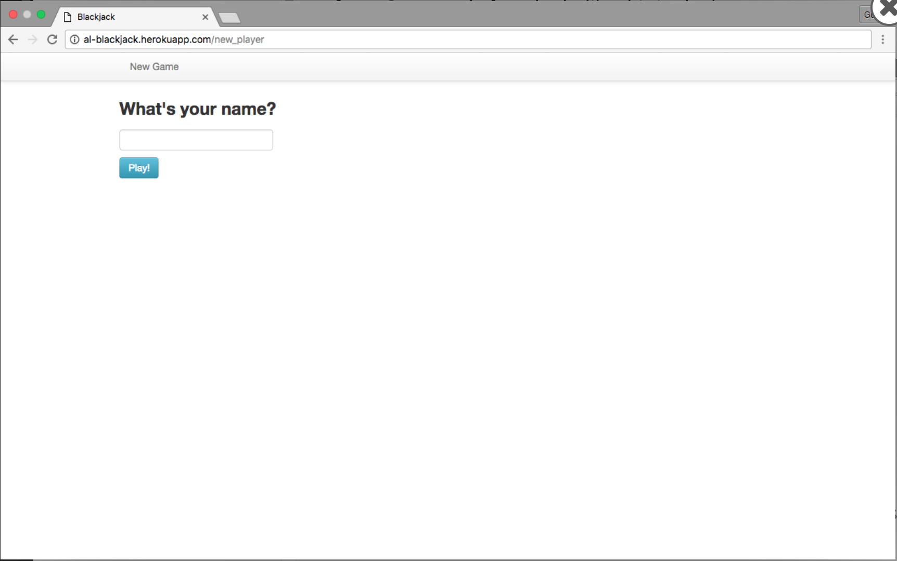
Image above shows a web form with a field and a `play!` web button. Entering
a name and pressing the button triggers a HTTP `POST` request.

**Examining the Data Parameters Using Web Developer Tool**
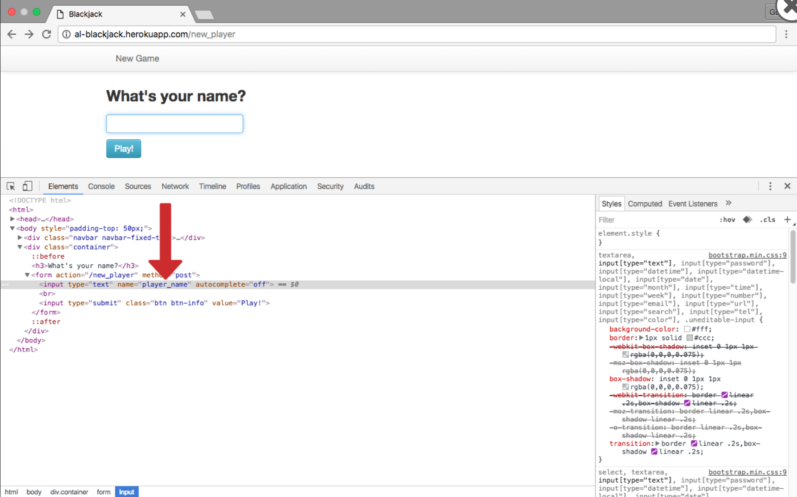
Examining the html file of the page using Inspector tab, we can see that 
the `player_name` parameter we are sending as part of the POST request is
embedded in the form via the `name` attribute of the `input` element.

**Redirection to another URL after POST Request**
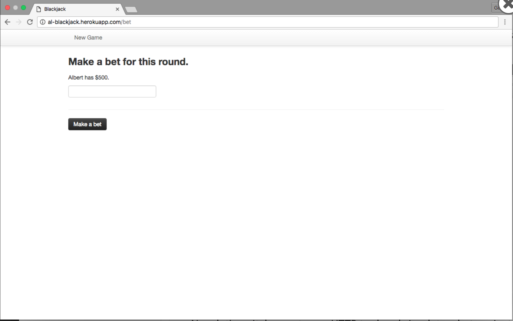
The response by the web server caused a redirection to a new URL.

**Examining POST Request and Response under HTTP Tool Paw 3**
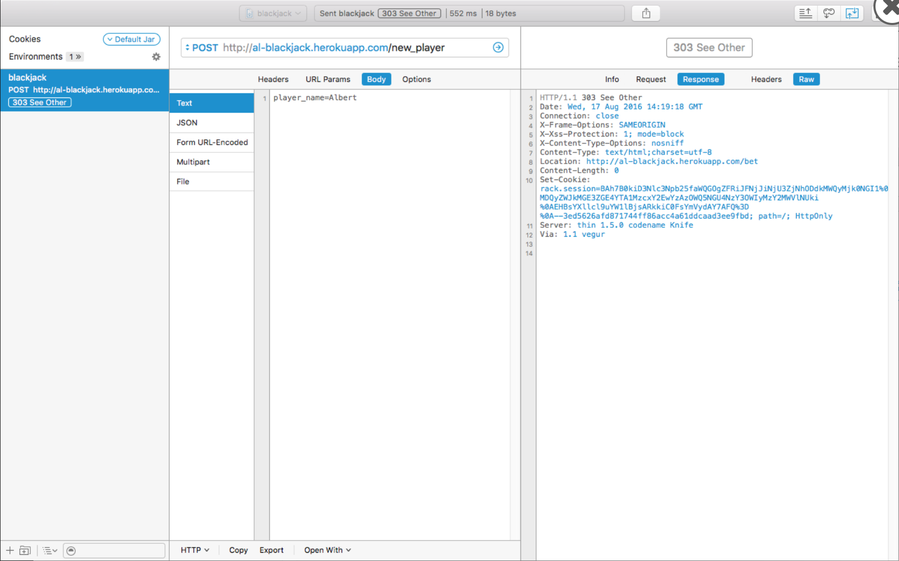 
Examining the response to the POST request using Paw HTTP tool, we see it 
has 303 status code and a location field in the response header, indicating
the resource is at another location. The browser on seeing this, will 
automatically send a new GET request to this url, which is what causes the
redirection. 

We can also use curl (terminal HTTP Tool) to effect the same post request.
```terminal
$ curl -X POST "http://al-blackjack.herokuapp.com/new_player" -d "player_name=Albert" -m 30 -v
```
Here we can also supply the parameter `player_name=albert` using the -d flag.

## HTTP Response
What is an HTTP Response?
- HTTP responses are text-based messages sent from the server to the client in
respond to the client's request. They either:
  - Provide the client with the resource required
  - Inform the client that the action it requested was carried out
  - Inform the client that an error occurred in the process

What does an HTTP Response consist of?
- An HTTP response consists of a **response line**, **headers**, and a **body**
- The **response line** contains the **status code**, **status text**, and **version**
  - The **status code** is a three-digit number send by server signifying the status
  of the request. 
  - The accompanying **status text** gives more description of the
  status code. Common response status code are:

  | Status Code | Status Text | Meaning |
  |---|---|---|
  | 200 | OK | The request was handled successfully. |
  | 302 | Found | The requested resource has changed temporarily. Usually results in redirect to another URL. |
  | 404 | Not Found | The requested resources cannot be found. |
  | 500 | Internal Server Error | The server has encountered a generic error. |

  - `302` Found
    - Indicates resource has been moved and new location has been found
    - The new location is provided in the `Location` response header. Browser
    will then automatically issue a GET request to that new url. An example
    of this is trying to access a page that requires authentication 
    e.g `https://github.com/settings/profile`. The server will issue a `302`
    status code response to redirect to the login page 
    `https://github.com/login?return_to=https://github.com/settings/profile`.
    The `return_to=` query string will help redirect back to the original 
    destination page after sign in.
    
    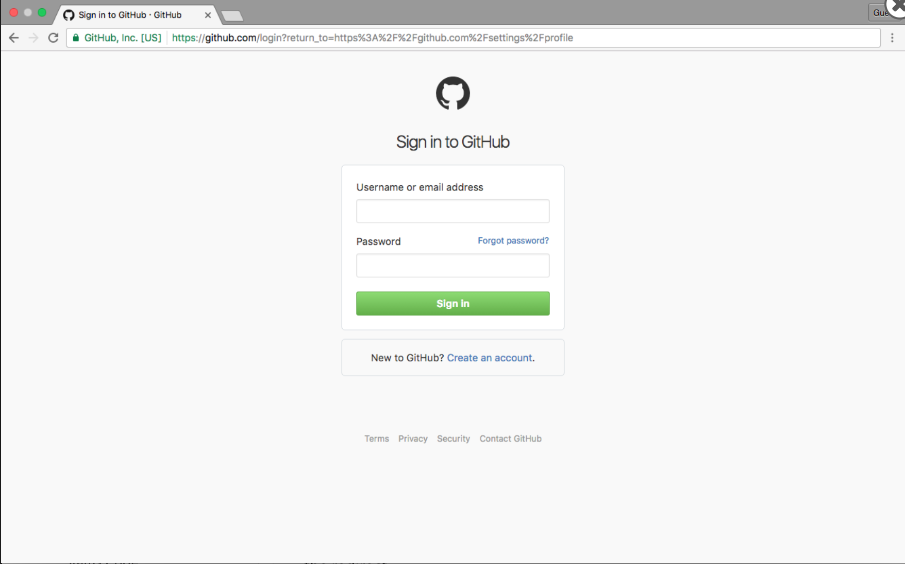
    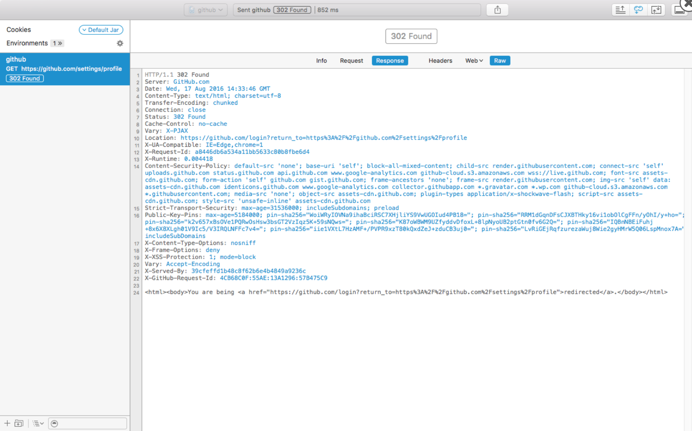

    - All 300 level status code indicate some kind of redirect status.
  
  - `500` Internal Server Error
  This status code indicate a **server side issue**, and can be caused by mis-configured server
  setting to misplaced comma in application code. 


- HTTP **response headers** offer more information about the resource being sent. Common
headers include:

  | Header Name | Description | Example |
  |---|---|---|
  | Content-Encoding | The type of encoding used on the data. | Content-Encoding: gzip |
  | Server | Name of the server. | Server: thin 1.5.0 codename Knife |
  | Location | Notify client of new resource location. | Location: https://www.github.com/login |
  | Content-Type | Type of data the response contains to help client render it correctly. | Content-Type: text/html; charset=UTF-8 |

- HTTP **response body** consists of the raw data for the requested resource
This might be the HTML of the webpage, or the raw data of any files being
requested, such as images, videos, or audio files.

## The HTTP Request Response Cycle
- The HTTP request-response cycle describes the way client and server
behaves to facilitate the exchange of information.
- It begins with the client making an HTTP request.
  - This typically involves a browser issuing a HTTP request to a server in
  response to some kind of user action or event (i.e. typing a url into an
  address bar, clicking a link, submitting a form, etc).
  - The request consists of, at minimum, a request line consists of the method
  (i.e. GET or POST), the host and the path.
  - The request is sent off to the server by means of the lower layer network
  protocols.
- When the server receives the request, it will analyze it.
  - This may include actions like verifying the user's session or loading any
  necessary data from a database
- Once the server has analysed the request, it will issue a response
  - This includes the status field, a numeric field that tells if the response
  was successful, headers which contain important meta-data that helps the
  client process the response, and the body which contains the raw data of the
  resource being sent.
- When the browser receives the response, it will process the information within
and render the resource in a user-friendly manner.

## State
What is meant by 'state' in the context of the web?

- A "stateful" web application is one that maintains knowledge of past
interactions.
  - This might include keeping track of individual user accounts and maintain
  a "logged in" status accross multiple resource requests and refreshes 
  e.g. Facebook.
  - Stateful apps can also keep track of items a user has placed in an online
  "shopping cart", even over multiple days
- **HTTP is a stateless protocol**, meaning that no information is kept on the
server between request/response cycles. Each request/response cycle is 
independent, and has no effect on previous or subsequent cycles.
- Stateless protocols are resilient, fast, and flexible as the server doesn't
have to retain any information between each request/response cycle nor does
any part of the system have to perform any clean up.
- However, because of the statelessness of HTTP, it can be very difficult to
simulate a stateful experience and make it seem like a persistent connection
exists as many modern web apps do.


## Stateful Web Applications
Modern web applications are able to stimulate a stateful experience
through the use of sessions and cookies.

### Sessions and Cookies
- A **session** refers to a contiguous period a client spent browsing a site. 
It starts the moment a client **first arrives** on a site and ends when it
stops using the site. Since the latter is non-deterministic, servers close a
connection if it goes idle for a specified period of time. The session is then
said to expire. Each session has a **session ID** created by the server to
uniquely identify that session. This session ID is used as a **key** to store
all session related data in a database on the server. 

- **Cookies** are small text files (max 4kb) sent by servers and stored locally
in the browser. They help websites track information about a user across
multiple pages of a website to delivers a stateful browsing experience.

- The process of how session ID and cookies are used to simulate a stateful 
experience is as follows:
  1. A user visits a site for the **first time** by entering its URL in the
  address bar of that browser. This issues a `GET` request to the server 
  hosting the resource.
  ```terminal
  GET /index.html HTTP/1.1
  Host: www.shoopshop.com
  ```
  
  2. The server examines the request and finds no cookie header. It proceeds to 
  **create a new session ID** for this new connection, then **sends a response
  with a `Set-Cookie` header** that contains the name `sessionId` and value 
  `abc123` of this session ID to user's browser. The cookie also have an
  expiration date. It is also possible to set more cookies using multiple
  `Set-Cookie` headers in the response if required.
  ```plaintext
  HTTP/1.0 200 OK
  Content-type: text/html
  Set-Cookie: sessionId=abc123; Expires=Wed, 09 Jun 2021 10:18:14 GMT
  ```
  
  3. The **browser saves the cookie information** on the user's hard drive, 
  allowing this user data to persist beyond this session. Cookies still
  available after restarting the browser or computer are known as a "persistent
  cookies". There are also "session cookies", cookies with no expiration date
  that gets deleted the moment the browser is closed.
  
  4. When the user next navigates to any resources on this website, the
  browser will **append the session ID to any subsequent requests** from the
  stored cookie for this website.
  ```plaintext
  GET /shop.html HTTP/1.1
  Cookie: sessionId=abc123
  ```
  
  5. When the server receives the HTTP request, it inspects the cookie header,
  and find that the request is coming from a user with a known session ID. It
  then look up that session ID in its database, construct the state (e.g. login 
  status, past preferences/purchases) from session data and create a
  presonalized response to the user.
  
  [Source: Khan Academy](https://www.khanacademy.org/computing/computers-and-internet/xcae6f4a7ff015e7d:online-data-security/xcae6f4a7ff015e7d:user-data-tracking/a/web-cookies)

### Additional Notes on Session IDs and Cookies
The use of session IDs impose the following requirements on servers:
- They have to **check for presence of session ids** in all requests they receives
- They have to **check the validity of the session ids** and have rules to handle
session expiry 
- They need to have a way to **store session data**
- They have to **retrieve the session data** using session IDs and **recreate the
application state** from the session data into a HTML file and send it back
to the client as the response.

Additional notes on **security**
- Session data stored on the server is deemed more secure then those
on a cookie as the former is encrypted and less easy to tamper.
- Removing the session ID in cookies is akin to logging out.
- To maintain security, sessions expire after a certain idle time, when the
user log out, closes the browser or simply delete that specific cookie
containing the session id. Due to differing security requirements, banking apps
typically impose a shorter expiry session to prevent unauthorised login while
other apps like facebook may use long expiry sessions to reduce usage friction
by minimising the need for relogins.

## AJAX
- AJAX stands for Asynchronous JavaScript and XML and it utilizes an 
**asynchronous request-response model** that allows is to develop highly
interactive, modern web applications.

- With HTTP/1.1 and earlier versions generally regarded as a 
[synchronous protocol](https://docs.microsoft.com/en-us/dotnet/architecture/microservices/architect-microservice-container-applications/communication-in-microservice-architecture#communication-types),
the client (browser) cannot perform another action but has to wait for a
server response after issuing a request. This make it potentially 
**unresponsive to new inputs while awaiting server response**. This 
potential poor responsiveness is inadequate if we want applications respond
interactively with each key stroke (e.g. each new letter entered in a google
search box triggers a request and resultant search suggestions)
- Also, requiring the browser to do a full page refresh as
expected in HTTP for every keystroke (request) is simply too costly.

AJAX helps overcome above limitations by:
- Being **asynchronous**, the client remains capable of performing other actions
e.g. respond to new user inputs by issuing new requests, even while awaiting
server response to previous requests.
- When a server response is received, a callback function is initialized
to process the response and **update only the affected part of the page** instead
of a full page refresh.

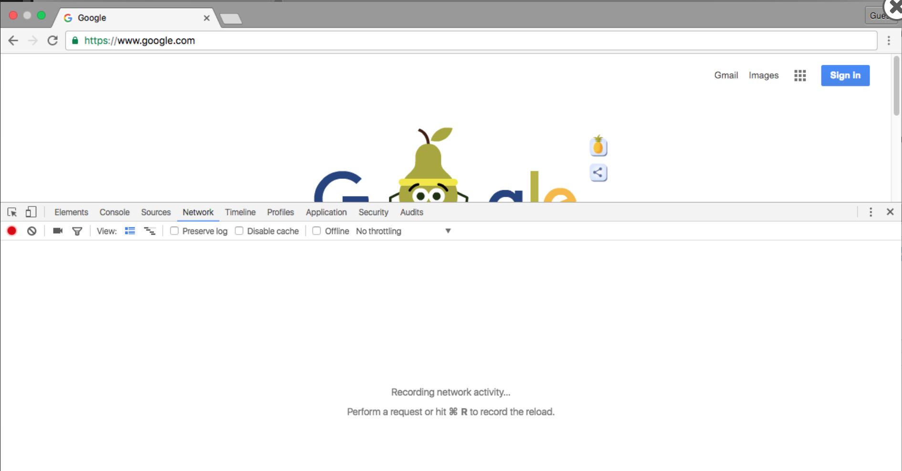
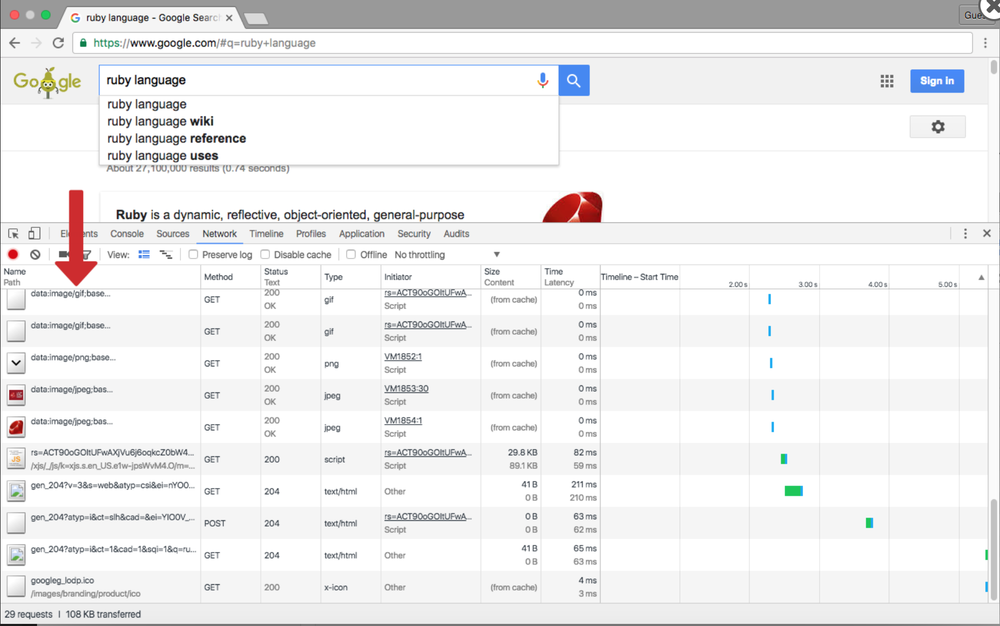


## HTTP Tools
- The browser has built-in tools to help web developers troubleshoot. We can 
  view the HTTP requests and responses using these tools. 
  1. Select **More Tools -> Web Developer Tools** from the drop down menu. 
  2. Next select **network** tab.
  3. Enter the URL in the address bar
  4. We will see a lot of entries, each entry represents a separate request.
  By visiting a URL, our browser is actually making multiple requests, one for
  each resource (images, file etc)
  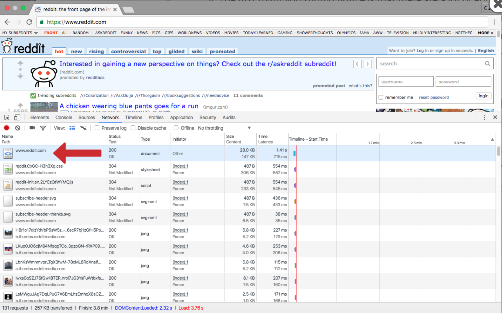

  5. We can view the specific request and response headers (including cookies)
  by clicking the specific request which will open up the header tab by default.
  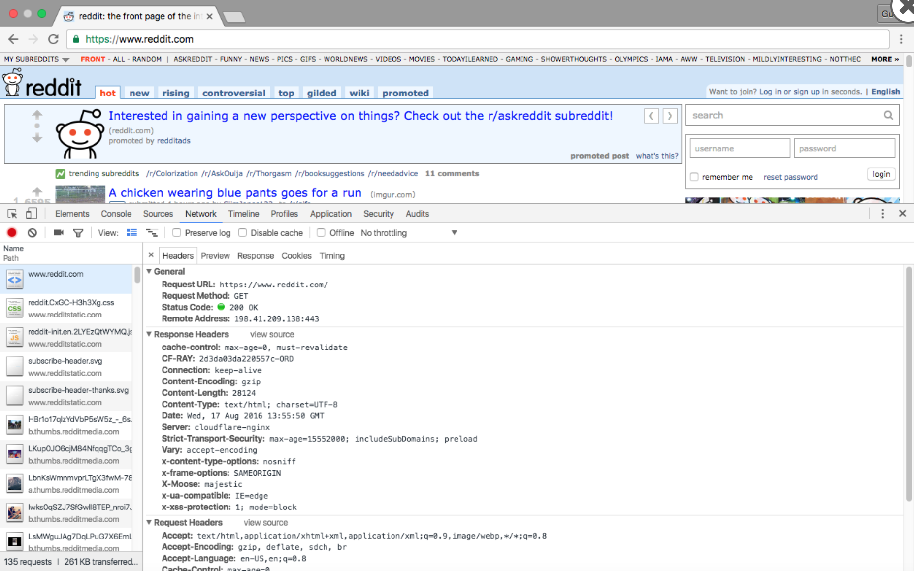

  6. We can see the response data under the response tab. This is the same data
  as using a HTTP tool.
  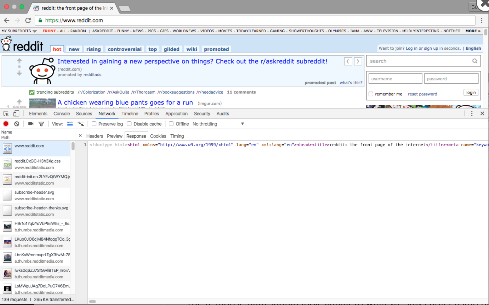

- Besides using a browser as a client, we can also use GUI based HTTP tools such
as [Paw](https://paw.cloud/) and CURL, a command line HTTP tool, to issue requests and receive
responses. It also issues a request like the browser but doesn't process the
response but show us its raw form.
  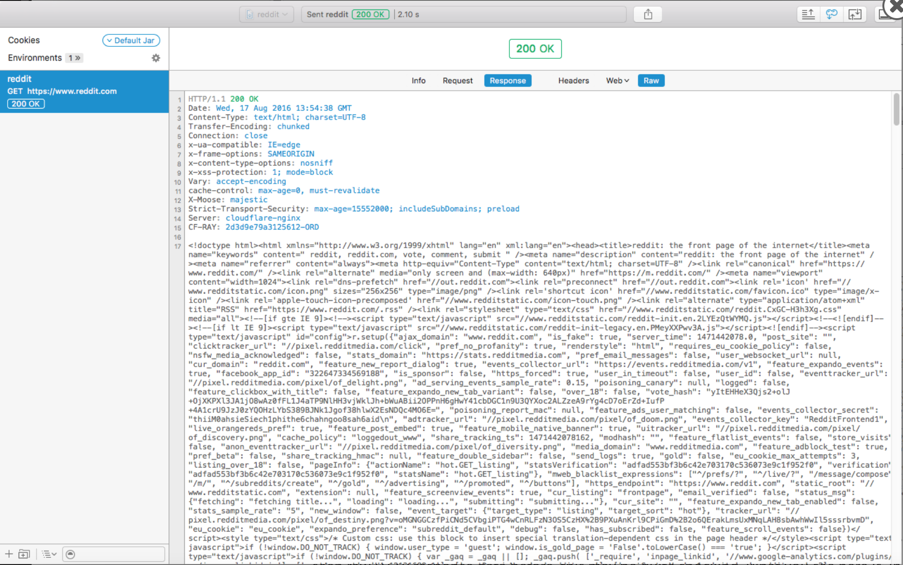

  ```terminal
  curl -X GET "https://www.reddit.com/" -m 30 -v -A 'User-Agent: Mozilla/5.0 (Macintosh; Intel Mac OS X 10_9_5) AppleWebKit/537.36 (KHTML, like Gecko) Chrome/38.0.2125.101 Safari/537.36'

  # More websites block bots and require HTTP requests to have a User-Agent representing the device and browser # confirguration. We do this using the -A option with curl.
  ```

What are some differences between using a web browser vs a HTTP tool as client?
- When using an HTTP tool, a new request for redirected resources 
(i.e. a 302 response) will not be issued automatically, unlike a browser
- A browser will **automatically send new requests to grab all referenced
resources** (i.e. dependencies) in the raw data of a response and an HTTP
tool will not
- A browser will render the row response data in a user friendly way, and an
HTTP tool will not


