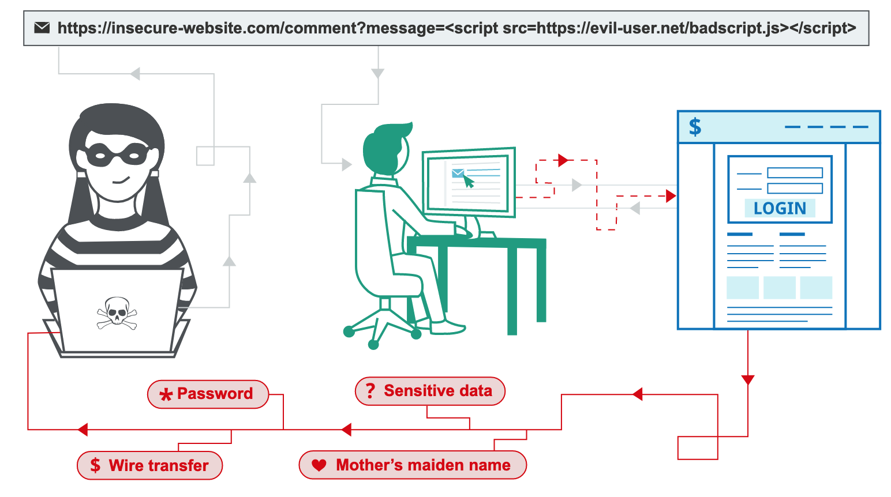

# Security
Below are some of the common security issues concerning web developers.

## Hypertext Transfer Protocol Secure (HTTPS)
- HTTP requests and responses are transferred in **plain text** and are 
inherently insecure. Using packet sniffing and other techniques, a hacker
could intercept the data exchanged and gain access to sensitive information.
- For security reasons, most web applications now opt for the **https** scheme
instead of http. 
- HTTPS uses the **Transport Layer Security (TLS) protocol** in the lower layer
and is also known as HTTP over TLS.
- With HTTPS, all requests and responses are **encrypted** before they are
transported on the network.

## Transport Layer Security (TLS)
- TLS operates between HTTP and TCP in the **Session Layer** (between 
Application and Transport layer) under the 7 layer OSI model.
- The current TLS protocol began life as the Secure Socket Layer (SSL). 
It provide the following security services: 
  - **Encryption**: the process of encoding a message so that it can only be
  read by authorized recipients.
  - **Authentication**: the process of verifying the identity of a party in
  a message exchange
  - **Integrity**: the process of detecting whether a message has been
  tampered.

- An application could choose one or more of these services and is not
obliged to use all three.

### Encryption
- **Symmetry key encryption** uses the **same key** to encrypt and 
decrypt a message.


- **Asymmetric key encryption** uses a pair of keys for encryption and 
decryption. A message sender will use the public key of the recipient 
to encrypt the message. The recipient will use its own private key
to decrypt the message. The public key of the recipient is available to
anyone but only the recipient knows it own private key.


- The problem of using symmetric key encryption over the internet lies in
the exchange of the common key between client and server without exposing
the key itself. A mechanism is needed to protect the symmetric key from 
exposure.

### The TLS Handshake
- The process to setup the secure connection is known as the TLS handshake.
- As TLS uses **TCP** as the transport layer protocol, the TLS handshake 
immediately **dovetails** the 3-way TCP handshake. 
- TLS handshake uses **asymmetric key encryption to securely exchange the 
common symmetric key**, then **transit to symmetric key encryption for 
subsequent message exchanges**.
- The TLS handshake process:
  - Client sends a `ClientHello` message immediately after the TCP `ACK` 
  message. This message contains the **highest TLS protocol version** and 
  **the list of [Ciper Suites](#Cipher Suites)** supported by the client.
  - The server replies with a `ServerHello` that sets the TLS protocol version
  and Cipher Suites. As part of this message, the server also includes its
  certificate containing its public key and sets the `ServerHelloDone` field.
  - The client commence symmetric key exchange and then set the 
  `ChangeCipherSpec` and `Finished` flags to inform server to switch to
  symmetric encryption. 
  - The server generates the symmetric key using the seed and agreed
  algorithm in the Ciper Suites then set the `ChangeCipherSpec` and `Finished`
  flag in its reply to the client to complete the TLS handshake.
  - Client and server then begin secure communication using symmetric key.
  
- HTTPS has performance overheads as the TLS handshake introduces 2 x round-trip
delays on top of the 1 x round-trip delay by TCP handshake. 

### Cipher Suites
- A cipher is a cryptographic algorithm used in encryption and decryption. 
- A suite of ciphers are required to accomplish the range of security tasks:
  - symmetric key exchange
  - authentication
  - symmetric key encryption
  - checking message integrity

### TLS Authentication
- While it is important to be able to transfer data in encrypted form, it is
important to verify the identify of the counterpart to make sure it is not
not a malicious impersonator.
- TLS allows the client to **authenticate the identity of the server** during 
the TLS handshake: 
  - The `ServerHello` message sent by the server includes the site's 
  security certificate. This certificate contains information on its owner,
  its public key. 
  - On top of that, the message also contain a set of data and a digital
  signature formed by encrypting that set of data using the server's private
  key. 
  - The client can then confirm the server holds the private key if the result
  of decrypting the digital signature using the public key matches the original
  unencrypted data.

- To confirm a certificate is authentic, we trace the Certificate Hierarchy 
to find the chain of **Certificate Authorities (CA)** that certify the 
certificate.
- Site certificates are issued by Intermediate CA, whose certificates are in
turn issued by Root CA in increasing level of authority. Root CA's certificate
are self-signed. 
- To verify a certificate, we use the public key in its Issuer's certificate. 


### TLS Integrity
- TLS encapsulates the HTTP PDU with its own meta-data to form its own PDU,
a **record**.
- One of the field is the Message Authentication Code (**MAC**) used
to test the message integrity 


- Similar to how the **checksum** field in a TCP segment is used to 
detect data corruption during transport, MAC is used to detect if a TLS 
record has been altered:
  - The sender create the MAC by applying a pre-agreed hash algorithm
  and hash value in the Cipher Suite on a subset of the data payload.
  - The sender then encypted the data payload using the symmetric key 
  (as part of the encryption process), and encapsulate it into a TLS
  record and hand it to the transport layer to be transferred to other
  party
  - The recipient decrypts the data payload of the received TLS record
  using the symmetric key, then use the pre-agreed hashing algorithm 
  and hash value on subset of payload to recreate the MAC. If the two
  MACs match, message is not tampered. 

## Same-origin policy
- This policy only allow unrestricted access between resources from the
**same origin**. 
- Two URLs have the **same origin** if they have **same scheme, hostname and 
port number**.
  | Resource 1 | Resource 2 | Same Origin? |
  |---|---|---|
  | `http://mysite.com/doc1` | `http://mysite.com/doc2` | Yes |
  | `http://mysite.com/doc1` | `https://mysite.com/doc2` | No, different scheme |
  | `http://mysite.com/doc1` | `http://mysite.com:4000/doc2` | No, different port |
  | `http://mysite.com/doc1` | `http://another_site.com/doc2` | No, different host |

- Restrictions apply if resources have different origins:
  - Disallowed: Programmatic access of resources via APIs (e.g. 
  `XMLLHttpRequest` or `fetch`)
  - Allowed: 
    - links, redirects or form submissions 
    - Cross-origin embedding of resources e.g. scripts, css stylesheets,
	  images, other media fonts, and iframes.

As web applications often base their user authentication on cookies
included in HTTP requests, this may make them vulnerable to **session 
hijacking**. The same-origin policy help prevent attacks coming from
another website.

**Possible Session Hijacking Scenario**
Without this policy, a user that has logged onto `onlinebank.com`, and
is also browsing `attacker.com` in another tab at the same time may be
subjected to an attack by a script hosted on `attacker.com`. The script
can issue a request to `onlinebank.com` and since the browser would
automatically include the `onlinebank.com` cookies in every request to
`onlinebank.com`, `attacker.com` can gain unauthorized access.  
`attacker.com` could do the following:

```plaintext
1. Issue a GET request to onlinebank.com/personal_info using a script. 
(Since you are logged in to onlinebank.com, the server could send back
the HTML page containing your personal info page.)

2. Receive and parse the returned HTML page.

3. Retrieve the CSRF tokens, private email addresses, addresses and
banking information parsed from the page.
```

[Reference](https://medium.com/swlh/hacking-the-same-origin-policy-f9f49ad592fc)

## Session Hijacking
- Session hijacking refers to a malignant action in which a hacker
uses a stolen session ID to bypass authentication and gain access
to protected content without the need for username and password
- To reduce the chance of session hijacking, we could: 
  - Reset sessions frequently. A successful login will reset a 
  session, rendering old session ID invalid through the creation of 
  a new one. Hence web applications tend to make users authenticate
  before granting access to sensitive areas. The old session ID that
  might been compromised would becomes invalidated.
  - Set expiration time on sessions to narrow access window.
  - Using HTTPS to prevent attacker from gaining access to session ID
 
## Cross-Site Scripting (XSS)
- Cross-site scripting (also known as XSS) is a web security vulnerability
that could happen when we allow users to **input HTML or Javascript that
to a page for display (e.g. a comment)**. 
- Users loading the compromised page will **execute the malicious code
on their browswer.** 
- Such attacks are not prevented by same origin policy since the malicious
code lives on the site. 

[Referenced from Portswigger](https://portswigger.net/web-security/cross-site-scripting)

To prevent XSS, we could:
- Sanitize user input to eliminate problematic inputs such as <script>
tags, or disallow HTML and Javascript input altogether
- Escape all user input data when displaying it so that browser do not
interpret them as code. e.g. `<p>Hello World!<\p>` to 
`&lt;p&gt;Hello World!&lt;\p&gt;` to display it as plaintext. 
[HTML entities](https://entitycode.com/#math-content)


[Additional Implementation Resource: Open Web Application Security Project Session Management Cheatsheet](https://cheatsheetseries.owasp.org/cheatsheets/Session_Management_Cheat_Sheet.html)