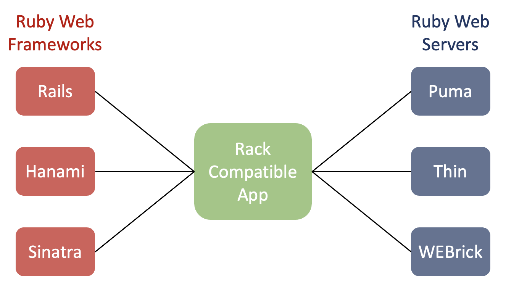

# Web Server, Rack and Web Frameworks

## Section Links
[Role of Server In HTTP Request - Response Cycle](#role-of-server-in-http-request---response-cycle)\
[Web Servers](#web-servers)\
[Rack](#rack)\
[Web Frameworks](#web-frameworks)\
[References](#references)

--- 

## Role of Server In HTTP Request - Response Cycle
- A server in a client - server paradigm has a broad set of meanings. It encompasses both physical hardware as well as the hosted web application that users are interacting with through their browsers. **Note:** physical hardware could involves 1 or more physical/virtual compute units as well as supporting services such as load balancers etc, depending on the scale involved.


	|  |
	| :--: |
	| <b>Image Credit - Launch School Course Material</b> |
- As part of the HTTP request - response cycle, web application residing on the server will need to be able to perform the following:
	1. Listen to incoming HTTP requests,
	2. Parse HTTP requests into readily useable forms e.g. path, parameters, respective headers and data in request body,
	3. Process request in accordance with business logic of application,
	4. Generate status update on processed request,
	5. Package status update and associated content, e.g. dynamically generated HTML, as a HTTP response for reply to client.

[Back to Top](#section-links)


## Web Servers
- As steps 1, 2, and 5 above are **common** to every web application, these functionalities have been **separately abstracted into applications called "web servers"**. With HTTP request and response handling provided by web servers, developers can focus their efforts implementing business logic unique to their application. 
- Different web servers are available in the market, each with different strengths. For example, WEBrick, a lightweight HTTPS server whose gem comes preinstalled with earlier versions of Ruby (before Ruby 3.0.0) and is popular for use in local development. In production, one can opt for [Puma](https://puma.io/), another Ruby based Webserver built for speed and parallelism. 
- Note: If you are using Ruby 3.0.0 or higher, you need to manually install the WEBrick Gem. Add the following statement to your `Gemfile` and then run `bundle install`:
	```ruby
	gem 'webrick'
	```

[Back to Top](#section-links)


## Rack
- To allow web applications to interoperate with different web servers available in the market, a web server interface specification known as **Rack** was developed. 
- Applications that complies with the Rack standard are commonly known as Rack applications. To be a Rack compatible application, it must: 
	- Contain a configuration file (see example of `HelloWorld` app below). The file can be named `config` or some other name but it must have a `.ru` extension and reside in the top level of the project directory. This file enables a connected web server to spin-up an instance of the web application.
	```ruby
	# config.ru
	require_relative 'hello_world'
	
	run HelloWorld.new
	```

	- The application must implement a **`call(env)` instance method** with an `env`  parameter. `env` contains all environment variables and information related to a HTTP request received by the connected web server parsed into a key-value hash.
	```plaintext
	-   GATEWAY_INTERFACE : CGI/1.1
	-   PATH_INFO : /
	-   QUERY_STRING :
	-   REMOTE_ADDR : 127.0.0.1
	-   REMOTE_HOST : 127.0.0.1
	-   REQUEST_METHOD : GET
	-   REQUEST_URI : [http://localhost:9595/](http://localhost:9595/)
	-   SCRIPT_NAME :
	-   SERVER_NAME : localhost
	-   SERVER_PORT : 9595
	-   SERVER_PROTOCOL : HTTP/1.1
	-   SERVER_SOFTWARE : WEBrick/1.3.1 (Ruby/2.3.1/2016–04–26)
	-   HTTP_HOST : localhost:9595
	-   HTTP_CONNECTION : keep-alive
	-   HTTP_CACHE_CONTROL : max-age=0
	-   HTTP_UPGRADE_INSECURE_REQUESTS : 1
	-   HTTP_USER_AGENT : Mozilla/5.0 (Macintosh; Intel Mac OS X 10_12_0) AppleWebKit/537.36 (KHTML, like — Gecko) Chrome/53.0.2785.143 Safari/537.36
	-   HTTP_ACCEPT : text/html,application/xhtml+xml,application/xml;q=0.9,image/webp,_/_;q=0.8
	-   HTTP_ACCEPT_ENCODING : gzip, deflate, sdch
	-   HTTP_ACCEPT_LANGUAGE : en-US,en;q=0.8
	-   HTTP_COOKIE : _netflux_session=VTZoU1ZvVXlZV1MrQ3pTMHhlNXBSRGdpMFdXQXhrRFJnUGNMMEhhQmNLanp1aU9rb3pyQ3o2dGRE eVp0ZW5YTVJaSXBqZldIdWV1ZEtDRFdJWVo5b0FkMHRyZWVLVXVjR0lRdnV5dnl4VU01UWs0ZnBTbmlQc1Urb1g2ME1yU0pESkg0bGR2 bmwzR0h2bUt6a2xlQjlNNEpJNGtiOG1BQ2VkS0p5TWEvc1U0THdkNGtzbEtETmUrb1lDVHY5VWtKLS1oMnQ1cUlXcVJWcXZqTHpqWUNO L0JRPT0%3D — 17bf5208879c831997c5c78c69895ded29aad26b
	-   rack.version : [1, 3]
	-   rack.input : #
	-   rack.errors : #
	-   rack.multithread : true
	-   rack.multiprocess : false
	-   rack.run_once : false
	-   rack.url_scheme : http
	-   rack.hijack? : true
	-   rack.hijack : #
	-   rack.hijack_io :
	-   HTTP_VERSION : HTTP/1.1
	-   REQUEST_PATH : /
	```

	- `call(env)` must return an **array containing 3 elements**:
		- **Status Code** represented by a string or other data type that responds to `to_i`
		- **Headers** in the form of a hash. Hash keys corresponds to HTTP response header fields while their corresponding value will be the value for that HTTP response header.
		- **Response Body**. This object can be any datatype that responds to an `each` method. The response should never just be a String but must yield a String value. 
	- The connected web server will then use the return value of `call(env)` to generate a HTTP response as reply to a HTTP request from a client.

[Back to Top](#section-links)


## Web Frameworks
- Web frameworks are a collection of libraries/code that work well together for a specific purpose: building command line apps, building web apps, parsing data, writing tests, working with images, working with music etc. 
- Sinatra and Rails are two popular Ruby based web frameworks for building Rack web applications. Sinatra is lightweight while Rails has more features.

	|  | 
	| :--: |
	| <b>Image Credit - Launch School Course Material</b> |
- Sinatra provides conventions for where to place application code, and built-in capabilities for routing, view templates and many other convenient features that you will otherwise have to code up yourself. 

[Back to Top](#section-links)


## Putting All Together
|  |
| :--: |
| <b> Image Credit - Adapted from [Demystifying Ruby Applications, Ruby Application Servers, and Web Servers](https://medium.com/launch-school/demystifying-ruby-applications-ruby-application-servers-and-web-servers-c3d0fd415cb3)</b> |

The above diagram shows how various Ruby Frameworks can be used to develop Rack compatible applications that can work with different Ruby web servers.

## References
- [Growing Your Own Web Framework with Rack Part 1](https://launchschool.medium.com/growing-your-own-web-framework-with-rack-part-1-8c4c630c5faf)
- [Growing Your Own Web Framework with Rack Part 2](https://launchschool.medium.com/growing-your-own-web-framework-with-rack-part-2-25393c5d48bc)
- [Growing Your Own Web Framework with Rack Part 3](https://launchschool.medium.com/growing-your-own-web-framework-with-rack-part-3-54ab86c569bc)
- [Growing Your Own Web Framework with Rack Part 4](https://launchschool.medium.com/growing-your-own-web-framework-with-rack-part-4-a4a4da2967a2)
- [What is 'Rack' in Ruby/Rail?](http://blog.gauravchande.com/what-is-rack-in-ruby-rails)
- [Demystifying Ruby Applications, Ruby Application Servers, and Web Servers](https://medium.com/launch-school/demystifying-ruby-applications-ruby-application-servers-and-web-servers-c3d0fd415cb3)

[Back to Top](#section-links)