# Introduction To SQL
---
## Section Links
[What Is Structured Data?](#what-is-structured-data)\
[Relational Database Management Systems](#relational-database-management-systems)\
[PostgreSQL Interfaces](#postgresql-interfaces)\
[What is SQL?](#what-is-sql)\
[Create, List and Delete Databases](#create-list-and-delete-databases)\
[Database Design](#database-design)\
[Create Tables](#create-tables)\
[Alter Tables ](#alter-tables)\
[Insert Data Into A Table](#insert-data-into-a-table)\
[Update Data In A Table](#update-data-in-a-table)\
[Delete Data From A Table](#delete-data-from-a-table)\
[Query Data](#query-data)

---
## What Is Structured Data?
- Structured data is data with well-formatted fields that can be stored in a table.
- Storing data in this manner makes it easier for one to find, arrange and analyze them.
- A relational database is used to store structured data.
- A spreadsheet can be thought of as a database:

	| Spreadsheet | Database |
	| --- | --- |
	| Worksheet | Table |
	| Worksheet Column | Table Column |
	| Worksheet Row | Table Record |

## Relational Database Management Systems
- While a spreadsheet is good enough to manage a small amount of data, they do not scale well, especially if one need to check for duplicates and errors, support concurrent users or find data quickly. At this point, it is likely better to move to a relational database.
- A relational database is a database organized according to the relational model of data. The relational model defines a set of relations (i.e. tables) and describes the relationships between tables.
- A Relational Database Management Systems is a software application for managing relational databases
- **SQLite**, **MS SQL**, **PostgresSQL** and **MySQL** are amongst the most popular relational model based RDMS. Non relational model systems also exist. For example, MongoDB is a popular 'NoSQL' system that uses a document oriented data storage model.


## PostgreSQL Interfaces
- A RDMS provides multiple interfaces to interact with it. We can do so using a programming language e.g. Ruby or Python, a GUI that comes with the RDMS, or the command-line interface.
- Fundamentally, all these interfaces adopt a **client-server architecture** for this interaction: they issue a request or command and receive a response in return.

### PostgreSQL Client Applications
- PostgreSQL comes with the following 'client applications' that are **executed from the command line**. Commonly used ones include `psql`, `createdb`, `dropdb`, `pg_dump`, `pg_restore` and `pg_bench`
- Some of these client applications are essentially wrappers around SQL statements. For example `createdb`, used to create a new PostgreSQL database, is essentially a wrapper for the SQL command `CREATE DATABASE`.

### The psql Console
- `psql` is a REPL (Read, Evaluate, Print, Loop) based interactive console with a terminal front-end for the PostgreSQL database, similar to `irb` for Ruby. 
- Type `psql -d $dbname` (or `psql $dbname` if the database name is the first argument) to start the console and connect to a database named `$dbname`. A `$dbname=#` prompt would indicate we have connected successfully. 
	```terminal
	cklim@Chees-Air ~ % psql postgres
	
	psql (14.5)
	Type "help" for help.
	
	postgres=#
	```

	**Note:** If we just run `psql` without providing any database name, it will attempt to connect to a database with same name as current username. If that database does not exist, it will throw an error.

- `psql` console accepts both **meta-commands** and **SQL statements**
- **meta commands** are commands runned within `psql` that are prefixed with a `\`. Some useful `psql` meta commands include:

	| Meta Command | Description | Example |
	| --- | --- | --- | --- |
	| `\conninfo` | Show **Conn**ection **Info** for current database connection | |
	|  `\l` | **L**ist all available databases in the server | |
	| `\c $dbname` | **C**onnect to database `$dbname` | `\c blog_development` |
	| `\d` | **D**escribe all tables, views and sequences in connected database |  |
	| `\dt` | **D**escribe all **t**ables in connected database |  |
	| `\ds` | **D**escribe all **s**equences in connected database |  |
	| `\d $name` | **D**escribe relation `$name` | `\d users` |
	| `\?` | List of console commands and options | |
	| `\h` | List of available SQL syntax **H**elp topics | |
	| `\h $topic` | SQL syntax **H**elp on syntax for `$topic` | `\h INSERT` |
	| `\i [filename]` | Execute commands from a file | `\i table_dump.sql` |
	| `\q` | **Q**uit | |

- SQL statements are commands issued to the database using SQL syntax and needs to be terminated with `;`. 

## What is SQL?
- SQL stands for Structured Query Language and is the language used to communicate with a relational database.
- SQL is a **declarative** language: It describes what needs to be done but not how to do it. The how is dependent on the choice of RDMS one is using.
- SQL comprised of 3 sub-languages

	| sub-language | controls | SQL Constructs |
	| --- | --- | --- |
	| **DDL** or data definition language | relation structure (schema) and rules | `CREATE`, `DROP`, `ALTER` |
	| **DML** or data manipulation language | values stored within relations (tables) | `SELECT`, `INSERT`, `UPDATE`, `DELETE`| 
	| **DCL** or data control language | access control i.e. who can do what | `GRANT`, `REVOKE` |
### Style Guide
- Refer to [SQL Style guide](https://www.sqlstyle.guide/) for conventions that we **may want** to adopt in our code. 
## Create, List and Delete Databases

| Client/ Application Command-Line Command | Notes |
| --- | --- |
| `psql -d sql_book` | starts a `psql` session and connect to the _sql_book_ database |
| `createdb sql_book` | creates a new database _sql_book_ using the psql utility |
| `dropdb my_database` | permanently deletes the database named _my_database_ and all its data |
Note: `createdb` and `dropdb` are just wrapper functions for `CREATE DATABASE` and `DROP DATABASE` SQL statements respectively.

| SQL Statement | Notes |
| --- | --- |
| `CREATE DATABASE sql_book;` | creates a new database called _sql_book_ |
| `DROP DATABASE my_database;` | permanently deletes the database named _my_database_ and all its data |

| PSQL Meta-Command | Notes |
| --- | --- |
| `\l` or `\list` | displays all databases |
| `\c db_name` or `\connect db_name` | connects to db_name database |
| `\q` | exits PostgreSQL session and return to command-line prompt |

### Load Databases
- To import a SQL file (containing a list of SQL statements) into a PostgreSQL database, we can do one of the following:
	```terminal
	$ psql -d my_database < file_to_import.sql
	```
	This will pipe the content of the SQL file within the `psql` console that is connected to `my_database` using redirection, allowing those SQL statements to be executed in `my_database`
	
	```sql
	my_database=# \i ~/some/files/file_to_import.sql
	```
	We can use the `\i` meta command if we are already in a psql session connected to the right database.


## Database Design
### What is Relational Data
- A relation is usually another way to mean table, but could also refer to sequences or views.
- A relationship is an association between the data stored in those relations.

### Normalization
- Combining multiple related columns in one giant table leads to following issues:
	- Data duplication (also known as redundancy);
	- Larger than required table due to duplication in mulitple columns;
	- More prone to errors since it relies on data entry rather than referencing from a master table
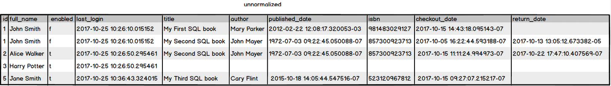

- Data **normalization** is the process of efficiently organizing data across multiple tables (called normal forms) to reduce duplication and then define relationships between them. 
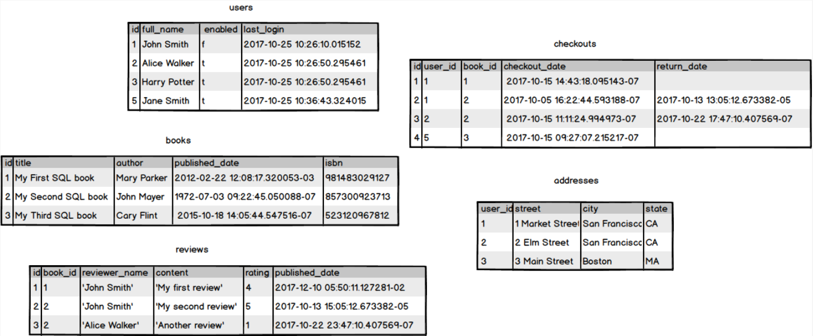


### Database Design
- Database design involves identifying **entities** (table) representing real world objects and the **relationships** between them.
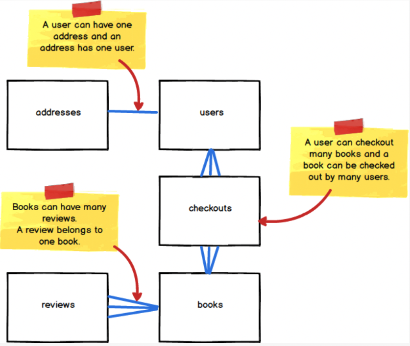
### Key
- A **key** uniquely identifies a single row in a database table. 
- There are two types of keys:
	- **natural key**: a single column or combination of columns (composite key) of a dataset whose values uniquely identifies each row of a table.
	- **surrogate key**: a column containing values specially created to uniquely identify each row of a table. We often use a field with an auto-incrementing integer as a surrogate key.
- `serial` datatype in PostgreSQL is a shortcut for creating columns with a default auto-incrementing value. It is **equivalent to an integer type with both `NOT NULL` and `DEFAULT` value constraints**. The default value corresponds to a sequence of integers, beginning with 1.
	```sql
	-- This statement:
	CREATE TABLE colors (id serial, name text);
	
	-- is actually interpreted as if it were this one:
	CREATE SEQUENCE colors_id_seq;
	CREATE TABLE colors (
	    id integer NOT NULL DEFAULT nextval('colors_id_seq'),
	    name text
	);
	```
	
	```sql
	INSERT INTO colors (name) VALUES ('red');
	INSERT INTO colors (name) VALUES ('green');
	INSERT INTO colors (name) VALUES ('blue');
	```
	
	```psql
	sql-course=# SELECT * FROM colors;
	 id | name
	----+-------
	  1 | red
	  2 | green
	  3 | blue
	```

- A **sequence** is a special type of relation i.e. table that generates a series of numbers. Similar to a generator in python, it keeps track of the current number and allow one to retrieve the next number in sequence using the  `nextval` function.
- Once a number is returned by `nextval` for a standard sequence, it will not be returned again, regardless whether the number has been stored in a row or not.

	```psql
	sql-course=# SELECT nextval('colors_id_seq');
	 nextval
	---------
	       4
	(1 row)
	```
	
	```psql
	sql-course=# INSERT INTO colors (name) VALUES ('yellow');
	INSERT 0 1
	sql-course=# SELECT * FROM colors;
	 id |  name
	----+--------
	  1 | red
	  2 | green
	  3 | blue
	  5 | yellow
	(4 rows)
	```

- To allow the `id` column to be used as a key, we have to enforce the `UNIQUE` constraint upon it. Otherwise, it is still possible to insert a row containing a pre-existing `id` value, rendering the column unsuitable to be a key.

	```psql
	sql-course=# INSERT INTO colors (id, name) VALUES (3, 'orange');
	INSERT 0 1
	sql-course=# SELECT * FROM colors;
	 id |  name
	----+--------
	  1 | red
	  2 | green
	  3 | blue
	  5 | yellow
	  3 | orange
	(5 rows)
	```
	
	```psql
	sql-course=# ALTER TABLE colors ADD CONSTRAINT id_unique UNIQUE (id);
	ERROR:  could not create unique index "id_unique"
	DETAIL:  Key (id)=(3) is duplicated.
	```

	We can fix it as follows:
	```psql
	sql-course=# UPDATE colors SET id = nextval('colors_id_seq') WHERE name = 'orange';
	UPDATE 1
	sql-course=# ALTER TABLE colors ADD CONSTRAINT id_unique UNIQUE (id);
	ALTER TABLE
	sql-course=# SELECT * FROM colors;
	 id |  name
	----+--------
	  1 | red
	  2 | green
	  3 | blue
	  5 | yellow
	  6 | orange
	(5 rows)
	```
	
### Primary Key
- The `PRIMARY KEY` constraint in PostgreSQL is a shortcut to uniquely identify rows in a table.
- Setting a column to be a `PRIMARY KEY` for a table is **functionally equivalent** to imposing `UNIQUE` and `NOT NULL` constraints on that column. The only difference is using `PRIMARY KEY` explicitly convey the intent of the database designer for users of the table to use the chosen column as a unique row identifier.
	```sql
	CREATE TABLE more_colors (id int PRIMARY KEY, name text);
	```

	```sql
	CREATE TABLE more_colors (id int NOT NULL UNIQUE, name text);
	```
- Each table can only have **one** primary key.
- By convention:
	- All tables should have a primary key column called `id`
	- The `id` column should be automatically set to a unique value when new rows are inserted into the table
	- The `id` column is often an integer, although other data types such as a UUID may be suitable on other occasions.

### Foreign Key
- A foreign key allows us to associate a row in a table to a row in another table. 
- This is done by setting a column in one table as a Foreign Key and having that column reference another table's Primary Key column. The foreign key column must have the same type as the column it is referencing.
	```sql
	FOREIGN KEY (fk_col_name)
	REFERENCES target_table_name (pk_col_name);
	```
- A table can have **zero or more** foreign key columns. A join table for M-to-M relationships have 2 foreign keys.
- A foreign key constraint allows only values presents in the column it is referencing to be inserted, it **does not prevent `NULL` from being inserted**. To do that we need to add a `NOT NULL` constraint on the foreign key. See question 5 of [foreign key example](../../07_ls180_database_foundations/lesson_03/02a_foreign_keys.md)
- Foreign key declaration syntax:

	**Correct syntax**
	```sql
	-- immediately next to column declaration
	CREATE TABLE flights (
	  id serial PRIMARY KEY,
	  ...
	  airline_id [other constraints] REFERENCES airlines(id)
	);
	```
	
	```sql
	-- after all column declaration
	CREATE TABLE flights (
	  id serial PRIMARY KEY,
	  ...
	  airline_id int,
	  FOREIGN KEY (airline_id) REFERENCES airlines(id)
	);
	```
	
	```sql
	-- post table creation
	CREATE TABLE flights (
	  id serial PRIMARY KEY,
	  ...
	  airline_id int
	);
	ALTER TABLE flights
	  ADD FOREIGN KEY (airline_id)
	  REFERENCES airlines(id);
	```

	**Wrong Syntax**
	```sql
	CREATE TABLE flights (
	  id serial PRIMARY KEY,
	  ...
	  airline_id int FOREIGN KEY REFERENCES airlines(id)
	);
	```

### One-to-One Relationship
- A one-to-one relationship between two entities exists when a particular entity instance in one table can only have one assoicate entity instance in another table. For example, we assume an user can only have one address in our application.

- To implement a 1-1 relationship in a database, `id`, which is the `PRIMARY KEY` of the `users` table is used as both the `FOREIGN KEY` _and_ `PRIMARY KEY` of the `addresses` table.
	```sql
	/*
	one-to-one: User has one address
	*/
	
	CREATE TABLE addresses (
	  user_id int, -- Both a primary and foreign key
	  street varchar(30) NOT NULL,
	  city varchar(30) NOT NULL,
	  state varchar(30) NOT NULL,
	  PRIMARY KEY (user_id),
	  FOREIGN KEY (user_id)
	      REFERENCES users (id)
	      ON DELETE CASCADE
	);
	```
	- The `PRIMARY KEY` and `FOREIGN KEY` clauses make `user_id` both the primary key as well as the foreign key of the addresses table.
	- The `PRIMARY KEY` constraint prevents us from inserting a row that has the same `user_id` value as an existing row.
	- The `FOREIGN KEY` constraint prevents us from inserting a row in `addresses` with a `user_id` value that does not exist in the `id` column of the `users` table. **Note**: We can add a user without an address but not an address without a user since it is `addresses` that references `users`
	- The `ON DELETE CASCADE` meant that if the row being referenced is deleted, the row referencing it is also deleted. Alternatives to `CASCADE` are `SET NULL` or `SET DEFAULT`

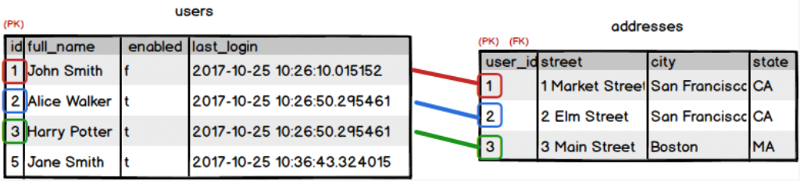

### One-to-Many Relationship
- A one-to-many relationship exists between two entities if an entity instance in one of the tables can be associated with multiple records in the other tables, and the opposite relationship does not exist. **Example:** A review belongs to only one book. A book can have many reviews.

- This relationship is modelled by having the `PRIMARY KEY` and `FOREIGN KEY` reference different columns.
	```sql
	CREATE TABLE books (
	  id serial,
	  title varchar(100) NOT NULL,
	  author varchar(100) NOT NULL,
	  published_date timestamp NOT NULL,
	  isbn char(12),
	  PRIMARY KEY (id),
	  UNIQUE (isbn)
	);
	
	/*
	 one-to-many: Book has many reviews
	*/
	
	CREATE TABLE reviews (
	  id serial,
	  book_id integer NOT NULL,
	  reviewer_name varchar(255),
	  content varchar(255),
	  rating integer,
	  published_date timestamp DEFAULT CURRENT_TIMESTAMP,
	  PRIMARY KEY (id),
	  FOREIGN KEY (book_id)
	      REFERENCES books(id)
	      ON DELETE CASCADE
	);
	```

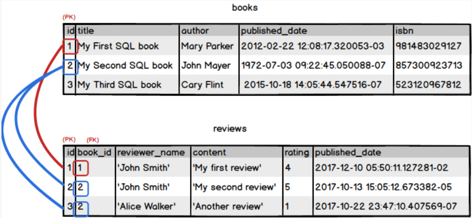

### Many-to-Many Relationship
- A many-to-many relationship exists between two entities if for one entity instance there may be multiple records in the other table, and vice versa. **Example:** A user can check out many books. A book can be checked out by many users (over time).

- To implement this relationship, we need a third, cross-reference, table holding the relationship between the two entities, by having **two** `FOREIGN KEY`s, each of which references the **PRIMARY KEY** of one of the tables for which we want to create this relationship. We already have our `books` and `users` tables, so we just need to create the cross-reference table: `checkouts`
	```sql
	CREATE TABLE checkouts (
	  id serial,
	  user_id int NOT NULL,
	  book_id int NOT NULL,
	  checkout_date timestamp,
	  return_date timestamp,
	  PRIMARY KEY (id),
	  FOREIGN KEY (user_id) REFERENCES users(id)
	                        ON DELETE CASCADE,
	  FOREIGN KEY (book_id) REFERENCES books(id)
	                        ON DELETE CASCADE
	);
	```

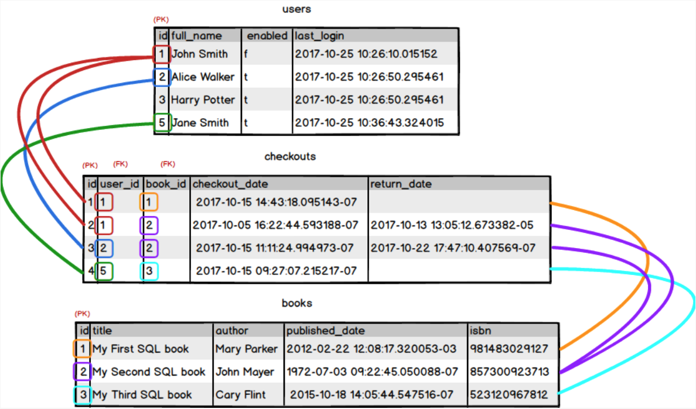

### Database Diagrams 
### Schema

- Database diagrams can be represented with **3 levels of schema**, each with different order of details:
	- **Conceptual**: A **high-level** design focussed on identifying entities (relations) and their relationships
	- **Logical**: Expand beyond a conceptual schema by providing details about attributes in each entity and their detail type. However, details are not implementation specific i.e. not tied to a specific choice of database such as MySQL, Oracle or PostgreSQL.
	- **Physical**: A detailed **database specific design** focused on implementation. Include rules i.e. constraints between entities.
	
### Entity Relationships
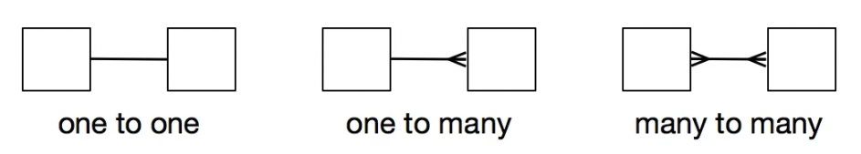

- **one to one**
	Each instance in one entity can only be associated with one instance on the related entity. One to one relationships are rare in practice. They are typically implemented by having the second entity sharing the same primary key as the first entity.

- **one to many**
	![[one_to_many_example.png]]
	- A ticket can only be for one event but an event can have many tickets (1:M)
	- A ticket is only for one seat but a seat can have many tickets (1:M)
	- A seat can only be in one section but a section can have many seats (1:M)
	- A ticket can only be purchased by one customer but a customer can purchase many tickets (1:M)
	- One to many relationship is typically implemented with the entity on the many end having a foreign key that reference the primary key of the entity on the one end.

- **many to many**
		![[many_to_many_example.png]]
	- A book can only have one author but an author can have many books (1:M)
	- A book can fall under many categories and a category can contain many books (M:M)
	- Many to many relationship are implemented by having an **additional entity** (called join entity) that contain two foreign keys, each referencing the primary keys of the original relations.

### Cardinality and Modality
| 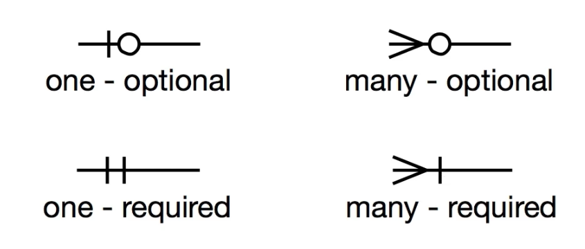 |
| :--: |
| <b> Crow's Foot Notation </b> |

- **Cardinality** determines the number of objects on each side of the relationship (1:1, 1:M, M:M)
- **Modality** determines if the relationship is required (1) or optional (0)

	**Ticketing Example**
	
	- Ticket must belong to one event but an event can have 0 or more tickets
	- Ticket must be associated with one seat but a seat can have 0 or more tickets
	- A seat must belong to one section but a section can have 1 or more seats
	- A ticket must belong to one customer but a customer can have 0 or more tickets
	
	**Book Author Example**
	
	- A book can belong to 0 or more categories and a category can have 0 or more books
	- A book must have 1 author but an author can have 1 or more books.

### Joins
`SELECT ... FROM table_a [JOIN TYPE] table_b ON join_condition`

The `JOIN TYPE` can be one of the following: 
- `INNER JOIN` returns only the rows where there the join condition is `true`
- `LEFT OUTER JOIN` returns all rows from the `FROM` table and rows from the right table that meets the join condition
- `RIGHT OUTER JOIN` returns all rows from the right table and rows from the left table that meets the join condition
- `FULL OUTER JOIN` returns the all rows from an `INNER JOIN` as well as unmatch rows from both the left and right tables. 
- `CROSS JOIN` takes each row from the `FROM` table and combine with all rows from the right table. It does not require `ON join_condition` since it returns all combinations.
	```sql
	SELECT * FROM table_a CROSS JOIN table_b 

	# old syntax
	SELECT * FROM table_a, table_b
    ```
- There is an old syntax that uses cross join and then `WHERE` clause to retain only the rows that match to get the equivalent of an `INNER JOIN`. This is not preferred since the join type is less obvious.
	```sql
	SELECT * FROM table_a, table_b WHERE table_a.id = table_b.id

	# Equivalent to
	SELECT * FROM table_a INNER JOIN table_b ON table_a.id = table_b.id
    ```


#### One-to-Many Relationships
- While a **denormalized** table may provide the convenience of having all required information in one table, it also results in several disadvantages:
	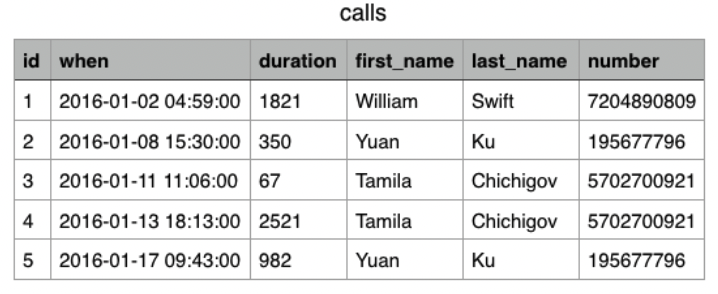
	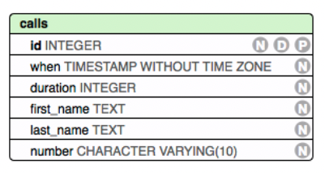
	- Certain fields will encounter **data duplication** due to sharing of common attributes. If these needs to be updated, the large number of affected rows increase the risk of **update anomaly**, where some affected rows are missed out in the update, leading to data inconsistency.
	- **Insertion anomaly** where we cannot just insert a subset of data. In the calls example, we cannot store contacts which have not made a call.
	- **Deletion anomaly** where we could lose more information than is required in a deletion. In the calls example, when a call is deleted, we could also lose the contact information.
- **Normalization** is the process of designing schema that minimize the possible occurrence of these anomalies. It involves extracting data into additional tables and then use foreign keys to tie back associated data.
- In the calls example, by separating the denormalized calls table into contacts and calls table, we eliminate data duplication but storing only unique contacts in the contacts table and referencing them in the calls table.
	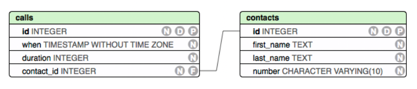
	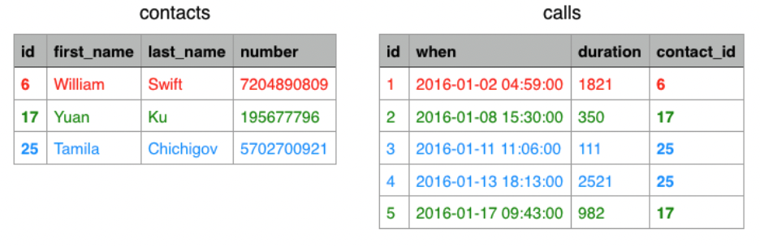
- We can obtain back the denormalized table by joining the two tables using the common column.

### Many-to-Many Relationships
- Instances from both tables can be associated to more than 1 instance from the other table. For example, a book can fall under multiple categories while a category can contain multiple books.
	
- Translating above entity relationship diagram into a physical schema, we get:
	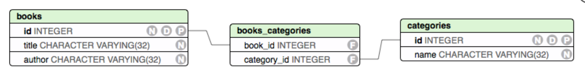
- Many-to-many relationships make use of a new table, `books_categories` in this example, to store information about the relationships between instances of the two tables. Such a table contain foreign keys which reference primary keys of the tables having the many-to-many relationship and is called a _join table_.
- Foreign keys should not allow `NULL` values. To enforce that, we should always enable both `NOT NULL` and `ON DELETE CASCADE` constraints on foreign keys.

## Create Tables
**Syntax**
```sql
CREATE TABLE table_name (
    column_1_name column_1_data_type [constraints, ...],
    column_2_name column_2_data_type [constraints, ...],
    .
    .
    .
    constraints
);
```

**Example**
```sql
CREATE TABLE users (
       id serial UNIQUE NOT NULL,
       username char(25),
       enabled boolean DEFAULT TRUE
);
```

### Common Data Types
| Data Type | Type | Value | Example Values |
| --- | --- | --- | --- | --- |
| `serial` | numeric | **Non-null**, **auto-incrementing integers** starting from 1. Used as identifiers for row. |`1`, `2` |
| `integer` | numeric | whole numbers | `-2147483648` to `+2147483647` |
| `real` | numeric | floating-point numbers | `123.456`, `-567.3515` |
| `decimal(precision, scale)` | numeric | precision numbers. precision refers to total numbers of digits, while scale is the number of decimal place | `123.45`, `-567.890` |
|  `char(N)` | character | `N` characters of text. If string has less than `N` characters, remaining length are filled with spaces | `John` |
| `varchar(N)` | character | Up to `N` characters of text | `canoe` |
| `text` | character | unlimited length of text. | `a very long string` |
| `timestamp` | date/time | date and time | `1999-01-08 04:05:06` |
| `date` | date/time | date only | `1999-01-08` |
| `boolean` | boolean | true or false. Displayed as `t` or `f` in PostgreSQL | `true` or `false` | 

**Additional Notes** 
- As of v. 10 of PostgreSQL, the `IDENTITY` syntax has replaced the use of `serial` to handle auto-incrementing key value.
	```sql
	column_name type GENERATED { ALWAYS | BY DEFAULT } AS IDENTITY[ ( sequence_option ) ]
	
	/* Example*/
	CREATE TABLE color (
	    color_id INT GENERATED ALWAYS AS IDENTITY,
	    color_name VARCHAR NOT NULL
	);
	```
- Most data types have a limited range of values they can stored. PostgreSQL will raise an error when those are exceeded.
- The `text` datatype is only applicable to PostgreSQL and not part of the SQL standard.
- For char related datatypes, we use **single quotes `''`** to enclose them. If there is a `'` within the string, it has to be escaped with a preceding `'`. **Double quotes `""`** are used to differentiate a name from a reserved keyword or for names with space e.g. `SELECT name AS "Tropical Fruits"`
- `NULL` is a special value which represent the absence of any other value. Using comparison operators ( `=` ,`<`, `>=` etc) on `NULL` will return `NULL` rather than `true` or `false` (e.g. `NULL = NULL` returns `NULL`). Instead, use `IS` or `IS NOT` when comparing something with `NULL`.
- `timestamptz` data type is available if we need to store a timestamp with timezone.
- Refer to [PostgreSQL data type documentation](https://www.postgresql.org/docs/current/datatype.html) for details.
- When naming columns, avoid names that are reserved keywords in the chosen RDMS. We can avoid collision by adding quotes to the column name to distinguish them from the reserved keyword.

	In PostgreSQL, `ALL` is a [reserved keyword](https://www.postgresql.org/docs/current/sql-keywords-appendix.html)
	```sql
	CREATE TABLE inventory (item varchar(255), all boolean);
	
	ERROR:  syntax error at or near "all"
	LINE 3:   all BOOLEAN
	```
	
	 We can solve this by:
	```sql
	CREATE TABLE inventory (item varchar(255), "all" boolean);
	CREATE TABLE
	
	INSERT INTO inventory
	VALUES ('torchlight', true),
	       ('duffel bag', false);
	INSERT 0 2
	
	/* Correct usage */
	SELECT "all" from inventory;
	all 
	-----
	t
	f
	(2 rows)
	
	/* Incorrect usage */
	SELECT all from inventory;
	--
	(2 rows)
	```


### Keys and Constraints
- keys and constraints are optional rules that define what data values are allowed in certain columns. Examples include:
	- `UNIQUE`: no duplicate values allowed in that column
	- `NOT NULL`: column cannot be empty
	- `DEFAULT`: If no value is provided for a row in that column, it will be given the default value.

### View the Table
- `\dt` meta-command to display list of tables in the database
- `\d table_name` to view the schema of a table
	```sql
	\d users
	```
	```plaintext
	        Table "public.users"
	  Column  |     Type      |  Modifiers
	----------+---------------+----------------------------------------------------
	 id       | integer       | not null default nextval('users_id_seq'::regclass)
	 username | character(25) |
	 enabled  | boolean       | default true
	Indexes:
	   "users_id_key" UNIQUE CONSTRAINT, btree (id)
	```
	- Even though `id` column is defined as `serial`, a special data type in PostgreSQL that corresponds to `integer` data type with `DEFAULT` constraint with `nextval` function that tracks the current number for auto-incrementing.
	- `users` table also has an index `user_id_key` that was created when we add the `UNIQUE` constaint. Indexes are a way to store quick references to values in a particular column. 


## Alter Tables
| Action | Command | Notes |
| --- | --- | --- |
| Add a column to a table | ALTER TABLE table_name ADD COLUMN column_name data_type CONSTRAINTS; | Alters a table by adding a column with a specified data type and optional constraints. |
| Alter a column's data type | ALTER TABLE table_name ALTER COLUMN column_name TYPE data_type; | Alters the table by changing the datatype of column. |
| Rename a table | ALTER TABLE table_name RENAME TO new_table_name; | Changes the name of a table in the currently connected to database.|
| Rename a column within a table | ALTER TABLE table_name RENAME COLUMN column_name TO new_column_name; | Renames a column of the specified table. |
| Add a table constraint | ALTER TABLE table_name ADD \[CONSTRAINT constraint_name\] **constraint_clause**; | Commonly used **constraint_clause** include:</br>`CHECK` (expression);</br>`UNIQUE` (col_name \[, ... \]);</br>`PRIMARY KEY` (col_name \[, ... \]);</br>`FOREIGN KEY` (col_name \[, ... \]) `REFERENCES` reference_table \[ (ref_col \[, ... \]) \]); |
| Add a `NOT NULL` constraint | ALTER TABLE table_name ALTER COLUMN col_name SET NOT NULL; | Set a NOT NULL constraint for a column. To set multiple columns, use the following:</br>ALTER TABLE</br>  ALTER COLUMN col_name SET NOT NULL,</br>  ALTER COLUMN col_name SET NOT NULL; |
| Add a `DEFAULT` constraint | ALTER TABLE table_name ALTER COLUMN col_name SET DEFAULT value; | |
| Remove a table constraint | ALTER TABLE table_name DROP CONSTRAINT constraint_name; | Removes a constraint from the specified table. |
| Remove a column constraint | ALTER TABLE table_name ALTER COLUMN column_name DROP CONSTRAINT; | Removes a constraint from the specified column. This syntax is necessary for `NOT NULL` constraints, which aren't specifically named. |
| Remove a column from a table | ALTER TABLE table_name DROP COLUMN column_name; | Removes a column from the specified table. |
| Delete a table from the database | DROP TABLE table_name; | Permanently deletes the specified table from its database. |

### Multiple Ways to Create a Table Schema
**Example**
We want to create an `airlines` table for a flight booking application. The table should contain the following columns:
-   An auto-incrementing id column which should also be the Primary Key
-   An airline name of up to 30 characters (this column shouldn't be empty)
-   A country name of up to 50 characters
-   A two character IATA code
-   A three character ICAO code
-   A website address of up to 40 characters

There are multiple ways to arrive at a required schema. We can list everything under `CREATE TABLE` and/or use `ALTER TABLE` to introduce missed out constraints. Even within `CREATE TABLE`, constraints can be listed immediately beside a field or below. All examples below are valid.
```sql
CREATE TABLE airlines (
  id serial PRIMARY KEY,
  airline_name varchar(30),
  country varchar(50),
  iata_code char(2),
  icao_code char(3),
  website varchar(40),
  CHECK (length(iata_code) = 2),
  CHECK (length(icao_code) = 3)
);
ALTER TABLE airlines
  ALTER COLUMN airline_name SET NOT NULL;
```

```sql
CREATE TABLE airlines (
  id serial PRIMARY KEY,
  airline_name varchar(30) NOT NULL,
  country varchar(50),
  iata_code varchar(2) CHECK (length(iata_code) = 2),
  icao_code varchar(3) CHECK (length(icao_code) = 3),
  website varchar(40)
);
```

```sql
CREATE TABLE airlines (
  id serial PRIMARY KEY,
  airline_name varchar(30) NOT NULL,
  country varchar(50),
  iata_code char(2),
  icao_code char(3),
  website varchar(40)
);
ALTER TABLE airlines
  ADD CHECK (length(iata_code) = 2),
  ADD CHECK (length(icao_code) = 3);
```

```sql
CREATE TABLE airlines (
  id serial PRIMARY KEY,
  airline_name varchar(30) NOT NULL,
  country varchar(50)
);
ALTER TABLE airlines
  ADD COLUMN iata_code char(2),
  ADD COLUMN icao_code char(3),
  ADD COLUMN website varchar(40),
  ADD CHECK (length(iata_code) = 2),
  ADD CHECK (length(icao_code) = 3);
```

There is a specific syntax to use `ALTER TABLE` to add a `NOT NULL` constraint.

**Example**
Assuming we have a table called `todos` that includes a boolean `status` column and we want to alter our table so that `NULL` values cannot be added to that column.

**Correct Syntax**
```sql
ALTER TABLE todos
  ALTER COLUMN status SET NOT NULL;
```

**Wrong Syntax**
```sql
ALTER TABLE todos
  ADD CONSTRAINT status_not_null
  SET status NOT NULL;
```

```sql
ALTER TABLE todos
  SET status NOT NULL;
```

```sql
ALTER TABLE todos
  ADD COLUMN status boolean NOT NULL;
```
This last example will also throw an error since `status` column already exist and we will not be allowed to add another column with the same name.

### Constraints and Adding Data
- Setting a `DEFAULT` constraint on a column ensures that the default value will be used if no value is specified for that column in an `INSERT` statement.
- A `NOT NULL` constraint ensures that a value has to be provided for that column.
- For a column with `UNIQUE` constraint, an index holding unique values will be created. This index will be used to ensure any new value to be inserted in that column does not already exist in the index.
- `CHECK` constraints allow us to check values for confirmity before insertion into column. E.g. an inserted string for the column `full_name` has to be non empty.
	```sql
	ALTER TABLE users ADD CONSTRAINT check_name CHECK (full_name <> '');

	# Shortcut if we do not mind an autogenerated constraint name
	ALTER TABLE users ADD CHECK (full_name <> '');
	```

	```sql
	INSERT INTO users (id, full_name) VALUES (4, '');
	```

	```plaintext
	ERROR:  new row for relation "users" violates check constraint "users_full_name_check"
	DETAIL:  Failing row contains (4, , t, 2017-10-25 10:32:21.521183).
	```

- We can make multiple changes in a single `ALTER TABLE` statement by separating each change with a comma.
	```sql
	ALTER TABLE stars
	  ADD CHECK (spectral_type IN ('O', 'B', 'A', 'F', 'G', 'K', 'M')),
	  ALTER COLUMN spectral_type SET NOT NULL;
	```

- Instead of using `CHECK` constraints with a list of valid values, we can also use `ENUM` types to achieve the same effect
```sql
-- Using CHECK constraints
ALTER TABLE stars
  ADD CHECK (spectral_type IN ('O', 'B', 'A', 'F', 'G', 'K', 'M'));

-- Using ENUM to enforce correct values
ALTER TABLE stars
DROP CONSTRAINT stars_spectral_type_check;

CREATE TYPE spectral_type_enum AS ENUM ('O', 'B', 'A', 'F', 'G', 'K', 'M');
ALTER TABLE stars
  ALTER COLUMN spectral_type TYPE spectral_type_enum
                           USING spectral_type::spectral_type_enum;
```
```
## Select Queries
- We use the `SELECT` statement to retrieve rows from a table that meets certain conditions
	``` sql
	SELECT column_name, ...
	  FROM table_name
	  WHERE condition;
	```

- The `WHERE` clause generally include operators in conditional expressions:
	- **Comparison** operators: `<`, `>`, `<=`, `>=`, `=`, `<>` or `!=`
		```sql
		SELECT full_name, enabled, last_login
			FROM users
		    WHERE id >= 2;
		```
	- **Comparison** predicates: `IS NULL`, `IS NOT NULL`, `BETWEEN`, `NOT BETWEEN`, `IS DISTINCT FROM`, `IS NOT DISTINCT FROM`. As `NULL` is a special value in SQL representing an absence of a value, we cannot use `WHERE column_name = NULL` or `WHERE column_name <> NULL` but have to use `WHERE column_name IS NULL`  or `WHERE column_name IS NOT NULL` instead.
	- **Logical** Operators: `AND`, `OR`, `NOT`
		```sql
		SELECT * FROM users
			WHERE full_name = 'Harry Potter'
		    AND enabled = 'false';
		```
	- **String Matching** Operators: `LIKE`
		```sql
		SELECT * FROM users WHERE full_name LIKE '%Smith';
		```
		`%` is a wildcard that matches any number of character.
		`_` is also a wildcard but only matches a single character
		`LIKE` is case sensitive so `LIKE %Smith` matches `Smith` but not `smith` or `SMITH`
		`ILIKE` for case insensitive match 

- An `ORDER BY` clause can be added to sort the results
	```sql
	SELECT full_name, enabled FROM users
	ORDER BY enabled DESC, id DESC;
	```

### LIMIT and OFFSET
- `LIMIT` or `OFFSET` can be used to return a portion of the result. `LIMIT n` selects the first n rows of the result table. `OFFSET n` skips the first n rows of the result.

	**users table**
	```plaintext
	id |  full_name   | enabled |         last_login
	----+--------------+---------+----------------------------
	 1 | John Smith   | f       | 2017-10-25 10:26:10.015152
	 2 | Jane Smith   | t       | 2017-10-25 10:26:50.295461
	 3 | Harry Potter | t       | 2017-10-25 10:26:50.295461
	 4 | Harry Potter | t       | 2017-10-25 10:36:38.188286
	 5 | Jane Smith   | t       | 2017-10-25 10:36:43.324015
	(5 rows)
	```

	```sql
	SELECT * FROM users LIMIT 1 OFFSET 1;
	```

	```plaintext
	id |  full_name   | enabled |         last_login
	----+--------------+---------+----------------------------
	  2 | Jane Smith   | t       | 2017-10-25 10:26:50.295461
	(1 row)
	```


### DISTINCT
- `DISTINCT` can be used to return only unique values in the result

	```sql
	SELECT DISTINCT full_name FROM users;
	```

	```plaintext
	 full_name
	--------------
	 John Smith
	 Jane Smith
	 Harry Potter
	(3 rows)
	```

- `DISTINCT` can be used in conjunction with SQL function e.g. `count()`:

	```sql
	SELECT count(full_name) FROM users;
	```

	```plaintext
	 count
	-------
	     5
	(1 row)
	```

	```sql
	SELECT count(DISTINCT full_name) FROM users;
	```

	```plaintext
	 count
	-------
	     3
	(1 row)
	```


### Common Functions
- String Functions
	
	| Function | Example | Notes |
	| --- | --- | --- |
	| `length` | `SELECT length(full_name) FROM users;` | This returns the length of every user's name. You could also use `length` in a `WHERE` clause to filter data based on name length. |
	| `trim` |  `SELECT trim(leading ' ' from full_name) FROM users;` | If any of the data in our `full_name` column had a space in front of the name, using the `trim` function like this would remove that leading space. |
	
- Date / Time Functions

	| Function | Example | Notes |
	| --- | --- | --- |
	| `date_part` | `SELECT full_name, date_part('year', last_login) FROM users;` |  `date_part` allow us to view a table that only contains a part of a user's timestamp that we specify. The above query allows us to see each user's name along with the year of the `last_login` date. Sometimes having date/time data down to the second isn't needed |
	| `age` |  `SELECT full_name, age(last_login) FROM users;` | The `age` function, when passed a single `timestamp` as an argument, calculates the time elapsed between that timestamp and the current time. The above query allows us to see how long it has been since each user last logged in. |
	

- Aggregate Functions:

	| Function | Example | Notes |
	| --- | --- | --- |
	| `count` | `SELECT count(id) FROM users;` | Returns the number of values in the column passed in as an argument. This type of function can be very useful depending on the context. We could find the number of users who have enabled an account, or even how many users have certain last names if we use the above statement with other clauses. |
	| `sum` | `SELECT sum(id) FROM users;` | Not to be confused with `count`. This _sums_ numeric type values for all of the selected rows and returns the total. |
	| `min` | `SELECT min(last_login) FROM users;` | This returns the lowest value in a column for all of the selected rows. Can be used with various data types such as numeric, date/ time, and string. |
	| `max` | `SELECT max(last_login) FROM users;` | This returns the highest value in a column for all of the selected rows. Can be used with various data types such as numeric, date/ time, and string. |
	| `avg` | `SELECT avg(id) FROM users;` | Returns the average (arithmetic mean) of numeric type values for all of the selected rows. |


### GROUP BY
- `GROUP BY` clause can be used to aggregate data
	```sql
	SELECT enabled, count(id) FROM users GROUP BY enabled;
	```

	```plaintext
	enabled | count
	---------+-------
	 f       |     1
	 t       |     4
	(2 rows)
	```

- Note: When `GROUP BY` is present, or any aggregate functions are present, it is not valid for the `SELECT` list expressions to refer to ungrouped columns except within aggregate functions or **when the ungrouped column is functionally dependent on the grouped columns**, since there would otherwise be more than one possible value to return for an ungrouped column. A **functional dependency exists if the grouped columns (or a subset thereof) are the primary key of the table containing the ungrouped column**. 

**No Error**
```sql
SELECT books.id, books.author, string_agg(categories.name, ', ') AS categories
  FROM books
    INNER JOIN books_categories ON books.id = books_categories.book_id
    INNER JOIN categories ON books_categories.category_id = categories.id
  GROUP BY books.id ORDER BY books.id;
```
- `books.author` above need not be in the `GROUP BY` clause and yet doesnt cause an error because it is the primary key of `books`, i.e. `books.id` is already in the `GROUP BY` clause. Hence, the issue of `book.author` having more than 1 value is non existant. [See many-to-many Question 2]. 
- We can also group by a primary key even if the `SELECT` list only includes its functionally dependent columns and not the key itself i.e. the column in the `GROUP BY` **need not** be in the `SELECT` list. In the above example, we can remove books.id from the `SELECT` list without any problems.
```sql
SELECT books.author, string_agg(categories.name, ', ') AS categories
  FROM books
    INNER JOIN books_categories ON books.id = books_categories.book_id
    INNER JOIN categories ON books_categories.category_id = categories.id
  GROUP BY books.id ORDER BY books.id;


**Error**
	```sql
	SELECT enabled, full_name, count(id)
	       FROM users
	       GROUP BY enabled;   -- full_name is not grouped
	```

	```plaintext
	ERROR:  column "users.full_name" must appear in the GROUP BY clause or be used in an aggregate function
	```


## Insert Data Into A Table
### Adding Rows of Data
- We can insert a row of value into a table using the following SQL statement:
	```sql
	INSERT INTO table_name
	            (column1_name, column2_name,...)
	     VALUES (data_for_column1, data_for_column2, ...);
	```
	- When inserting data, we may specify all the columns from the table, just a few of them, or none at all. However, not specifying columns could sometimes lead to unexpected errors so it is best to specify which columns we want to insert data into
	- When specifying columns, for each column specified, we must supply a value for it in the VALUES clause. Else we get an error. 
	- If we do not specify a column, a `NULL` or default value will be added to the record automatically during insertion.
	- We can insert multiple rows by separating each value row with a comma. The second digit in the response indicate the count of rows inserted.
	
	```sql
	INSERT INTO users (full_name, enabled)
	           VALUES ('John Smith', false), ('Tom William', true);
	```
	```plaintext
	INSERT 0 2
	```

**Example**
Examine the following schema for a table called `tools`:

```psql
                        Table "public.tools"
  Column  |          Type          |                     Modifiers
----------+------------------------+----------------------------------------------------
 id       | integer                | not null default nextval('tools_id_seq'::regclass)
 name     | character varying(100) | not null
 cost     | numeric(7,2)           | not null
 price    | numeric(7,2)           | not null
 stock    | integer                | not null
 discount | numeric(7,2)           | default 0
 comments | text                   |
Indexes:
    "tools_pkey" PRIMARY KEY, btree (id)
```

We want to add some rows of data to the table, using the default value for the `discount` column and having the values for the `comments` column as `NULL`. Which of the following SQL statements would successfully add data into the table?

**Correct**
```sql
INSERT INTO tools (name, cost, price, stock)
  VALUES ('Hammer', 5.28, 10.00, 25),
         ('Wrench', 11.32, 20.00, 20),
         ('Saw', 3.47, 8.00, 30),
         ('Screwdriver', 1.12, 2.50, 50);
```

```sql
INSERT INTO tools
  VALUES (DEFAULT, 'Hammer', 5.28, 10.00, 25),
         (DEFAULT, 'Wrench', 11.32, 20.00, 20),
         (DEFAULT, 'Saw', 3.47, 8.00, 30),
         (DEFAULT, 'Screwdriver', 1.12, 2.50, 50);
```

**Wrong**
```sql
INSERT INTO tools (name, cost, price, stock, discount, comments)
  VALUES ('Hammer', 5.28, 10.00, 25, DEFAULT),
         ('Wrench', 11.32, 20.00, 20, DEFAULT),
         ('Saw', 3.47, 8.00, 30, DEFAULT),
         ('Screwdriver', 1.12, 2.50, 50, DEFAULT);
```
This would raise an error since our `INSERT` statement has more target columns than expressions. If we specify a column in the column list we must provide a value for it, even if we want the column to contain `NULL` values.

```sql
INSERT INTO tools
  VALUES ('Hammer', 5.28, 10.00, 25),
         ('Wrench', 11.32, 20.00, 20),
         ('Saw', 3.47, 8.00, 30),
         ('Screwdriver', 1.12, 2.50, 50);
```
This would also raise an error. Since this statement doesn't use a column list, PostgreSQL will try to insert the specified values to the columns in the order defined in the schema; it therefore tries to insert string values into the `id` column, which expects integer values.

### Insert With Select
- We can also use `INSERT` using the output of a `SELECT` statement in place of `VALUES`. For example, the following:
	```sql
	INSERT into foo_bar (foo_id, bar_id) VALUES ((select id from foo where name = 'selena'), (select id from bar where type = 'name'));    
	INSERT into foo_bar (foo_id, bar_id) VALUES ((select id from foo where name = 'funny'), (select id from bar where type = 'name'));
	INSERT into foo_bar (foo_id, bar_id) VALUES ((select id from foo where name = 'chip'), (select id from bar where type = 'name'));
	```

	Can be accomplished using the following:
	```sql
	INSERT into foo_bar (foo_id, bar_id) ( 
	  SELECT foo.id, bar.id FROM foo CROSS JOIN bar 
	    WHERE type = 'name' AND name IN ('selena', 'funny', 'chip') 
	);
	```

- This works becauses `VALUES` is just a special type of `SELECT` and `INSERT` just writes the result of an arbitrary `SELECT` statement into the table.
	```sql
	SELECT 1; vs. VALUES (1);
	SELECT * FROM (SELECT 1) sq; vs. SELECT * FROM (VALUES (1)) sq;
	INSERT INTO quix VALUES (1); vs. INSERT INTO quix SELECT 1;
	```

- Just be careful when using `SELECT` within an `INSERT` statement as it can be tricky.  Details about the technique can be found [here](http://www.chesnok.com/daily/2013/11/19/everyday-postgres-insert-with-select/comment-page-1/)

### COPY
- We can also copy data between a file or stdin and table using [`COPY`](https://www.postgresql.org/docs/current/sql-copy.html) SQL statement or `\copy` meta command. If it involves a file, `COPY` requires an absolute path to file while `\copy` can use a relative path. The sample code below copy data from a csv formatted file `bidders.csv` with header fields on the first line to a `bidders` table. `COPY N` is returned on successful operation, with `N` the number of rows copied.

	```sql
	-- Using \copy meta-command
	\copy bidders FROM 'bidders.csv' WITH HEADER CSV;
	
	-- Using COPY SQL statement
	COPY bidders FROM '/absolute/path/bidders.csv' WITH HEADER CSV;
	```


## Update Data In A Table
**Syntax**
```sql
UPDATE table_name
SET column_name = value, ...
WHERE expression;
```
- `...` represents the ability to set values for more than 1 column at the same time.
- The `WHERE` clause is **optional**. If omitted, PostgreSQL will update every row in target table
- As this involves data modification, one should be careful the `WHERE` clause targets only the correct rows. It is advisable to run a query to test the expression fetches the right rows before executing an update.

**Example**
```sql
UPDATE users SET enabled = true
             WHERE full_name = 'Harry Potter'
                OR full_name = 'Jane Smith';
```

```plaintext
UPDATE 4
```

- Although we can only use `IS NULL` or `IS NOT NULL` when comparing data, `= NULL` can be use when updating data
```sql
UPDATE table_name SET column_name1 = NULL
WHERE expression;
```

## Delete Data From A Table
**Syntax**
```sql
DELETE FROM table_name WHERE expression;
```
- The `DELETE` statement will remove all **rows** that matches the expression in the `WHERE` clause
- If the intent is to delete all rows, the `WHERE` clause can be omitted.
- As this involves data modification, one should be careful the `WHERE` clause targets only the correct rows. It is advisable to run a query to test the expression fetches the right rows before executing an update.


## SQL Joins
- As data are now separated across multiple tables, to get all pertinent data, we need to join these tables.
- The general syntax of a `JOIN` statement is:
	```sql
	SELECT table_nameN.column_name, ...
	       FROM table_name1
	       join_type JOIN table_name2
	                 ON join_condition;
	```
- `JOIN` will create a vitual table based on the join condition from which the selected columns will be extracted as the result.

### Types of Joins
- `INNER JOIN` creates the intersection between two tables
- `LEFT JOIN` takes all the rows from the first table, and matching rows from the second table
- `RIGHT JOIN` takes the matching rows from the second table and all rows from the second table.
- `FULL JOIN` is a combination of left and right join and will contain all rows from both tables.
- `CROSS JOIN`, also known as Cartesian JOIN returns all rows from one table crossed with every row from the second table.

**Example**
You have a table called `pet_owners` containing the following data:
| id | name |
| --- | --- |
| 1 | David |
| 2 | Keiko |
| 3 | Zia |
| 4 | Carlos |

You also have a table called `pets` containing the following data:
| id | name | type | owner_id |
| --- | --- | --- | --- |
| 1 | Fluffy | Rabbit | 2 |
| 2 | Rex | Dog | 1 |
| 3 | Daisy | Cat | 3 |
| 4 | Oscar | Cat | 3 |

Which type of join was used to produce the following result?

```psql
id |  name  | id |  name  |  type  | owner_id
----+--------+----+--------+--------+----------
 2 | Keiko  |  1 | Fluffy | Rabbit |        2
 1 | David  |  2 | Rex    | Dog    |        1
 3 | Zia    |  3 | Daisy  | Cat    |        3
 3 | Zia    |  4 | Oscar  | Cat    |        3
 4 | Carlos |    |        |        |
(5 rows)
```

Assume that `pet_owners` is the table specified in the `FROM` clause of the `JOIN`.

**Answer**:
- `LEFT OUTER JOIN`
- `FULL OUTER JOIN`


### Multiple Joins
```sql
SELECT users.full_name, books.title,
       checkouts.checkout_date
    FROM users
    INNER JOIN checkouts
          ON users.id = checkouts.user_id
    INNER JOIN books
          ON books.id = checkouts.book_id;
```
- The above query involves two `INNER JOIN`. PostgreSQL first creates a virtual table containing all columns from both original table i.e. `users` and table identified by `JOIN`  i.e. `checkouts`
- For the second `JOIN`, it again create another virtual table from the first virtual table and the second table i.e. `books`. It then select the required columns

### Aliasing
- We use aliasing for table names to make the query more concise
	```sql
	SELECT u.full_name, b.title, c.checkout_date
	       FROM users AS u
	       INNER JOIN checkouts AS c
	           ON u.id = c.user_id
	       INNER JOIN books AS b
	           ON b.id = c.book_id;
	```

- We also use aliasing for columns to give it meaningful names
	```sql
	SELECT count(id) AS "Number of Books Checked Out"
	       FROM checkouts;
	```

	```plaintext
	Number of Books Checked Out
	-----------------------------
	                          4
	(1 row)
	```


### Subqueries
- A subquery contain a `SELECT` query nested as a conditional within an outer query.
	Subquery
	```sql
	SELECT u.full_name FROM users u
	       WHERE u.id NOT IN (
	           SELECT c.user_id FROM checkouts c
	       );
	```

	Same result using `JOIN`
	```sql
	SELECT u.full_name
	       FROM users u
	       LEFT JOIN checkouts c ON u.id = c.user_id
	       WHERE c.user_id IS NULL;
	```

- PostgreSQL provides multiple expressions that can be used with sub-queries. Examples include `IN`, `NOT IN`, `ANY`, `SOME`, `ALL`.
- While subqueries may return the same result as using a `JOIN`, they are slower to run.


## How PostgreSQL Execute `SELECT` Queries
1. The database creates a new temporary table populated with data from all tables listed in both the `FROM` and `JOIN` clauses.
2. Rows are then filtered using `WHERE` conditions
3. If the query contains a `GROUP BY` clause, remaining rows are divided in appropriate groups.
4. `HAVING` is similar to `WHERE`, except it acts on aggregated/grouped data. If the query contains a `HAVING` clause, it is used to filter data at the aggregated / grouped level.
5. Each element in the select list is evaluated, including any function and associated with the required name.
6. Results are then sorted based on the `ORDER BY` clause.
7. If `LIMIT` or `OFFSET` clauses are present, the result will be adjusted.


## Table and Column Aliases
- The `AS` keyword is used for aliasing in SQL and can be applied to both column and table names.
- Alias are used for columns to give them meaningful names.
	```sql
	films=# SELECT count(id) FROM films;
	 count
	-------
	    10
	(1 row)
	
	films=# SELECT count(id) AS total_films FROM films;
	 total_films
	-------------
	          10
	(1 row)
	```
- Aliases are used for table names for shorter representation especially when we are joining tables. We also need the table prefix when we want to distinguish between column names that are common across joining tables.
	```sql
	SELECT f.title, d.name, f.id AS film_id, d.id AS director_id
	FROM films AS f
	INNER JOIN directors as d
	ON f.director_id = d.id
	```


## Optimising SQL Queries

### Indexes
- Similar to how books use use index to list list the pages of key terms so that readers can quickly find them, an index on a column of a database table enables fast lookup.
- If we indexed the `author` column, instead of searching each row in the table in search of a given name, PostgreSQL would just need to search the index for the name that matched the search condition to identify the relevant rows. 

### When to use an  index?
- While index speeds up searches and make reads faster, there is a cost involved as indexes have to be updated whenever a row is updated or inserted.
	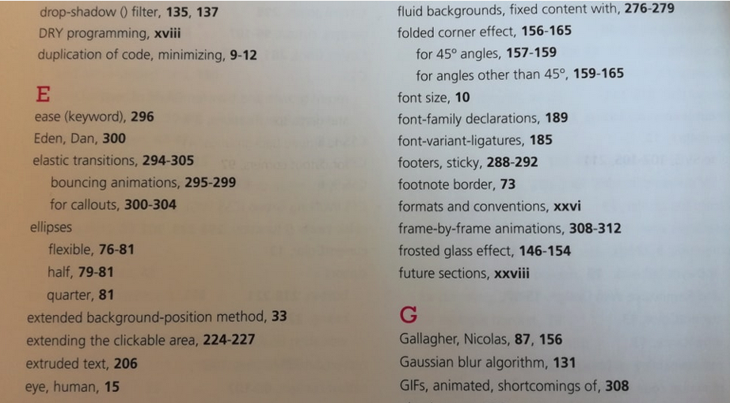
	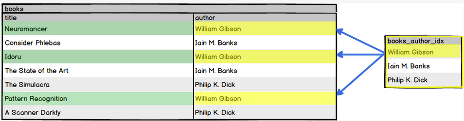
- Some rule of thumb when assessing trade-offs include:
	- Indexes are best used when sequential reading is inadequate. Examples include columns that are used in mapped relationships (e.g. Foreign Keys) or columns frequently used as part of `ORDER BY` clauses.
	- Indexes are best used in tables and/or columns where data are read more frequently than they are created or updated.

### Types of Index
- PostgreSQL provides several index types: B-tree, Hash, GiST, SP-GiST and GIN. Each type uses a different data structure and search algorithm that is best suited to different types of queries.
- Indexes created with `PRIMARY KEY`, `UNIQUE` or `CREATE INDEX` are B-tree indexes
- Refer to [PostgreSQL documentation](https://www.postgresql.org/docs/9.2/static/indexes-types.html) for more information.

### Creating Indexes
- Whenever we impose a `PRIMARY KEY` or `UNIQUE` constraint on a column, we are automatically creating an index on that column. An index is how these constraints enforce uniqueness of values for the column.
	```psql
	my_books=# CREATE TABLE authors (
	my_books(#   id serial PRIMARY KEY,
	my_books(#   name varchar(100) NOT NULL
	my_books(# );
	CREATE TABLE
	my_books=# CREATE TABLE books (
	my_books(#   id serial PRIMARY KEY,
	my_books(#   title varchar(100) NOT NULL,
	my_books(#   isbn char(13) UNIQUE NOT NULL,
	my_books(#   author_id int REFERENCES authors(id)
	my_books(# );
	CREATE TABLE
	my_books=# \d books
	                          Table "public.books"
	     Column     |          Type          |                     Modifiers
	----------------+------------------------+----------------------------------------------------
	 id             | integer                | not null default nextval('books_id_seq'::regclass)
	 title          | character varying(100) | not null
	 isbn           | character(13)          | not null
	 author_id      | integer                |
	Indexes:
	  "books_pkey" PRIMARY KEY, btree (id)
	  "books_isbn_key" UNIQUE CONSTRAINT, btree (isbn)
	Foreign-key constraints:
	  "books_author_id_fkey" FOREIGN KEY (author_id) REFERENCES authors(id)
	```

- Unlike `PRIMARY KEY` and `UNIQUE` constraints, a `FOREIGN KEY` **does not** create an index on a column, although these columns are good candidates for indexing.
- The general form for adding an index to a table is:
	```sql
	CREATE INDEX [index_name] ON table_name (field_name);
	```
- If `index_name` is omitted, PostgreSQL will automatically generate a unique name for the index. 

### Unique and Non-Unique Indexes
- An index created via `PRIMARY KEY` or `UNIQUE` constraints is a _unique_ index and multiple table rows with equal values for that index is not allowed.
- The index we created using `CREATE INDEX ON books (author_id)` a non-unique index and does not enforce uniqueness.
	```psql
	my_books=# CREATE INDEX ON books (author_id);
	CREATE INDEX
	```
	```psql
	my_books=# \d books
	                         Table "public.books"
	     Column     |          Type          |                     Modifiers
	----------------+------------------------+----------------------------------------------------
	 id             | integer                | not null default nextval('books_id_seq'::regclass)
	 title          | character varying(100) | not null
	 isbn           | character(13)          | not null
	 author_id      | integer                |
	Indexes:
	  "books_pkey" PRIMARY KEY, btree (id)
	  "books_isbn_key" UNIQUE CONSTRAINT, btree (isbn)
	  "books_author_id_idx" btree (author_id)
	Foreign-key constraints:
	  "books_author_id_fkey" FOREIGN KEY (author_id) REFERENCES authors(id)
	```

### Multicolumn Indexes
- Indexes can be created on more than one column. 
	```sql
	CREATE INDEX index_name ON table_name (field_name_1, field_name_2);
	```
- There is a limit to the number of columns that can be combined in an index and only certain index types support multi-column indexes.

### Partial Indexes
- Partial indexes are built from a subset of data in a table, defined using a conditional expression. 
- The index only contains entries for the rows in the table where the value in the indexed column satisfies the condition.

### Deleting Indexes
- `\di` psql console command is used to list indexes
	```psql
	my_books=# \di
	              List of relations
	 Schema |        Name         | Type  | Owner |  Table
	--------+---------------------+-------+-------+---------
	 public | authors_pkey        | index | User  | authors
	 public | books_author_id_idx | index | User  | books
	 public | books_isbn_key      | index | User  | books
	 public | books_pkey          | index | User  | books
	(4 rows)
	```
- We can use `DROP INDEX index_name` command to delete an index
	```psql
	my_books=# DROP INDEX books_author_id_idx;
	DROP INDEX
	```

	```psql
	my_books=# \di
	                 List of relations
	 Schema |      Name      | Type  | Owner |  Table
	--------+----------------+-------+-------+---------
	 public | authors_pkey   | index | karl  | authors
	 public | books_isbn_key | index | karl  | books
	 public | books_pkey     | index | karl  | books
	(3 rows)
	```

## Comparing SQL Statements
- We can arrive at the same results by structuring our queries in a different number of ways. For example, instead of using a join, we might opt for a subquery.
- How a query is structured will have different performance e.g. time taken for query to run and memory usage.
- We can prepend the `EXPLAIN` command to a query to see the query plan created by PostgreSQL
	```psql
	my_books=# EXPLAIN SELECT * FROM books;
	                     QUERY PLAN
	----------------------------------------------------------
	 Seq Scan on books  (cost=0.00..12.60 rows=260 width=282)
	(1 row)
	```
- The query plan is presented in a form of a node-tree. The greater the complexity of the query, the more nodes there will be in the query plan. For example, the simple `SELECT * FROM books;` above consist of only one node in the query plan. 
- Each node will show its **type** ( e.g. a sequential scan), **estimated cost** (start-up and total cost), **estimated number of output rows** and the **estimated average width of rows in bytes**.
- For complex queries with multiple nodes, the estimated cumulative cost is shown at the top.
- We can use `EXPLAIN` to compare equivalent queries and get a feel for which one is more costly. 
	```psql
	my_books=# EXPLAIN SELECT books.title FROM books
	my_books-# JOIN authors ON books.author_id = authors.id
	my_books-# WHERE authors.name = 'William Gibson';
	                        QUERY PLAN
	--------------------------------------------------------------------
	Hash Join  (cost=14.03..27.62 rows=2 width=218)
	  Hash Cond: (books.author_id = authors.id)
	  ->  Seq Scan on books  (cost=0.00..12.60 rows=260 width=222)
	  ->  Hash  (cost=14.00..14.00 rows=2 width=4)
	        ->  Seq Scan on authors  (cost=0.00..14.00 rows=2 width=4)
	              Filter: ((name)::text = 'William Gibson'::text)
	(6 rows)
	```

	```psql
	my_books=# EXPLAIN SELECT title FROM books
	my_books-# WHERE author_id =
	my_books-# (SELECT id FROM authors
	my_books(# WHERE name = 'William Gibson');
	                                     QUERY PLAN
	-------------------------------------------------------------------------------------
	 Index Scan using books_author_id_idx on books  (cost=14.15..22.16 rows=1 width=218)
	   Index Cond: (author_id = $0)
	   InitPlan 1 (returns $0)
	     ->  Seq Scan on authors  (cost=0.00..14.00 rows=2 width=4)
	           Filter: ((name)::text = 'William Gibson'::text)
	(5 rows)
	```
	In above example, the subquery surprising has a slightly lower cost (`22.16`) than the join (`27.62`) equivalent. This is data dependent and unusual as joins are typically more efficient that subqueries.

### EXPLAIN ANALYZE
- `EXPLAIN` does not actually run the query. It generates its estimates using the planner's knowledge of the schema and assumptions based on PostgreSQL [system statistics](https://www.postgresql.org/docs/current/planner-stats.html)
- To access a query based on actual data, we can add the `ANALYZE` option to an `EXPLAIN` command.
	```psql
	my_books=# EXPLAIN ANALYZE SELECT books.title FROM books
	my_books-# JOIN authors ON books.author_id = authors.id
	my_books-# WHERE authors.name = 'William Gibson';
	                                                  QUERY PLAN
	--------------------------------------------------------------------------------------------------------------
	 Hash Join  (cost=14.03..27.62 rows=2 width=218) (actual time=0.029..0.034 rows=3 loops=1)
	   Hash Cond: (books.author_id = authors.id)
	   ->  Seq Scan on books  (cost=0.00..12.60 rows=260 width=222) (actual time=0.009..0.012 rows=7 loops=1)
	   ->  Hash  (cost=14.00..14.00 rows=2 width=4) (actual time=0.010..0.010 rows=1 loops=1)
	         Buckets: 1024  Batches: 1  Memory Usage: 9kB
	         ->  Seq Scan on authors  (cost=0.00..14.00 rows=2 width=4) (actual time=0.006..0.007 rows=1 loops=1)
	               Filter: ((name)::text = 'William Gibson'::text)
	               Rows Removed by Filter: 2
	 Planning time: 0.201 ms
	 Execution time: 0.074 ms
	(10 rows)
	```
- With the `ANALYZE` option, the query is actually being run, showing the actual time (milliseconds) and the actual rows returned by each plan node.
- For details, see [Planner](https://www.postgresql.org/docs/9.5/planner-optimizer.html) and [EXPLAIN](https://www.postgresql.org/docs/current/using-explain.html)

## Subqueries
- A subquery works by first using the nested query to generate a set of values to be used, usually as a condition under a `WHERE` clause, by the outer query.
	```sql
	SELECT title FROM books WHERE author_id =
	  (SELECT id FROM authors WHERE name = 'William Gibson');
	```

	```psql
	my_books=# SELECT id FROM authors WHERE name = 'William Gibson';
	 id
	----
	  1
	(1 row)
	```

	As the inner query returns the `id` of `William Gibson` which is `1`, the outer query effectively becomes:
	```sql
	SELECT title FROM books WHERE author_id = 1;
	```

- Besides under a `WHERE` clause, a subquery can appear under different clauses of a main query
	- `FROM` clause. Using subquery to generate a result or virtual table, then query the table for final result. Take note that the virtual table need to be in parenthesis and aliased.
		```sql
		SELECT MAX(bid_counts.count) FROM
		  (SELECT COUNT(bidder_id) FROM bids GROUP BY bidder_id) AS bid_counts;
		```
	
	- `SELECT` clause. Also known as [scalar subqueries](https://www.postgresql.org/docs/9.5/sql-expressions.html#SQL-SYNTAX-SCALAR-SUBQUERIES), we can reference columns from the outer `SELECT` query within the subquery. A scalar subquery must only return 1 column and 1 row.
		```sql
		SELECT name,
		       (SELECT COUNT(item_id) FROM bids WHERE item_id = items.id)
		FROM items;
		```
			Here, for each `id` in `items`, the scalar subquery is run and returns a count value.

### Subquery Expressions
- We use `=` in the `WHERE` condition because the nested query returned a **single velue**.  If the subquery return more than one value, we could then use one of the subquery expressions below for comparison.
- `EXISTS (subquery)` checks if the subquery returns any result. If at least one row is returned, it returns `true`, else it returns `false`.
	```psql
	SELECT name FROM bidders
	WHERE EXISTS (SELECT 1 FROM bids WHERE bids.bidder_id = bidders.id);
	```

	```psql
	      name
	-----------------
	 Alison Walker
	 James Quinn
	 Taylor Williams
	 Alexis Jones
	 Gwen Miller
	 Alan Parker
	(6 rows)
	```

	Here, each `id` in `bidders` is assigned to `bidders.id` in the subquery. If a matching `bidder_id` in `bids` is found, a row of 1 is returned. As long as there is a row returned, regardless of value, `EXISTS` will evaluate to `true` and the name for that `id` is retained for the final result.
	
- `IN` compares an evaluated expression to every row in the the subquery result. If the evaluated expression is found in anyone of the returned rows of the subquery, `IN` evaluates to `true`, else it evaluates to `false`.
	```psql
	my_books=# SELECT name FROM authors WHERE id IN
	my_books-#   (SELECT author_id FROM books
	my_books(#     WHERE title LIKE 'The%');
	      name
	----------------
	 Iain M. Banks
	 Philip K. Dick
	(2 rows)
	```
	Here, the query will return the names of authors who has one or more book title starting with `The`.

- `NOT IN` negates the result of `IN` and evaluates to `true` if the an equal row is not found.
	```psql
	my_books=# SELECT name FROM authors WHERE id NOT IN
	my_books-#   (SELECT author_id FROM books
	my_books(#     WHERE title LIKE 'The%');
	      name
	----------------
	 William Gibson
	(1 row)
	```
	Here, the query will return names of authors who does not have any books whose title begin with `The`.

- `ANY` or `SOME` are synoyms and can be used interchangeably. They are used in conjunction with an operator (e.g. `=`, `>`, `<`) and evaluates to `true` if any `true` result is obtained in the operation.
	```psql
	my_books=# SELECT name FROM authors WHERE length(name) > ANY
	my_books-# (SELECT length(title) FROM books
	my_books(# WHERE title LIKE 'The%');
	      name
	----------------
	 William Gibson
	 Philip K. Dick
	(2 rows)
	```
	Here, the query return names of authors who name length is greater than any of the length of book titles beginning with `The`.

- `ALL` is also used in conjunction with an operator (e.g. `=`, `>`, `<`) and evaluates to true only if all results of the operation are `true`. Note: `!=` / `<>` `ALL` is logically equivalent to `NOT IN`.
	```psql
	my_books=# SELECT name FROM authors WHERE length(name) > ALL
	my_books-# (SELECT length(title) FROM books
	my_books(# WHERE title LIKE 'The%');
	 name
	------
	(0 rows)
	```
	Here, the query return names of authors whose name length is longer than the length of all books beginning with `The`. 

### When to Use Subqueries
- When performance is not a consideration, subqueries is used based on personal preference. Generally, if the return values does not involve data from another table, subqueries may be used. Else `join` may be more suitable.

## Row Comparison
- Using [Row Constructors](https://www.postgresql.org/docs/9.5/sql-expressions.html#SQL-SYNTAX-ROW-CONSTRUCTORS) and [Row-wise Comparison](https://www.postgresql.org/docs/9.5/functions-comparisons.html#ROW-WISE-COMPARISON), we can also perform row level comparisons in PostgreSQL. This is useful when we need to compare the values of many fields which will make using `AND` cumbersome. For example, if we have all the data in a row except for its `id`, we can retrieve it using the following:
	```psql
	SELECT id FROM items
	WHERE ROW('Painting', 100.00, 250.00) =
	  ROW(name, initial_price, sales_price);
	```
	Here, the values for each row under `name`, `initial_price` and `sales_price` are compared to the given set of values `(Painting, 100.00, 250.00)` and the rows that match will have their `id` returned.

