# Introduction To SQL

## Section Links
[Setup](#setup)\
[Introduction](#introduction)\
[PostgreSQL Interfaces](#postgresql-interfaces)\
[Create, List and Delete Databases](#create-list-and-delete-databases)\
[Create A Table](#create-a-table)\
[Alter A Table ](#alter-a-table)\
[Database Design - Multiple Tables](#database-design---multiple-tables)\
[Insert Data Into A Table](#insert-data-into-a-table)\
[Update Data In A Table](#update-data-in-a-table)\
[Delete Data From A Table](#delete-data-from-a-table)\
[Select Queries](#select-queries)\
[Subqueries](#subqueries)\
[Optimizing SQL Queries](#optimizing-sql-queries)\
[Comparing SQL Statements](#comparing-sql-statements)

---
## Setup
### Installation of PostgreSQL on Cloud9
If you are using AWS Cloud9 with Amazon Linux 2, use the following commands to install PostgreSQL:
```shell
$ sudo yum install postgresql postgresql-server
$ sudo service postgresql initdb
```

Use this command to **start PostgreSQL** everytime before we use it:
```shell
$ sudo service postgresql start
```

The default user name on Cloud 9 is `ec2-user`. Hence if we try to run the `psql` console directly using the `psql` command, we'll receive an error which looks something like this:

```shell
$ psql
psql: FATAL:  role "ec2-user" does not exist
```

This happens because Postgres automatically tries to run using the local user, but there is no user role defined for `ec2-user` yet within Postgres.

**Running Postgres as the postgres user**
By default, Postgres will create a `postgres` user role in all installation. Thus, we are assume the role of `postgres` by prepending any command we are running with `sudo -u postgres`. For instance, to run the psql command, type:
```shell
$ sudo -u postgres psql
```

To create a new database, type:
```shell
$ sudo -u postgres createdb my_database
```

**Creating a Postgres role for the local user**
If prepending `sudo -u postgres` before any command is a chore, another option is to create a Postgres role for the local user. This is done by passing the `-s` flag to `createuser` and supplying it with the username of the local user to create a superuser role:
```shell
$ sudo -u postgres createuser -s $LOGNAME
```

Note: When we run this command, `bash` will automatically replace the `$LOGNAME` variable with whatever name used for the local user. Its value is usually `ec2-user`.

When running that command, we may see a message along these lines of `could not change directory to "/home/ec2-user/environment": Permission denied`. Don't worry about this as the user should still be created.

With the new user role created, we are now able to run Postgres commands from the terminal without the need to prepend them with `sudo -u postgres`.

It is also usually a good idea to also create a database of the same name as the user role. This is because Postgres automatically tries to connect to a database of the same name as the user running the command whenever we run the `psql` command without any database specified:
```shell
$ psql
psql: FATAL:  database "ec2-user" does not exist
$ createdb $LOGNAME
$ psql
psql (9.6.11)
Type "help" for help.

ec2-user=#
```

### Mac OSX install
One option for installing PostgreSQL on a Mac is to use Postgres.app. There are instructions for installing Postgres.app on the [its homepage](https://postgresapp.com/). The site also has instructions for using the Postgres.app [command line tools](https://postgresapp.com/documentation/cli-tools.html).

Alternatively you can use [Homebrew](https://www.postgresql.org/docs/9.6/static/app-psql.html) to install PostgreSQL. If you don't have Homebrew installed, follow the installation instructions on its homepage.

First, we ensure that Homebrew is up to date

```shell
$ brew update
$ brew doctor
$ brew upgrade
```

Next, follow the instructions listed in [this blog post](https://launchschool.com/blog/how-to-install-postgresql-on-a-mac/).When reading this article, you only need to follow instructions for installing PostgreSQL; skip the section on Rails.

Homebrew may complain that there is "No available formula with the name "postgres" when you try to run `brew install postgres`. If you see this message, try installing one of the specific versions listed, preferring one of the most recent versions. For instance, to install version 14, you would run `brew install postgresql@14`.

## Introduction
### What Is Structured Data?
- Structured data is data with well-formatted fields that can be stored in a table.
- Storing data in this manner makes it easier for one to find, arrange and analyze them.
- A relational database is used to store structured data.
- A spreadsheet can be thought of as a database:

	| Spreadsheet | Database |
	| --- | --- |
	| Worksheet | Table |
	| Worksheet Column | Table Column |
	| Worksheet Row | Table Record |

### Relational Database Management Systems
- While a spreadsheet is good enough to manage a small amount of data, they do not scale well, especially if one need to check for duplicates and errors, support concurrent users or find data quickly. At this point, it is likely better to move to a relational database.
- A relational database is a database organized according to the relational model of data. The relational model defines a set of relations (i.e. tables) and describes the relationships between tables.
- A Relational Database Management System (RDBMS) is a software application for managing relational databases
- **SQLite**, **MS SQL**, **PostgresSQL** and **MySQL** are amongst the most popular relational model based RDMS. Non relational model systems also exist. For example, MongoDB is a popular 'NoSQL' system that uses a document oriented data storage model.

### What is SQL?
- SQL stands for Structured Query Language. It is the language used to communicate with a relational database.
- SQL is a **declarative** in nature: It describes "What" needs to be done but does not prescribe "How" to do it. The "How" is dependent on the choice of RDMS one is using.
- SQL is comprised of 3 sub-languages

	| sub-language | controls | SQL Constructs |
	| --- | --- | --- |
	| Data Definition Language (**DDL**) | relation structure (schema) and rules | `CREATE`, `DROP`, `ALTER` |
	| Data Manipulation Language (**DML**) | values stored within relations (tables) | `SELECT`, `INSERT`, `UPDATE`, `DELETE`| 
	| Data Control Language (**DCL**) | access control i.e. who can do what | `GRANT`, `REVOKE` |

### Style Guide
- Refer to [SQL Style guide](https://www.sqlstyle.guide/) for style conventions that we **may want** to adopt in our code. 

[Back to Top](#section-links)


## PostgreSQL Interfaces
- A RDMS usually has multiple interfaces. For example, we can interact with it using 
	- a programming language such as Ruby or Python, 
	- a GUI that comes with the RDMS, or 
	- the command-line interface.
- Fundamentally, all these interfaces adopt a **client-server architecture** for the interaction: i.e. they issue a request/command and receive a response in return.

### PostgreSQL Client Applications
- PostgreSQL comes with the following 'client applications' that **executes from the command line**. Commonly used ones include `psql`, `createdb`, `dropdb`, `pg_dump`, `pg_restore` and `pg_bench`.
- Some of these client applications are essentially wrappers around SQL statements: `createdb`, used to create a new PostgreSQL database, essentially wraps the SQL command `CREATE DATABASE`.

### The psql Console
- `psql` is a REPL (Read, Evaluate, Print, Loop) based interactive console with a terminal front-end for the PostgreSQL database. It is similar to `irb` for Ruby. 
- To **connect to a database**, enter `psql -d $dbname` (or `psql $dbname` if database name is the first argument) in the command prompt to start the console and connect to said database. A `$dbname=#` prompt would indicate we have connected successfully. 
	```terminal
	% psql postgres
	
	psql (14.5)
	Type "help" for help.
	
	postgres=#
	```

	**Note:** If we just run `psql` without providing any database name, PostgreSQL will by default attempt to connect to a database with same name as current username. If that database does not exist, it will throw an error.

- `psql` console accepts both **meta-commands** and **SQL statements**
- **meta commands** are commands executed within `psql`. They can be identified by an `\` prefix. Some useful `psql` meta commands includes:

	| Meta Command | Description | Example |
	| --- | --- | --- |
	| `\conninfo` | Show **Conn**ection **Info** for current database connection | |
	|  `\l` | **L**ist all available databases in the server | |
	| `\c $dbname` | **C**onnect to database `$dbname` | `\c blog_development` |
	| `\d` | **D**escribe all tables, views and sequences in connected database |  |
	| `\dt` | **D**escribe all **t**ables in connected database |  |
	| `\ds` | **D**escribe all **s**equences in connected database |  |
	| `\d $name` | **D**escribe relation `$name` | `\d users` |
	| `\?` | List of console commands and options | |
	| `\h` | List of available SQL syntax **H**elp topics | |
	| `\h $topic` | SQL syntax **H**elp on syntax for `$topic` | `\h INSERT` |
	| `\i [filename]` | Execute commands from a file | `\i table_dump.sql` |
	| `\q` | **Q**uit | |

- SQL statements are commands issued to the database using SQL syntax. They need to be terminated with a `;`. 

[Back to Top](#section-links)


## Create, List and Delete Databases

| Purpose | Client Application in Command Prompt | SQL Statement |
| --- | --- | --- |
| **Create** a new database `sql_book` | `psql -d sql_book` | `CREATE DATABASE sql_book;` |
| **Delete** existing database `my_database` | `dropdb my_database` | `DROP DATABASE my_database;` |

Note: `createdb` and `dropdb` are just wrapper functions for `CREATE DATABASE` and `DROP DATABASE` SQL statements respectively.

| Purpose | PSQL Meta-Command (In PSQL) |
| --- | --- |
| **List** existing databases | `\l` or `list`|
| **Connect** to `$dbname` database | `\c $dbname` or `\connect $dbname` |
| **Quit** PostgreSQL session | `\q` |

### Load Databases
- To import a SQL file (containing a list of SQL statements) into a PostgreSQL database, we can do one of the following:
	- Pipe content of SQL file for execution within connected database using redirection (`<`) operator. 
		```terminal
		$ psql -d my_database < file_to_import.sql
		```

	- Use `\i` meta command within psql console to execute the `.sql` file within database
		```sql
		my_database=# \i ~/some/files/file_to_import.sql
		```

[Back to Top](#section-links)


## Create A Table
We create a table in SQL using the `CREATE TABLE` statement following the **syntax** below:
```sql
CREATE TABLE table_name (
    column_1_name column_1_data_type [constraints, ...],
    column_2_name column_2_data_type [constraints, ...],
    .
    .
    .
    constraints
);

 -- Example
CREATE TABLE users (
    id serial UNIQUE NOT NULL,
    username char(25),
    enabled boolean DEFAULT TRUE
);
```

### Common Data Types
| Data Type | Type | Value | Example Values |
| --- | --- | --- | --- | 
| `serial` | numeric | **Non-null**, **auto-incrementing integers** starting from 1. Used as identifiers for row. |`1`, `2` |
| `integer` | numeric | whole numbers | `-2147483648` to `+2147483647` |
| `real` | numeric | floating-point numbers | `123.456`, `-567.3515` |
| `decimal(precision, scale)` | numeric | precision numbers. precision refers to total numbers of digits, while scale is the number of decimal place | `123.45`, `-567.890` |
|  `char(N)` | character | `N` characters of text. If string has less than `N` characters, remaining length are filled with spaces | `John` |
| `varchar(N)` | character | Up to `N` characters of text | `canoe` |
| `text` | character | unlimited length of text. | `a very long string` |
| `timestamp` | date/time | date and time | `1999-01-08 04:05:06` |
| `date` | date/time | date only | `1999-01-08` |
| `boolean` | boolean | true or false. Displayed as `t` or `f` in PostgreSQL | `true` or `false` | 

**Additional Notes** 
- As of v10 of PostgreSQL, the `IDENTITY` syntax has replaced the use of `serial` to handle auto-incrementing key value.
	```sql
	column_name type GENERATED { ALWAYS | BY DEFAULT } AS IDENTITY[ ( sequence_option ) ]
	
	/* Example*/
	CREATE TABLE color (
	    color_id INT GENERATED ALWAYS AS IDENTITY,
	    color_name VARCHAR NOT NULL
	);
	```
- Most data types have a limited range of values they can stored. PostgreSQL will raise an error when those are exceeded.
- The `text` datatype is only applicable to PostgreSQL and not part of the SQL standard.
- Use of quotes: 
	- **Single quotes `''`** are used to enclose character type values. If we want to include `'` within a string e.g. `Tom's`, we will need to escape it with a preceding `'` i.e. `'Tom''s'`.
	- **Double quotes `""`** are used to differentiate a name from a reserved keyword or space separated names with space e.g. `SELECT name AS "Tropical Fruits"`
		In PostgreSQL, `ALL` is a [reserved keyword](https://www.postgresql.org/docs/current/sql-keywords-appendix.html)
		```sql
		CREATE TABLE inventory (item varchar(255), all boolean);
	
		ERROR:  syntax error at or near "all"
		LINE 3:   all BOOLEAN
		```
	
		 Although, we should avoid using a reserved keyword as a column name, if it is absolutely required, we can overcome it as follows:
		```sql
		CREATE TABLE inventory (item varchar(255), "all" boolean);
		CREATE TABLE
	
		INSERT INTO inventory
		VALUES ('torchlight', true),
		       ('duffel bag', false);
		INSERT 0 2
	
		/* Correct usage */
		SELECT "all" from inventory;
		all 
		-----
		t
		f
		(2 rows)
	
		/* Incorrect usage */
		SELECT all from inventory;
		--
		(2 rows)
		```

- `NULL` is a special value in SQL which symbolizes the absence of any other value. We should not use any comparison operators such as `=` ,`<`, `>=` on `NULL` as that will return `NULL` rather than the boolean result we wanted. For example, `NULL` = `NULL` returns `NULL` rather than `true`. Instead, use `IS` or `IS NOT` when we want to compare something with `NULL`.
- `timestamptz` data type is available if we need to store a timestamp with timezone.
- Consult [PostgreSQL data type documentation](https://www.postgresql.org/docs/current/datatype.html) for details.

### Keys and Constraints
Keys and constraints **are optional rules** that define what values a column can take. Examples include:
- `UNIQUE`: no duplicate values allowed in that column
- `NOT NULL`: column cannot be empty
- `DEFAULT`: If no value is provided for a row in that column, it will be given the default value.
- `PRIMARY KEY`: equivalent to imposing `UNIQUE` + `NOT NULL` constraint on a column
- `FOREIGN KEY`: require values to be present in the referenced column. `NULL` is however not rejected.

### View the Table
- `\dt` meta-command will list all tables in the database
- `\d $table_name` will display the schema of `$table_name`

	```sql
	sql_book=# CREATE TABLE users (
	  id serial PRIMARY KEY,
	  username CHAR(25),
	  enabled BOOLEAN DEFAULT true
	  );
	CREATE TABLE

	sql_book=# \d users
	               Table "public.users"
	Column  | Type         | Nullable| Default 
	--------+--------------+---------+--------------
	id      | integer      | not null| nextval('users_id_seq'::regclass
	username| character(25)|         | 
	enabled | boolean      |         | true
	
	Indexes:
	"users_pkey" PRIMARY KEY, btree (id)
	```
	- `id` column is originally defined as type `serial`, a shortcut in PostgreSQL that actually defines an `integer` data type with `NOT NULL` and  `DEFAULT` constraint. `DEFAULT` uses the value of `nextval` function applied to the integer sequence `users_id_seq` that begins with `1` to return an auto-incrementing integer.
	- `users` table also has an index `user_id_key` that was created when we add the `UNIQUE` constaint. Indexes are a way to store quick references to values in a particular column. 

[Back to Top](#section-links)


## Alter A Table
| Action | Command | Notes |
| --- | --- | --- |
| Add a column to a table | `ALTER TABLE` table_name `ADD COLUMN` column_name data_type `CONSTRAINTS`; | Alters a table by adding a column with a specified data type and optional constraints. |
| Alter a column's data type | `ALTER TABLE` table_name `ALTER COLUMN` column_name `TYPE` data_type; | Alters the table by changing the datatype of column. |
| Rename a table | `ALTER TABLE` table_name `RENAME TO` new_table_name; | Changes the name of a table in the currently connected to database.|
| Rename a column within a table | `ALTER TABLE` table_name `RENAME COLUMN` column_name `TO` new_column_name; | Renames a column of the specified table. |
| Add a **table** constraint | `ALTER TABLE` table_name `ADD` \[`CONSTRAINT` constraint_name\] **constraint_clause**; | Commonly used **constraint_clause** include:</br>`CHECK` (expression);</br>`UNIQUE` (col_name \[, ... \]);</br>`PRIMARY KEY` (col_name \[, ... \]);</br>`FOREIGN KEY` (col_name \[, ... \]) `REFERENCES` reference_table \[ (ref_col \[, ... \]) \]);<br>**Note:** These are table level constraints and schema does not listed them under specific columns. |
| Add a `NOT NULL` **column** constraint | `ALTER TABLE` table_name `ALTER COLUMN` col_name `SET NOT NULL`; | Set a `NOT NULL` constraint for a column. To set multiple columns, use the following:</br>`ALTER TABLE`</br>  `ALTER COLUMN` col_name `SET NOT NULL`,</br>  `ALTER COLUMN` col_name `SET NOT NULL`; |
| Add a `DEFAULT` **column** constraint | `ALTER TABLE` table_name `ALTER COLUMN` col_name `SET DEFAULT` value; | |
| Remove a **table** constraint | `ALTER TABLE` table_name `DROP CONSTRAINT` constraint_name; | Removes a constraint from the specified table. |
| Remove a **column** constraint | `ALTER TABLE` table_name `ALTER COLUMN` column_name `DROP` constraint_type; | Removes a constraint from the specified column. This syntax is necessary for `NOT NULL` constraints, which aren't specifically named. |
| Remove a column from a table | `ALTER TABLE` table_name `DROP COLUMN` column_name; | Removes a column from the specified table. |
| Delete a table from the database | `DROP TABLE` table_name; | Permanently deletes the specified table from its database. |

### More About Constraints
- A column with `DEFAULT` constraint will be filled with the default value if no value is specified in an `INSERT`.
- `NOT NULL` constraint uses a particular syntax under `ALTER TABLE`.
	```sql
	-- Correct NOT NULL syntax
	ALTER TABLE table_name ALTER COLUMN col_name SET NOT NULL;
	
	-- Cannot be used for setting NOT NULL constraint
	ALTER TABLE table_name ADD [CONSTRAINT constraint_name] constraint_clause;
	```

	**Example**\
	Assuming we have a table called `todos` that includes a boolean `status` column and we want to alter our table so that `NULL` values cannot be added to that column.
	
	**Correct Syntax**
	```sql
	ALTER TABLE todos
      ALTER COLUMN status SET NOT NULL;
	```
	
	**Incorrect Syntax**
	```sql
    ALTER TABLE todos
      ADD CONSTRAINT status_not_null
      SET status NOT NULL;

    ALTER TABLE todos
      SET status NOT NULL;

    ALTER TABLE todos
      ADD COLUMN status boolean NOT NULL;
	```
	This last example will also throw an error since `status` column already exist and we will not be allowed to add another column with the same name.

- For a column with `UNIQUE` constraint, an index holding unique values will be created. This index will be used to ensure any new value to be inserted in that column does not already exist in the index.

- `CHECK` constraints allow us to check values for conformity before insertion into column. For example, we can check to ensure strings are not empty before being inserted into `full_name`.
	```sql
	-- Preferred way using autogenerated constraint name
	ALTER TABLE users ADD CHECK (full_name <> '');

	-- Adding check constraint with supplied name
	ALTER TABLE users ADD CONSTRAINT check_name CHECK (full_name <> '');
	```

	```sql
	INSERT INTO users (id, full_name) VALUES (4, '');
	ERROR:  new row for relation "users" violates check constraint "users_full_name_check"
	DETAIL:  Failing row contains (4, , t, 2017-10-25 10:32:21.521183).
	```

- Using `ENUM` type instead of a `CHECK` constraint to ensure a column contains only values from an acceptable list.
```sql
-- Using CHECK constraints
ALTER TABLE stars
  ADD CHECK (spectral_type IN ('O', 'B', 'A', 'F', 'G', 'K', 'M'));

-- Using ENUM to enforce correct values
CREATE TYPE spectral_type_enum AS ENUM ('O', 'B', 'A', 'F', 'G', 'K', 'M');
ALTER TABLE stars
  ALTER COLUMN spectral_type TYPE spectral_type_enum
                           USING spectral_type::spectral_type_enum;
```

- We can make multiple changes in a single `ALTER TABLE` statement by separating each change with a comma.
	```sql
	ALTER TABLE stars
	  ADD CHECK (spectral_type IN ('O', 'B', 'A', 'F', 'G', 'K', 'M')),
	  ALTER COLUMN spectral_type SET NOT NULL;
	```

**Exercise: Create and Alter a Table Schema**\
We want to create an `airlines` table for a flight booking application. The table should contain the following columns:
-   An auto-incrementing id column which should also be the Primary Key
-   An airline name of up to 30 characters (this column shouldn't be empty)
-   A country name of up to 50 characters
-   A two character IATA code
-   A three character ICAO code
-   A website address of up to 40 characters

**Note**: There are multiple ways to arrive at a required schema. We can list everything under `CREATE TABLE` and/or use `ALTER TABLE` to introduce missed out constraints. Even within `CREATE TABLE`, constraints can be listed immediately against a field or below. All examples below are valid.
```sql
CREATE TABLE airlines (
  id serial PRIMARY KEY,
  airline_name varchar(30),
  country varchar(50),
  iata_code char(2),
  icao_code char(3),
  website varchar(40),
  CHECK (length(iata_code) = 2),
  CHECK (length(icao_code) = 3)
);
ALTER TABLE airlines
  ALTER COLUMN airline_name SET NOT NULL;
```

```sql
CREATE TABLE airlines (
  id serial PRIMARY KEY,
  airline_name varchar(30) NOT NULL,
  country varchar(50),
  iata_code varchar(2) CHECK (length(iata_code) = 2),
  icao_code varchar(3) CHECK (length(icao_code) = 3),
  website varchar(40)
);
```

```sql
CREATE TABLE airlines (
  id serial PRIMARY KEY,
  airline_name varchar(30) NOT NULL,
  country varchar(50),
  iata_code char(2),
  icao_code char(3),
  website varchar(40)
);
ALTER TABLE airlines
  ADD CHECK (length(iata_code) = 2),
  ADD CHECK (length(icao_code) = 3);
```

```sql
CREATE TABLE airlines (
  id serial PRIMARY KEY,
  airline_name varchar(30) NOT NULL,
  country varchar(50)
);
ALTER TABLE airlines
  ADD COLUMN iata_code char(2),
  ADD COLUMN icao_code char(3),
  ADD COLUMN website varchar(40),
  ADD CHECK (length(iata_code) = 2),
  ADD CHECK (length(icao_code) = 3);
```

[Back to Top](#section-links)


## Database Design - Multiple Tables
- Database design involves identifying **entities (i.e. relations)** representing real world objects and **relationships** between them.
- A **relation** is usually another way to mean a table. However, it could also refer to a sequence or a view.
- A **relationship** is an association between data stored in two relations.

	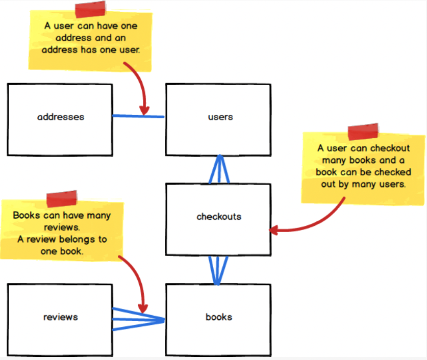


### Database Diagrams
Database diagrams are used to represent entities and their relationships and can have different levels of details.
- **Conceptual**: This is a high level design focussed on identifying relations and their relationships.
- **Logical**: A expanded version of conceptual diagram that include data fields and types within a relation.
- **Physical**: A RDBMS specific detailed design that include rules such as constraints.

	

### Entity Normalization
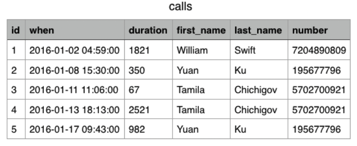
- While it might seem a good idea to have all related data fields in one table i.e. in **denormalized** form, this actually poses several problems:
	- **Data duplication** could occur when different values of one field have the same value for another field. Data duplication also make it susceptible to **update anomalies** if affected rows are missed out during the update process;
	- **Insertion anomaly** is also an issue since we cannot just insert a subset of data. In the `calls` example, we cannot just store contacts that have never made a call;
	- **Deletion anomaly** is another issue since deleting a row could result in more information loss than otherwise required. Using the `calls` example, deleting a call could lead to a loss of contact information since the values are tied.
		
- **Normalization** is the process of designing relations' schema to minimize the occurrences of these anomalies. It involves extracting data into additional relations and then use foreign keys to tie back associated data.
- In the `calls` example, by separating a single denormalized `calls` relation into separate `contacts` and `calls`, we eliminate data duplication by only storing unique contacts in the `contacts` table and referencing them in the normalized `calls` table. Insertion and deletion anomaly are also not avoided as we can now delete calls without loss of contact information and also insert contacts that have yet to make any calls.
	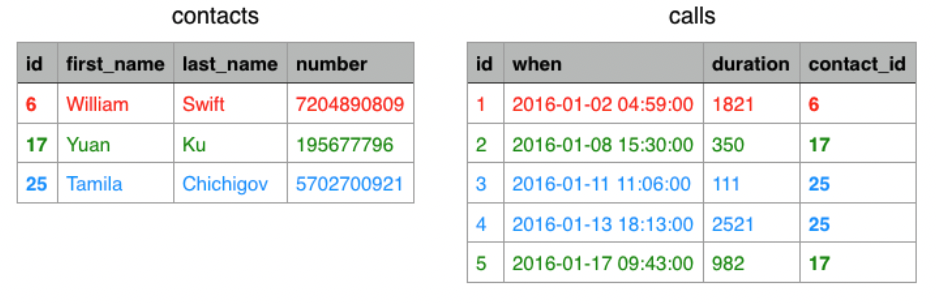
	

### Key
- Within a table (relation) in a database, a **key** is used to uniquely identify each row of data. 
- There are two types of keys:
	- **natural key**: column or combination of columns (**composite** key) that are part of a dataset whose values can uniquely identify each row of data in the dataset. For example, a national identification number serves as natural keys in a citizenry database to uniquely identify each citizen of a country.
	- **surrogate key**: a column **specially created** to contain values that uniquely identify each row of data. We often create an `id` field with an auto-incrementing integer as a surrogate key.
	- A surrogate key is **preferred over** natural keys because most values that seem like good candidates for natural keys turn out to not be. For example, a phone number and email address can change hands. A social security number shouldn't change but only some people have them. And products often go through multiple revisions while retaining the same product number.
- The **`serial`** datatype in PostgreSQL, which creates a field with default auto-incrementing integers, provides a convenient way to create a surrogate key for a table. Declaring a column **`serial`** is **functionally equivalent** to declaring it an **integer type with both `NOT NULL` and `DEFAULT` constraints**. The default value corresponds to a sequence of integers, beginning with 1.
	```sql
	-- This statement:
	CREATE TABLE colors (
	  id serial, 
	  name text
	);
	
	-- is actually interpreted as if it were this one:
	CREATE SEQUENCE colors_id_seq;
	CREATE TABLE colors (
	    id integer NOT NULL DEFAULT nextval('colors_id_seq'),
	    name text
	);
	```
	
	```sql
	INSERT INTO colors (name) VALUES ('red');
	INSERT INTO colors (name) VALUES ('green');
	INSERT INTO colors (name) VALUES ('blue');
	```
	
	```psql
	sql-course=# SELECT * FROM colors;
	 id | name
	----+-------
	  1 | red
	  2 | green
	  3 | blue
	```

- A **sequence** is a special type of relation i.e. table that generates a series of numbers. Similar to a generator in python, it keeps track of the current number and allow one to retrieve the next number in sequence using the  `nextval` function.
- Once a number is returned by `nextval` for a standard sequence, it will not be returned again, regardless whether the number has been stored in a row or not.

	```psql
	sql-course=# SELECT nextval('colors_id_seq');
	 nextval
	---------
	       4
	(1 row)
	```
	
	```psql
	sql-course=# INSERT INTO colors (name) VALUES ('yellow');
	INSERT 0 1
	sql-course=# SELECT * FROM colors;
	 id |  name
	----+--------
	  1 | red
	  2 | green
	  3 | blue
	  5 | yellow
	(4 rows)
	```

- To allow the `id` column to be used as a key, we have to enforce the `UNIQUE` constraint upon it. Otherwise, it is still possible to manually insert a row containing a pre-existing `id` value, rendering the column unsuitable to be a key.

	```psql
	sql-course=# INSERT INTO colors (id, name) VALUES (3, 'orange');
	INSERT 0 1
	sql-course=# SELECT * FROM colors;
	 id |  name
	----+--------
	  1 | red
	  2 | green
	  3 | blue
	  5 | yellow
	  3 | orange
	(5 rows)
	```
	
	```psql
	sql-course=# ALTER TABLE colors ADD CONSTRAINT id_unique UNIQUE (id);
	ERROR:  could not create unique index "id_unique"
	DETAIL:  Key (id)=(3) is duplicated.
	```

	We can fix it as follows:
	```psql
	sql-course=# UPDATE colors SET id = nextval('colors_id_seq') WHERE name = 'orange';
	UPDATE 1
	sql-course=# ALTER TABLE colors ADD CONSTRAINT id_unique UNIQUE (id);
	ALTER TABLE
	sql-course=# SELECT * FROM colors;
	 id |  name
	----+--------
	  1 | red
	  2 | green
	  3 | blue
	  5 | yellow
	  6 | orange
	(5 rows)
	```
	
#### Primary Key
- The `PRIMARY KEY` constraint in PostgreSQL is a shortcut to uniquely identify rows in a table.
- Setting a column to be a **`PRIMARY KEY`** for a table is **functionally equivalent** to imposing **`UNIQUE`** and **`NOT NULL`** constraints on that column. The only difference is using `PRIMARY KEY` explicitly convey the intent of the database designer for users of the table to use the chosen column as a unique row identifier.
	```sql
	CREATE TABLE more_colors (id int PRIMARY KEY, name text);

	-- functionally equivalent
	CREATE TABLE more_colors (id int NOT NULL UNIQUE, name text);
	```
- Each table can only have **one** primary key.
- By convention:
	- All tables should have a primary key column called `id`
	- The `id` column should be automatically set to a unique value when new rows are inserted into the table
	- The `id` column is often an integer, although other data types such as a UUID may be suitable on other occasions.

#### Foreign Key
- A foreign key allows us to associate a row in a table to a row in another table. 
- This is done by setting a column in one table as a Foreign Key and having it reference another table's Primary Key column. The foreign key column must have the same type as the column it is referencing.
	```sql
	FOREIGN KEY (fk_col_name)
	REFERENCES target_table_name (pk_col_name);
	```
- A table can have **zero or more** foreign key columns. A join table for Many to Many relationships have 2 foreign keys.
- A foreign key constraint allows only values presents in the column it is referencing to be inserted, it **does not prevent `NULL` from being inserted**. To do that we need to add a `NOT NULL` constraint on the foreign key. See question 5 of [foreign key example](../../07_ls180_database_foundations/lesson_03/02a_foreign_keys.md)
- There are different ways to declare a foreign key:

	**Correct syntax**
	```sql
	-- immediately next to column declaration
	CREATE TABLE flights (
	  id serial PRIMARY KEY,
	  ...
	  airline_id int [other constraints] REFERENCES airlines(id)
	);
	```
	
	```sql
	-- after all column declaration
	CREATE TABLE flights (
	  id serial PRIMARY KEY,
	  ...
	  airline_id int,
	  FOREIGN KEY (airline_id) REFERENCES airlines(id)
	);
	```
	
	```sql
	-- post table creation
	CREATE TABLE flights (
	  id serial PRIMARY KEY,
	  ...
	  airline_id int
	);
	ALTER TABLE flights
	  ADD FOREIGN KEY (airline_id)
	  REFERENCES airlines(id);
	```

	**Wrong Syntax**
	```sql
	CREATE TABLE flights (
	  id serial PRIMARY KEY,
	  ...
	  airline_id int FOREIGN KEY REFERENCES airlines(id)
	);
	```


### Entity Relationships
There are three types of relationships between entities (relations).
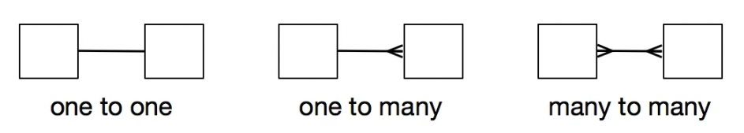

#### One to One Relationship
- Each instance from one entity can only be associated with one instance from the related entity. One to one relationships are rare in practice. As an example, we can assume a user can only have only one address in our application.
- To implement a 1-1 relationship in a database, the second entity will share the same primary key as the first entity. For example, `id` the `PRIMARY KEY` of the `users` table is used as both the `FOREIGN KEY` and `PRIMARY KEY` of the `addresses` table.
	```sql
	 /*
	 one-to-one: User has one address
	 */
	 
	 CREATE TABLE addresses (
	   user_id int, -- Both a primary and foreign key
	   street varchar(30) NOT NULL,
	   city varchar(30) NOT NULL,
	   state varchar(30) NOT NULL,
	   PRIMARY KEY (user_id),
	   FOREIGN KEY (user_id)
	       REFERENCES users (id)
	       ON DELETE CASCADE
	 );
	```
	-   The `PRIMARY KEY` and `FOREIGN KEY` clauses make `user_id` both the primary key as well as the foreign key of the addresses table.
	-   The `PRIMARY KEY` constraint prevents us from inserting a row that has the same `user_id` value as an existing row.
	-   The `FOREIGN KEY` constraint prevents us from inserting a row in `addresses` with a `user_id` value that does not exist in the `id` column of the `users` table. **Note**: We can add a user without an address but not an address without a user since it is `addresses` that references `users`
	-   The `ON DELETE CASCADE` meant that if the row being referenced is deleted, the row referencing it is also deleted. Alternatives to `CASCADE` are `SET NULL` or `SET DEFAULT`
	
	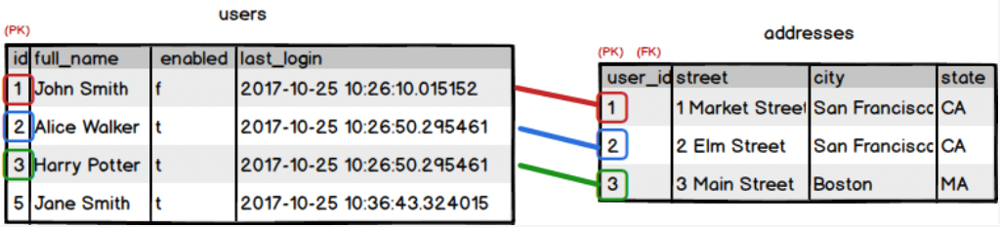

#### One to Many Relationship

- An instance from the first entity (relation) can be associated with one instance of the second entity (relation) but an instance of the second entity can be associated to more than one instance of the first entity: A `call` can only be made by 1 `contact` but a `contact` can make many `calls` (**1:M**).
- **One to many** relationship are implemented with the entity on the many end having a foreign key that references the primary key of the entity on the one end.

	
```sql
CREATE TABLE contacts (
  id serial PRIMARY KEY,
  first_name TEXT NOT NULL,
  last_name TEXT NOT NULL,
  number VARCHAR(10) NOT NULL
);

/*
 one-to-many: A contact can make many calls
*/

CREATE TABLE calls (
  id serial PRIMARY KEY,
  "when" timestamp NOT NULL,
  duration integer NOT NULL,
  contact_id integer NOT NULL,
  FOREIGN KEY (contact_id) REFERENCES contacts(id) ON DELETE CASCADE
);
```

#### Many to Many Relationship
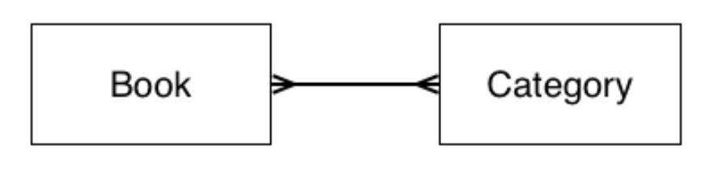
- Instances from one entity can be associated to more than 1 instance from the other entity and vice versa: a `book` can fall under multiple `categories` while a `category` can contain multiple `books` (**M:M**).
- Translating above entity relationship diagram into a physical schema, we get:
	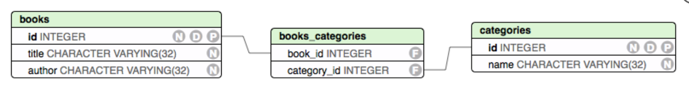
- Many-to-many relationships are implemented using an **additional table** to store the relationships between instances of the two tables. This table, called a _join table_, contains **two** `FOREIGN KEY`s referencing the `PRIMARY KEY` of each table having the many-to-many relationship. By convention, the name of the join table is formed by concatenating the names of the two tables in alphabetical order e.g. `books_categories` in this example.
- **Important Note**: Although foreign keys should not have `NULL` values, the `Foreign Key` constraint does not enforce that. To enforce that, we need to add both `NOT NULL` and `ON DELETE CASCADE` constraints on foreign keys. 
```sql
CREATE TABLE books (
  id serial PRIMARY KEY,
  title VARCHAR(32) NOT NULL,
  author VARCHAR(32) NOT NULL
);

CREATE TABLE categories (
  id SERIAL PRIMARY KEY,
  name VARCHAR(32) NOT NULL
);

-- Join Table
CREATE TABLE books_categories (
  books_id INTEGER REFERENCES books(id) ON DELETE CASCADE,
  category_id INTEGER REFERENCES categories(id) ON DELETE CASCADE
)
```

### Cardinality and Modality
| 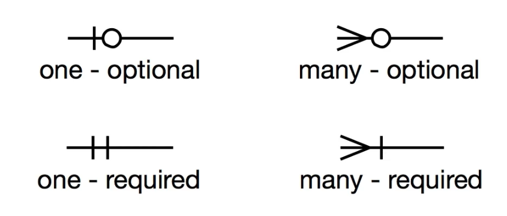 |
| :--: |
| <b> Crow's Foot Notation </b> |

- **Cardinality** determines the number of objects on each side of the relationship (1:1, 1:M, M:M)
- **Modality** determines if the relationship is required (1) or optional (0)


**Event Ticketing Example**\
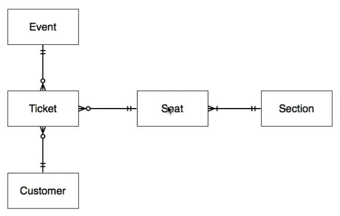
- Ticket must belong to one event but an event can have 0 or more tickets
- Ticket must be associated with one seat but a seat can have 0 or more tickets
- A seat must belong to one section but a section can have 1 or more seats
- A ticket must belong to one customer but a customer can have 0 or more tickets


**Book Author Example**\
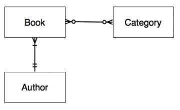
- A book can belong to 0 or more categories and a category can have 0 or more books
- A book must have 1 author but an author can have 1 or more books.


### JOIN
```sql
SELECT ... FROM table_a [JOIN TYPE] table_b ON join_condition
```

`JOIN TYPE` can be one of the following: 
- `INNER JOIN` returns only the rows where there the join condition is `true`
- `LEFT OUTER JOIN` returns all rows from the `FROM` table and rows from the right table that meets the join condition
- `RIGHT OUTER JOIN` returns all rows from the right table and rows from the left table that meets the join condition
- `FULL OUTER JOIN` returns the all rows from an `INNER JOIN` as well as unmatch rows from both the left and right tables. 
- `CROSS JOIN` takes each row from the `FROM` table and combine with all rows from the right table. It does not require `ON join_condition` since it returns all combinations.

	```sql
	SELECT * FROM table_a CROSS JOIN table_b 

	# old syntax
	SELECT * FROM table_a, table_b
    ```
- There is an old syntax that **uses cross join and `WHERE`** clause to retain only the rows that match to get the **equivalent of an `INNER JOIN`**. This is not preferred since the join type is less obvious.
	```sql
	SELECT * FROM table_a, table_b 
	  WHERE table_a.id = table_b.id

	-- Equivalent to
	SELECT * FROM table_a 
	  INNER JOIN table_b ON table_a.id = table_b.id
    ```

[Back to Top](#section-links)


## Insert Data Into A Table
### INSERT INTO ... VALUES
- `INSERT INTO ... VALUES` statements are used to append rows into a table:
	```sql
	INSERT INTO table_name [(column_A, column_B, ...)]
	  VALUES (col_A_data, col_B_data, ...);
	```
	- When inserting data into a table, we may specify either **all the columns**, a **subset of columns**, or **none at all**. Specifying all or a subset of columns allows to enter the data values in a different order from that set during the schema definition. Not specifying at all will assume the same column order as that set during the schema definition but could sometimes lead to unexpected errors. Hence it is best to specify which columns we want to insert data into.
	- When columns are specified, each specified column have be supplied with a corresponding value in the `VALUES` clause. If a column has a default value defined, we can enter `DEFAULT` if we want to use that value. 
	- If we omit a column, a default value or `NULL` (if no default value is specified in the schema for that column) will be added to the record automatically during insertion.
	- We can insert multiple rows by separating each value row/tuple with a comma. The second digit in the response indicate the count of rows inserted.

	```sql
	CREATE TABLE users (
	  id SERIAL PRIMARY KEY,
	  name TEXT DEFAULT 'Anonymous',
	  enabled BOOLEAN,
	  age integer
	);

	-- No column names, wrong number of values supplied
	INSERT INTO users VALUES ('John', true, 24);
	ERROR:  invalid input syntax for type integer: "John"
	LINE 1: INSERT INTO users VALUES ('John', true, 24);

	-- No column names, correct number of values supplied in right order
	INSERT INTO users VALUES (DEFAULT, 'John', true, 24);

	-- Subset of column names supplied, non specified columns be given default value or NULL
	INSERT INTO users (enabled, age) VALUES (false, 30);

	-- Subset of column names supplied, in different order to schema
    INSERT INTO users (enabled, name) VALUES (true, DEFAULT), (true, 'Tom');
   
    SELECT * FROM users;
    
	id |   name    | enabled | age 
   ----+-----------+---------+-----
     1 | John      | t       |  24
     2 | Anonymous | f       |  30
     3 | Anonymous | t       |    
     4 | Tom       | t       |    
    (4 rows)
	```

	**Exercise**\
	Examine the following schema for a table called `tools`:

	```psql
	                        Table "public.tools"
	  Column  |          Type          |                     Modifiers
	----------+------------------------+----------------------------------------------------
	 id       | integer                | not null default nextval('tools_id_seq'::regclass)
	 name     | character varying(100) | not null
	 cost     | numeric(7,2)           | not null
	 price    | numeric(7,2)           | not null
	 stock    | integer                | not null
	 discount | numeric(7,2)           | default 0
	 comments | text                   |
	Indexes:
	    "tools_pkey" PRIMARY KEY, btree (id)
	```

	We want to add some rows of data to the table, using the default value for the `discount` column and having the values for the `comments` column as `NULL`. Which of the following SQL statements would successfully add data into the table?

	**Correct**
	```sql
	INSERT INTO tools (name, cost, price, stock)
	  VALUES ('Hammer', 5.28, 10.00, 25),
	         ('Wrench', 11.32, 20.00, 20),
	         ('Saw', 3.47, 8.00, 30),
	         ('Screwdriver', 1.12, 2.50, 50);
	```

	```sql
	INSERT INTO tools
	  VALUES (DEFAULT, 'Hammer', 5.28, 10.00, 25),
	         (DEFAULT, 'Wrench', 11.32, 20.00, 20),
	         (DEFAULT, 'Saw', 3.47, 8.00, 30),
	         (DEFAULT, 'Screwdriver', 1.12, 2.50, 50);
	```
	This will not raise an error even though the number of values is 1 short of the number of columns but the last column will automatically have `NULL` inserted.

	**Wrong**
	```sql
	INSERT INTO tools (name, cost, price, stock, discount, comments)
	  VALUES ('Hammer', 5.28, 10.00, 25, DEFAULT),
	         ('Wrench', 11.32, 20.00, 20, DEFAULT),
	         ('Saw', 3.47, 8.00, 30, DEFAULT),
	         ('Screwdriver', 1.12, 2.50, 50, DEFAULT);
	```
	This would raise an error since our `INSERT` statement has more target columns than expressions. If we specify a column in the column list we must provide a value for it, even if we want the column to contain `NULL` values.

	```sql
	INSERT INTO tools
	  VALUES ('Hammer', 5.28, 10.00, 25),
	         ('Wrench', 11.32, 20.00, 20),
	         ('Saw', 3.47, 8.00, 30),
	         ('Screwdriver', 1.12, 2.50, 50);
	```
	This would also raise an error. Since this statement doesn't use a column list, PostgreSQL will try to insert the specified values to the columns in the order defined in the schema; it therefore tries to insert string values into the `id` column, which expects integer values.

### INSERT INTO ... (SELECT ... )
- `INSERT INTO tbl_name (col_a, ...) (SELECT ...);` can also be use to append data to a table. Here, `(SELECT ... )` replaces `VALUES ( ... )`. For example, the following:
	```sql
	INSERT INTO foo_bar (foo_id, bar_id) 
	  VALUES ((SELECT id FROM foo WHERE name = 'selena'), (SELECT id FROM bar WHERE type = 'name'));    
	INSERT INTO foo_bar (foo_id, bar_id) 
	  VALUES ((SELECT id FROM foo WHERE name = 'funny'), (SELECT id FROM bar WHERE type = 'name'));
	INSERT INTO foo_bar (foo_id, bar_id) 
	  VALUES ((SELECT id FROM foo WHERE name = 'chip'), (SELECT id FROM bar WHERE type = 'name'));
	```

	Can be accomplished using the following:
	```sql
	INSERT INTO foo_bar (foo_id, bar_id) ( 
	  SELECT foo.id, bar.id FROM foo CROSS JOIN bar 
	    WHERE type = 'name' AND name IN ('selena', 'funny', 'chip') 
	);
	```

- This works becauses `VALUES` is just a special type of `SELECT` and `INSERT` just writes the result of an arbitrary `SELECT` statement into the table.
	```sql
	SELECT 1; vs. VALUES (1);
	SELECT * FROM (SELECT 1) sq; vs. SELECT * FROM (VALUES (1)) sq;
	INSERT INTO quix VALUES (1); vs. INSERT INTO quix SELECT 1;
	```

- Just be careful when using `SELECT` within an `INSERT` statement as it can be tricky.  Details about the technique can be found [here](http://www.chesnok.com/daily/2013/11/19/everyday-postgres-insert-with-select/comment-page-1/)

### COPY
- We can also copy data between a file or stdin and table using the [`COPY`](https://www.postgresql.org/docs/current/sql-copy.html) SQL statement or `\copy` meta command. If the source is a file, `COPY` requires an absolute path to the file while `\copy` can use a relative path (and is thus easier to use). The sample code below copy data from a csv formatted file `bidders.csv` with header fields on the first line to a `bidders` table. `COPY N` is returned when the operation is performed successfully. `N` is the number of rows copied.

	```sql
	-- Using \copy meta-command
	\copy bidders FROM 'bidders.csv' WITH HEADER CSV;
	
	-- Using COPY SQL statement
	COPY bidders FROM '/absolute/path/bidders.csv' WITH HEADER CSV;
	```

[Back to Top](#section-links)


## Update Data In A Table

```sql
UPDATE table_name
  SET column_A = value_A [, column_B = value_B ...]
  WHERE expression;
```
- `[ ... ]` represents the ability to set values for more than 1 column at the same time.
- The `WHERE` clause is **optional**. If omitted, PostgreSQL will update every row in target table
- As this involves data modification, one should be careful to ensure the `WHERE` clause targets only the correct rows. It is advisable to run a query to test the expression fetches the right rows before executing an update.

	**Example**
	```sql
	UPDATE users 
	  SET enabled = true
	  WHERE full_name = 'Harry Potter' OR full_name = 'Jane Smith';
	```

	```plaintext
	UPDATE 4
	```

- Although we should use `IS NULL` or `IS NOT NULL` when comparing data, `= NULL` can be use when updating data
```sql
UPDATE table_name 
  SET column_name1 = NULL
  WHERE expression;
```

[Back to Top](#section-links)


## Delete Data From A Table
**Syntax**
```sql
DELETE FROM table_name WHERE expression;
```
- The `DELETE FROM` statement will remove all **rows** that matches the expression in the `WHERE` clause
- If the intent is to delete all rows, the `WHERE` clause can be omitted.
- As this involves data modification, one should be careful to ensure the `WHERE` clause targets only the correct rows. It is advisable to run a query to test the expression fetches the right rows before executing an update.

[Back to Top](#section-links)


## Select Queries
- We use the `SELECT` statement to retrieve rows from a table that meets certain conditions
	``` sql
	SELECT column_name, ...
	  FROM table_name
	  WHERE condition;
	```

- The `WHERE` clause generally include operators in conditional expressions:
	- **Comparison** operators: `<`, `>`, `<=`, `>=`, `=`, `<>` or `!=`
		```sql
		SELECT full_name, enabled, last_login
			FROM users
		    WHERE id >= 2;
		```
	
	- **Comparison** predicates: `IS NULL`, `IS NOT NULL`, `BETWEEN`, `NOT BETWEEN`, `IS DISTINCT FROM`, `IS NOT DISTINCT FROM`. As `NULL` is a special value in SQL representing an absence of a value, we cannot use `WHERE column_name = NULL` or `WHERE column_name <> NULL` but have to use `WHERE column_name IS NULL`  or `WHERE column_name IS NOT NULL` instead.
	
	- **Logical** Operators: `AND`, `OR`, `NOT`
		```sql
		SELECT * FROM users
			WHERE full_name = 'Harry Potter'
		    AND enabled = 'false';
		```
	
	- **String Matching** Operators: `LIKE`
		```sql
		SELECT * FROM users WHERE full_name LIKE '%Smith';
		```
		`%` is a wildcard that matches any number of character.
		`_` is also a wildcard but only matches a single character
		`LIKE` is case sensitive so `LIKE %Smith` matches `Smith` but not `smith` or `SMITH`
		`ILIKE` for case insensitive match 

- An `ORDER BY` clause can be added to sort the results
	```sql
	SELECT full_name, enabled FROM users
	ORDER BY enabled DESC, id ASC;
	```

### LIMIT and OFFSET
- `LIMIT` or `OFFSET` can be used to return a portion of the result. `LIMIT n` selects the first n rows of the result table. `OFFSET n` skips the first n rows of the result.

	**users table**
	```plaintext
	 id |  full_name   | enabled |         last_login
	----+--------------+---------+----------------------------
	  1 | John Smith   | f       | 2017-10-25 10:26:10.015152
	  2 | Jane Smith   | t       | 2017-10-25 10:26:50.295461
	  3 | Harry Potter | t       | 2017-10-25 10:26:50.295461
	  4 | Harry Potter | t       | 2017-10-25 10:36:38.188286
	  5 | Jane Smith   | t       | 2017-10-25 10:36:43.324015
	 (5 rows)
	```

	```sql
	SELECT * FROM users LIMIT 1 OFFSET 1;
	```

	```plaintext
	 id |  full_name   | enabled |         last_login
	----+--------------+---------+----------------------------
	  2 | Jane Smith   | t       | 2017-10-25 10:26:50.295461
	(1 row)
	```

### DISTINCT
- `DISTINCT` can be used to return only unique values in the result
	```sql
	SELECT DISTINCT full_name FROM users;
	```

	```plaintext
	 full_name
	--------------
	 John Smith
	 Jane Smith
	 Harry Potter
	(3 rows)
	```

- `DISTINCT` can be used in conjunction with SQL function e.g. `count()`:

	```sql
	SELECT count(full_name) FROM users;
	```

	```plaintext
	 count
	-------
	     5
	(1 row)
	```

	```sql
	SELECT count(DISTINCT full_name) FROM users;
	```

	```plaintext
	 count
	-------
	     3
	(1 row)
	```


### Common Functions
- String Functions

| Function | Example | Notes |
| --- | --- | --- |
| `length` | `SELECT length(full_name) FROM users;` | This returns the length of every user's name. You could also use `length` in a `WHERE` clause to filter data based on name length. |
| `trim` |  `SELECT trim(leading ' ' from full_name) FROM users;` | If any of the data in our `full_name` column had a space in front of the name, using the `trim` function like this would remove that leading space. |
	
- Date / Time Functions

| Function | Example | Notes |
| --- | --- | --- |
| `date_part` | `SELECT full_name, date_part('year', last_login) FROM users;` |  `date_part` allow us to view a table that only contains a part of a user's timestamp that we specify. The above query allows us to see each user's name along with the year of the `last_login` date. Sometimes having date/time data down to the second isn't needed |
| `age` |  `SELECT full_name, age(last_login) FROM users;` | The `age` function, when passed a single `timestamp` as an argument, calculates the time elapsed between that timestamp and the current time. The above query allows us to see how long it has been since each user last logged in. |

- Aggregate Functions

| Function | Example | Notes |
| --- | --- | --- |
| `count` | `SELECT count(id) FROM users;` | Returns the number of values in the column passed in as an argument. This type of function can be very useful depending on the context. We could find the number of users who have enabled an account, or even how many users have certain last names if we use the above statement with other clauses. |
| `sum` | `SELECT sum(id) FROM users;` | Not to be confused with `count`. This _sums_ numeric type values for all of the selected rows and returns the total. |
| `min` | `SELECT min(last_login) FROM users;` | This returns the lowest value in a column for all of the selected rows. Can be used with various data types such as numeric, date/ time, and string. |
| `max` | `SELECT max(last_login) FROM users;` | This returns the highest value in a column for all of the selected rows. Can be used with various data types such as numeric, date/ time, and string. |
| `avg` | `SELECT avg(id) FROM users;` | Returns the average (arithmetic mean) of numeric type values for all of the selected rows. |

### GROUP BY
- `GROUP BY` clause can be used to aggregate data
	```sql
	SELECT enabled, count(id) FROM users GROUP BY enabled;
	```

	```plaintext
	enabled | count
	---------+-------
	 f       |     1
	 t       |     4
	(2 rows)
	```

- **Note:** When `GROUP BY` is present, or any aggregate functions are present, it is not valid for the `SELECT` list expressions to refer to ungrouped columns except **within aggregate functions** or when the **ungrouped column is functionally dependent on the grouped columns: A functional dependency exists if the grouped columns (or a subset thereof) are the primary key of the table containing the ungrouped column**. Otherwise there will be more than one possible value to return for an ungrouped column. 

**Correct Syntax**
```sql
SELECT 
  books.id,
  books.author, 
  string_agg(categories.name, ', ') AS categories
FROM books
  INNER JOIN books_categories ON books.id = books_categories.book_id
  INNER JOIN categories ON books_categories.category_id = categories.id
GROUP BY books.id 
ORDER BY books.id;
```
- `books.author` need not be included in the `GROUP BY` clause since it is functionally dependent on `books.id`, the primary key of `books`, which is already in the `GROUP BY` clause. Hence, the issue of `book.author` having more than 1 value is non existant. However, the converse is not true and grouping by `books.author` alone will cause an error as `books.id` is not functionally dependent on `books.author`.See Question 2 in [many-to-many exercise](https://github.com/cklim83/launch_school/blob/main/07_ls180_database_foundations/lesson_03/06a_many_to_many.md). 
- We can also group by a primary key even if the `SELECT` list only includes its functionally dependent columns and not the key itself i.e. the column in the `GROUP BY` **need not** be in the `SELECT` list. In the above example, we can remove `books.id` from the `SELECT` list without any problems.
```sql
SELECT 
  books.author, 
  string_agg(categories.name, ', ') AS categories
FROM books
  INNER JOIN books_categories ON books.id = books_categories.book_id
  INNER JOIN categories ON books_categories.category_id = categories.id
GROUP BY books.id 
ORDER BY books.id;
```

**Wrong Syntax**
```sql
SELECT enabled, full_name, count(id)
  FROM users
GROUP BY enabled;   -- full_name is not grouped
```

```plaintext
ERROR:  column "users.full_name" must appear in the GROUP BY clause or be used in an aggregate function
```

This results in an error as `users.full_name` is not functionally dependent on `users.enabled`. There is the possibility that enabled rows having the same value have different values for `full_name`, hence triggering the error.

### HAVING
```sql
SELECT column1, aggregate_function (column2)
FROM table_name
GROUP BY column1
HAVING condition;
```
- The `HAVING` clause behaves in a similar way to the `WHERE` clause. However instead of filtering rows for a specified condition, it **filters groups or aggregates**. Hence it is often used in conjunction with `GROUP BY` clause.
- As PostgreSQL evaluates the `HAVING` clause before `SELECT`, we cannot use column aliases in the `HAVING` clause

**Examples**
```sql
-- Selecting only customers whose total payment sum exceeds 2000
SELECT customer_id, SUM(amount)
  FROM payments
  GROUP BY customer_id
  HAVING SUM(amount) > 2000;
```

```sql
-- Select only stores with at least 300 customer visits
SELECT store_id, COUNT(customer_id)
 FROM customer
 GROUP BY store_id
 HAVING COUNT(customer_id) > 300;
```

### JOIN
- When data are separated across multiple tables, we need to join these tables to get all pertinent data.
- The general syntax of a `JOIN` statement is:
	```sql
	SELECT table_nameN.column_name, ...
	       FROM table_name1
	       join_type JOIN table_name2
	                 ON join_condition;
	```
- `JOIN` will create a **virtual table** based on the join condition from which the selected columns will be extracted as the result.

#### Types of Joins
- `INNER JOIN` creates the intersection between two tables
- `LEFT JOIN` takes all the rows from the first table, and matching rows from the second table
- `RIGHT JOIN` takes the matching rows from the first table and all rows from the second table.
- `FULL JOIN` is a combination of left and right join and will contain all rows from both tables.
- `CROSS JOIN`, also known as Cartesian JOIN returns all rows from one table crossed with every row from the second table.

**Exercise**
You have a table called `pet_owners` containing the following data:
| id | name |
| --- | --- |
| 1 | David |
| 2 | Keiko |
| 3 | Zia |
| 4 | Carlos |

You also have a table called `pets` containing the following data:
| id | name | type | owner_id |
| --- | --- | --- | --- |
| 1 | Fluffy | Rabbit | 2 |
| 2 | Rex | Dog | 1 |
| 3 | Daisy | Cat | 3 |
| 4 | Oscar | Cat | 3 |

Which type of join was used to produce the following result?

```psql
id |  name  | id |  name  |  type  | owner_id
----+--------+----+--------+--------+----------
 2 | Keiko  |  1 | Fluffy | Rabbit |        2
 1 | David  |  2 | Rex    | Dog    |        1
 3 | Zia    |  3 | Daisy  | Cat    |        3
 3 | Zia    |  4 | Oscar  | Cat    |        3
 4 | Carlos |    |        |        |
(5 rows)
```

Assume that `pet_owners` is the table specified in the `FROM` clause of the `JOIN`.

**Answer**:
- `LEFT OUTER JOIN`
- `FULL OUTER JOIN`

#### Multiple Joins
```sql
SELECT users.full_name, books.title,
       checkouts.checkout_date
    FROM users
    INNER JOIN checkouts
          ON users.id = checkouts.user_id
    INNER JOIN books
          ON books.id = checkouts.book_id;
```
- The above query involves two `INNER JOIN`. PostgreSQL first creates a virtual table containing all columns from both original table i.e. `users` and table identified by `JOIN`  i.e. `checkouts`
- For the second `JOIN`, it again create another virtual table from the first virtual table and the second table i.e. `books`. It then select the required columns

### Aliasing
- The `AS` keyword is used for aliasing in SQL. It can be be used for both column and table names.
- Alias are used for columns to give them meaningful names.
	```sql
	films=# SELECT count(id) FROM films;
	 count
	-------
	    10
	(1 row)
	
	films=# SELECT count(id) AS total_films FROM films;
	 total_films
	-------------
	          10
	(1 row)
	```
- Aliases can be used for table names to make the query shorter and more concise, especially when we are joining tables. We also need the table prefix when we want to distinguish between column names that are common across joining tables.
	```sql
	SELECT 
	  f.title, 
	  d.name, 
	  f.id AS film_id, 
	  d.id AS director_id
	FROM films AS f
	INNER JOIN directors as d
	ON f.director_id = d.id
	```

### How PostgreSQL Evaluate A `SELECT` Query
```plaintext
-- Sequence of Evaluation
FROM/JOIN -> WHERE -> GROUP BY -> HAVING -> SELECT -> DISTINCT -> ORDER BY -> LIMIT
```
1. The database creates a new virtual table populated with data from all tables listed in both `FROM` and `JOIN` clauses.
2. Rows are then filtered using `WHERE` conditions
3. If the query contains a `GROUP BY` clause, remaining rows are divided in appropriate groups.
4. If `HAVING` clause is present, it is used to filter data at the grouped/aggregated level.
5. Each element in `SELECT` is then evaluated, including any function, alias.
6. If `DISTINCT` is present, duplicates are removed.
7. Results are then sorted based on the `ORDER BY` clause.
8. If `LIMIT` or `OFFSET` clauses are present, the result will be adjusted.

### Other Feature - Row Comparison
- Using [Row Constructors](https://www.postgresql.org/docs/9.5/sql-expressions.html#SQL-SYNTAX-ROW-CONSTRUCTORS) and [Row-wise Comparison](https://www.postgresql.org/docs/9.5/functions-comparisons.html#ROW-WISE-COMPARISON), we can also perform row level comparisons in PostgreSQL. This is useful when we need to compare the values of many fields which will make using `AND` cumbersome. For example, if we have all the data in a row except for its `id`, we can retrieve it using the following:
	```psql
	SELECT id FROM items
	WHERE ROW('Painting', 100.00, 250.00) =
	  ROW(name, initial_price, sales_price);
	```
	Here, the values for each row under `name`, `initial_price` and `sales_price` are compared to the given set of values `(Painting, 100.00, 250.00)` and the rows that match will have their `id` returned.

[Back to Top](#section-links)


## Subqueries
- A subquery works by first using a nested query to generate a set of values to be used, usually as a condition under a `WHERE` clause, by the outer query.
	```sql
	SELECT title FROM books WHERE author_id =
	  (SELECT id FROM authors WHERE name = 'William Gibson');
	```

	```psql
	my_books=# SELECT id FROM authors WHERE name = 'William Gibson';
	 id
	----
	  1
	(1 row)
	```

	As the inner query returns the `id` of `William Gibson` which is `1`, the outer query effectively becomes:
	```sql
	SELECT title FROM books WHERE author_id = 1;
	```

- Besides under a `WHERE` clause, a subquery can appear under different clauses of a main query
	- `FROM` clause. Using subquery to generate a result or virtual table, then query the table for final result. Take note that the virtual table need to be in parenthesis and aliased.
		```sql
		SELECT MAX(bid_counts.count) FROM
		  (SELECT COUNT(bidder_id) FROM bids GROUP BY bidder_id) AS bid_counts;
		```
	
	- `SELECT` clause. Also known as [scalar subqueries](https://www.postgresql.org/docs/9.5/sql-expressions.html#SQL-SYNTAX-SCALAR-SUBQUERIES), we can reference columns from the outer `SELECT` query within the subquery. A scalar subquery must only return 1 column and 1 row.
		```sql
		SELECT name,
		       (SELECT COUNT(item_id) FROM bids WHERE item_id = items.id)
		FROM items;
		```
		Here, for each `id` in `items`, the scalar subquery is run and returns a count value.

### Subquery Expressions
- We use `=` in the `WHERE` condition because the nested query returned a **single value**.  If the subquery return more than one value, we could then use one of the subquery expressions below for comparison.
- `EXISTS (subquery)` checks if the subquery returns any result. If at least one row is returned, it returns `true`, else it returns `false`.
	```sql
	SELECT name FROM bidders
	WHERE EXISTS (SELECT 1 FROM bids WHERE bids.bidder_id = bidders.id);
	```

	```psql
	      name
	-----------------
	 Alison Walker
	 James Quinn
	 Taylor Williams
	 Alexis Jones
	 Gwen Miller
	 Alan Parker
	(6 rows)
	```

	Here, each `id` in `bidders` is assigned to `bidders.id` in the subquery. If a matching `bidder_id` in `bids` is found, a row of 1 is returned. As long as there is a row returned, regardless of value, `EXISTS` will evaluate to `true` and the name for that `id` is retained for the final result.
	
- `IN` compares an evaluated expression to every row in the the subquery result. If the evaluated expression is found in anyone of the returned rows of the subquery, `IN` evaluates to `true`, else it evaluates to `false`.
	```psql
	my_books=# SELECT name FROM authors WHERE id IN
	my_books-#   (SELECT author_id FROM books
	my_books(#     WHERE title LIKE 'The%');
	      name
	----------------
	 Iain M. Banks
	 Philip K. Dick
	(2 rows)
	```
	Here, the query will return the names of authors who has one or more book title starting with `The`.

- `NOT IN` negates the result of `IN` and evaluates to `true` if the an equal row is not found.
	```psql
	my_books=# SELECT name FROM authors WHERE id NOT IN
	my_books-#   (SELECT author_id FROM books
	my_books(#     WHERE title LIKE 'The%');
	      name
	----------------
	 William Gibson
	(1 row)
	```
	Here, the query will return names of authors who does not have any books whose title begin with `The`.

- `ANY` or `SOME` are synoyms and can be used interchangeably. They are used in conjunction with an operator (e.g. `=`, `>`, `<`) and evaluates to `true` if any `true` result is obtained in the operation.
	```psql
	my_books=# SELECT name FROM authors WHERE length(name) > ANY
	my_books-# (SELECT length(title) FROM books
	my_books(# WHERE title LIKE 'The%');
	      name
	----------------
	 William Gibson
	 Philip K. Dick
	(2 rows)
	```
	Here, the query return names of authors who name length is greater than any of the length of book titles beginning with `The`.

- `ALL` is also used in conjunction with an operator (e.g. `=`, `>`, `<`) and evaluates to true only if all results of the operation are `true`. Note: `!=` / `<>` `ALL` is logically equivalent to `NOT IN`.
	```psql
	my_books=# SELECT name FROM authors WHERE length(name) > ALL
	my_books-# (SELECT length(title) FROM books
	my_books(# WHERE title LIKE 'The%');
	 name
	------
	(0 rows)
	```
	Here, the query return names of authors whose name length is longer than the length of all books beginning with `The`. 

### When to Use Subqueries
- When performance is not a consideration (subquery can usually be slower), subqueries is used based on personal preference. Generally, if the return values does not involve data from another table, subqueries may be used. Else `join` may be more suitable.

	```sql
	-- Using Subquery
	SELECT u.full_name 
	  FROM users u
	  WHERE u.id NOT IN (
	    SELECT c.user_id FROM checkouts c
	  );

	-- Using JOIN
	SELECT u.full_name
	  FROM users u
	  LEFT JOIN checkouts c ON u.id = c.user_id
	  WHERE c.user_id IS NULL;
	```

[Back to Top](#section-links)


## Optimizing SQL Queries

### Indexes
- Similar to how books use an index to list the page numbers of key terms to enable readers to quickly find them, an index of a database table also enables fast lookup.
- If we indexed the `author` column, instead of searching each row in the table in search of a given name, PostgreSQL would just need to search the index for the name that matched the search condition to identify the relevant rows. 

### When to use an  index?
- While index speeds up searches and make reads faster, there is a cost involved as indexes have to be updated whenever a row is updated or inserted.
	
	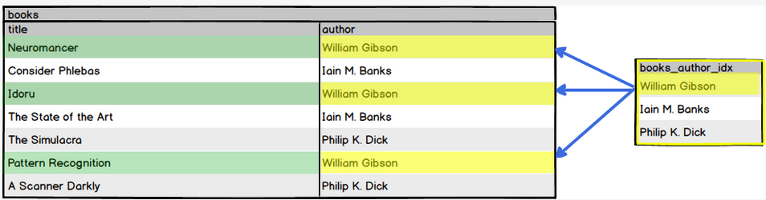
- Some rule of thumb when assessing trade-offs include:
	- Indexes are best used when sequential reading is inadequate. Examples include columns that are used in mapped relationships (e.g. Foreign Keys) or columns frequently used as part of `ORDER BY` clauses.
	- Indexes are best used in tables and/or columns where data are read more frequently than they are created or updated.

### Types of Index
- PostgreSQL provides several index types: B-tree, Hash, GiST, SP-GiST and GIN. Each type uses a different data structure and search algorithm that is best suited to different types of queries.
- Indexes created with `PRIMARY KEY`, `UNIQUE` or `CREATE INDEX` are B-tree indexes
- Refer to [PostgreSQL documentation](https://www.postgresql.org/docs/9.2/static/indexes-types.html) for more information.

### Creating Indexes
- Whenever we impose a `PRIMARY KEY` or `UNIQUE` constraint on a column, we are automatically creating an index on that column. An index is how these constraints enforce uniqueness of values for the column.
	```psql
	my_books=# CREATE TABLE authors (
	my_books(#   id serial PRIMARY KEY,
	my_books(#   name varchar(100) NOT NULL
	my_books(# );
	CREATE TABLE
	my_books=# CREATE TABLE books (
	my_books(#   id serial PRIMARY KEY,
	my_books(#   title varchar(100) NOT NULL,
	my_books(#   isbn char(13) UNIQUE NOT NULL,
	my_books(#   author_id int REFERENCES authors(id)
	my_books(# );
	CREATE TABLE
	my_books=# \d books
	                          Table "public.books"
	     Column     |          Type          |                     Modifiers
	----------------+------------------------+----------------------------------------------------
	 id             | integer                | not null default nextval('books_id_seq'::regclass)
	 title          | character varying(100) | not null
	 isbn           | character(13)          | not null
	 author_id      | integer                |
	Indexes:
	  "books_pkey" PRIMARY KEY, btree (id)
	  "books_isbn_key" UNIQUE CONSTRAINT, btree (isbn)
	Foreign-key constraints:
	  "books_author_id_fkey" FOREIGN KEY (author_id) REFERENCES authors(id)
	```

- Unlike `PRIMARY KEY` and `UNIQUE` constraints, a `FOREIGN KEY` **does not** create an index on a column, although these columns are good candidates for indexing.
- The general form for adding an index to a table is:
	```sql
	CREATE INDEX [index_name] ON table_name (field_name);
	```
- If `index_name` is omitted, PostgreSQL will automatically generate a unique name for the index. 

### Unique and Non-Unique Indexes
- An index created via `PRIMARY KEY` or `UNIQUE` constraints is a _unique_ index and multiple table rows with equal values for that index is not allowed.
- The index we created using `CREATE INDEX ON books (author_id)` a non-unique index and does not enforce uniqueness.
	```psql
	my_books=# CREATE INDEX ON books (author_id);
	CREATE INDEX
	```
	```psql
	my_books=# \d books
	                         Table "public.books"
	     Column     |          Type          |                     Modifiers
	----------------+------------------------+----------------------------------------------------
	 id             | integer                | not null default nextval('books_id_seq'::regclass)
	 title          | character varying(100) | not null
	 isbn           | character(13)          | not null
	 author_id      | integer                |
	Indexes:
	  "books_pkey" PRIMARY KEY, btree (id)
	  "books_isbn_key" UNIQUE CONSTRAINT, btree (isbn)
	  "books_author_id_idx" btree (author_id)
	Foreign-key constraints:
	  "books_author_id_fkey" FOREIGN KEY (author_id) REFERENCES authors(id)
	```

### Multicolumn Indexes
- Indexes can be created on more than one column. 
	```sql
	CREATE INDEX index_name ON table_name (field_name_1, field_name_2);
	```
- There is a limit to the number of columns that can be combined in an index and only certain index types support multi-column indexes.

### Partial Indexes
- Partial indexes are built from a subset of data in a table, defined using a conditional expression. 
- The index only contains entries for the rows in the table where the value in the indexed column satisfies the condition.

### Deleting Indexes
- `\di` psql console command is used to list indexes
	```psql
	my_books=# \di
	              List of relations
	 Schema |        Name         | Type  | Owner |  Table
	--------+---------------------+-------+-------+---------
	 public | authors_pkey        | index | User  | authors
	 public | books_author_id_idx | index | User  | books
	 public | books_isbn_key      | index | User  | books
	 public | books_pkey          | index | User  | books
	(4 rows)
	```
- We can use `DROP INDEX index_name` command to delete an index
	```psql
	my_books=# DROP INDEX books_author_id_idx;
	DROP INDEX
	```

	```psql
	my_books=# \di
	                 List of relations
	 Schema |      Name      | Type  | Owner |  Table
	--------+----------------+-------+-------+---------
	 public | authors_pkey   | index | karl  | authors
	 public | books_isbn_key | index | karl  | books
	 public | books_pkey     | index | karl  | books
	(3 rows)
	```

[Back to Top](#section-links)


## Comparing SQL Statements
- We can arrive at the same results by structuring our queries in a different number of ways. For example, instead of using a join, we might opt for a subquery.
- How a query is structured will have different performance e.g. time taken for query to run and memory usage.
- We can prepend the `EXPLAIN` command to a query to see the query plan created by PostgreSQL
	```psql
	my_books=# EXPLAIN SELECT * FROM books;
	                     QUERY PLAN
	----------------------------------------------------------
	 Seq Scan on books  (cost=0.00..12.60 rows=260 width=282)
	(1 row)
	```
- The query plan is presented in a form of a node-tree. The greater the complexity of the query, the more nodes there will be in the query plan. For example, the simple `SELECT * FROM books;` above consist of only one node in the query plan. 
- Each node will show its **type** ( e.g. a sequential scan), **estimated cost** (start-up and total cost), **estimated number of output rows** and the **estimated average width of rows in bytes**.
- For complex queries with multiple nodes, the estimated cumulative cost is shown at the top.
- We can use `EXPLAIN` to compare equivalent queries and get a feel for which one is more costly. 
	```psql
	my_books=# EXPLAIN SELECT books.title FROM books
	my_books-# JOIN authors ON books.author_id = authors.id
	my_books-# WHERE authors.name = 'William Gibson';
	                        QUERY PLAN
	--------------------------------------------------------------------
	Hash Join  (cost=14.03..27.62 rows=2 width=218)
	  Hash Cond: (books.author_id = authors.id)
	  ->  Seq Scan on books  (cost=0.00..12.60 rows=260 width=222)
	  ->  Hash  (cost=14.00..14.00 rows=2 width=4)
	        ->  Seq Scan on authors  (cost=0.00..14.00 rows=2 width=4)
	              Filter: ((name)::text = 'William Gibson'::text)
	(6 rows)
	```

	```psql
	my_books=# EXPLAIN SELECT title FROM books
	my_books-# WHERE author_id =
	my_books-# (SELECT id FROM authors
	my_books(# WHERE name = 'William Gibson');
	                                     QUERY PLAN
	-------------------------------------------------------------------------------------
	 Index Scan using books_author_id_idx on books  (cost=14.15..22.16 rows=1 width=218)
	   Index Cond: (author_id = $0)
	   InitPlan 1 (returns $0)
	     ->  Seq Scan on authors  (cost=0.00..14.00 rows=2 width=4)
	           Filter: ((name)::text = 'William Gibson'::text)
	(5 rows)
	```
	In above example, the subquery surprising has a slightly lower cost (`22.16`) than the join (`27.62`) equivalent. This is data dependent and unusual as joins are typically more efficient that subqueries.

### EXPLAIN ANALYZE
- `EXPLAIN` does not actually run the query. It generates its estimates using the planner's knowledge of the schema and assumptions based on PostgreSQL [system statistics](https://www.postgresql.org/docs/current/planner-stats.html)
- To access a query based on actual data, we can add the `ANALYZE` option to an `EXPLAIN` command.
	```psql
	my_books=# EXPLAIN ANALYZE SELECT books.title FROM books
	my_books-# JOIN authors ON books.author_id = authors.id
	my_books-# WHERE authors.name = 'William Gibson';
	                                                  QUERY PLAN
	--------------------------------------------------------------------------------------------------------------
	 Hash Join  (cost=14.03..27.62 rows=2 width=218) (actual time=0.029..0.034 rows=3 loops=1)
	   Hash Cond: (books.author_id = authors.id)
	   ->  Seq Scan on books  (cost=0.00..12.60 rows=260 width=222) (actual time=0.009..0.012 rows=7 loops=1)
	   ->  Hash  (cost=14.00..14.00 rows=2 width=4) (actual time=0.010..0.010 rows=1 loops=1)
	         Buckets: 1024  Batches: 1  Memory Usage: 9kB
	         ->  Seq Scan on authors  (cost=0.00..14.00 rows=2 width=4) (actual time=0.006..0.007 rows=1 loops=1)
	               Filter: ((name)::text = 'William Gibson'::text)
	               Rows Removed by Filter: 2
	 Planning time: 0.201 ms
	 Execution time: 0.074 ms
	(10 rows)
	```
- With the `ANALYZE` option, the query is actually being run, showing the actual time (milliseconds) and the actual rows returned by each plan node.
- For details, see [Planner](https://www.postgresql.org/docs/9.5/planner-optimizer.html) and [EXPLAIN](https://www.postgresql.org/docs/current/using-explain.html)

[Back to Top](#section-links)

