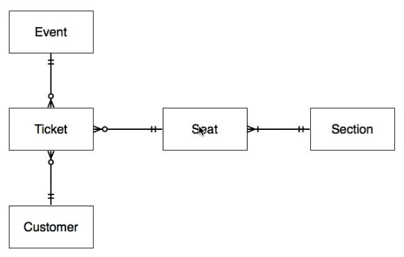

# LS180 - SQL Fundamentals Study Guide

## SQL
1. Identify the different types of `JOIN`s and explain their differences.

The different types of `JOIN`s are:
- INNER JOIN: It returns rows where the join condition is `true`.
- LEFT OUTER JOIN: It returns all rows from the `FROM` table and rows from the right table that meets the join condition. 
- RIGHT OUTER JOIN: It retains all rows from the right table and rows from the `FROM` table that meet the join condition.
- FULL OUTER JOIN: It returns all rows from an `INNER JOIN` and unmatched rows from both the left and right tables.
- CROSS JOIN: It is also called a CARTESIAN JOIN where each row from the `FROM` table is joined with all rows from the right table. It does not require `ON join_condition` since it returns all combinations.


2. Name and define the three sublanguages of SQL and be able to classify different statements by sublanguage.

The three sublanguages of SQL are Data Definition Language (DDL), Data Manipulation Language (DML) and Data Control Language (DCL). 
- DDL is used to defined the relation structure (schema) and rules. SQL constructs include `CREATE`, `DROP` and `ALTER`.
- DML is used to manipulate (Insert, Update, Delete, Select) values stored within relations.SQL constructs include `INSERT`, `UPDATE`, `DELETE` and `SELECT`.
- DCL is used to control access to the database. SQL constructs include `GRANT` and `REVOKE`.

3. Write SQL statements using INSERT, UPDATE, DELETE, CREATE/ALTER/DROP TABLE, ADD/ALTER/DROP COLUMN.

```sql
INSERT INTO table_name (col_name_a, col_name_b)
  VALUES (value_a1, value_b1),
         (value_a2, value_b2);

UPDATE table_name
  SET col_name = value [, col_name = value ...]
  WHERE condition;

DELETE FROM table_name
  WHERE condition;

CREATE TABLE table_name (
  colname type [constraint ...],
  colname type [constraint ...],
  ...
);

ALTER TABLE table_name
  ADD COLUMN col_name type [constraint],
  ALTER COLUMN col_name TYPE data_type,
  ADD CHECK (expression),
  ADD UNIQUE (col_name_a [, ...]),
  ADD PRIMARY KEY (col_name [, ...]),
  ADD FOREIGN KEY (col_name [, ...]) REFERENCES reference_table (ref_col [, ...]),
  ALTER COLUMN col_name SET NOT NULL,
  ALTER COLUMN col_name SET DEFAULT value,
  ALTER COLUMN col_name DROP CONSTRAINT constraint_name,
  DROP CONSTRAINT constraint_name,
  DROP COLUMN col_name;

DROP TABLE table_name;

DROP DATABASE database_name;
```

4. Understand how to use GROUP BY, ORDER BY, WHERE, and HAVING.

```sql
SELECT col_name_a, agg_function(col_name_b)
  FROM table_name
  WHERE condition
  GROUP BY col_name_a (or column that col_name_a depends on e.g. primary key)
  HAVING agg_function(col_name_b) conditional
  ORDER BY agg_function(col_name_b) DESC;
```

PostgreSQL evaluates in the following order:
- Returns the rows from `FROM` and `JOIN` clauses
- Filter rows according to `WHERE` condition
- Group rows according to `GROUP BY` clause
- Filter groups/aggregates according to `HAVING` clauses
- Evaluate elements in SELECT clause, including any functions
- Remove duplicates for `DISTINCT` clauses
- Sort results according to `ORDER BY` clause
- Filter result according to `LIMIT n` and `OFFSET n` clauses

When using `GROUP BY`, the non-aggregated elements in the SELECT clauses must either
be in GROUP BY or are functionally dependent on the column(s) in `GROUP BY` e.g. PRIMARY
KEY of table so that it is not possible for a group to have 2 different values.

- `WHERE` filters rows according to given condition
- `HAVING` is similar to `WHERE` but filters groups/aggregates instead of rows
- `ORDER BY` sorts the selected columns in either ASC or DESC order.
 
5. Understand how to create and remove constraints, including CHECK constraints

```sql
ALTER TABLE table_name
  ADD CHECK (expression),
  ADD UNIQUE (col_name_a [, ...]),
  ADD PRIMARY KEY (col_name [, ...]),
  ADD FOREIGN KEY (col_name [, ...]) REFERENCES reference_table (ref_col [, ...]),
  ALTER COLUMN col_name SET NOT NULL,
  ALTER COLUMN col_name SET DEFAULT value,
  ALTER COLUMN col_name DROP CONSTRAINT constraint_name,
  DROP CONSTRAINT table_constraint_name,
```

6. Be familiar with using subqueries

A subquery works by first using a nested query to generate a set of values 
to be used by the outer query. The nested query can be in the 
- `WHERE` clause

  ```sql
  SELECT title FROM books 
    WHERE author_id = (SELECT id FROM authors WHERE name = 'William Gibson');
  ```

- `FROM` clause in the form of virtual table which needs an alias, or

  ```sql
  SELECT MAX(bid_counts.count) FROM
    (SELECT COUNT(bidder_id) FROM bids GROUP BY bidder_id) AS bid_counts;
  ```

- `SELECT` clause also known as scalar subqueries. We can reference columns from the outer `SELECT` query within the subquery. A scalar subquery must only return 1 column and 1 row.

  ```sql
  SELECT name,
    (SELECT COUNT(item_id) FROM bids WHERE item_id = items.id)
   FROM items;
  ```

When subquery from `WHERE` clause returns more than 1 value, we can use subquery
expressions such as `IN`, `NOT IN`, `EXISTS` or { operator such as `=`, `>`, `<` } {`ANY`, `SOME` `ALL`} for comparison.


## PostgreSQL
7. Describe what a sequence is and what they are used for.

A sequence is a special type of relation that generates a series of contiguous numbers. Similar to generators in the Python programming language, it keeps track of the current number and allows one to retrieve the next number in sequence using the `nextval` function.

They are frequently use as surrogate keys in a table.


8. Create an auto-incrementing column.

```sql
CREATE TABLE table_name (
  id SERIAL
);
```

9. Define a default value for a column.

A default value for a column in a relation is the value a column will assume if no value
is provided during data insertion.

```sql
-- Creating Table
CREATE TABLE table_name (
  colname type DEFAULT value,
  ...
);

-- Altering table
ALTER TABLE table_name
  ALTER COLUMN colname SET DEFAULT value;
```

10. Be able to describe what primary, foreign, natural, and surrogate keys are.
- A primary key is a constraint in PostgreSQL that makes values in a column to be unique identifiers of each row in a table.
- A foreign key is a constraint in PostgreSQL that allows a row in a table to be associate with a row in another table. This is done by setting a column in one table as Foreign Key and having it reference another table's primary key column. A table can have 0 or more foreign keys. Join tables in M:M relationships have 2 foreign keys.
- A natural key is a natural occurring column or combination of columns in a dataset whose value(s) can uniquely identify a row.
- A surrogate key is a column of values that is specially created and not part of the original dataset to unique identify each row of data. We often use the `SERIAL` datatype or `colname type GENERATED ALWAYS AS IDENTITY` to create surrogate keys for relations.

11. Create and remove CHECK constraints from a column.

```sql
-- During table creation
CREATE TABLE table_name (
  ...,
  colname type CHECK (expression)
);

-- During table alteration
ALTER TABLE tablename
  ADD CHECK (expression),
  DROP CONSTRAINT constraint_name;
```

12. Create and remove foreign key constraints from a column.

```sql
-- During table creation
CREATE TABLE t1 (
  a integer PRIMARY KEY,
  b integer,
  c integer,
  FOREIGN KEY (b [, c]) REFERENCES other_table (c1 [, c2]) [ON DELETE CASCADE]
);

-- During table alteration
ALTER TABLE t1 
  ADD FOREIGN KEY (b [, c]) REFERENCES other_table (c1 [, c2]) [ON DELETE CASCADE];

ALTER TABLE t1
  DROP CONSTRAINT foreign_key_constraint_name;
```

## Database Diagrams
13. Talk about the different levels of schema.
We have 3 levels of schema, in increasing order of detail. They are:
- Conceptual: High level design focussed on identify the relations and their relationships
- Logical: An expanded version of conceptual diagram with details such as the fields and types in each relation.
- Physical: A RDMS specific detailed design that include rules such as constraints.

14. Define cardinality and modality.
- Cardinality identifies the number of instances on each end of the relationship between relations
- Modality determines if the relationship is required (1) or optional (0).

15. Be able to draw database diagrams using crow's foot notation.

**Example**\

