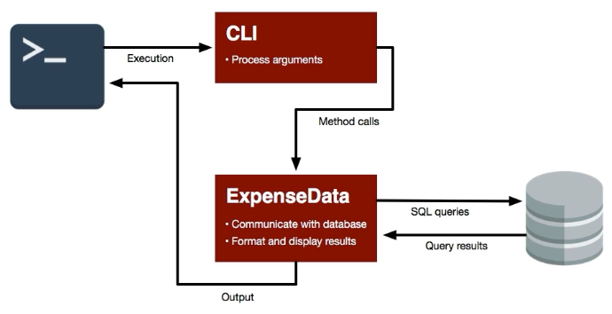
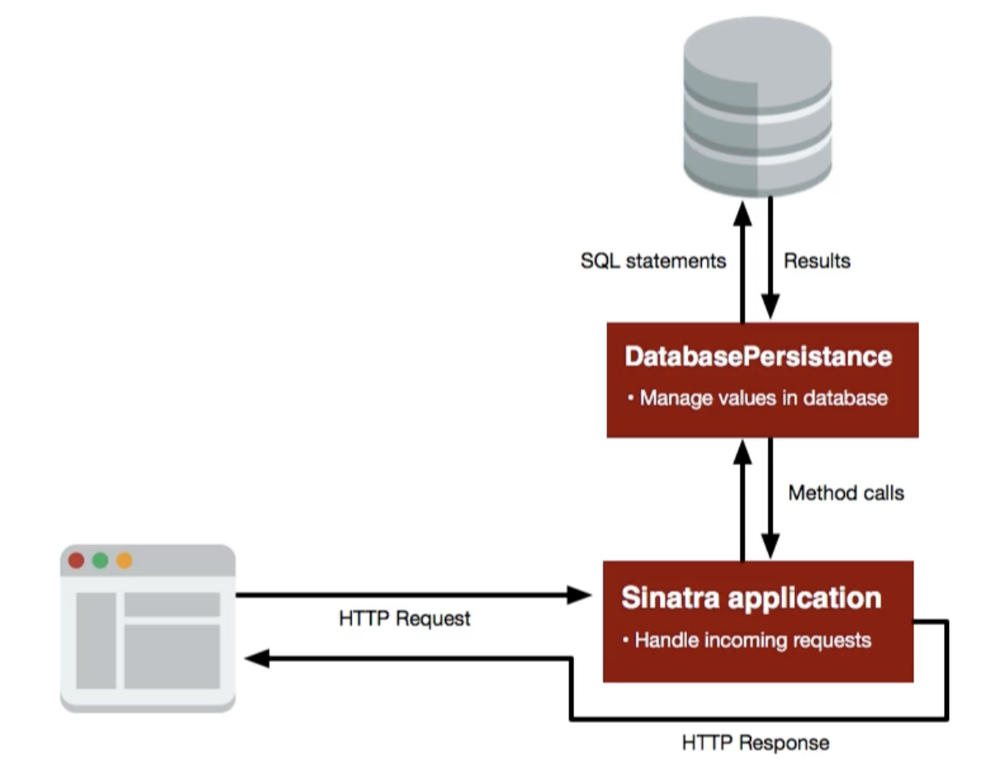

# Using SQL in Ruby Code

## Section Links
[Install `pg` Gem](#install-pg-gem)\
[Useful Commands](#useful-commands)\
[Database Applications](#database-applications)
- [Argument Parsing for Command Line Applications](#argument-parsing-for-command-line-applications)
- [Architecture Design](#architecture-design)
- [Create Tables Automatically](#create-tables-automatically)
- [Handle Parameter Safely](#handle-parameter-safely)
- [Logging](#logging)
- [Web App Deployment on Heroku](#web-app-deployment-on-heroku)
- [Query Optimisation](#query-optimisation)

---

## Install `pg` Gem
- To run SQL statements within Ruby, we need to install the `pg` gem as follows:
	- On OSX local machine, execute `gem install pg` in the terminal
	- On Cloud 9, we cannot directly install the `pg` gem on an Amazon Linux 2 environment. Doing so will result in the following error: 
	```plaintext
	$ gem install pg
	Building native extensions. This could take a while...
	ERROR:  Error installing pg:
	        ERROR: Failed to build gem native extension.
	
	    current directory: /usr/local/rvm/gems/ruby-2.6.3/gems/pg-1.1.4/ext
	/usr/local/rvm/rubies/ruby-2.6.3/bin/ruby -I /usr/local/rvm/rubies/ruby-2.6.3/lib/ruby/2.6.0 -r ./siteconf20190701-22274-ora9tz.rb extconf.rb
	checking for pg_config... yes
	Using config values from /usr/bin/pg_config
	checking for libpq-fe.h... no
	Can't find the 'libpq-fe.h header
	*** extconf.rb failed ***
	```
	- To fix it, we need to run the following two commands first before installing the gem
	```terminal
	$ sudo yum install postgresql postgresql-server postgresql-libs postgresql-contrib postgresql-devel
	```
	```terminal
	$ sudo amazon-linux-extras install postgresql14
	```

[Back to Top](#section-links)


## Useful Commands 
| Command | What It Does |
| --- | --- |
| `PG.connect(dbname: "a_database")` | Returns a new `PG::Connection` object connected to `a_database` |
| `connection.exec("SELECT * FROM table_name")` |  Executes the SQL query string and returns a `PG::Result` object |
| `result.values` | Returns an Array of Arrays containing values for each row in `result` |
| `result.fields` | Returns the names of columns as an Array of Strings |
| `result.ntuples` | Returns the number of rows in `result` |
| `result.each(&block)` | Yields a Hash of column names and values to the block for each row in `result` |
| `result.each_row(&block)` | Yields an Array of values to the block for each row in `result` |
| `result[index]` | Returns a Hash of values for row at `index` in `result` |
| `result.field_values(column)` | Returns an Array of values for `column`, one for each row in `result` |
| `result.column_values(index)` | Returns an Array of values for column at `index`, one for each row in `result` |
**Note**: all the values in the `result` object will be of the string type. They need to be converted to the appropriate type before handing over to the application code.

### Usage Examples
Import this [file](sql_files/films_7.sql) into a database before continuing. 
```terminal
createdb films
psql -d films < films7.sql
```

We will explore the common functions using `pry` since it allow us to also view requisite documentation within the interactive session.

**Connect to Database**
```terminal
$ pry
[1] pry(main)> require "pg"
=> true

[2] pry(main)> db = PG.connect(dbname: "films")
=> #<PG::Connection:0x0000000154458f80>

[3] pry(main)> show-method PG.connect

From: /Users/tom/.rvm/gems/ruby-2.7.2/gems/pg-1.4.5/lib/pg.rb:67:
Owner:#<Class:PG>
Visibility: public
Signature: connect(*args, &block)
Number of lines: 3

def self.connect( *args, &block )
  Connection.new( *args, &block )
end
```
- `PG#connect` returns a new `Connection` object that we use to execute SQL queries 
- We can use `show-method method_name` in pry to display the documentation

**Execute A Query**
```terminal
[4] pry(main)> result = db.exec("SELECT 1")
=> #<PG::Result:0x00000001548c4b50 status=PGRES_TUPLES_OK ntuples=1 nfields=1 cmd_tuples=1>

[5] pry(main)> ls result
Enumerable#methods: 
  all?            each_cons         flat_map  min_by        slice_when
  any?            each_entry        grep      minmax        sort      
  chain           each_slice        grep_v    minmax_by     sort_by   
  chunk           each_with_index   group_by  none?         sum       
  chunk_while     each_with_object  include?  one?          take     
  collect         entries           inject    partition     take_while
  collect_concat  filter            lazy      reduce        tally     
  count           filter_map        map       reject        to_a      
  cycle           find              max       reverse_each  to_h      
  detect          find_all          max_by    select        to_set    
  drop            find_index        member?   slice_after   uniq      
  drop_while      first             min       slice_before  zip       

PG::Result#methods: 
  []                field_values  num_tuples                  
  autoclear?        fields        oid_value                   
  check             fmod          paramtype                   
  check_result      fname         res_status                  
  clear             fnumber       result_error_field          
  cleared?          fsize         result_error_message        
  cmd_status        ftable        result_status               
  cmd_tuples        ftablecol     result_verbose_error_message
  cmdtuples         ftype         stream_each
```
- `Connection#exec` accepts a SQL string and returns a `PG::Result` object. 
- It is **optional** for SQL statement to be terminated with `;`
- We can see the methods available to `PG::Result` using `ls` in `pry`. Here, we see that it has included the Enumerable module as well since those methods are also available.

**Explore PG::Result Methods**
```terminal
[6] pry(main)> result = db.exec("SELECT * FROM films;")
=> #<PG::Result:0x00000001542eb148 status=PGRES_TUPLES_OK ntuples=10 nfields=6 cmd_tuples=10>

[7] pry(main)> result.values
=> [["1", "Die Hard", "1988", "action", "132", "1"],
 ["2", "Casablanca", "1942", "drama", "102", "2"],
 ["3", "The Conversation", "1974", "thriller", "113", "3"],
 ["4", "1984", "1956", "scifi", "90", "4"],
 ["5", "Tinker Tailor Soldier Spy", "2011", "espionage", "127", "5"],
 ["6", "The Birdcage", "1996", "comedy", "118", "6"],
 ["7", "The Godfather", "1972", "crime", "175", "3"],
 ["8", "12 Angry Men", "1957", "drama", "96", "7"],
 ["9", "Wayne's World", "1992", "comedy", "95", "8"],
 ["10", "Let the Right One In", "2008", "horror", "114", "4"]]
```
- `PG::Result#values` returns all values in a **nested array of strings**, no matter what is the original datatypes. **Take note to convert to the right datatype** before handing it the application code.

```terminal
[8] pry(main)> result.fields
=> ["id", "title", "year", "genre", "duration", "director_id"]
```
- `PG::Result#fields` returns the column names as an array of strings

```terminal
[9] pry(main)> result.ntuples
=> 10
```
- `PG::Result#ntuples` returns the number of rows in the result object. `result.values.size` will get the same result but has an extra step.

```terminal
[10] pry(main)> result.each do |tuple|
[10] pry(main)    puts "#{tuple["title"]} is released in #{tuple["year"]}"
[10] pry(main) end

Die Hard is released in 1988
Casablanca is released in 1942
The Conversation is released in 1974
1984 is released in 1956
Tinker Tailor Soldier Spy is released in 2011
The Birdcage is released in 1996
The Godfather is released in 1972
12 Angry Men is released in 1957
Wayne's World is released in 1992
Let the Right One In is released in 2008
=> #<PG::Result:0x00000001542eb148 status=PGRES_TUPLES_OK ntuples=10 nfields=6 cmd_tuples=10>
```
- `PG::Result#each` yields each row in the form of a hash to the block.

```terminal
[13] pry(main)> result.each_row do |row|
[13] pry(main)    puts "#{row[1]} is published in #{row[2]}"  
[13] pry(main) end  
Die Hard is published in 1988
Casablanca is published in 1942
The Conversation is published in 1974
1984 is published in 1956
Tinker Tailor Soldier Spy is published in 2011
The Birdcage is published in 1996
The Godfather is published in 1972
12 Angry Men is published in 1957
Wayne's World is published in 1992
Let the Right One In is published in 2008
```
- `PG::Result#each_row` yields each row in the form of an array to the block.

```terminal
[14] pry(main)> result[2]
=> {"id"=>"3", "title"=>"The Conversation", "year"=>"1974", "genre"=>"thriller", "duration"=>"113", "director_id"=>"3"}
```
- `PG::Result#[index]` accepts an **index representing a row** and returns it in a **hash**.

```terminal
[15] pry(main)> result.field_values("duration")
=> ["132", "102", "113", "90", "127", "118", "175", "96", "95", "114"]
```
- `PG:Result#field_values("col_name")` accepts a **column name** and returns all the row values in that column as an **array of strings**.

```terminal
[16] pry(main)> result.column_values(4)
=> ["132", "102", "113", "90", "127", "118", "175", "96", "95", "114"]
```
- `PG::Result#column_values(index)` accepts an **column index (starting at 0)** and returns all row values in that column as an **array of strings**.

[Back to Top](#section-links)


## Database Applications
### Argument Parsing for Command Line Applications
- Space delimited arguments passed to a command line script are stored in the `ARGV` array, one argument per element
```shell
$ ruby argf.rb --verbose file1 file2

ARGV  #=> ["--verbose", "file1", "file2"]
option = ARGV.shift #=> "--verbose"
ARGV  #=> ["file1", "file2"]
```

[Back to Top](#section-links)

### Architecture Design
- Separate code that handles HTTP/user request (Application) from those that retrieve and persist data (DataPersistence) into separate classes. Define a set of methods provided by the DataPersistence class to allow application to retrieve information from or make changes to database. 
	
	
	- [Command Line Application Example](https://github.com/cklim83/expense_tracker/blob/main/expense)
	- [Todos Example](https://github.com/cklim83/todos)

[Back to Top](#section-links)

### Create Tables Automatically
- In the initialization of DataPersistence class, we check for existance of required tables using the following:
	``` sql
	SELECT COUNT(*) FROM information_schema.tables 
	WHERE table_schema = 'public' AND table_name = 'your_table_name';
	```
- If those tables have not yet been created, the count be zero. We can then run a create table query to automatically create required tables in the backend.
	```ruby
	class ExpenseData
	  def initialize
	    @connection = PG.connect(dbname: "expenses")
	    setup_schema
	  end
	  
	  ...
	  
	  private
	  
	  def setup_schema
	    result = @connection.exec <<~SQL
	      SELECT COUNT(*) FROM information_schema.tables
	      WHERE table_schema = 'public' AND table_name = 'expenses';
	    SQL
	    
	    if result[0]["count"] == "0"
	      @connection.exec <<~SQL
	        CREATE TABLE expenses (
	          id serial PRIMARY KEY,
	          amount numeric(6, 2) NOT NULL CHECK (amount >= 0.01),
	          memo text NOT NULL,
	          created_on date NOT NULL
	        );
	      SQL
	    end
	  end
	end
	```

[Back to Top](#section-links)

### Handle Parameter Safely
- User inputs have to be properly sanitize/escaped before they are use in SQL queries. Manually interpolation of user inputs risk exposing our application to SQL injection attacks.
```ruby
def add_expense(amount, memo)
  date = Date.today
  sql = "INSERT INTO expenses (amount, memo, created_on) VALUES (#{amount}, '#{memo}', '#{date}')"
  CONNECTION.exec(sql)
end

add_expense(43.23, "', '2015-01-01'); DROP TABLE expenses; --")
```
Above statement is an example of a malicious SQL injection attack. It will cause the following SQL statements to be executed, resulting in the unintended deletion of table `expenses`.
```
INSERT INTO expenses (amount, memo, created_on) VALUES (43.23, '', '2015-01-01'); DROP TABLE expenses; --', '2022-12-01')**"**
```

- **`PG::Connection#exec_params` is a safer way to generate SQL** statements from user input values.  It will safely escape the input into a harmless string under `memo`.
```ruby
def add_expense(amount, memo)
  date = Date.today
  sql = "INSERT INTO expenses (amount, memo, created_on) VALUES ($1, $2, $3)"
  CONNECTION.exec_params(sql, [amount, memo, date])
end
```
```terminal
$ ./expense add 0.01 "', '2015-01-01'); DROP TABLE expenses; --"
$ ./expense list                                                

There is 1 expense.
  1 | 2022-12-01 |         0.01 | ', '2015-01-01'); DROP TABLE expenses; --
-------------------------------------------------------
Total                      0.01
```

[Unsafe version using #exec](https://github.com/cklim83/expense_tracker/tree/v0.1)
[Safe version using #exec_params](https://github.com/cklim83/expense_tracker/tree/v0.2)

[Back to Top](#section-links)

### Logging
- Sinatra provides a logger object we can use to log SQL queries or other messages for debugging purposes during code development
- We can pass the `logger` object when initializing a DatabasePersistence object to use it to log SQL queries.
```ruby
# app_name.rb
before do
  @storage = DatabasePersistence.new(logger)
end
```

```ruby
class DatabasePersistence
  def initialize(logger)
    @db = if Sinatra::Base.production?
            PG.connect(ENV['DATABASE_URL'])
          else
            PG.connect(dbname: "todos")
          end
    @logger = logger
  end

  def query(statement, *params)
    @logger.info "#{statement}: #{params}" # Printing query to console
    @db.exec_params(statement, params)
  end
  
  ...
end
```

[Back to Top](#section-links)

### Web App Deployment on Heroku

1. Follow [deployment steps](https://github.com/cklim83/launch_school/blob/main/notes/05_ls_175/03_deployment.md), specifically:
	- Specify version of Ruby in `Gemfile`
	- Add `puma` to the `Gemfile`
	- Run `bundle install`
	- Shift reloading under configure in `app_name.rb`
		```ruby
		configure(:development) do
		  require "sinatra/reloader"
		  also_reload "database_persistence.rb"
		end
		```
	- Add a `Procfile`
	- Verify everything is working using `heroku local`. If using Cloud 9 and firefox, select preview application to load the application in browser.

2. Update the code to open the database like this:
	```ruby
	@db = if Sinatra::Base.production?
	        PG.connect(ENV['DATABASE_URL'])
	      else
	        PG.connect(dbname: "your_database_name")
	      end
	```

3. Create an application on Heroku by running `heroku apps:create unique_app_name` within project's directory
	```terminal
	$ heroku apps:create xyzzy-rb180-todos
	Creating ⬢ xyzzy-rb180-todos... done
	https://xyzzy-rb180-todos.herokuapp.com/ | https://git.heroku.com/xyzzy-rb180-todos.git
	```

4. Enable PostgreSQL for your application on Heroku:
	```terminal
	$ heroku addons:create heroku-postgresql:hobby-dev -a xyzzy-rb180-todos
	Creating heroku-postgresql:hobby-dev on ⬢ xyzzy-rb180-todos... free
	Database has been created and is available
	 ! This database is empty. If upgrading, you can transfer
	 ! data from another database with pg:copy
	Created postgresql-asymmetrical-27376 as DATABASE_URL
	Use heroku addons:docs heroku-postgresql to view documentation
	```

5. If you have some code to create your database schema in `schema.sql`, you can try running the following command to do so:
	```terminal
	$ heroku pg:psql -a xyzzy-rb180-todos < schema.sql
	- -> Connecting to postgresql-asymmetrical-27376
	Pager usage is off.
	...
	```

	Make sure you're using the correct application name after the `-a` option. If, after confirming that you're using the correct name, you get the message `Couldn't find that app`, try running it without the application name:
	```terminal
	$ heroku pg:psql < schema.sql
	--> Connecting to postgresql-asymmetrical-27376
	Pager usage is off.
	...
	```

	If you need to set up your database schema manually, you can log into a psql shell on Heroku with:
	```terminal
	$ heroku pg:psql -a postgresql-asymmetrical-27376
	```
	
	As before, you can try running this command without the application name if it complains that it `Couldn't find that app`:
	```terminal
	$ heroku pg:psql
	```

6. We're using Heroku's hobby-dev PostgreSQL database plan, which only allows for a maximum of 20 open database connections at once. If we exceed this limit, then our application will throw an error. Add the following code into your application to ensure that you don't exceed that 20 connection limit.
	```ruby
	after do
	  @storage.disconnect
	end
	```

	```ruby
    def disconnect
	  @db.close
    end
	```
    
7.   Commit any changes you made above.
    
8.  Deploy the application to Heroku using:
	```terminal
	$ git push heroku main
	```

	If you're working on a branch other than `main`, you'll need to use its name in this command instead. For instance, if you're using the `master` branch, use the command `git push heroku master`.

	You may get the following error message on the `git push heroku main` command:
	```plaintext
	fatal: 'heroku' does not appear to be a git repository
	fatal: Could not read from remote repository.
	```

	If that happens, you can run the following command (be sure to use the appropriate app name instead xyzzy-rb180-todos):
	```terminal
	$ heroku git:remote -a xyzzy-rb180-todos
	```

	After running that, try `git push heroku main` again.

[Back to Top](#section-links)

### Query Optimization
- We start by building an application using generalized queries.
- Then we observe if there are performance issues that can be optimized:
	- N+1 queries where we have nested queries: e.g. fetching a main list, then items nested within each element in that list.
- We optimise by make queries more specialize to:
	1. Reduce number of queries required to satisfy each HTTP request
	2. Reduce loading of unneccessary fields
	3. Offloading some functions that are more efficiently performed by the database then in ruby code. For example, instead of fetching all items and then do the count in `app.rb`, we use do the counting the in SQL query directly.

[Todos App Example](https://github.com/cklim83/todos/commit/cd1ec0913f0d86be7786dce173a08491ab326710)

[Back to Top](#section-links)