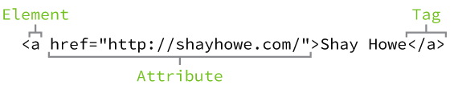
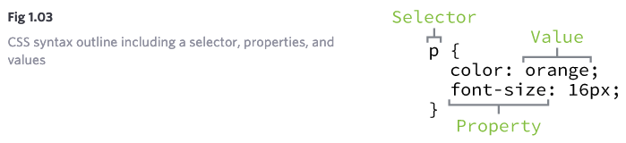
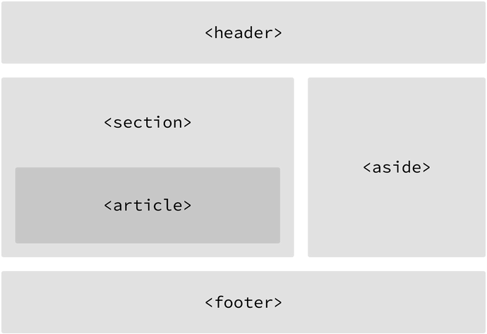
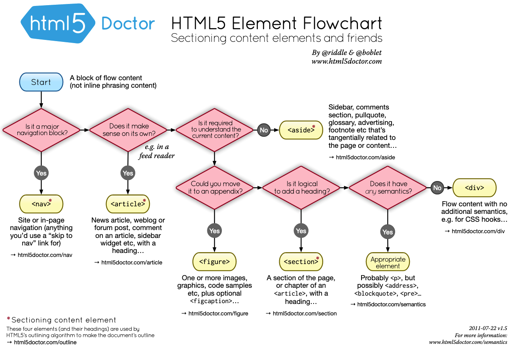

# Introduction to HTML and CSS

## Section Links


## What Are HTML and CSS
- _HTML_, or HyperText Markup Language, defines the **structure and content** of a webpage 
- _CSS_, or Cascading Style Sheets, is a presentation language used to **style the appearance** of that content.
- The two languages are generally independent of one another and should be kept so: CSS should not be written in an HTML document and vice versa.

## Common HTML Terminologies
### Elements 
- Elements are designators that define the structure and content of objects within a page. 
- Common elements include headings (`h1` to `h6`), paragraphs (`p`), anchors (`a`), and others such as `div`, `span`, `em` and `strong`. 

### Tags
- The use of less-than and greater-than angle brackets around an element e.g. `<p>` creates a _tag_. 
- Tags most commonly occur in pairs of opening and closing tags. An opening tag marks the beginning of an element while a closing tag marks the end of an element. The content that falls between the opening and closing tags is the content of the element. An example of anchor tags is as follows:
	```html
	<a> ... </a>
	```

- Some elements only uses **self-closing** tags. Examples include:
	```html
	<br>
	
	<meta>
	<input>
	```

### Difference between HTML Element and Tag
- An HTML tag consists of an element name wrapped within angle brackets i.e. `<element name>`. We can have 
	- An opening tag `<p>`, 
	- A closing tag `</p>` or 
	- A self-closing tag `<br>`.
- An HTML element is either:
	- opening tag + content + closing tag e.g. `<h1>Hello</h1>`  or
	- self-closing tag e.g. ``

### Attributes
- Attributes are **properties** providing more information about an element. 
- Some attributes are **common to all elements**. The `id` attribute which identifies an element and the `class` attribute which classifies an element are examples.
- Other attributes are **only applicable to specific elements**. For example, a `src` attribute is used to specify the source of embedded content used in an `img` element while a `href` attribute is used to provide a hyperlink reference to a linked resource for an anchor element. 
- Attributes are **defined within the opening tag**, after the element's name. The format consists of the attribute name, followed by an equal, then the attribute value. `<a href="http://google.com/">Google</a>`

|  |
| :--: |
| <b>HTML syntax showing an element, attribute and tag.</b> Source: [ShayHowe](https://learn.shayhowe.com/html-css/building-your-first-web-page/) |

## HTML Document Structure
- HTML are **plain text** documents saved with an `.html` file extension.
- All HTML documents require the following declaration and elements:
	- `<!DOCTYPE html>`: This is placed at the start of the document and inform web browsers the version of HTML being used. `<!DOCTYPE html>` simply means we are using the **latest version** of HTML.
	- `<html>`: The html element follows the document type declaration and signifies the start of the document.
	- `<head>`: Inside the `<html>` element, this element identifies the top of the document and contains the document title (displayed on the title bar of the browser tab), links to any external file or relevant metadata (e.g. character encoding).
	- `<body>`: This element follows the `<head>` element within the `<html>` element. It holds all the visible content within the web page.

	```html
	<!DOCTYPE html>
	<html lang="en">
	  <head>
	    <meta charset="utf-8">
	    <title>Hello World</title>
	  </head>
	  <body>
	    <h1>Hello World</h1>
	    <p>This is a web page.</p>
	  </body>
	</html>
	```

## Common CSS Terminologies
### Selectors
- A selector allow us to **specify element or a group of elements** within a HTML document to apply styles (such as color, size and position).
- A selector may include a **combination of qualifiers**, based on the specificity required, to select elements. These may be an **attribute value** e.g. `id` or `class` value **or a specific type of element** such as `<h1>` or `<p>` or their combination.
- Within CSS, selectors are followed by curly brackets `{}` which contain the styles to be applied to those selected elements.
	```css
	p {...}  # selector targeting all <p> elements
	```

### Properties
- Once an element is selected, a property determines the style that will be applied to that element
- Property names are housed in curly braces `{}` that follows a selector. They are preceded by a colon `:`. Common properties include `background`, `color`, `font-size`, `height` and `width`.
	```css
	p {
	  color: ...;
	  font-size: ...;
	}
	```

### Values
- Values are the texts that follows property names. They determine the look and feel of a html element.

	```css
	p {
	  color: orange;
	  font-size: 16px;
	}
	```

|  |
| :--: |
| <b> CSS syntax showing a selector, properties and values.</b> Source: [ShayHowe](https://learn.shayhowe.com/html-css/building-your-first-web-page/) |

## Selectors
### Type Selectors
Type selectors target elements by their element type
```css
div { ... }
```

```html
<div> ... </div>
...
<div> ... </div>
```

### Class Selectors
- Class selectors allow us to select an element based on the element's class attribute value.
- Class selectors are more specific that type selectors in that they select a particular group of elements rather than all elements of a type.
- Class selectors allow different element types of the same class to have the same style.
- In CSS, classes are **denoted by a leading period `.`** followed by the class attribute value.
	```css
	.awesome { ... }
	```

	```html
	<div class="awesome"> ... </div>
	<p class="awesome"> ... </div>
	```

### ID Selectors
- ID selectors are even more precise than class selectors. They target only one unique element at a time by using the element's id attribute value as a selector.
- `id` attribute values can **only be used once per page**. They should be reserved for significant elements.
- ID selectors are denoted by a leading hash sign `#` followed by the id attribute value.
	```css
	#shayhowe { ... }
	```

	```html
	<div id="shayhowe">...</div>
	```

### Other Selectors
There are many [advanced selectors](https://learn.shayhowe.com/advanced-html-css/complex-selectors/) available for exploration and use. Some examples include:
- [:nth-of-type](https://developer.mozilla.org/en-US/docs/Web/CSS/:nth-of-type), [:first-of-type](https://developer.mozilla.org/en-US/docs/Web/CSS/:first-of-type), [:last-of-type](https://developer.mozilla.org/en-US/docs/Web/CSS/:last-of-type)
- [:nth-child](https://developer.mozilla.org/en-US/docs/Web/CSS/:nth-child), [:first-child](https://developer.mozilla.org/en-US/docs/Web/CSS/:first-child), [:last-child](https://developer.mozilla.org/en-US/docs/Web/CSS/:last-child)
- The difference between `nth-of-type` and `nth-child` is the former is more specific, only matching element of a specific type while the latter match any element, even those that are not of the type before the colon.
```html
<article>
  <h1>Nutrition</h1>
  <p>Serving Size 2/3 cup</p>
  <p>Servings Per Container</p>
</article>
```

```css
article p:nth-child(2) {
  /* 
  Selects the second child of
  article i.e. Serving Size 2/3 
  */
}

article p:nth_of_type(2) {
  /*
  Selects the second child of type p
  i.e. Servings Per Container 
  */
}
```

- [+](https://developer.mozilla.org/en-US/docs/Web/CSS/Adjacent_sibling_combinator) **adjacent sibling combinator** separates two selectors and matches the second element only if it _immediately_ follows the first element, and both are children of the same parent element.
	```css
	/* Paragraphs that come immediately after any image */
	img + p {
	  font-weight: bold;
	}
	```


## Referencing CSS
- To get CSS to talk to HTML, we need to reference our CSS file within our HTML. The best way to do this is by including all our styles in a **single external style sheet** and reference this within the `<head>` element. Note: CSS can also be used inline with HTML or in an internal document but that mixes HTML and CSS together, which is not recommended.
- Our `.css` file should be saved within the same folder, or a subfolder. where our HTML file is located.
- A `<link>` element is used to define the relationship between the HTML and CSS file. We use a `rel` attribute with value of `stylesheet` to specify the relationship. A `href` (hyperlink reference) attribute is use to identify the path of the `.css` file **relative** to that of the `.html` file. The example below assumes the css file is nested within stylesheets folder that is in the same directory as the html file. Reference from the root i.e. `/...` could also be used.
	```html
	<head>
	  <link rel="stylesheet" href="stylesheets/main.css">
	</head>
	```

## CSS Resets
- Every browser has its own default styles for rendering different elements. To ensure a html renders the same across all browsers, CSS resets are used to apply a unified style for all common HTML elements.
- As CSS cascades from top to bottom, with the bottom overriding the top. Hence a reset should be placed at the top of the style sheet. There are multiple reset options, [Eric Meyer's reset](meyerweb.com/eric/tools/css/reset/) is a popular choice.


# Getting to Know HTML
## Semantics Overview
Semantics in HTML involves giving content on the page **meaning and structure** by using the proper element.

## Block and Inline Elements
- Block-level elements **begin on a new line**. They **occupy the entire width** regardless of the amount of content and are **stacked on top of one another**. Block-level elements **can nest inside one another** and also **wrap inline-line elements**. These elements are usually used for larger pieces of contents, like paragraphs. 
- Inline-level elements **do not begin on a new line** but **line up alongside the preceding** one. They **occupy a width equivalent to their contents**. Inline-level elements can nest inside one another but cannot wrap block-level elements. These elements are usually used for smaller pieces of contents e.g. a few words.

## Divisions and Spans
- `<div>` and `<span>` are the only HTML elements that **does not confer semantic meaning** on their contents. They are used purely as **containers for styling purposes**. 
- `<div>` is a **block-level** element to group larger amount of content for styling.
- `<span>` is a **inline-level** element to group smaller amount of text within a block-level element.
- `class` and `id` attribute **values** in `<div>` and `<span>` should be chosen based on the **content** of an element and not their intended appearance since the latter is subjected to change but the former is not.
```html
<!-- Division -->
<div class="social">
  <p>I may be found on ...</p>
  <p>Additionally, I have a profile on ...</p>
</div>

<!-- Span -->
<p>Soon we'll be <span class="tooltip">writing HTML</span> with the best of them.</p>
```

## Text Based Elements
### Headings
- `<h1>` to `<h6>` are **block level** elements that represent **6 levels of section headings**
- They are used as **headings in sections** and should **not be used to make text bold or big**. If intent is to make normal text bigger or bolder, use CSS `font-size` and `font-weight` instead. 
	```html
	<h1>Heading Level 1</h1>
	<h2>Heading Level 2</h2>
	<h3>Heading Level 3</h3>
	<h4>Heading Level 4</h4>
	<h5>Heading Level 5</h5>
	<h6>Heading Level 6</h6>
	```

### Paragraphs
- Paragraphs are block-level elements
- They often follow headings and defined using `<p> ... </p>` tags.

### Bold Text
- `<strong>` **in-line level** element bolds content to emphasize **strong importance**
- `<b>` element is semantically used to **stylistically offset text** used to **bring attention** to its contents. It is suitable for keywords, product names etc
```html
<!-- Strong importance -->
<p><strong>Caution:</strong> Falling rocks.</p>

<!-- Stylistically offset -->
<p>This recipe calls for <b>bacon</b> and <b>baconnaise</b>.</p>
```

### Italize Text
- `<em>` **inline-level** element is to place **stressed emphasis** on its content.
- `<i>` is to represent **alternative voice or tone** on its content, similar to a quotation mark
```html
<!-- Stressed emphasis -->
<p>I <em>love</em> Chicago!</p>

<!-- Alternative voice or tone -->
<p>The name <i>Shay</i> means a gift.</p>
```

## Building Structure
- The structure of web pages used to be built using `<div>`. Since these are just containers without semantic value, it is difficult to determine the intentions of each division.
- HTML5  introduced new **structural block-level elements** with semantics to give meaning to a page structure.



### Header
- The `<header>` element outlines the heading segment of a page. 
- This should **not be confused** with both `<head>` or headings `<h1> ... <h6>` elements.

### Navigation
- The `<nav> ... </nav>` element identifies a **section of primary navigation links**.
- Links within `<nav>` element will link to other parts of the same page or other pages within the same website. Miscellaneous one-off link should use anchor elements `<a>` and not be wrapped within `<nav>`.

### Article
- The `<article> ... </article>` element identifies a **section of independent, self-contained content** that can be extracted and placed elsewhere e.g. an email or another website and read without confusion.

### Section
- The `<section> ... </section>` element identifies a thematic **grouping of related content** that usually includes a heading.
- It is commonly used to breakup and provide hierachy to a page.

### Deciding Between `<article>`, `<section>` or `<div>`
- As `<article>` and `<section>` has structural meaning to outline a page, if the content is solely group for styling reasons, use `<div>` as it has no structural meaning.
- If content adds to document outline and can be independently redistributed, use `<article>`.
- If content adds to document outline and represents a thematic grouping of related content, use `<section>`

### Aside
- `<aside> ...</aside>` is block-level element that holds contents such as sidebars or inserts of brief explanations that are **tangentially related** to the content surrounding it.

### Footer
`<footer> ... </footer>` is a block-level element that identifies the end of a page, article, section or segments of a page. The content it contains should be relative information and not diverge from the section it is included in.

|  |
| :--: |
| <b>HTML5 semantic elements usage guide. </b>Source: [HTML5Doctor](http://html5doctor.com/downloads/h5d-sectioning-flowchart.pdf) |

## Creating Hyperlinks
- Hyperlinks are created using the anchor `<a>` **inline-level** elements. They contain the `href` hyperlink reference attribute that identifies the destination of that link.
- Since anchors are inline elements, they are originally not supposed to wrap block elements. However since HTML5, they are **now allowed to wrap block elements** so content blocks can now be links.

### Relative & Absolute Paths
- Links to other pages on the **same website** will have _relative paths_ in their `href` attribute
- Links to **other websites** requires an _absolute path_. This include the url scheme and the domain name.
```html
<!-- Relative Path -->
<a href="pages/about.html">About</a>

<!-- Absolute Path -->
<a href="http://www.google.com">Google</a>
```

### Linking to Email
- An `email` link will open up a user's default email client and pre-populate the recipient's email address and any enclosed parameters. To do that the `href` attribute need to be given an **email address prepended with `mailto:`**
- Subject lines and message body are optional parameters `subject=` and `body=`  that we can add in a syntax similar to query strings in URLs. Certain characters have to be encoded.
```html
<a href="mailto:shay@awesome.com?subject=Reaching%20Out&body=How%20are%20you">Email Me</a>
```

### Opening Links In a New Window
- Clicking on a hyperlink will load the new page in current window by default.
- To open a link in a new window, we add a `target="_blank"` attribute value to the anchor element. `target` specify where the link will be display while `_blank` value indicates a new window.
```html
<a href="http://shayhowe.com/" target="_blank">Shay Howe</a>
```

### Linking to Parts of the Same Page
- We can create an on-page link by setting an `id` attribute on an element we wish to link to, then use the value of the `id` attribute prepended with `#` within an anchor element's `href` attribute.
```html
<body id="top">
  ...
  <a href="#top">Back to top</a>
  ...
</body>
```

# Getting to Know CSS
## The Cascade
- Within CSS, all styles in stylesheet **cascade from the top to the bottom**, i.e. styles specified lower in the stylesheet will take precedence and override those at the top. In the example below, all `<p>` elements will have `green` background and font-size of `24px` due to the cascading property.
	```css
	p {
	  background: orange;
	  font-size: 24px;
	}
	
	p {
	  background: green;
	}
	```

- Cascading property also apply **within** a selector. Below, all `<p>` elements will have `green` background.
	```css
	p {
	  background: orange;
	  background; green;
	}
	```

## Calculating Specificity
- Ranking of specificity weight: **`id` (`1-0-0`) > `class` (`0-1-0`) >`type` (`0-0-1`)**.
- Selectors with **higher specificity weight** will determine the final style of an element, regardless of the relative position in the cascade. Hence, in below example, the specific `<p>` element in the HTML will have `green` background even though the type selector is lower down the stylesheet.
```html
<p id="food">...</p>
```
```css
#food {
  background: green;
}

p {
  background: orange;
}
```

## Combining Selectors
- We can **combine selectors to be more specific** which element or groups of elements to select.
- When selectors are combined, they should be read from **right to left**. The selector **furthest right** and closest to the curly bracket is known as the **key selector**. It identifies the element(s) the styles should be applied to. Any selector to the left of the key selector are known of **prequalifier**.
	```html
	<div class="hotdog">
	  <p>...</p>
	  <p>...</p>
	  <p class="mustard">...</p>
	</div>
	```
	```css
	/* select <p> element within element of hotdog class */
	.hotdog p {
	  background: brown;
	}
	
	/* select p element of mustard class within element of hotdog class */
	.hotdog p.mustard {
	  background: yellow;
	}
	```
- `.hotdog p` consists of two selectors separated by a space. The key selector targets `p` elements prequalified with class selector `.hotdog`. Hence combined selector will only select paragraph elements residing within an element with class attribute value of `hotdog`
- `.hotdog p.mustard` consists of three selectors. `mustard` is the key selector while `hotdog` and `p` are prequalifiers. The **presence or absence of space between selectors make a great difference**. As there is no space between `p` and `mustard` class selector, `p.mustard` only select `p` elements with the class attribute value `mustard`. Continuing left, these `p` elements must reside in elements with class attribute value of `hotdog`. 
- If `p` is removed and selector becomes `.hotdog .mustard`, the combined selector will select any elements of `mustard` class that are within elements of `hotdog` class. This would have selected the same `<p>` element above and is considered better practice since we **generally want to select any element of a given class and not just one type of element**.
- When selectors are combined, their specificity weight is also combined along the respective category of `id-class-type`. `.hotdog p` has a specificity weight of `0-1-1` while `.hotdog p.mustard` has a higher specificity weight of `0-2-1`. Hence, even if the relative order in the stylesheet is swapped, with `.hotdog p.mustard` appearing nearer the top, the appearance of their style will not change.
- We can select elements that are **direct descendents** of an element using the child combinator `>`. Elements matched by the second selector must be the immediate children of elements matched by the first selector. This is stricter then the descendents combination (i.e. a space), which matches all elements matched by the second selector for which there exists an ancestor element matched by the first selector, regardless of the number of "hops" up the DOM.
	```css
	/* List items that are children of the "my-things" list */
	ul.my-things > li {
	  margin: 2em;
	}
	```

## Multiple Selectors
- The `,` separator is used when including multiple selectors for a style.
	```css
	a:hover,
	a:focus {
	  ...
	}
	```

## Layering Styles with Multiple Classes
- Using multiple classes on an element, we can layer multiple styles on it using multiple low specificity selectors.
- Each class value should be separated by a space.
	```html
	<a class="btn btn-danger">...</a>
	<a class="btn btn-success">...</a>
	```
	```css
	.btn {
	  font-size: 16px;
	}
	
	.btn-danger {
	  background: red;
	}
	
	.btn-success {
	  background: green;
	}
	```

## Common CSS Property Values
### Colors
- Color values in CSS are defined using sRGB (standard Red, Green and Blue). We can represent sRGB colors in 4 ways:
	- [keywords](https://www.w3.org/TR/css-color-3/#html4)
	- hexadecimal
	- RGB or RGBa. Range for Red, Green and Blue GB are from `0-255`. Range for transparency is from `0` (fully transparent) to `1` (fully opaque) 
	- HSL and HSLa. HSL stands for Hue, Saturation and Lightness. H ranged from `0 - 360` for different colors, S range from `0%` for grayscale to `100%` for full saturation and L range from `0%` for black to `100%` for white). Like in RGBa, opacity range from `0` to `1`.
	```css
	.task {
	  background: maroon;
	  background: #800000;
	  background: rgb(128, 0, 0);
	  background: rgba(128, 0, 0, .25);
	  background: hsl(0, 100%, 25%);
	  background: hsla(0, 100%, 25%, .25);
	}
	
	.count {
	  background: yellow;
	  background: #ff0;
	  background: rgb(255, 255, 0);
	  background: rgba(255, 255, 0, 1);
	  background: hsl(60, 100%, 50%);
	  background: hsla(60, 100%, 50%, 1);
	}
	```

### Lengths
- Absolute length:
	- Pixels. 1 pixel is 1 / 96 of an inch. Due to varying screen sizes, absolute measurement has become last popular as it is less flexible.
- Relative Length:
	- Percentages: The length is defined in relative to the length of the element's parent. 
	- `em`: The length is calculated based on an element's font size. `1em` is equivalent to the current element's font size. If a current element has a font size of 14px, `5em` is equivalent to `70px`. If the font size of an element is not stated, the `em` unit will be relative to the font size of the closest parent element with stated font size.
	```css
	.col {
	width: 50%;
	}
	
	.banner {
	  font-size: 14px;
	  width: 5em;
	}
	```

## Creating the HTML Skeletion
```html
<!DOCTYPE html>
<html lang="en">
<head>
  <title>your page title goes here</title>
  <meta charset="utf-8">
</head>
<body>
</body>
</html>
```
- `<!DOCTYPE html>` is the **Document Type Definition**, also known as **DTD** or **DOCTYPE**. It tells the browser which specific markup language to expect (XML being another type) and the version used. If version is not specified, the latest HTML5 is assumed.
- `html` element encloses the entire HTML document. The optional `lang=en` attribute informs the browser it uses the English language for text.
- The `head` element contains elements that provides meta-information that are not displayed in a page
	- `title` element for display on the browser tab
	- `<meta charset="utf-8>"` informing the browser that the page uses UTF-8 character encoding
- The `body` element that encloses all content that are rendered in the browser content area.
- We use 2 spaces to indent tags.

## Classes, IDs and Names
- HTML provides 3 way to identify elements: `class`, `id` and `name` attributes
- `class` and `id` are available to any element but `name` is only available to certain elements.
	```html
	<input type="submit" name="save" id="save-button" class="default-button">
	```
- `class` and `id` are used as selectors for CSS styling but **`name` is typically not used for styling but together with its value are sent to server as parameters**. 

### Classes
```html
<table>
  <tbody>
    <tr class="teaching-assistant">
      <td>Elizabeth</td>
      <td>JS230</td>
    </tr>

    <tr>
      <td>Nancy</td>
      <td>RB101</td>
    </tr>

    <tr>
      <td>Joe</td>
      <td>RB120</td>
    </tr>

    <tr class="teaching-assistant">
      <td>Pete</td>
      <td>JS225</td>
    </tr>

    <tr>
      <td>Kim</td>
      <td>LS202</td>
    </tr>
  </tbody>
</table>
```
```css
tr {
  background-color: lime;
  font-size: 200%;
}

.teaching-assistant {
  background-color: yellow;
}
```
- The `class` attribute identifies a **set of elements** we wish to apply the same style.
- Any number of elements can belong to the same class.
- An element can belong to one or more classes, separated by space in the value of the class attribute e.g. `class=executive management full-time`.
- Class names should be semantic i.e. confer meaning rather than the style they will take on.
- CSS class selectors have a dot prefix i.e. `.classname`
- Class selectors have lower CSS specificity that ID selectors but higher than tag/type selectors.

### IDs
```html
<h1>This is a plain h1 heading</h1>
<h1 id="headline">This is my headline</h1>
```
```css
#headline {
  color: red;
  font-size: 48px;
}
```
- The `id` attributes applies a **unique identification string** to an element; no other `id` attribute on that page can have the same ID. 
- Each element can have **one or no** ID.
- ID names should be semantic e.g. opt for ID name of `headline` rather than `big-font`.
- CSS ID selectors have a `#` prefix i.e. `#id-name`
- ID selectors have the higher CSS specificity than both class and tag selectors. They are useful for selecting a particular element for styling due to their high specificity.

### Names
```html
<form method="get" action="#">
  <label for="first-name-field">First name:</label>
  <input type="text" name="first-name" id="first-name-field" />

  <label for="last-name-field">Last name:</label>
  <input type="text" name="last-name" id="last-name-field" />

  <input type="submit" value="Search" />
</form>
```
- The `name` attribute tie form elements to data on the server.
- When a form is submitted, these parameters are either sent as an URL query string (`?first-name=Joe&last-name=Jones`) if the action is a `get` method or in the HTTP request body if the action is a `post` method.
- Either way, we can then use `params[:name_value]` to retrieve the submitted value in the backend application code.
- Always use `name` attribute to assign a name to a form data element. The server will then use this name as a key to retrieve the relevant form value.
- Not all tags accept  the `name` attribute; it applies to only **input controls** in forms. Other elements may have a `name` attributes, but they have different meaning.
- Each **name** in a form should be **unique to that form** except for radio buttons and checkboxes that belong to a single group.
- For values of name attributes, use **descriptive rather than semantic values** e.g. `use name="last-name"` rather than `name="input-field"`
- **Avoid** trying to select elements in CSS using the `name` attribute

Note: the **value for a `for` attribute must be the `id` value of the form element the label element is associated with**. Since the browser does not send the `id` attribute value to the server, it is accepted practice to use both a `name` and `id` on form elements and have them take on the same value. 

## Inline, Internal and External CSS
- There are three ways to apply CSS to a web page:
	- **Inline**: CSS uses the **style attribute** in each HTML tag
	- **Internal**: CSS uses the **style element** within the head element of a HTML
	- **External**: CSS stores the CSS in a separate `.css` file. A html file then references it using the `<link rel="stylesheet" href="path_to_css_file">`

### Inline CSS
Inline CSS involves adding a `style` attribute to apply CSS styling to a single element identified by the tag.
```html
<p>
  Welcome to my website! It's a work in progress as I learn
  <strong style="color: blue; text-decoration: underline;">HTML</strong>
  and <strong>CSS</strong> from a <em>terrific</em> class I'm taking at
  <a href="https://launchschool.com">Launch School</a>. I'm learning a lot! Why
  don't you join me?
</p>
```

| Benefits | Disadvantages |
| --- | --- |
| The style is applied one at a time, directly to the HTML element we choose to style | Tedious and error prone |
|   | Mixes presentation information with content |

### Internal CSS
All style information is consolidated within `<style> ... </style>` element that is nested within the `<head>` element of the HTML
```html
<head>
  <title>Welcome!</title>
  <meta charset="utf-8" />
  <style>
    strong {
      color: blue;
      text-decoration: underline;
    }
  </style>
</head>
```

| Benefits | Disadvantages |
| --- | --- |
| Style and HTML are consolidated in one HTML document, making it convenient to access both in one place | Style can only be used in one HTML and not shared across |
| Use of CSS selectors for styling is more efficient and scalable |   |

### External CSS
This involves placing CSS in a separate file and identifying that file as a stylesheet with a `<link>` tag to tell the browser it should load CSS style information from an external file located on the server. The `link` tag is nested within the `<head>...</head>` element.
```html
<!DOCTYPE html>
<html lang="en-US">
  <head>
    <title>Welcome!</title>
    <meta charset="utf-8">
    <link rel="stylesheet" href="my.css">
  </head>
  <body>
  </body>
</html>
```

| Benefits | Disadvantages |
| --- | --- |
| Clear separation of style and content | Some inconvenience having to reference two files |
| A stylesheet can be use to style multiple HTML pages |   |

## Using Chrome Inspector
- We can use a tool called the **Inspector** that is part of the **Developer Tools** umbrella in Chrome to view what styles an element on a page uses and how it got those styles. We can even change them temporarily and see the effects.
- We open the tools by right-clicking any page element and select Inspect.
- Read the [documentation](https://developers.google.com/web/tools/chrome-devtools/), starting with [Get Started With Viewing And Changing The DOM](https://developers.google.com/web/tools/chrome-devtools/dom/) section. See the [Chrome Devtools Documentation](https://developer.chrome.com/docs/devtools/) for information on how to configure the docking state of the Tools.
- The documentation talks about **DOM nodes** or **nodes**. We can view them as another way to refer to HTML elements.

## HTML and CSS Style Guide
### HTML Style
- Avoid cramming more than two elements on a single line.
	```html
    <!-- Legal but hard to read -->
    <nav><ul><li>Home</li><li>Sign Up</li><li>Log In</li><li>Log Out</li></ul></nav>
    
    <!-- Good -->
    <nav>
      <ul>
        <li>Home</li>
        <li>Sign Up</li>
        <li>Log In</li>
        <li>Log Out</li>
      </ul>
    </nav>
    
    <!-- Acceptable, but a bit hard to read -->
    <li><a href="home.html">Home</a></li>
    <a href="home.html"></a>
    ```
    
-   Indent nested tags by two spaces, four spaces, or hard tabs. (Be consistent.)
	```html
    <!-- Legal but hard to read and maintain -->
      <section>
    <blockquote>
    the quote
                </blockquote>
    </section>
    
    <!-- Easier to read, but doesn't reveal structure -->
    <section>
    <blockquote>
    the quote
    </blockquote>
    </section>
    
    <!-- Good -->
    <section>
      <blockquote>
        the quote
      </blockquote>
    </section>
    ```
    
-   Don't indent the `<html>` tag.
	```html
    <!-- Legal, but non-standard -->
    <!DOCTYPE html>
      <html lang="en-US">
        <!-- rest of HTML -->
      </html>
    
    <!-- Okay -->
    <!DOCTYPE html>
    <html lang="en-US">
      <!-- rest of HTML -->
    </html>
    ```
    
-   Avoid `/` in **self-closing** tags (`<br >`, ``, etc.). But if we choose to use it, be consistent.
	```html
    <!-- Good -->
    <br>
    

    <!-- Good -->
    <br />
    
    
    <!-- Inconsistent (bad) -->
    <br>
    
    ```
    
-   When using Flex or Grid (we'll talk about these later), consider placing the most significant content blocks near the top of the file, and the least important at the bottom.
    

## CSS Style
-   Don't put more than one property on the same line.
	```css
    /* Legal but hard to read and maintain */
    p {
      background-color: yellow; border: 3px dashed #888; color: red;
    }
    
    /* Okay */
    p {
      background-color: yellow;
      border: 3px dashed #888;
      color: red;
    }
    ```
    
-   An exception to the above rule occurs when using **fallbacks**. To support older browsers, CSS developers must sometimes provide two or more different values for a property; one that applies to contemporary browsers, and another for older browsers. You can list fallbacks on the same line to show when you are using one:
	```css
    p {
      background-color: yellow;
      color: red;
      width: 50%; width: 50vw; /* fallback to 50% if 50vw not recognized */
    }
    ```
    
-   Indent property names and values by two spaces, four spaces, or hard tabs. (Be consistent.)
    ```css
    /* Legal but hard to read */
    p {
    background-color: yellow;
                  border: 3px dashed #888;
            color: red;
    }
    
    /* Okay */
    p {
      background-color: yellow;
      border: 3px dashed #888;
      color: red;
    }
    ```
    
-   Put the opening `{` on the same line as the selector. Put the closing `}` on a line by itself or at the end of the last property.
	```css
    /* Legal but hard to read */
    p
        {
      color: red;}
    
    /* Okay */
    p {
      color: red;
    }
    
    /* Also okay */
    p
    {
      color: red;
    }
    
    /* Also okay */
    p { color: red; }
    
    /* Also okay, but unusual */
    p {
      color: red;
      width: 500px; }
    
    ```
    
-   Include a space after the `:` in `property: value;`. Don't use spaces before the `:`.
	```css
    /* Legal but hard to read */
    p {
      background-color:orange;
      border  :3px solid green;
      color:black;
    }
    
    /* Okay */
    p {
      background-color: orange;
      border: 3px solid green;
      color: black;
    }
    ```
    
-   Don't use spaces before the `;`.
	```css
    /* Legal but not common usage */
    p {
      background-color: orange ;
    }
    
    /* Okay */
    p {
      background-color: orange;
    }
    ```
    
-   The order of properties in each rule is _typically_ insignificant; you can use them in any order. However, be mindful of how related shortcuts and long-form items like `margin` and `margin-left` interact; the property listed second will override the first, either wholly or in part.
	```css
    p {
        margin: 25px;
        margin-right: 10px;
        /* Partial override: `margin: 25px 10px 25px 25px;` */
    }
    
    blockquote {
        margin-right: 10px;
        margin: 25px;
        /* Complete override: `margin: 25px;` */
    }
    ```
    
    We order our properties alphabetically to make them easy to find, but you don't have to.
    
-   The order of the rules is significant but depends upon the tricky cascade, specificity, and inheritance rules. List your selectors in the functional groups. For instance, put all of the header-specific selectors together, all of the article-specific selectors, etc.--try to keep things grouped by function, and you will probably do fine. If one or more selectors don't seem to work, start looking at the cascade, specificity, and inheritance rules. Linters like stylelint can detect potential problems and save you a great deal of debugging time.
    
-   Avoid using tag selectors (`h1`, `p`, etc.) and ID selectors (`#title`) as much as possible. Note that the specificity rules give tag selectors the lowest priority and ID selectors the highest. Therefore, if you have the following code:
	```html
	<h1 class="heading" id="my-heading">Hello</h1>
	```

	```css
	h1 { color: red; }
	#my-heading { color: blue; }
	.heading { color: green; }
	```

	then the `#my-heading` selector will win out, and the heading will be blue. If you use class selectors as much as possible, you will have fewer specificity issues to worry about.

## Guidelines to Styling a Page
- Start by adding some simple properties, primarily color and font, to the `body` selector to give the page an overall look and feel that focuses on your content.
- Set the position and size of the organizational components of the page: header, footer, sidebars, etc. to match your desired page structure.
- Apply your background and font colors to those parts of the page that need non-default styling.
- By now, your page should look a lot like your final product. Finish by concentrating on each component individually and make any adjustments you need to make to achieve the desired look.

Note: The `color` property is **inheritable**: applying `color` to an element also applies it to every descendant of that element, links excepted as browser separate colors for links and text. 

## CSS Practice
[CSS Diner](https://flukeout.github.io/) offers some practice constructing CSS selectors

## References
- [Mozilla Developer Network](https://developer.mozilla.org/en-US/). A trusted resource for HTML, CSS and JavaScript. Adding a **MDN** prefix to any search terms in these areas e.g. `mdn html a` will pull out relevant resources from Mozilla in its top results.
- [HTML Standard](https://html.spec.whatwg.org/multipage/)
- [DOM Standard](https://dom.spec.whatwg.org/)
-  [W3C](https://www.w3.org/), the World Wide Web Consortium, is the standards body for Web technologies. **Note:** Results from W3 Schools are **not** from W3C. They are often outdated and should be avoided
- [W3C's HTML Validator](https://validator.w3.org/#validate_by_input) to validate HTML syntax.
- [W3C's CSS Validator](https://jigsaw.w3.org/css-validator/#validate_by_input) to validate CSS syntax.
- [Building Your First Web Page](https://learn.shayhowe.com/html-css/building-your-first-web-page/)
- [Getting to Know HTML](https://learn.shayhowe.com/html-css/getting-to-know-html/)
- [Getting to Know CSS](https://learn.shayhowe.com/html-css/getting-to-know-css/)