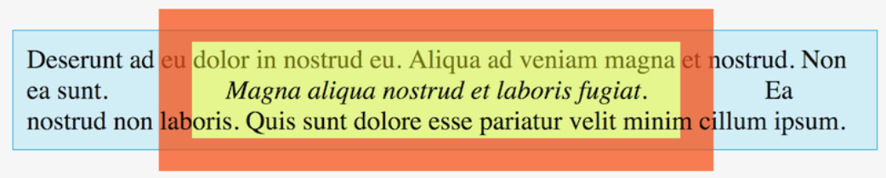

# The Box Model

## Section Links
[Everything is a Box](#everything-is-a-box)\
[Box Properties](#box-properties)\
[Visual Formatting Model](#visual-formatting-model)\
[Box Sizing](#box-sizing)\
[Paddings and Margins](#paddings-and-margins)\
[Using Outline for Troubleshooting](#using-outline-for-troubleshooting)\
[Dimensions](#dimensions)\
[Practice Questions](#practice-questions)

---

## Everything is a Box
- Every HTML element, including characters in text content, has a box boundary.
- The box model describes how browsers uses both CSS and browser default values to calculate the dimensions of each element.

[Back to Top](#section-links)


## Box Properties
Every element box has the following properties:
- The **width** and **height** define how much horizontal and vertical space it needs for the _content area_ of the box, which may or may not include the padding and borders. In most cases, the browser can determine the width and height automatically.
- The **padding** is an area that surrounds the content area of the box and separates the content from its border. It is typically opaque and hides anything that it overlays.
- The **border** is a boundary that surrounds the padding.
- The **margin** is a transparent area that lies outside the border and supplies separation between elements.
- The box model **allows** the width, height, padding, border and margin attributes to **all take values of 0**. Doing so will collapses the box around a zeroed item.
- The **display** property determines how the browser lays out an element relative to its neighbors.
	

[Back to Top](#section-links)


## Visual Formatting Model
- Every element has a display property that typically takes one of 3 values: `block`, `inline` and `inline-block`. The browser uses this property to determine how elements lay up in a document.

### Block Elements
- A `block` element will occupy all horizontal space by itself, even if the width is smaller than available space. If a page contains 3 `block` elements, they will be displayed one on top of the other in a stack.
- `block` elements use the box properties (`width`, `height`, `padding`, `border`, and `margin`) to determine the size of the element. An element that is 928 pixel wide, 168 pixel high and 20 pixel of left and right padding, 10 pixel of top and bottom padding, 1 pixel border and 28 pixel bottom margin will have an overall dimension of 970 x 218 pixels.
- Most `block` elements acts as **containers** and group one or more elements, which may also be `block`s. The master container is the `body`. We sometimes use **parent** to refer to a container and **child** to refer to the nested element.
- Most elements are `block` elements by default. Common examples include:
	- `section`, `article`, `aside`, `header`, `footer`
	- `h1` to `h6`
	- `p`
	- `ul`, `ol`,`dl`
	- `form` and `fieldset`
	- `blockquote`
	- `figure` and `figcaption`
- We can convert any element to a `block` element using the `display: block` CSS property.

### Inline Elements
- Inline elements are typically used to provide semantic meaning to a portion of content. For example, `b`  elements are used to stylistically offset a section of text so that the reader can see them at a glance.
- Common elements that are **inline by default** are:
	- `span`
	- `b`, `i`, `u`, `strong`, `em`
	- `a`
	- `img`
	- `sub` and `sup`
- `inline` elements handle dimension properties different from `block` elements. They 
	- **ignore** `width` and `height` properties (with `img` the only exception) but use values computed from element content
	- **ignore** top and bottom margins
	- **doesn't ignore** top and bottom padding but the **effect is unseen** as these **does not affect the flow layout**. The effect is only observed if there is a border or background.
	- **doesn't ignore** borders.
- In summary, for inline elements, **only the left and right box properties affect the flow** while the top and bottom does not. See example below.
	```html
	<p>
	  Deserunt ad eu dolor in nostrud eu. Aliqua ad veniam magna et nostrud. Non ea
	  sunt. <em>Magna aliqua nostrud et laboris fugiat.</em> Ea nostrud non laboris.
	  Quis sunt dolore esse pariatur velit minim cillum ipsum.
	</p>
	```

	```css
	p {
	  background-color: #d4f0f8;
	  border: 1px solid #2db7e1;
	  box-sizing: border-box;
	  font-size: 1.5rem;
	  padding: 0.5em;
	  width: 780px;
	}
	
	em {
	  background-color: rgba(255, 255, 0, .5);
	  border: 30px solid rgba(255, 0, 64, .5);
	  margin: 40px;
	  padding: 30px;
	}
	```

	**Example of Inline Element `em`**
	
	- Padding is yellow, border is orange and margins are unseen.
	- **Width and height properties in CSS are ignored**. Instead the actual `em` content width and height are used.
	- Only left and right component of padding + border + margin affects the flow of text. Top and bottom component of padding and border, though included, does not affect the flow and will intersect with content above and below. **Top and bottom margins are ignored**.
	- See [practice problem 3]() for another example

### Inline-Block Elements
- `inline-block` visual display model is now legacy and replaced by a new equivalent `inline flow-root` model. However, they are still remain largely in use.
- `inline-block` are a combination of `block` and `inline` models. They behaves **like `block` elements but do not occupy the entire row** when the `width` property is less than available width. 
- This allow **side-by-side placement** of `inline-block` element with other `inline` or `inline-block` elements. A useful application of this is to arrange content horizontally instead of vertically, like horizontal navigation bars where elements are defined as `inline-block`.
- Unlike `inline` elements, `inline-block` element observe the width and height properties, as well as the padding, borders and margin in full like a `block` element.
- We can use the `vertical-align` property to vertically align among adjacent `inline-block` elements

	```html
	<div>
	  <p>
	    Occaecat sunt nulla esse. Est cupidatat fugiat sit mollit.  Sunt in velit
	    mollit deserunt veniam.
	  </p>
	  <p>
	    Aliquip dolor aliqua consequat ullamco exercitation anim.  Dolor voluptate
	    irure eiusmod cillum consectetur enim excepteur mollit mollit. Do proident
	    ipsum dolore. Et aliqua veniam ex laborum aliquip cupidatat excepteur.
	  </p>
	</div>
	```

	```css
	div {
	  background-color: #c0ffc0;
	  border: 1px solid green;
	  padding: 10px;
	}
	
	p {
	  background-color: white;
	  border: 1px solid blue;
	  display: inline-block;
	  margin: 0 2%;
	  padding: 10px;
	  vertical-align: bottom;
	  width: 40%;
	}
	```

	

	```css
	p {
	  vertical-align: middle;
	}
	```
	
	

	```css
	p {
	  vertical-align: top;
	}
	```

	

- There are differences in terms of how certain elements are treated across browsers. Chrome and Safari treats `input` and `textarea` elements as `inline-block` but Firefox treats them as `inline`. We can make them consistent by setting the display property to `inline-block`.
- When lining `inline-block` element side by side, any number of spaces, including new line, between the elements in the html is interpreted as a single space and result in a gap (font-size for space character) when rendered, even when margins are set to `0`. 

	```html
	<nav>
	  <a href="#">One</a>
	  <a href="#">Two</a>
	  <a href="#">Three</a>
	</nav>
	```

	```
	nav a {
	  display: inline-block;
	  padding: 5px;
	  background: red;
	}	
	```

	

We can solve this by butting the elements against each other and eliminating any spaces between them or using comments.
```html
<nav>
	<a href="#">One</a><a href="#">Two</a><a href="#">Three</a>
</nav>
```

```html
<nav>
	<a href="#">One</a><!--
	--><a href="#">Two</a><!--
	--><a href="#">Three</a>
</nav>
```

This phenomenon and more possible solutions can be found [here](https://css-tricks.com/fighting-the-space-between-inline-block-elements/)

### Nesting Elements
- There are restrictions to nesting elements. While we can nest an `inline` element within a `block` element, we can't nest a `block` or `inline-block` in an `inline` element. For example, an `em` (inline) element can nest inside a `blockquote` (block) but not the other way round.
- There is an exception to above rule: `block` and `inline-block` elements can nest in an `a` tag (inline) as long as they do not contain interactive elements like `input`, `button`, `select`, `textarea` or another `a` tag. This feature is however rarely used.

### Other Visual Display Models
- There are many visual display models. `flex` and `grid` have seen widespread use in recent years as they solve many design problems.

[Back to Top](#section-links)


## Box Sizing
- The `box-sizing` property allow us to choose between `content-box` or `border-box`.
- The **`content-box`** setting is the default value for the `box-sizing` property in all modern browsers. It cause the browser to interpret `width` and `height` values as **exclusive** of `padding` and `border` for all `block` or `inline-block` elements. To determine the size of the visible box, one will need to add `padding` and `border` values to the `width` / `height`. 
- The **`border-box`** setting cause the browser to interpret `width` and `height` values as  **inclusive** of `padding` and `border` values but not `margin` values.
- `border-box` is useful in relative settings without the need for arithmetic calculations. For example, a 50% width and 12px padding under `border-box` will definitely take up half the `width` of the parent container.
- To use border-box everywhere, add the following to CSS
	```css
	html {
	  box-sizing: border-box;
	}
	
	*, *::before, *::after {
	  box-sizing: inherit;
	}
	```
	- We do not set the box-sizing value to border-box using the wildcard `*` selector because any component we overwrite to use content-box, its children will still be set as border-box. Using `inherit` allows us to change any component to use `content-box` and automatically propagate this effect to their children. See this [article](https://css-tricks.com/inheriting-box-sizing-probably-slightly-better-best-practice/) for detail explanation.

[Back to Top](#section-links)


## Paddings and Margins
- Padding forms part of the **visible and clickable bounds** of an element while a margin is just spacing between elements. When we click on the content area or anywhere in the padding or border of a clickable element, the browser will process the click. Clicking on the margin will not yield any response.
- The padding area are opaque and shows the background of the the element. Margins are transparent and show the background of its parent (container).
- For `inline` elements, the **top and bottom margins are ignored. Left and right padding, border and margin are considered when spacing elements**. Although **top and bottom padding and border** are **considered in box height calculation**, they are **ignored when spacing elements**, allowing the elements to overlap with content above or below. See example under [inline elements](#inline-elements).
- When stacking `block` elements, their **margin collapse** onto each other: the total spacing between the top and bottom blocks isn't the sum of margins but the larger of the two. 
	```html
	<p>This is the first sentence</p>
	<p>This is the second sentence</p>
	```

	```css
	p {
	  margin-bottom: 15px;
	  margin-top: 32px;
	}
	```
	The spacing between the two paragraph is 32 pixels and not 47 pixels. 
- Margin collapse occurs with top and bottom margins, but not with left and right margins. Padding does not collapse.

### Guidelines On Choosing Between Padding or Margins
- Use margins everywhere but padding when we want to:
	- Change the height or width of a border
	- Adjust the amount of visible background around an element
	- Alter the amount of clickable area
	- Avoid margin collapse
	- Have some horizontal space to the left or right of an `inline` element
	- Use padding to separate the left and right border of a container from its contents. Use margin for the vertical gap.

[Back to Top](#section-links)


## Using Outline for Troubleshooting
- If the display is not behaving as intended, it is also easier to draw an **outline** for the affected element to check the boundaries. An outline looks like a border visually except that it takes 0 pixel space, unlike a border. Since it takes no pixel space, it will not contribute to width exceeding 100% resulting in unexpected spillover when lining elements horizontally across entire body width, something that is common when using a border.
	```css
	li {
	  outline: 1px solid red;
	}
	```

[Back to Top](#section-links)


## Dimensions
- **Measurements** or **dimensions** are values of length based properties such as `width`, `height`, `padding`, `border`, `margin` and `font-size`.
- `px`, `rem`, `em`, `%` associated with these values are known as **measurement units** or **units**
- There should be **no space** between the measurement and unit
```css
/*correct */
body {
  font-size: 24px;
}

/* wrong */
body {
  font-size: 24 px;
}
```

### Absolute Units
- The **pixel** (`px`) is an absolute unit of length. CSS reference pixel adjust for differences in in device resolutions and display dimensions (and typical viewing distances) to make them similar in sizes.
- Other absolute units such as inches and milimeters are also available but are rarely used as the view experience differs based on devices characteristics.

### Relative Units
- CSS also provide several relative length units. **`em`, `rem` and percentages** are amongst the most useful.
- `em` is a length unit relative to the calculated font size of the **parent/container element**
- `rem` is a length unit relative to the root font size, defined as the font size for the `html` element
- `rem`s are easier to work with since its is relative to a fixed font size, the value at the root. Once the root font size for a document is set with an absolute length, 1.5 rem means the same thing everywhere else in that document. This is not true for `em`, which compounds. We can't go back to the original font size using `1em` but `1rem` will take you back to the original font size.
	```html
	<h1>Using `em` Units</h1>
	<div class="a-em">
	  1em == 1 * 24px == 24px
	  <div class="b-em">
	    1.5em == 1.5 * 24px == 36px
	    <div class="c-em">
	      2em == 2 * 36px == 72px
	      <div class="a-em">
	        1em == 1 * 72px == 72px
	      </div>
	    </div>
	  </div>
	</div>
	
	<hr>
	
	<h1>Using `rem` Units</h1>
	<div class="a-rem">
	  1rem == 1 * 24px == 24px
	  <div class="b-rem">
	    1.5rem == 1.5 * 24px == 36px
	    <div class="c-rem">
	      2rem == 2 * 24px == 48px
	      <div class="a-rem">
	        1rem == 1 * 24px == 24px
	      </div>
	    </div>
	  </div>
	</div>
	```

	```css
	html, body { font-size: 24px; }
	
	.a-em { font-size: 1em; }
	.b-em { font-size: 1.5em; }
	.c-em { font-size: 2em; }
	
	.a-rem { font-size: 1rem; }
	.b-rem { font-size: 1.5rem; }
	.c-rem { font-size: 2rem; }
	```

	

- We can specify a **fallback unit** in case older browsers do not support rems. Below css sets font-size of `p` elements to be `1.25rem`, and `20px` as the fallback. To be equivalent, it assumes the default root font size to be `16px`, which is the norm.
	```css
	p {
	  font-size: 20px; font-size: 1.25rem;
	}
	```

- **`Percentage`** are generally not considered a length value in CSS. However, they can be used to define dimensions as a fraction of the container/parent's width or height. If we place a `block` or `inline-block` element in a container and set `width: 50%`, the element's width is 50% of the width of the container. Note that `width` and `height` have **no effect** on `inline` elements unless it is an `img` element.
- The **`auto`** specifier is also not a length value but it lets the browser determine a width or height in the following way:
	- As a `width` or `height`, it tells the browser to try to fit the entire element (including its margins) in its container.
	- As a left or right `margin` value on a **block** element, it tells the browser to push the element all the way right or left (i.e. maximium possible margin) inside its container. You can center a block element by setting both left and right margins to `auto`. **Note**: `auto` margins only work for `block` elements but not `inline` or `inline-block`. To use it for these elements, we must set their css as `display: block;`  See [practice #1]()
	- As a top or bottom `margin` value, `auto` is equivalent to `0`.
	- Padding does not accept `auto` values.

	```html
	<div id="center-margin-auto">
	  <div id="center-margin-auto-center">centered</div>
	  <div id="center-margin-auto-right">right</div>
	</div>
	```

	```css
	#center-margin-auto {
	  background-color: cyan;
	  border: 1px solid gray;
	  width: 780px;
	}
	
	#center-margin-auto div {
	  background-color: #ffe0e0;
	  border: 10px solid red;
	  padding: 10px;
	  width: 50%;
	}
	
	#center-margin-auto-center {
	  margin: 10px auto;
	}
	
	#center-margin-auto-right {
	  margin: 10px 10px 10px auto;
	}
	```

	

- For zero length, we can omit the units since 0 is the same in all units
	```css
	blockquote {
	  margin: 0;
	}
	```
- We can freely mix units anywhere on a page but need to be careful as mixing units can lead to problems when we want to determine the "right" length so that the final display renders as intended.
	```css
	p {
	  border: 1rem solid red;
	  height: auto;
	  margin: 10px;
	  padding: 0.5em 10vw 0.5in 18pt;
	  width: 80%;
	}
	```

### Unit Usage Guideline
Below are general guidelines that we can refer to. None of these are absolute and we can ignore or break them when appropriate.
- Use absolute units sparingly, and stick with pixels. Pixels work well for:
	- the root font size
	- image widths and heights
	- top and bottom margins and padding, sometimes useful with left and right margins and padding
	- width or height of fixed-width/fixed-height containers such as navigation sidebars
	- border widths
 
- Use relative units liberally:
	- Use rems for fonts, possibly with a fallback to ems or pixels. The root font should use pixels.
	- If you must use ems instead of rems, try to avoid compounding font sizes.
	- Use rems, ems, or pixels for left and right margins and padding.
	- Use `%` for measurements that are proportional to the container element's width or height. Percentages work best for container dimensions and come in handy when you want certain areas of the page to grow and shrink as the width of the browser window changes.
	- Use `auto` with `width` and `height` to let the browser calculate an appropriate value.
	- Use `auto` with left and right margins to left, center, or right justify a block element within its container.

[Back to Top](#section-links)


## Practice Questions
1. Which of the following statements about `block` elements are true? Select all that apply.

	A: Two `block` elements that have the same parent element may appear side by side on a page.

	B: Two `block` elements that _don't_ have the same parent element may appear side by side on a page.

	C: Browsers don't use the left and right margins for a `block` element.

	D: You can convert any element to a `block` element.

	**Discussion**
	Choice **A** is incorrect since two `block` elements always use the entire width of the container, so cannot be side by side if they have the same parent. Choice **C** is incorrect since browsers do use the left and right margins of `block` elements.

	Choice **B** is correct since the parent elements may be `inline-block` or `inline`, which lets the browser render them side by side. With the proper dimensions, margins, padding, and alignment, it's possible to arrange the child `block` elements side by side as well.

	Choice **D** is correct. In fact, you can change any element's visual display model to any other visual display model.


2. Which of the following statements about `inline` elements are true? Select all that apply.

	A: Browsers ignore the `width` property for all `inline` elements.

	B: Browsers ignore the left and right margins for `inline` elements.

	C: Browsers ignore the top and bottom margins for `inline` elements.

	D: Browsers ignore padding for `inline` elements.

	**Discussion**
	While browsers ignore the `width` property for most `inline` elements and calculate the width based on the content, the `img` element is an exception. Thus, choice **A** is incorrect. Choice **B** is incorrect since browsers don't ignore the left and right margins for inline elements; they do, however, ignore the top and bottom margins, so choice **C** is correct. Choice **D** is incorrect since browsers use padding for `inline` elements.


3. Consider the following code:

	```html
	<!doctype html>
	<html>
	  <head>
	    <title>My Picture</title>
	    <meta charset="utf-8">
	    <style>
	      body {
	        box-sizing: border-box;
	        width: 1000px;
	        padding: 50px;
	        margin: 30px;
	        border: 10px solid blue;
	      }
	
	      section {
	        width: 75%;
	        padding: 25px;
	        margin: 15px;
	      }
	
	      img { width: 80%; }
	    </style>
	  </head>
	  <body>
	    <section>
	      
	    </section>
	  </body>
	</html>
	```

	Determine the final width of the image, in pixels. Assume that `picture.jpg` is 800px in width.

	A: 528px

	B: 540px

	C: 600px

	D: 640px

	**Discussion**
	Percentage widths use the content width of the parent element and must also take into account the `box-sizing` property. In this problem, the content width for the `<body>` element is 880px: 1000px for the `width` property, less 120px for the padding and border on the sides since we have a `border-box` sizing model. The `<section>`'s width is 660px (880px * 0.75), and that leads to a width of 528px (660px * 0.80) for the ``. Thus, choice **A** is correct. Note that the actual width of the image does not factor into the computation.

[Back to Top](#section-links)