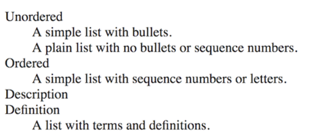
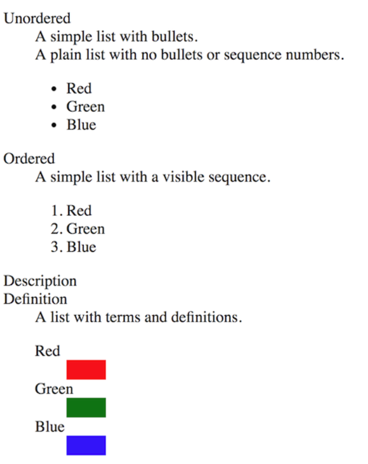
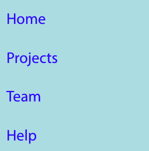
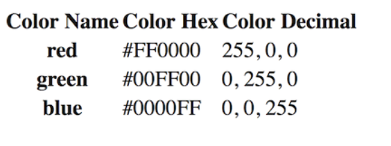
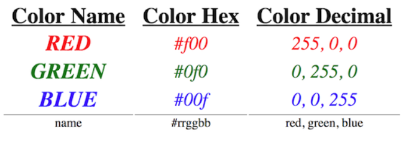

# Lists and Tables

## Section Links
[Unordered Lists](#unordered-lists)\
[Ordered Lists](#ordered-lists)\
[Description Lists](#description-lists)\
[Nesting Lists](#nesting-lists)\
[Constructing Navigation Menus](#constructing-navigation-menus)\
[Tables](#tables)\
[Simple Table without `thead`, `tbody` or `tfoot`](#simple-table-without-thead-tbody-or-tfoot)\
[Semantic Table Using `thead`, `tbody` and `tfoot`](#semantic-table-using-thead-tbody-and-tfoot)

---

## Lists
- There are three types of lists: **unordered**, **ordered** and **description**.

### Unordered Lists
- There are no visual numbering or naming systems for items in the list
- By default, items are listed vertically in bullets. They can be made horizontal with bullets hidden.
- `<ul>` and `<li>` tags are used to construct unordered lists.
	
	```html
	<ul>
	  <li>Red</li>
	  <li>Orange</li>
	  <li>Yellow</li>
	  <li>Green</li>
	  <li>Blue</li>
	  <li>Indigo</li>
	  <li>Violet</li>
	</ul>
	```

[Back to Top](#section-links)


### Ordered Lists
- Items appeared in a sequence. By default, it gets rendered as a vertical list of numbered items.
- HTML uses `<ol>` and `<li>` tags to construct ordered lists

	```html
	<ol>
	  <li>Red</li>
	  <li>Orange</li>
	  <li>Yellow</li>
	  <li>Green</li>
	  <li>Blue</li>
	  <li>Indigo</li>
	  <li>Violet</li>
	</ol>
	```

[Back to Top](#section-links)


### Description Lists
- Description lists, also known as definition lists prior to HTML5, contain a list of terms and definitions.
- Each item in a description list, also known as grouping, contains **one or more terms (`dt`) paired with one or more definitions (`dd`)**.
- HTML uses `<dl>`, `<dt>` and `<dd>` tags to construct description lists.

	```html
	<dl>
	  <dt>Unordered</dt>
	  <dd>A simple list with bullets.</dd>
	  <dd>A plain list with no bullets or sequence numbers.</dd>
	
	  <dt>Ordered</dt>
	  <dd>A simple list with sequence numbers or letters.</dd>
	
	  <dt>Description</dt>
	  <dt>Definition</dt>
	  <dd>A list with terms and definitions.</dd>
	</dl>
	```

	

[Back to Top](#section-links)


### Nesting Lists
- We can nest any list within another list, regardless of types. We can mix and match them e.g. put unordered list inside a description list.

	```html
	<dl>
	  <dt>Unordered</dt>
	  <dd>A simple list with bullets.</dd>
	  <dd>A plain list with no bullets or sequence numbers.</dd>
	  <dd>
	    <ul>
	      <li>Red</li>
	      <li>Green</li>
	      <li>Blue</li>
	    </ul>
	  </dd>
	
	  <dt>Ordered</dt>
	  <dd>A simple list with a visible sequence.</dd>
	  <dd>
	    <ol>
	      <li>Red</li>
	      <li>Green</li>
	      <li>Blue</li>
	    </ol>
	  </dd>
	
	  <dt>Description</dt>
	  <dt>Definition</dt>
	  <dd>A list with terms and definitions.</dd>
	  <dd>
	    <dl>
	      <dt>Red</dt>   <dd><div class="red"></div></dd>
	      <dt>Green</dt> <dd><div class="green"></div></dd>
	      <dt>Blue</dt>  <dd><div class="blue"></div></dd>
	    </dl>
	  </dd>
	</dl>
	```

	```css
	li, dd, dt {
	  font-size: 1.25rem;
	}
	
	.red, .green, .blue {
	  width: 50px;
	  height: 25px;
	}
	
	.red {
	  background-color: red;
	}
	
	.green {
	  background-color: green;
	}
	
	.blue {
	  background-color: blue;
	}
	```

	

[Back to Top](#section-links)


### Constructing Navigation Menus
- Unordered lists are frequently used to construct navigation menus, both vertical and horizontal
- CSS is used to set `list-style-type` property to remove bullet. `:hover` and `:focus` **pseudo-classes** are used as selectors to highlight mouse over of menu items.
- `,` separator is used to separate multiple selectors.

	```html
	<nav>
	  <ul>
	    <li><a href="#">Home</a></li>
	    <li><a href="#">Projects</a></li>
	    <li><a href="#">Team</a></li>
	    <li><a href="#">Help</a></li>
	  </ul>
	</nav>
	```

	```css
	nav ul {
	 background-color: powderblue;
	 list-style-type: none;
	 padding-left: 0;
	 width: 200px;
	}
	
	nav li {
	 font-size: 1.25rem;
	}
	
	nav a {
	 box-sizing: border-box;
	 color: blue;
	 display: inline-block;
	 line-height: 2.5;
	 padding: 0 10px;
	 text-decoration: none;
	 width: 100%;
	}
	
	nav a:hover,
	nav a:focus {
	 background-color: blue;
	 color: white;
	}
	```

	

- To get a horizontal list, we can make the following changes:
	- Reset the width of the menu (`ul`).
	- Set the font size for the list (`ul`) to 0, then restore it for the list items (`li`).
	- Set the list items to `inline-block`.
	- Set the width of the list items to a value that will distribute the values the way you want them distributed (typically, you want a percentage width).
	- Center the list items horizontally.

	```css
	nav ul {
	  font-size: 0;
	  width: 100%;
	}
	
	nav li {
	  display: inline-block;
	  font-size: 1.25rem;
	  text-align: center;
	  width: 25%;
	}
	```

	

[Back to Top](#section-links)


## Tables
- HTML provides a variety of tags to construct tables:
	- `<table>` tag defines a table
	- `<tr>` tag defines a single row in a table
	- `<td>` tag defines a single cell of content in a table. Each row includes zero or more cells.
	- The `<th>` tag defines a single heading. The first cell in a row or column is typically a heading, but this is not required.
	- `<thead>`, `<tbody>`, and `<tfoot>` each define a set of one or more rows that comprise the header, body, and footer rows of a table.

[Back to Top](#section-links)


### Simple Table without `thead`, `tbody` or `tfoot`
- We just use `<th>` to define column and row headings and the browser will know to render them differently from data cells
```html
<table>
  <tr>                      <!-- row 1 -->
    <th>Color Name</th>       <!-- column header 1 -->
    <th>Color Hex</th>        <!-- column header 2 -->
    <th>Color Decimal</th>    <!-- column header 3 -->
  </tr>

  <tr>                      <!-- row 2 -->
    <th>red</th>              <!-- row header (column 1) -->
    <td>#f00</td>             <!-- data cell 1 (column 2) -->
    <td>255, 0, 0</td>        <!-- data cell 2 (column 3) -->
  </tr>

  <tr>                      <!-- row 3 -->
    <th>green</th>            <!-- row header (column 1) -->
    <td>#0f0</td>             <!-- data cell 1 (column 2) -->
    <td>0, 255, 0</td>        <!-- data cell 2 (column 3) -->
  </tr>

  <tr>                      <!-- row 4 -->
    <th>blue</th>             <!-- row header (column 1) -->
    <td>#00f</td>             <!-- data cell 1 (column 2) -->
    <td>0, 0, 255</td>        <!-- data cell 2 (column 3) -->
  </tr>
</table>
```

```css
table {
  font-size: 1.5rem;
}
```



[Back to Top](#section-links)


### Semantic Table Using `thead`, `tbody` and `tfoot`
- We can use the `<thead>`, `<tbody>` and `<tfoot>` tags to give semantic meaning to specific rows in a table
- We can also use the `scope` attribute in `th` elements to identify them as `col` or `row` and use these as selectors `[scope="col"]`, `[scope="row"]` for styling
- We can also use the `:nth-child()` psuedo-class to select the specific instance of `tr` within `tbody` for styling.

```html
<table>
  <thead>                              <!-- heading rows -->
    <tr>                                 <!-- row 1 -->
      <th scope="col">Color Name</th>      <!-- column header 1 -->
      <th scope="col">Color Hex</th>       <!-- column header 2 -->
      <th scope="col">Color Decimal</th>   <!-- column header 3 -->
    </tr>
  </thead>

  <tbody>                              <!-- body rows -->
    <tr>                                 <!-- row 2 -->
      <th scope="row">red</th>             <!-- row header (column 1) -->
      <td>#f00</td>                        <!-- data cell 1 (column 2) -->
      <td>255, 0, 0</td>                   <!-- data cell 2 (column 3) -->
    </tr>

    <tr>                                 <!-- row 3 -->
      <th scope="row">green</th>           <!-- row header (column 1) -->
      <td>#0f0</td>                        <!-- data cell 1 (column 2) -->
      <td>0, 255, 0</td>                   <!-- data cell 2 (column 3) -->
    </tr>

    <tr>                                 <!-- row 4 -->
      <th scope="row">blue</th>            <!-- row header (column 1) -->
      <td>#00f</td>                        <!-- data cell 1 (column 2) -->
      <td>0, 0, 255</td>                   <!-- data cell 2 (column 3) -->
    </tr>
  </tbody>

  <tfoot>                              <!-- footer -->
    <tr>                                 <!-- row 5 -->
      <td>name</td>                        <!-- data cell 1 (column 1) -->
      <td>#rrggbb</td>                     <!-- data cell 2 (column 2) -->
      <td>red, green, blue</td>            <!-- data cell 3 (column 3) -->
    </tr>
  </tfoot>
</table>
```

```css
table {
  font-size: 1.5rem;
}

th {
  font-size: 1.75rem;
}

tbody tr {
  font-style: italic;
}

tbody tr:nth-child(1) {
  color: red;
}

tbody tr:nth-child(2) {
  color: green;
}

tbody tr:nth-child(3) {
  color: blue;
}

tfoot tr {
  font-size: 1rem;
}

tfoot td {
  border-top: 1px solid gray;
}

td {
  text-align: center;
}

[scope="col"] {
  padding: 0 10px;
  text-decoration: underline;
}

[scope="row"] {
  text-transform: uppercase;
}
```



[Back to Top](#section-links)