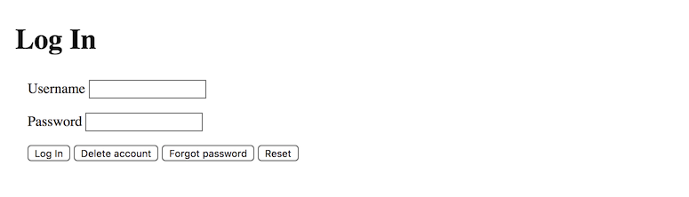
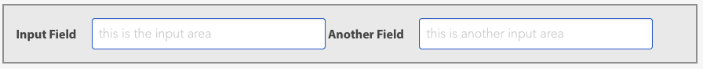
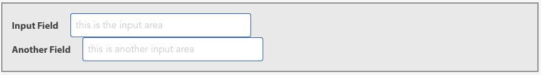
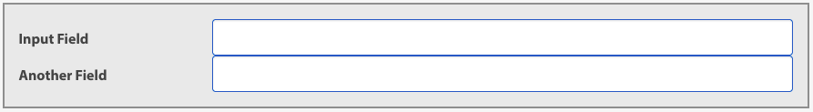
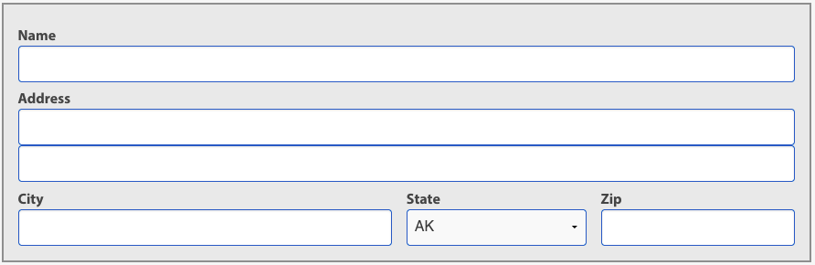

# Forms

## Section Links
[Why Forms](#why-forms)\
[The `form` Tag](#the-form-tag)\
[The `fieldset` Tag](#the-fieldset-tag)\
[The `input` Tag](#the-input-tag)\
[The `label` Tag](#the-label-tag)\
[A `form` Example](#a-form-example)\
[Input Types](#input-types)\
[Input Attributes](#input-attributes)\
[Select and Textarea](#select-and-textarea)\
[Form Layout](#form-layout)

---
## Why Forms
- HTML forms let us gather information from users. Different form controls available allow us to handle different data types. Javascript can be used to pre-validate information entered on forms. Upon receipt, the backend application on the server is responsible for validating the data, and acting on it.

[Back to Top](#section-links)


## The `form` Tag
- The `<form>` tag is the **parent** for all form-related tags. It's two most important attributes are `action` and `method`. 
- **`action`** tells the browser **where** i.e. the url to send the data. Individual action items (`button` and `input type="submit"` elements) in a form can override the form's `action` value using the `formaction` attribute.
- **`method`** tells the browser **how** the data is sent. `get` method is used when we want to retrieve data from the server. Data sent using `get` are appended to the url as an query string. `post` is used when we want to update data on the server. Data sent via `post` method will not be appended in the url but will be included in a HTTP message body instead. While HTTP support other methods, HTML allows only these two. To use other methods, we need JavaScript or a backend application.
- A form should contain at least one `input`, `textarea` or `select` tag, without which it is useless. These form-related elements are also known as **widget**, **control** and **input** 

[Back to Top](#section-links)


## The `fieldset` Tag
- `fieldset` is an optional tag that group together related set of form content. Most browser draw a border around the content.
- `fieldset` provides semantic meaning to the browser and can be used in CSS for styling and layout purposes.
- Forms can contain multiple `fieldset` tags.
	```html
	<form action="/login" method="post">
	  <fieldset>
	    <input type="text" name="username">
	    <input type="password" name="password">
	  </fieldset>
	  <fieldset>
	    <input type="submit" value="Save">
	    <input type="submit" value="Forgot Password" formaction="/forgot">
	  </fieldset>
	</form>
	```

[Back to Top](#section-links)


## The `input` Tag
- The `input` tag describes a control or widget that let the user supply information or a request to the application on the server.
- It has a `type` attribute to specify the type of widget required e.g. `input="text"` or `type="submit"`.
	```html
	<input type="text" name="city">
	<input type="password" name="password">
	<input type="submit" value="Save">
	```
- Most `input` widgets requires a `name` attribute used by both browser and backend application as key to a value.

[Back to Top](#section-links)


## The `label` Tag
- The `label` tag provides a way to associate some text with an input field. The browser uses the `for` attribute in the `label` tag and the `id` attribute in the `input` tag to associate the two items. This association allows the cursor to automatically jump to the associated input when the user click on the label.
	```html
	<label for="phone">Phone</label>
	<input type="text" id="phone" name="phone_number">
	```
- Another syntax for `label` tags is to use them as containers to nest `input` tags. This way, the enclosed `input` is automatically associated with the enclosing label, without the need for `id` and `for` attributes.
	```html
	<label>
	  Phone
	  <input type="text" name="phone">
	</label>
	```

[Back to Top](#section-links)


## A `form` Example
- This form has two input fields, `username` and `password`, each with a label and four buttons.
- We use the `formaction` attribute on `Delete account` and `Forgot password` button to send the user to different corresponding url from that indicated under `action`
- `fieldset` tags are used to layout the widgets. Without which, all widgets will appear on same row horizontally.
```html
<form action="#" method="post">
  <fieldset>
    <h1>Log In</h1>
    <fieldset>
      <label for="username">Username</label>
      <input type="text" name="username" id="username">
    </fieldset>

    <fieldset>
      <label for="password">Password</label>
      <input type="password" name="password" id="password">
    </fieldset>

    <fieldset>
      <input type="submit" value="Log In">
      <input type="submit" value="Delete account"
             formaction="/account/delete">
      <input type="submit" value="Forgot password"
             formaction="/account/password">
      <input type="reset" value="Reset">
    </fieldset>
  </fieldset>
</form>
```

```css
fieldset {
  border: none;
}
```

[Back to Top](#section-links)


## Input Types
### Text
- The `text` type creates a simple text entry field. The user can enter any text in this control and the developer should validate the data. 
- If a value already existed for an text input field, either from the database or submitted by the user earlier in the sesssion, we can use the `value` attribute to set it as the default value. Otherwise, the browser will set the default value to be an empty string.
- We can use `maxlength` attribute to specify the input's maximum length
	```html
	<form action="#" method="post">
	  <fieldset>
	    <label>
	      First Name
	      <input type="text" name="first_name" value="Tom">
	    </label>
	  </fieldset>
	</form>
	```

	<form action="#" method="post">
	  <fieldset>
	    <label>
	      First Name
	      <input type="text" name="first_name" value="Tom">
	    </label>
	  </fieldset>
	</form>

### Password
- The `password` type creates a single-line text field with **obscured** value used for passwords and other sensitive information. Use `maxlength` attribute to specify the input's maximum length
	```html
	<form action="#" method="post">
	  <fieldset>
	    <label for="password">Password</label>
	    <input type="password" name="password" id="password"
	           value="Not-good-password" size="35">
	  </fieldset>
	</form>
	```
	
	<form action="#" method="post">
	  <fieldset>
	    <label for="password">Password</label>
	    <input type="password" name="password" id="password"
	           value="Not-good-password" size="35">
	  </fieldset>
	</form>


### Email
- The `email` type is used for entry of email addressed in the format `username@domain`. Browsers implementing this type will validate entry to ensure they adhere to this format. Developer should always do their own validation.
	```html
	<form action="#" method="post">
	  <fieldset>
	    <label>
	      Email
	      <input type="email" name="email" placeholder="username@domain">
	    </label>
	  </fieldset>
	</form>
	```

	<form action="#" method="post">
	  <fieldset>
	    <label>
	      Email
	      <input type="email" name="email" placeholder="username@domain">
	    </label>
	  </fieldset>
	</form>


### Tel
- The `tel` type is used for entry of telephone numbers. Browsers that implement this type do not validate the input since phone number formats vary across countries. We can use the `placeholder` attribute to guide user the acceptable format
	```html
	<form action="#" method="post">
	  <fieldset>
	    <label>
	      Phone
	      <input type="tel" name="phone" placeholder="(###) ###-####">
	    </label>
	  </fieldset>
	</form>
	```
	
	<form action="#" method="post">
	  <fieldset>
	    <label>
	      Phone
	      <input type="tel" name="phone" placeholder="(###) ###-####">
	    </label>
	  </fieldset>
	</form>


### Checkbox
- The `checkbox` type lets the user select **zero or more** items among a list of items. 
- If using both `name` and `value` attributes, the browser will send `name=value` pairs for selected checkboxes. No value pairs will be sent for unselected items. 
- Each checkbox functions independently. Even though they may be options under the same group, they can all hold different values for the `name` attribute. We can however also opt for a common value for the `name` attribute for related checkboxes, with the `value` attribute holding the value to be send to server upon selection. This is shown in the example below,  where `choice=google` and `choice=recent` will be sent to the server on form submission.
- Use `checked` attribute to pre-select a checkbox. We can also select checked elements in CSS using the `:checked` pseudo-class for styling. This pseudo-class select elements based on its **current state** and not those with the checked attribute.
	```html
	<form action="#" method="post">
	  <fieldset>
		<label>
		  <input type="checkbox" name="choice" value="search">
		  Sort search results
		</label>
	
		<label>
		  <input type="checkbox" name="choice" value="google" checked>
		  Search on Google
		</label>
	
		<label>
		  <input type="checkbox" name="choice" value="recent" checked>
		  Recent results (within last year)
		</label>
	  </fieldset>
	</form>
	```
	
	<form action="#" method="post">
	  <fieldset>
		<label>
		  <input type="checkbox" name="choice" value="search">
		  Sort search results
		</label>
	
		<label>
		  <input type="checkbox" name="choice" value="google" checked>
		  Search on Google
		</label>
	
		<label>
		  <input type="checkbox" name="choice" value="recent" checked>
		  Recent results (within last year)
		</label>
	  </fieldset>
	</form>

- We can also opt to omit the `value` attribute and instead just use the `name` attribute to hold the value we want to send to the server. In this case, the browser will then send `NAME=on` for each selected checkbox, where `NAME` corresponds to the value of the `name` attribute of each selected checkbox.
	```html
	<form action="#" method="post">
	  <fieldset>
	    <label>
	      <input type="checkbox" name="search">
	      Sort search results
	    </label>
	
	    <label>
	      <input type="checkbox" name="google" checked>
	      Search on Google
	    </label>
	
	    <label>
	      <input type="checkbox" name="recent" checked>
	      Recent results (within last year)
	    </label>
	  </fieldset>
	</form>
	```
	Here the browser will send `google=on` and `recent=on` to the server. Use the format that your server-side code expects. In most cases, it's easiest to use separate `name` values.

### Radio
- The `radio` type lets the user choose **zero or one** item for a list of options.
- The user is not obliged to select a radio button from a group unless we use the `required` attribute on all of the buttons in a group. 
- For a group of related radio buttons, it is recommended to use a common value for their `name` attribute and to use the `value` attribute to hold the value associate with each button. With both `name` and `value` attributes used, the browser will submit a `NAME=VALUE` pair to the server, where `NAME` and `VALUE` corresponds to the value of the `name` and `value` attribute of the selected radio button. 
- Like checkboxes, we can omit the use of the `value` attribute to hold the value to be submitted. In its absence, the browser will send `NAME=on` for the selected radio button, where `NAME` is the value of the `name` property.
- Use the `checked` attribute to pre-select an item and mark it as the **default** radio button. As with checkboxes, we can use `:checked` psuedo-class as CSS selector to select radio button that is currently selected.
	```html
	<form action="#" method="post">
	  <fieldset>
	    <label>
	      <input type="radio" name="color" value="red">
	      Red
	    </label>
	
	    <label>
	      <input type="radio" name="color" value="green" checked>
	      Green
	    </label>
	
	    <label>
	      <input type="radio" name="color" value="blue">
	      Blue
	    </label>
	  </fieldset>
	</form>
	```
	<form action="#" method="post">
	  <fieldset>
	    <label>
	      <input type="radio" name="color" value="red">
	      Red
	    </label>
	
	    <label>
	      <input type="radio" name="color" value="green" checked>
	      Green
	    </label>
	
	    <label>
	      <input type="radio" name="color" value="blue">
	      Blue
	    </label>
	  </fieldset>
	</form>

- `radio` buttons work best with short lists up till 5 items. Beyond that, they become unwieldy and the `select` list control may be a better choice. when you have more than a handful of options from which to choose.

### Submit
- The `submit` type creates a button that the user can click to submit the contents of a form to the server. The `action` attribute on the `form` tag typically provides the URL of the server but this can be overridden using the `formaction` attribute available to this tag.
- The `value` attribute is used to hold the label for the button.
	```html
	<form action="#" method="post">
	  <fieldset>
	    <input type="submit" value="Save">
	  </fieldset>
	</form>
	```
	<form action="#" method="post">
	  <fieldset>
	    <input type="submit" value="Save">
	  </fieldset>
	</form>

**Note**: Although `<input type="button" value="Submit"` will display a button labelled as `Submit`, pressing the button will not automatically submit the form by default. Instead, we must attach an "event handler" telling the browser to submit the form data when button is clicked. 

### Reset
- The `reset` type creates a button that the user can click to reset the contents of a form to its default values. Clicking a `reset` button does not send a request to the server.
- The `value` attribute is used to hold the label for the button.
	```html
	<form action="#" method="post">
	  <fieldset>
	    <input type="reset" value="Clear Form">
	  </fieldset>
	</form>
	```
	<form action="#" method="post">
	  <fieldset>
	    <input type="reset" value="Clear Form">
	  </fieldset>
	</form>


### Other Input Types
- There are other form controls. To see the complete list, see the [MDN Documentation](https://developer.mozilla.org/en-US/docs/Web/HTML/Element/input) for the `<input>` tag.

[Back to Top](#section-links)


## Input Attributes
### `value` 
- For text-based types such as `text`, `email`, and `number`, the `value` attributes assigns a **default value** for the control. If you don't supply a default value, the browser uses an empty string.
	- We should use `value` when we already have a value, either loaded from a database or provided by the user during the session.
	```html
	<form action="#" method="post">
	  <fieldset>
	    <label>
	      Phone
	      <input type="tel" name="phone" value="503-555-1212">
	    </label>
	  </fieldset>
	</form>
	```

	<form action="#" method="post">
	  <fieldset>
	    <label>
	      Phone
	      <input type="tel" name="phone" value="503-555-1212">
	    </label>
	  </fieldset>
	</form>

- `checkbox` and `radio` types use the `value` attribute to **set the value the form submits** for the selected checkbox or radio group element. 
	- Technically, `checkbox` and `radio` input types do not require the `value` attribute. If  `value` attribute is omitted, the browser will send `NAME=on` to the server, where `NAME` is the value of the `name` propery. 
	- We recommend always using the `value` attribute and use `name` to group related radio buttons together. If several radio buttons belong together, they should all have the same `name` attribute value.
	- Note that we added a `checked` attribute to the blue button to make that button the initial selection. If we want to leave all of the radio buttons unselected, but still require a selection, we can add a `required` attribute to each button.
	```html
	<form action="#" method="post">
	  <fieldset>
	    <label>
	      <input type="radio" name="color" value="red">
	      Red
	    </label>
	    <br>
	
	    <label>
	      <input type="radio" name="color" value="blue" checked>
	      Blue
	    </label>
	    <br>
	
	    <label>
	      <input type="radio" name="color" value="green">
	      Green
	    </label>
	  </fieldset>
	</form>
	```

- Button types like `submit`, `reset` and `button` use the `value` attribute for the label that appears on the button.
	```html
	<form action="#" method="post">
	  <fieldset>
	    <input type="submit" value="Save">
	  </fieldset>
	</form>
	```
	<form action="#" method="post">
	  <fieldset>
	    <input type="submit" value="Save">
	  </fieldset>
	</form>


### `size` and `maxlength`
- These attributes apply to most text-based input types.
- The [`size`](https://developer.mozilla.org/en-US/docs/Web/HTML/Element/input#size) attribute specifies how much of the input is **shown**, and not how many characters the user can input. It is an _approximation_ for the width of the input box. The CSS `width` property overrides the `size` attribute in CSS enabled browsers.
- The [`maxlength`](https://developer.mozilla.org/en-US/docs/Web/HTML/Element/input#maxlength) property defines the maximum number of characters (UTF-16 code units) the user can **enter** into the field. This must have a integer value `0` or higher. 

	```html
	<form action="#" method="post">
	  <fieldset>
	    <label>
	      Phone
	      <input type="tel" name="phone" size="10" maxlength="16">
	    </label>
	    <br>
	    <label>
	      Cell Phone
	      <input type="tel" name="cell-phone" size="20" maxlength="40">
	    </label>
	  </fieldset>
	  <input type="submit" value="send">
	</form>
	```

### `placeholder`
- The `placeholder` attribute lets us display some text when a field is empty to help describe the expected input; it applies to most of the text-based `input` types. 
- Most browsers display `placeholder` text using a grayed-out format, and they erase the placeholder text as soon as the user starts typing.
- You may see sites that use placeholders as a substitute for labels. Don't do this yourself, though, since it breaks screen readers.

	```html
	<form action="#" method="post">
	  <fieldset>
	    <label>
	      Phone
	      <input type="tel" name="phone" placeholder="###-###-####">
	    </label>
	  </fieldset>
	</form>
	```
	<form action="#" method="post">
	  <fieldset>
	    <label>
	      Phone
	      <input type="tel" name="phone" placeholder="###-###-####">
	    </label>
	  </fieldset>
	</form>

### `disabled`
- The `disabled` attribute lets us disable `input` elements; the browser renders disabled elements but won't let the user interact with them. The rendering looks different from enabled attributes, often by using a gray or lighter color. 
- `disabled` also turns on the `:disabled` CSS pseudo-class. (Non-disabled elements set the `:enabled` pseudo-class.)

	```html
	<form action="#" method="post">
	  <fieldset>
	    <label>
	      Email
	      <input type="email" name="email" value="xyz@example.com" disabled>
	    </label>
	    <br>
	    <input type="submit" value="Save" disabled>
	  </fieldset>
	</form>
	```
	<form action="#" method="post">
	  <fieldset>
	    <label>
	      Email
	      <input type="email" name="email" value="xyz@example.com" disabled>
	    </label>
	    <br>
	    <input type="submit" value="Save" disabled>
	  </fieldset>
	</form>

### `required`
- The `required` attribute marks an `input` as required; the browser won't let the user submit the form until the user completes all required fields. 
- `required` also turns on the `:required` CSS pseudo-class.

	```html
	<form action="#" method="post">
	  <fieldset>
	    <label>
	      Home Phone
	      <input type="text" name="home_phone" required>
	    </label>
	    <br>
	    <label>
	      Business Phone
	      <input type="text" name="business_phone">
	    </label>
	    <br>
	    <input type="submit" value="Save">
	  </fieldset>
	</form>
	```

	```css
	input:required {
	  background-color: yellow;
	}
	```

### `autocomplete`
- We can use `autocomplete` on most `input` text-box elements. This attribute prevents the browser from storing data for later reuse by the browser's `autocomplete` features. 
- Autocomplete is common on smartphones and tablets but can be a nuisance. We can use the values `on` and `off` to explicitly turn `autocomplete` on or off on any given field.
- The `autocomplete` option does not affect the `password` input type.

	```html
	<input type="tel" value="123-456-7890" name="phone" autocomplete="off">
	```

### `autocapitalize`
- Some browsers recognize an `autocapitalize` attribute to turn autocapitalization on and off for the first letter of words or sentences. Browsers that recognize this attribute default to `sentences`. 
- Use `autocapitalize="none"` when expecting input that we don't want to capitalize. We can also specify `autocapitalize="words"` or `autocapitalize="characters"`
- `autocapitalize` is not part of the HTML standard, but an attribute provided by some _mobile_ browsers, such as iOS Safari and Google Chrome. It does not affect desktop and laptop systems. The W3C HTML validator presently complains about `autocapitalize` since it is non-standard. 
	```html
	<input type="text" name="full-name" autocapitalize="words">
	```

### `autocorrect`
- Some browsers support an `autocorrect` attribute that turns automatic spelling correction on and off. We can disable this feature with `autocorrect="off"`; we should usually disable it with names, addresses, and other information where autocorrection would be a bother.
- `autocorrect` is non-standard HTML, but an attribute presently provided by iOS Mobile Safari. Since it is non-standard, the W3C HTML validator will complain about the `autocorrect` attribute. 
	```html
	<input type="text" name="full-name" autocorrect="off">
	```

[Back to Top](#section-links)


## Select and Textarea
### Textarea
- `textarea` lets the user input **multiple lines of text**. 
- `textarea` preserves **carriage returns, newlines, and other whitespace characters** and use them to format the text into lines and paragraphs. This is different from other `text`-type inputs which ignores them. Since `textarea` preserves whitespace, its common practice to code the open and close tags on the same line unless the initial text content contains newlines.
- Unlike other controls, though, the value of the `textarea` doesn't use the `value` attribute to provide a value for the element. Instead, you need to contain the text between the opening and closing tags.
	```html
	<form action="#" method="post">
	  <fieldset>
	    <label>
	      Comment
	      <textarea name="tweet">I got 20% off my first purchase at joesburgers.com! You can too!</textarea>
	    </label>
	  </fieldset>
	</form>
	```
	<form action="#" method="post">
	  <fieldset>
	    <label>
	      Comment
	      <textarea name="tweet">I got 20% off my first purchase at joesburgers.com! You can too!</textarea>
	    </label>
	  </fieldset>
	</form>

- `textarea` uses the `rows` and `cols` attributes to control the height and width of the text box; `rows` is the height in lines, while `cols` is the width in characters. As with the `size` attribute on some `input` tags, neither measurement is precise - the browser may choose to display more or fewer lines or columns than requested. The CSS `height` and `width` properties will also override these attributes. Furthermore, the `rows` value is not a maximum for the number of lines of input allowed; instead, it's the **number of visible lines**. The text box enables vertical scrolling when the content exceeds the `rows` count.

- Most browsers today let the user resize the `textarea` box by dragging and dropping a small triangle that appears in the lower-right corner of the text box. We can use the CSS [`resize`](https://developer.mozilla.org/en-US/docs/Web/CSS/resize) property to control how the element can be resized e.g. vertical only etc.

### Select
- `select` creates a **drop-down list** of options from which the user can select **zero or more options**. 
- `select` uses the `name` attribute like other form elements, but it uses the `option` elements within it to describe the values shown to the user and sent to the server (which may be different).
- It has two possible child elements, the `option` and `optgroup` elements.
- An `option` defines one of the choices a user can make in a `select` tag. A `select` element is useless without its `option` elements. Each `option` represents a possible value for the select, and they use the `value` attribute as the value sent to the server with the `select` element's name. If an `option` does not have a `value` attribute, the browser uses the text contained by the `option` element instead.
- `select` elements often have a placeholder `option` that says something like `Choose one` and has a `value` of an empty string, as well as a `disabled` and `selected` attribute. This option works something like the placeholder attribute on text boxes: the user can see some helpful text, but she cannot select that text.
	```html
	<form action="#" method="post">
	  <fieldset>
	    <label>
	      Colors
	      <select name="color">
	        <option value="" disabled selected>Choose one</option>
	        <option value="#f00">Red</option>
	        <option value="#0f0">Green</option>
	        <option value="#00f">Blue</option>
	      </select>
	    </label>
	  </fieldset>
	</form>
	```

	<form action="#" method="post">
	  <fieldset>
	    <label>
	      Colors
	      <select name="color">
	        <option value="" disabled selected>Choose one</option>
	        <option value="#f00">Red</option>
	        <option value="#0f0">Green</option>
	        <option value="#00f">Blue</option>
	      </select>
	    </label>
	  </fieldset>
	</form>

- By default, `select` lets the user choose precisely one option or leave the option unselected if it contains a `disabled selected` option as shown above. If we add the `multiple` attribute, the user can select more than one option. On most browsers, a `select` with `multiple` appears as a (possibly scrolling) rectangle that displays several options. The user then Ctrl-clicks (Windows) or Cmd-clicks (Mac) to select the options she wants. We can also supply the size attribute to control the height of the selection box.

	```html
	<form action="#" method="post">
	  <fieldset>
	    <label>
	      Choose Your Favorite Movies
	      <select name="favorites" multiple size="4">
	        <option value="" disabled selected>Select One or More</option>
	        <option>2001: A Space Odyssey</option>
	        <option>Arrival</option>
	        <option>Close Encounters of the Third Kind</option>
	        <option>District 9</option>
	        <option>Guardians of the Galaxy</option>
	        <option>Interstellar</option>
	        <option>Serenity</option>
	        <option>Silent Running</option>
	      </select>
	    </label>
	  </fieldset>
	</form>
	```

	<form action="#" method="post">
	  <fieldset>
	    <label>
	      Choose Your Favorite Movies
	      <select name="favorites" multiple size="4">
	        <option value="" disabled selected>Select One or More</option>
	        <option>2001: A Space Odyssey</option>
	        <option>Arrival</option>
	        <option>Close Encounters of the Third Kind</option>
	        <option>District 9</option>
	        <option>Guardians of the Galaxy</option>
	        <option>Interstellar</option>
	        <option>Serenity</option>
	        <option>Silent Running</option>
	      </select>
	    </label>
	  </fieldset>
	</form>

[Back to Top](#section-links)


## Form Layout
### Basic Form Styling
- We use three `background-*` properties to provide the custom look for the select control
- The `url("data:rest-of-url")` value on `background-image` loads an "inline image" that shows the tiny drop-down arrow in the select box rather than downloading it separately. We do not need to know how to make these inline images but should know how to use them. We will typically be given the `data:` URL that we can plug directly into the `url()` value.
- The `border-radius` property lets us apply rounded corners to any element with a border. 
-  We used the `appearance` property (experimental as of 2018) to turn off the browser-specific default appearance of a widget (the `select` in this case). We should know how to remove browser-specific styling from input controls.
- Since `appearance` is an experimental feature, we use [Can I Use](https://caniuse.com/css-appearance) to determine the extent of browser support and the property name to use for the different browsers. As of 2022, the support for `none` value is already 97% so this feature is unlikely to go away. 
	```html
	<form action="#" class="styled-form">
	  <fieldset>
	    <label for="text_field">Input Field</label>
	    <input type="text" name="text_field" id="text_field"
	           placeholder="this is the input area">
	
	    <br>
	
	    <label for="select_field">Select Field</label>
	    <select name="select_field" id="select_field">
	      <option>Choice 1</option>
	      <option>Choice 2</option>
	      <option>Choice 3</option>
	    </select>
	  </fieldset>
	</form>
	```

	```css
	/* Eliminate margins and padding on everything */
	.styled-form * {
	  margin: 0;
	  padding: 0;
	}
	
	/* Grey box and default font for fieldsets */
	.styled-form fieldset {
	  background-color: #ececec;
	  border: 2px solid #999;
	  box-sizing: border-box;
	  color: #4d4d4d;
	  font-family:
	    myriad-pro, "Helvetica Neue", Helvetica, Roboto,
	    Arial, sans-serif;
	  padding: 1rem;
	}
	
	/* Custom appearance for labels */
	.styled-form label {
	  font-weight: bold;
	  line-height: 1.5rem;
	}
	
	/* Custom appearance for input and select fields */
	.styled-form input[type="text"],
	.styled-form select {
	  border: 1px solid #06c;
	  border-radius: 4px;
	  box-sizing: border-box;
	  font: normal 1rem Helvetica, Arial, sans-serif;
	  height: 40px;
	  padding: 5px 8px;
	}
	
	/* More customization for select lists */
	.styled-form select {
	  -moz-appearance: none;
	  -webkit-appearance: none;
	  appearance: none;
	  background-image:
	    url("data:image/svg+xml;base64,PHN2ZyB4bWxucz0iaHR0cDovL3d3dy53My5vcmcvMjAwMC9zdmciIHZlcnNpb249IjEuMSIgeD0iMTJweCIgeT0iMHB4IiB3aWR0aD0iMjRweCIgaGVpZ2h0PSIzcHgiIHZpZXdCb3g9IjAgMCA2IDMiIGVuYWJsZS1iYWNrZ3JvdW5kPSJuZXcgMCAwIDYgMyIgeG1sOnNwYWNlPSJwcmVzZXJ2ZSI+PHBvbHlnb24gcG9pbnRzPSI1Ljk5MiwwIDIuOTkyLDMgLTAuMDA4LDAgIi8+PC9zdmc+");
	  background-position: 100% center;
	  background-repeat: no-repeat;
	  padding-right: 1.5rem;
	}
	```


### Structuring HTML and Label Orientation
```html
<form action="#" class="styled-form side-by-side">
  <fieldset>
    <label for="text_field">Input Field</label>
    <input type="text" name="text_field" id="text_field"
           placeholder="this is the input area">

    <label for="another_field">Another Field</label>
    <input type="text" name="another_field" id="another_field"
            placeholder="this is another input area">
  </fieldset>
</form>
```

```css
/* Add to end of file */
.side-by-side label,
.side-by-side input[type="text"] {
  display: inline-block;
}

.side-by-side label {
  margin-right: 1rem;
  vertical-align: middle;
}

.side-by-side input[type="text"] {
  vertical-align: middle;
  width: 35%;
}
```


- The above HTML structure may resulted in wrapped elements e.g. second label on the first row and second input on the second row if the browser window is too narrow.
- To ensure each label-input pair stays together, developer may warp both label and input pairs in a `block` using `div`
	```html
	<form action="#" class="styled-form side-by-side">
	  <fieldset>
	    <div class="keep-together">
	      <label for="text_field">Input Field</label>
	      <input type="text" name="text_field" id="text_field"
	             placeholder="this is the input area">
	    </div>
	
	    <div class="keep-together">
	      <label for="another_field">Another Field</label>
	      <input type="text" name="another_field" id="another_field"
	             placeholder="this is another input area">
	    </div>
	  </fieldset>
	</form>
	```
	

- The problem with using `div` to group label and inputs is that fields do not align vertically if the label have different width.  
- To help with alignment, we could use **description list**: `dt` to hold the labels and `dd` to hold the inputs.
- `dl`, `dt` and `dd` then become tags we can use to style without affecting the HTML.
	```html
	<form action="#" class="styled-form side-by-side">
	  <fieldset>
	    <dl>
	      <dt><label for="text_field">Input Field</label></dt>
	      <dd><input type="text" id="text_field" name="text_field"></dd>
	
	      <dt><label for="another_field">Another Field</label></dt>
	      <dd><input type="text" id="another_field" name="another_field"></dd>
	    </dl>
	  </fieldset>
	</form>
	```

	```css
	.side-by-side input[type="text"] {
	  width: 100%; /* Replaces 35% */
	}
	
	/* Add to end of file */
	.side-by-side dl {
	  font-size: 0;
	}
	
	.side-by-side dt,
	.side-by-side dd {
	  box-sizing: border-box;
	  display: inline-block;
	  font-size: 1rem;
	  vertical-align: middle;
	}
	
	.side-by-side dt {
	  padding-right: 1rem;
	  width: 25%;
	}
	
	.side-by-side dd {
	  width: 75%;
	}
	```
	

- We can have more styling flexibility by having **separate description lists for each label-input pair**. We can also add **appropriate classes** to the `dl` elements to **style related pairs collectively** e.g. putting city, state and zipcode together on one horizontal line.
	```html
	<form action="#" class="styled-form top-to-bottom">
	  <fieldset>
	    <dl>
	      <dt><label for="name">Name</label></dt>
	      <dd><input type="text" id="name"></dd>
	    </dl>
	
	    <dl class="address">
	      <dt><label for="address1">Address</label></dt>
	      <dd>
	        <input type="text" id="address1">
	        <input type="text" id="address2">
	      </dd>
	    </dl>
	
	    <dl class="city partial">
	      <dt><label for="city">City</label></dt>
	      <dd><input type="text" id="city"></dd>
	    </dl>
	
	    <dl class="state partial">
	      <dt><label for="state">State</label></dt>
	      <dd>
	        <select id="state">
	          <option>AK</option>
	          <option>AL</option>
	          <!-- You can download the complete list of states at -->
	          <!-- https://launchschool.com/gists/2424a869 -->
	        </select>
	      </dd>
	    </dl>
	
	    <dl class="zipcode partial">
	      <dt><label for="zipcode">Zip</label></dt>
	      <dd><input type="text" id="zipcode"></dd>
	    </dl>
	
	  </fieldset>
	</form>
	```

	```css
	/* Add to end of file */
	.styled-form label {
	  padding-top: 0.3333rem;
	}
	
	.top-to-bottom dl.partial {
	  box-sizing: border-box;
	  display: inline-block;
	  padding-right: 1rem;
	  vertical-align: top;
	}
	
	.top-to-bottom dl.address {
	  width: 100%;
	}
	
	.top-to-bottom dl.city {
	  width: 50%;
	}
	
	.top-to-bottom dl.state {
	  width: 25%;
	}
	
	.top-to-bottom dl.zipcode {
	  padding-right: 0;
	  width: 25%;
	}
	
	.top-to-bottom dl dd {
	  width: auto;
	}
	
	.top-to-bottom fieldset,
	.top-to-bottom dl,
	.top-to-bottom dl dd,
	.top-to-bottom dl dt {
	  font-size: 0;
	}
	
	.top-to-bottom dl label,
	.top-to-bottom dl input[type="text"] {
	  font-size: 1rem;
	}
	
	.top-to-bottom select {
	  width: 100%;
	}
	```
	

[Back to Top](#section-links)