# Advanced Layout

## Section Links
[Floats](#floats)\
[Positioning](#positioning)\
[Flex and Grid](#flex-and-grid)\
[What Are CSS Frameworks?](#what-are-css-frameworks)\
[Responsive Design](#responsive-design)


---

## Floats
- With `inline` or `inline-block` display types, elements are layed side by side (assuming they all fit in the same row) following their order in the HTML. There will be times we need them to appear in the reverse order i.e. earlier element appearing on the right of later elements.
- Although we can achieve that by altering the element order in the HTML document, sometimes this is not practical as it might entail many HTML pages, all following that particular layout structure.
- The CSS `float` property allows us to efficiently achieve the same effect across all pages in just a single CSS file, without the need to amend affected HTML documents.

	```html
	<div class="outer">
	  <div class="primary">
	    <p>Main Content</p>
	  </div>
	
	  <div class="secondary">
	    <p>Sidebar 1</p>
	  </div>
	</div>
	```

	```css
	html {
	  font-size: 16px;
	}
	
	* {
	  margin: 0;
	  padding: 0;
	}
	
	body {
	  padding: 0.5rem;
	}
	
	p {
	  color: black;
	  font-family: serif;
	  font-size: 1.5rem;
	  font-weight: bold;
	}
	
	.outer {
	  border: 1px solid gray;
	  overflow: hidden;
	  width: 100%;
	}
	
	.primary, .secondary {
	  border: 1px solid black;
	  box-sizing: border-box;
	  text-align: center;
	}
	
	.primary {
	  background-color: moccasin;
	  float: left;
	  height: 100px;
	  line-height: 100px;
	  width: 65%;
	}
	
	.secondary {
	  background-color: coral;
	  float: left;
	  height: 75px;
	  line-height: 75px;
	  width: 30%;
	}
	```
	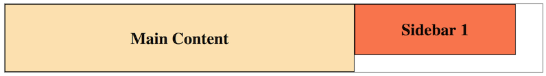
	
	```css
	.secondary {
	  float: right;
	}
	```
	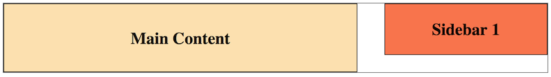
	
	```css
	.primary {
	  float: right;
	}
	
	.secondary {
	  float: left;
	}
	```
	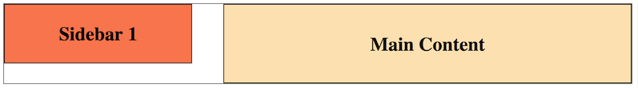
	
- Another use case of `float` is to eliminate embedded whitespace between two adjacent elements on the same row.  This is because two elements floated in the same direction will naturally have their edges touch, as long as they both fit in the same row, the `float` property can be used in place of `<!-- ... ->` or other hacks.


### Containing Floats
- When using `float`, it is common to encounter the "containing floats" problem i.e. floating elements spilling outside the borders of the containing element.
- This happens because browsers will **remove floated, absolute or fixed position elements from the document flow**, causing them to have no effect on the dimensions of their parents. As such the parent container cannot fully contain these elements.
```html
<div id="columns">
  <div id="primary">
    <h1>Main Content</h1>
  </div>

  <div id="secondary">
    <h3>Sidebar Content</h3>
  </div>
</div>
```

```css
#columns {
  background-color: #e0e0e0;
  box-sizing: border-box;
  margin: 0 auto;
  padding: 20px;
  width: 780px;
}

#primary, #secondary {
  background-color: yellow;
}

#primary {
  float: left;
  width: 500px;
}

#secondary {
  float: right;
  width: 200px;
}
```

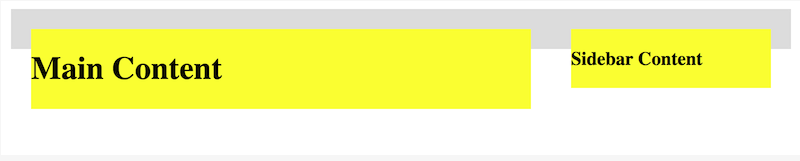
- There are two methods to fix this problem: **`overflow`** or **clearfix**.

#### Overflow
- `overflow: hidden` or `overflow: auto` can be **applied to parents** containing floating element(s) to expand them to envelop all floating children. It works because `overflow` creates a **block formatting context** that contains everything inside the element this property is applied to, including floats.
```css
#columns {
  overflow: hidden;
}
```
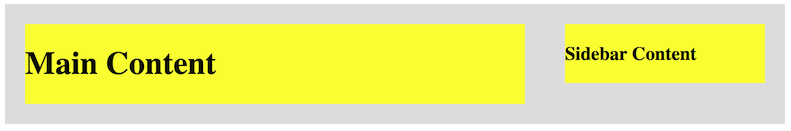
- While `overflow` works correctly most of the time, there are two edge cases one should be mindful:
	- `overflow: hidden` can cut off content that exceeds the allocated space for the text if the container has a set height or width.
	- `overflow: auto` can add unwanted scrollbars depending on the browser.
- If any of the edge cases occur, we could opt to use clearfix instead.

#### Clearfix
- A clearfix is a standard pattern developers use to ensure a container doesn't lose its floated children. It uses an invisible block as the last child of the container and the `clear` property.
```css
#columns {
  /* overflow: hidden; */
}

#columns::after { /* This rule is the clearfix */
  clear: both;
  content: "";
  display: block;
}
```

- The `::after` pseudo-element creates a child element at the **end** of the selected element. 
- This child is defined as a `block` which will occupy the entire row and have an empty string (`content: ""`) as its content, making it invisible. 
- `clear: both` is used to clear all floats inside the container, **forcing selected element**, i.e. the invisible child in this case, directly **below all floated content**.
- `clear` takes values of `right`, `left`, or `both`. `right` and `left` refer to the type of floated element it will clear, while `both` clears any floated element that it finds. We can use any of these values with `clear`, but we should use `clear: both` unless we find that we need `clear: left` or `clear: right` for some reason.

[Back to Top](#section-links)


## Positioning
- CSS positioning is used when we want to fine-tune the placement of elements within their containers.

### Offset Properties
- `top`, `right`, `bottom`, `left` are offset properties that **work in conjunction** with the `position` property to determine the **direction** and **how far** we move an element. For example, `bottom: 50px` indicates moving a selected element 50px **inwards** from the bottom edge of the container. 
- The offset is always in the **inward direction** for **positive** offset values and outwards for negative values.

### `Position` Property
- `position: static` is the **default**. Statically positioned elements remain part of the page flow in the same order as in the markup. **floated, grid, flex, fixed and absolute positioned elements** get removed from the page flow. Offset properties **do not** affect static elements.
- `position: relative` moves an element to a new position relative to where the browser would have positioned it without the offsets. Relative position is typically used with one vertical offset (`top` or `bottom`) and one horizontal offset (`left` or `right`). Relative positioned elements **remain in the document flow**. The browser positions the next element as though the relative positioned one occupied its pre-offset location. 
	```html
	<section>
	  <aside class="normal">normal</aside>
	  <aside class="shifted pos">top</aside>
	  <aside class="shifted neg">-top</aside>
	  <aside class="normal">normal</aside>
	</section>
	```

	```css
	section {
	  border: 1px solid gray;
	  padding: 70px 10px;
	}
	
	aside {
	  border: 1px solid black;
	  display: inline-block;
	  height: 100px;
	  line-height: 100px;
	  margin: 0;
	  padding: 0;
	  text-align: center;
	  width: 100px;
	}
	
	.normal {
	  background-color: yellow;
	}
	
	.shifted {
	  position: relative;
	}
	
	.pos {
	  background-color: cyan;
	  top: 60px;
	}
	
	.neg {
	  background-color: lightgreen;
	  top: -60px;
	}
	```
	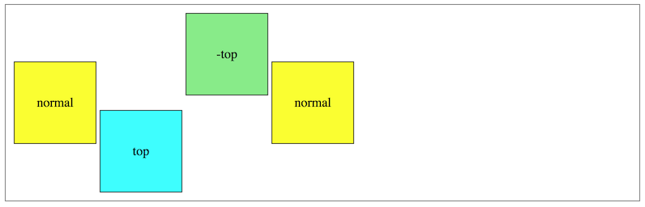

- `position: absolute` positioned elements are **removed from the document flow**. This cause them to be moved to a new position **within** their container element. By default, the container is the nearest ancestor element with a _fixed_, _relative_, _absolute_ or _sticky_ `position`. If no such ancestor exist, the browser will use the `body` and position the element at an absolute position within the body.

	```html
	<section>
	  <aside class="relative">
	    <div class="absolute-1"></div>
	  </aside>
	  <aside class="relative">
	    <div class="absolute-2"></div>
	  </aside>
	  <aside class="relative">
	    <div class="absolute-3"></div>
	  </aside>
	</section>
	```

	```css
	section {
	  border: 1px solid gray;
	  padding: 10px 10px 60px;
	  width: 780px;
	}
	
	aside {
	  border: 1px solid black;
	  display: inline-block;
	}
	
	.relative {
	  background-color: yellow;
	  height: 200px;
	  left: 0;
	  margin: 0 25px;
	  position: relative;
	  top: 0;
	  width: 200px;
	}
	
	.absolute-1 {
	  background-color: lightgreen;
	  bottom: 33%;
	  left: 33%;
	  position: absolute;
	  right: 33%;
	  top: 33%;
	}
	
	.absolute-2 {
	  background-color: cyan;
	  bottom: 150px;
	  left: 0;
	  position: absolute;
	  right: 20px;
	  top: 0;
	}
	
	.absolute-3 {
	  background-color: pink;
	  bottom: -50px;
	  left: 100px;
	  position: absolute;
	  right: -40px;
	  top: 150px;
	}
	```

	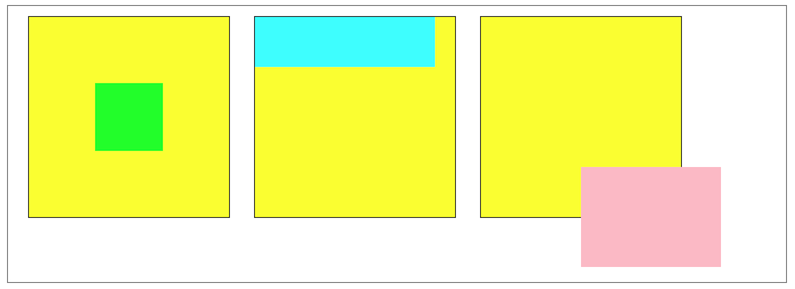
	- The yellow boxes representing the `aside` elements are containers to absolute positioned elements (green, cyan and pink boxes) since they are the closest ancestor with non-static positioning (`relative` in this case.
	- The green box gives an example of using `absolute` positioning to center an element without specified dimensions within its container i.e. setting all offset properties to `33%` and leaving the remaining 34% as the width and height of the element. Note: the offset values will have to be recalculated if the width and height of the elements are specified.
	- The cyan box demonstrates a different way of `absolute` positioning. We set the top of the cyan box to be aligned with the top of the container, bottom of the cyan box to be 150px inwards from its container, left of the cyan box to be aligned with the left of the container and right of the cyan box to be 20px inwards from the right of its container.
	- The pink box show how negative offsets can be used to shift an `absolute` positioned element outside its container.
	- Since an `absolute` positioned element is removed from the document flow, an unpositioned i.e. `static` black box will be placed at the top left corner of the container, as if the other positioned boxes  that exist earlier in the mark up are not there.
		```html
		<section>
		  <aside class="relative">
		    <div class="absolute-1"></div>
		    <div class="absolute-2"></div>
		    <div class="absolute-3"></div>
		    <div class="unpositioned"></div>
		  </aside>
		</section>
		```

		```css
		.unpositioned {
		  background-color: black;
		  height: 100px;
		  width: 100px;
		}
		```

		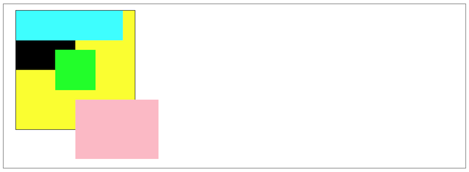

- `position: fixed` sets an element to a fixed position within the **view window**. The element **does not move** even when the user scrolls the page. This is commonly used in sticky navigation bar that is always remain at the top of the view window even while the user scroll down the page. It is useful to have some transparency for a fixed positioned element to see the rest of the page scrolls beneath it.
	```html
	<header>
	  Fixed Position Demo
	</header>
	
	<section>
	  <p>
	    This part of the window scrolls up and down.
	  </p>
	  <p>
	    Sint cillum tempor esse eu laborum ipsum eu. Cupidatat sint laboris
	    excepteur eu enim adipisicing officia. Sunt cupidatat id ipsum reprehenderit
	    et irure veniam ex. Duis cupidatat ullamco adipisicing mollit ea nulla irure
	    mollit eu. Aliqua laboris aute sint consectetur aute occaecat cillum sint
	    aliqua. Culpa eiusmod officia Lorem dolore.
	  </p>
	  <p>
	    Dolor proident mollit eiusmod. Cupidatat Lorem ipsum irure culpa quis. Non
	    consequat sunt non nostrud sint id quis consectetur aute. Exercitation nisi
	    tempor excepteur. Magna exercitation ad amet ut commodo consequat non. Duis
	    veniam culpa esse magna laborum aute sunt quis.
	  </p>
	  <!-- add several more paragraph here -->
	</section>
	```

	```css
	header {
	  background-color: lightgreen;
	  font-size: 4rem;
	  height: 8rem;
	  left: 0;
	  line-height: 8rem;
	  opacity: .75;
	  position: fixed;
	  text-align: center;
	  top: 0;
	  width: 100%;
	}
	
	section {
	  margin: 0 auto;
	  padding: 10rem 1rem 0;
	  width: 600px;
	}
	
	p {
	  font-size: 2rem;
	  margin-bottom: 1.5rem;
	}
	```
	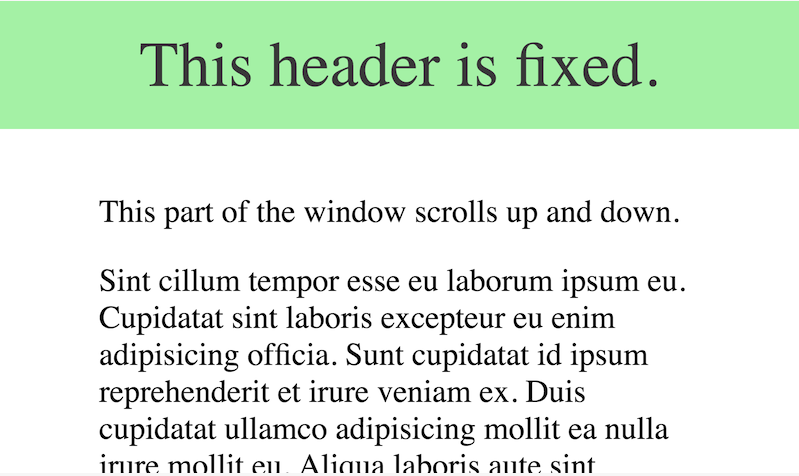
- Sometime, the 3D vertical order of a positioned element or flex items may require adjustment. To do that, we make use of the [`z-index`](https://developer.mozilla.org/en-US/docs/Web/CSS/z-index) CSS property to set the z-order. Overlapping elements with larger z-index cover those with smaller one.

[Back to Top](#section-links)


## Flex and Grid
- While floats and positioning allows us to control the CSS layout, they are difficult to use. For example, we need to use clearfix to handle overlaps, and offset parameters to position items nicely.
- Flex and grid offers a much simpler way to position items and have preset values to arrange them nicely.

### Flex
- Flex (or Flexbox) is a new `display` property that gain widespread use since 2018. 
- It is a one-dimensional layout tool to lay out items in a single row or column. We can use multiple flexboxes to create two-dimensional formats but Grid is more suited for that.
- Refer to the following resources on Flex:
	- [A Complete Guide to Flexbox](https://css-tricks.com/snippets/css/a-guide-to-flexbox/)
	- [Flexbox Documentation MDN](https://developer.mozilla.org/en-US/docs/Web/CSS/CSS_Flexible_Box_Layout/Basic_Concepts_of_Flexbox)

**Sample code**
```css
.container {
  display: flex;  /* Implies a default of flex-flow: row nowrap */
  justify-content: space-around; /* layout flex items along main axis */
  align-items: center; /* layout flex items along cross axis */
}

/* Flex items */
article {
  flex: 2; /* flex: flex-grow [flex-shrink flex-basis] */
}
aside {
  flex: 1;
}
```

### Grid
- `display: grid` is another property that exploded in usage and is use in conjunction with Flex.
- It is a two-dimensional layout tool where we can place elements in a grid (rows and columns) format at ths same time. We can also use it for a single row or column but Flex is better suited for those.
- Refer to following resources on Grid:
	- [A Complete Guide to Grid](https://css-tricks.com/snippets/css/complete-guide-grid/)
	- [Grid Layout Documentation MDN](https://developer.mozilla.org/en-US/docs/Web/CSS/CSS_Grid_Layout)

**Sample Code**
```css
body {
  display: grid;
  grid-template-columns: 1fr 2fr 1fr; /* define space in each column */
  grid-auto-rows: min-content; /* set width based on child item content */
  grid-template-areas: 
    "header   header   header"
    "nav      nav      nav"
    "sidebar1 article1 sidebar2"
    "sidebar3 article2 article2"
    "footer   footer   footer"
}

header {
  grid-area: header; /* header occupies 3 columns in first row */
  ...
}

nav {
  grid-area: nav; /* nav occupies 3 columns in second row */
  ...
}

#article-1 {
  grid-area: article1;
  ...
}

#article-2 {
  grid-area: article2;
  ...
}

#sidebar-1 {
  grid-area: sidebar1;
  ...  
}
...
```

### Flex and Grid
- [Learn to Code with Games](https://codepip.com/)
- [Flexbox and Grids, your layout’s best friends](https://aerolab.co/blog/flexbox-grids)

[Back to Top](#section-links)


## What Are CSS Frameworks
- A CSS framework comprises several CSS stylesheets ready for use by web developers and designers. The stylesheets are prepped for use for standard web design functions: setting colors, layout, fonts, navbars, etc. Generally, stylesheets are supported and expanded by other scripting technologies like SASS and JavaScript.
- With a CSS framework, the user tap on completed CSS stylesheet, and only have to code the HTML with accurate classes, structure, and IDs to set up a web page. The framework already has classes built-in for common website elements – footer, slider, navigation bar, hamburger menu, column-based layouts, etc.
- Layouts in frameworks might or might not use `display: grid` in their implementation.
- Two common frameworks are Twitter Bootstrap and Foundation. More examples [here](https://www.browserstack.com/guide/top-css-frameworks)

**Example 4-Column Grid Layout**
We want four equal-sized containers per row and want that behavior no matter the browser's current width. We can create a class called `one-fourth` and have it set to 25% of the parent container's width. Column containers almost always use a relative width measurement as well, i.e., percentages or rems, so you can nest columns within others and have them behave the same way no matter the parent container's width.
```css
ul {
  padding: 0;
}

.one-fourth {
  display: inline-block;
  outline: 1px solid gray;
  vertical-align: top;
  width: 25%;
}
```

```html
<ul class="row">
  <li class="one-fourth">8 GB SD card</li>
  <li class="one-fourth">16 GB SD card</li>
  <li class="one-fourth">32 GB SD card</li>
  <li class="one-fourth">64 GB SD card</li>
</ul>
```

```css
.row::after {
  clear: both;
  content: "";
  display: block;
  line-height: 0;
}

.one-fourth {
  display: inline-block;
  float: left;
  outline: 1px solid gray;
  vertical-align: top;
  width: 25%;
}
```

**Result**:
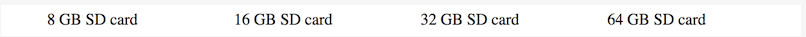

[Back to Top](#section-links)


## Responsive Design
A website needs to cater to visitors browsing on a myriad of devices e.g. smartphone, desktops. To ensure the website looks good no matter the browsing device, site presentation have to be customized according to display sizes.

### Media Queries
- To do that, we utilise CSS media queries, which **define styles based on the current size of the browser window**.
- In the example below, the media query will change the link color on small devices with screens less than 480px wide.
	```css
	a {
	  color: #f00;
	}
	
	@media (max-width: 480px) {
	  a {
	    color: #06c;
	  }
	}
	```
- We can use `not` and `and` in media queries, as well as choose different media types such as `screen`, `print` or `speech`. Most common is a combination of `screen` media type and `min-width` or `max-width` like below. Refer to [media query documentation](https://developer.mozilla.org/en-US/docs/Web/CSS/Media_Queries/Using_media_queries) for more information.
	```css
	@media screen and (max-width: 1600px) {
	  /* CSS for 1600px (or smaller) screens (no printers!) */
	}
	```

#### Mobile-First and Desktop-First
- A key decision usually involves deciding whether a site should cater for mobile or desktop devices first. 
- The mobile-first approach frequently results in faster downloads on mobile devices and is considered best practice by most developers.
- A mobile first approach will start by styling for the mobile site first, then use several media queries to handle progressively larger devices:
	```css
	/* CSS for all cell phones and shared cross-browser CSS */
	
	@media screen and (min-width: 481px) {
	  /* CSS for tablets and larger */
	}
	
	@media screen and (min-width: 961px) {
	  /* CSS for small desktop and laptop screens and larger */
	}
	
	@media screen and (min-width: 1501px) {
	  /* CSS for large laptop and desktop displays */
	}
	
	@media print {
	  /* CSS for printers */
	}
	```
	- The CSS file starts with styling for the smallest devices one intend to support. Here we also include any CSS common to all or most of the media queries to be supplied. Properties like color tend not to vary with device sizes, so it is common for them to appear at the top.
	- We can use the remaining `screen` queries to provide CSS intended for larger devices.
	- We can also provide a media query for printing e.g. so as to avoid wasting on colored inks.

#### Breakpoints
- We should a variety of sizes, or **breakpoints** for the media queries above. While we tried using comments to classify each size into a device type, they tend not be work well as modern devices occupy a continuum of screen sizes.
- Instead of deciding styling based on device types, it be best to build layout based on screen sizes.

#### Emulating Devices in Google Chrome
- Chrome developer tools allow one to emulate a range of devices to test how a website will appear on them. We can access it as follows:
	- Open the inspector.
	-   Click the emulation icon in the top bar (it looks like a smartphone resting atop a tablet in Chrome v64 - other versions may differ).
	-   Several drop-downs will appear above the web page.
	-   Select iPhone 8 from the "Responsive" drop-down.
	-   Refresh the page to ensure the page loads everything it needs.

#### Using Your Page on Multiple Devices
- If you design your application with responsiveness in mind, you must put the following `<meta>` elements in the `<head>` part of `<html>`. It tells the mobile device how to handle that page. Without it, devices will often display a miniaturized version of the page instead of styling based on the media queries and CSS.
	```html
	<meta name="viewport" content="width=device-width, initial-scale=1">
	```
- Search for "meta viewport" on MDN for more information on what `<meta name="viewport">` does and how to use it.

### Fluid and Liquid Layouts
#### Liquid Layout
- Liquid layouts often employ percentage values for widths to maintain the same width ratios for content areas as the browser width changes.
	```html
	<main>
	  <article class="content">
	    Enim Lorem aliqua anim nulla labore nulla ullamco. Deserunt fugiat duis ex
	    dolor. Ex laboris ad officia minim quis.  Incididunt eu reprehenderit
	    ullamco eiusmod dolor pariatur mollit qui. Officia aliqua velit deserunt
	    adipisicing duis minim minim tempor.
	  </article>
	
	  <aside class="sidebar">
	    Proident cillum ad cillum minim magna. Duis nulla est est non sunt. Est
	    culpa laborum velit dolor.
	  </aside>
	</main>
	```

	```css
	html {
	  font-size: 16px;
	}
	
	body, article, p {
	  margin: 0;
	  padding: 0;
	}
	
	body {
	  margin: 0;
	  padding: 0.5rem;
	}
	
	main {
	  clear: both;
	  overflow: hidden;
	  padding-bottom: 1.5rem;
	}
	
	.content,
	.sidebar {
	  box-sizing: border-box;
	  float: left;
	  padding: 20px 30px;
	}
	
	.content {
	  background-color: pink;
	  width: 70%;
	}
	
	.sidebar {
	  background-color: cyan;
	  width: 30%;
	}
	```
	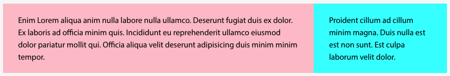

- To resize the proportion of content article's width to 70%, we can have to change the sidebar to 40%. Alternatively, we could remove the float and width properties from the sidebar, then use the `overflow` property with any value except `visible`.
	```css
	.content,
	.sidebar {
	  /* delete: float: none; */
	}
	
	.content {
	  float: left;
	  width: 60%; /* was 70% */
	}
	
	.sidebar {
	  overflow: hidden;
	  /* delete: width: 30%; */
	}
	```
	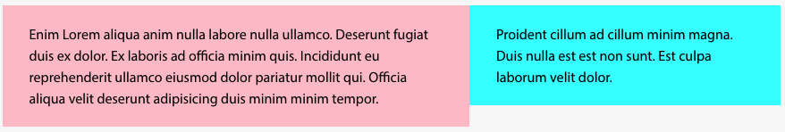

#### Fluid Layout
- Fluid layout is similar to liquid layout in that it expands or contracts when the browser width changes, **but only till a point before becoming fixed** once the browser width reaches a specified size.
- We can convert the liquid layout above to a fluid layout by setting a `min-width` and `max-width` to prevent site from becoming too spacious or cramped.
	```css
	main {
	  max-width: 1000px;
	  min-width: 500px;
	}
	
	.content,
	.sidebar {
	  padding: 20px 30px;
	}
	
	.content {
	  box-sizing: border-box;
	  float: left;
	  width: 70%;
	}
	
	.sidebar {
	  overflow: hidden;
	}
	```
	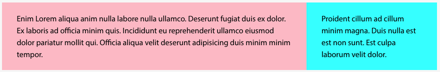

[Back to Top](#section-links)